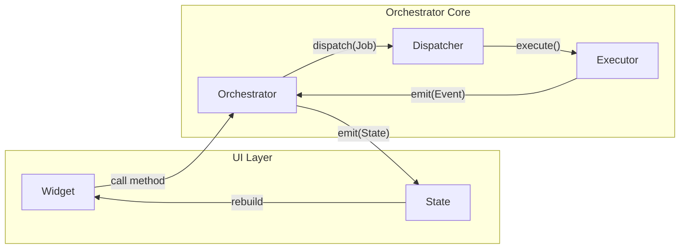

# Flutter Orchestrator

<p align="center">
  <strong>Event-Driven Orchestrator Architecture for Flutter Applications</strong>
</p>

<p align="center">
  <a href="README_vi.md">🇻🇳 Tiếng Việt</a> •
  <a href="docs/vi/README.md">📚 Documentation</a> •
  <a href="book/vi/README.md">📖 Book (Architecture)</a> •
  <a href="packages/orchestrator_core">📦 Core Package</a>
</p>

---

## Introduction

**Flutter Orchestrator** is an Event-Driven architecture designed to solve the "God Classes" problem in large Flutter applications. Instead of having Controllers/BLoCs manage both UI State and Business Logic, this architecture separates concerns clearly:

- **Orchestrator**: Manages UI State & Coordination
- **Executor**: Executes Business Logic (Pure Dart)
- **Dispatcher**: Central hub for routing & event handling (Offline, Logging...)



## Why Flutter Orchestrator?

1. **Complete Logic Separation**: Executors know nothing about UI, Orchestrators know nothing about API/DB calls.
2. **Easy Testing**: With logic in pure Dart Executors, you can Unit Test 100% of logic without mocking Context or Widgets.
3. **Automatic Offline Support**: Just mark with `@NetworkJob`, and queuing, retry, sync when online are all handled automatically.
4. **Better Teamwork**: Dev A works on screens (Orchestrator), Dev B works on logic (Executor). No more conflicts in a 2000-line Controller.

## Getting Started

See detailed documentation at: [Framework Docs (Vietnamese)](docs/vi/README.md)

### Quick Installation

```bash
flutter pub add orchestrator_core orchestrator_bloc
```

### Simple Example

**1. Define a Job:**
```dart
class LoginJob extends BaseJob {
  final String username;
  final String password;
  LoginJob(this.username, this.password);
}
```

**2. Write Logic (Executor):**
```dart
class LoginExecutor extends BaseExecutor<LoginJob> {
  @override
  Future<User> process(LoginJob job) async {
    return api.login(job.username, job.password);
  }
}
```

**3. Call from UI (Orchestrator):**
```dart
class LoginCubit extends OrchestratorCubit<LoginState> {
  void onLoginPressed() {
    dispatch(LoginJob('user', '123456'));
  }
}
```

---

## Project Structure

```
flutter_orchestrator/
├── book/                    # Book (Architecture Philosophy)
│   └── vi/                  # Vietnamese
│
├── docs/                    # Technical Documentation
│   └── vi/                  # Vietnamese
│       ├── guide/           # Basic guides
│       ├── concepts/        # Core concepts
│       └── advanced/        # Advanced features
│
├── packages/                # Library packages
│   ├── orchestrator_core/   # Core framework
│   ├── orchestrator_bloc/   # BLoC integration
│   ├── orchestrator_provider/   # Provider integration
│   └── orchestrator_riverpod/   # Riverpod integration
│
└── examples/                # Example applications
    └── simple_counter/      # Hello World example
```

## Packages

| Package | Description |
|---------|-------------|
| [orchestrator_core](packages/orchestrator_core) | Core framework (Pure Dart) |
| [orchestrator_bloc](packages/orchestrator_bloc) | flutter_bloc integration |
| [orchestrator_provider](packages/orchestrator_provider) | provider integration |
| [orchestrator_riverpod](packages/orchestrator_riverpod) | riverpod integration |
| [orchestrator_generator](packages/orchestrator_generator) | Code generation for NetworkJob |

## License

MIT License.
