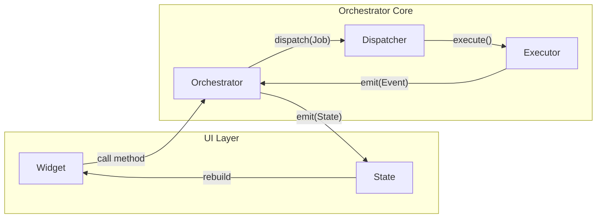

# Flutter Orchestrator

<p align="center">
  <strong>Event-Driven Orchestrator Architecture for Flutter Applications</strong>
</p>

<p align="center">
  <a href="README_vi.md">🇻🇳 Tiếng Việt</a> •
  <a href="docs/en/README.md">📚 Documentation</a> •
  <a href="book/README.md">📖 Book (Architecture)</a> •
  <a href="packages/orchestrator_core">📦 Core Package</a>
</p>

---

## Introduction

**Flutter Orchestrator** is an Event-Driven architecture designed to solve the "God Classes" problem in large Flutter applications. Instead of having Controllers/BLoCs manage both UI State and Business Logic, this architecture separates concerns clearly:

- **Orchestrator**: Manages UI State & Coordination
- **Executor**: Executes Business Logic (Pure Dart)
- **Dispatcher**: Central hub for routing & event handling (Offline, Logging...)



## Why Flutter Orchestrator?

1. **Complete Logic Separation**: Executors know nothing about UI, Orchestrators know nothing about API/DB calls.
2. **Easy Testing**: With logic in pure Dart Executors, you can Unit Test 100% of logic without mocking Context or Widgets.
3. **Automatic Offline Support**: Just mark with `@NetworkJob`, and queuing, retry, sync when online are all handled automatically.
4. **Better Teamwork**: Dev A works on screens (Orchestrator), Dev B works on logic (Executor). No more conflicts in a 2000-line Controller.
5. **DevTools Integration**: Real-time debugging with Flutter DevTools extension for event monitoring, metrics, and network queue inspection.

## Getting Started

See detailed documentation at: [Framework Docs (English)](docs/en/README.md)

### Quick Installation

```bash
# Core + State Management Integration
flutter pub add orchestrator_core orchestrator_bloc

# Flutter Platform Support (Offline Storage, DevTools)
flutter pub add orchestrator_flutter

# Code Generation (Optional)
# Code Generation (Optional)
flutter pub add dev:orchestrator_generator dev:build_runner

# Testing Support (Dev Dependency)
flutter pub add dev:orchestrator_test
```

### Simple Example

**1. Define a Job:**
```dart
class LoginJob extends BaseJob {
  final String username;
  final String password;
  LoginJob(this.username, this.password);
}
```

**2. Write Logic (Executor):**
```dart
class LoginExecutor extends BaseExecutor<LoginJob> {
  @override
  Future<User> process(LoginJob job) async {
    return api.login(job.username, job.password);
  }
}
```

**3. Call from UI (Orchestrator):**
```dart
class LoginCubit extends OrchestratorCubit<LoginState> {
  void onLoginPressed() {
    dispatch(LoginJob('user', '123456'));
  }
}
```

---

## Project Structure

```
flutter_orchestrator/
├── book/                    # Book (Architecture Philosophy)
│   └── vi/                  # Vietnamese
│
├── docs/                    # Technical Documentation
│   ├── en/                  # English
│   │   ├── guide/           # Basic guides
│   │   ├── concepts/        # Core concepts
│   │   └── advanced/        # Advanced features
│   └── vi/                  # Vietnamese
│
├── packages/                # Library packages
│   ├── orchestrator_core/   # Core framework (Pure Dart)
│   ├── orchestrator_flutter/# Flutter platform support
│   ├── orchestrator_bloc/   # BLoC integration
│   ├── orchestrator_provider/   # Provider integration
│   ├── orchestrator_riverpod/   # Riverpod integration
│   ├── orchestrator_generator/  # Code generation
│   ├── orchestrator_cli/    # CLI tool
│   └── orchestrator_devtools_extension/ # DevTools Extension
│
└── examples/                # Example applications
    ├── simple_counter/      # Hello World example
    └── cli_templates/       # CLI template examples
```

## Packages

| Package | Version | Description |
|---------|---------|-------------|
| [orchestrator_core](packages/orchestrator_core) | 0.3.1 | Core framework (Pure Dart) - Jobs, Executors, Dispatcher, Events |
| [orchestrator_flutter](packages/orchestrator_flutter) | 0.3.1 | Flutter platform support - Offline storage, Connectivity, DevTools Observer |
| [orchestrator_bloc](packages/orchestrator_bloc) | 0.3.0 | flutter_bloc integration - OrchestratorCubit, OrchestratorBloc |
| [orchestrator_provider](packages/orchestrator_provider) | 0.3.0 | provider integration - OrchestratorNotifier |
| [orchestrator_riverpod](packages/orchestrator_riverpod) | 0.3.0 | riverpod integration - OrchestratorNotifier |
| [orchestrator_generator](packages/orchestrator_generator) | 0.3.0 | Code generation for @NetworkJob, @AsyncState, @Orchestrator |
| [orchestrator_test](packages/orchestrator_test) | 0.1.0 | Testing utilities - Mocks, Fakes, Matchers, BDD helpers |
| [orchestrator_cli](packages/orchestrator_cli) | 0.1.0 | CLI tool for project scaffolding (WIP) |
| orchestrator_devtools_extension | - | DevTools Extension for real-time debugging (bundled in orchestrator_flutter) |

## DevTools Extension

Flutter Orchestrator includes a DevTools extension for real-time debugging:

- **Event Timeline**: Monitor all dispatched jobs and events in real-time
- **Job Inspector**: Group and inspect events by correlation ID
- **Metrics Dashboard**: View success rates, throughput, and anomaly detection
- **Network Queue**: Inspect pending offline jobs
- **Executor Registry**: View registered executors

The extension is automatically available when using `orchestrator_flutter`. See [DevTools Extension Guide](docs/en/advanced/devtools-extension.md) for details.

## Contributing

See [CONTRIBUTING.md](CONTRIBUTING.md) for development workflow, versioning, and publishing guidelines.

## License

MIT License.
