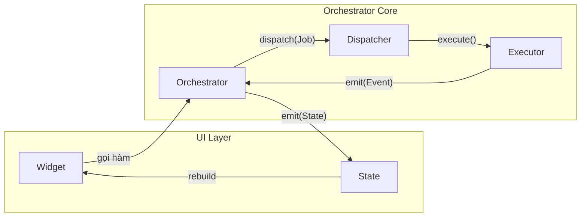

# Flutter Orchestrator

<p align="center">
  <strong>Event-Driven Orchestrator Architecture for Flutter Applications</strong>
</p>

<p align="center">
  <a href="docs/vi/README.md">📚 Tài liệu Kỹ thuật (Framework Docs)</a> •
  <a href="book/vi/README.md">📖 Đọc Sách (Tư duy kiến trúc)</a> •
  <a href="packages/orchestrator_core">📦 Core Package</a>
</p>

---

## Giới thiệu

**Flutter Orchestrator** là một kiến trúc hướng sự kiện (Event-driven) được thiết kế để giải quyết vấn đề "God Classes" trong các ứng dụng Flutter lớn. Thay vì để Controller/BLoC quản lý cả UI State nhận Business Logic, kiến trúc này tách biệt rõ ràng:

- **Orchestrator**: Quản lý UI State & Điều phối
- **Executor**: Thực thi Business Logic (Thuần Dart)
- **Dispatcher**: Trung tâm điều phối & Xử lý sự kiện (Offline, Logging...)




## Tại sao chọn Flutter Orchestrator?

1.  **Tách biệt logic hoàn toàn**: Executor không biết gì về UI, Orchestrator không biết gì về logic gọi API/DB.
2.  **Test dễ dàng**: Với logic được tách ra Executor thuần Dart, bạn có thể Unit Test 100% logic mà không cần Mock Context hay Widget.
3.  **Hỗ trợ Offline tự động**: Chỉ cần đánh dấu `@NetworkJob`, mọi vấn đề lưu queue, retry, sync khi có mạng đều được handle tự động.
4.  **Teamwork tốt hơn**: Dev A làm màn hình (Orchestrator), Dev B làm logic (Executor). Không còn conflict code trong một file Controller dài 2000 dòng.

## Bắt đầu ngay

Xem hướng dẫn chi tiết tại: [Tài liệu Framework (Tiếng Việt)](docs/vi/README.md)

### Cài đặt nhanh

```bash
flutter pub add orchestrator_core orchestrator_bloc
```

### Ví dụ đơn giản

**1. Định nghĩa Job:**
```dart
class LoginJob extends BaseJob {
  final String username;
  final String password;
  LoginJob(this.username, this.password);
}
```

**2. Viết Logic (Executor):**
```dart
class LoginExecutor extends BaseExecutor<LoginJob, User> {
  @override
  Future<User> process(LoginJob job) async {
    return api.login(job.username, job.password);
  }
}
```

**3. Gọi từ UI (Orchestrator):**
```dart
class LoginCubit extends OrchestratorCubit<LoginState> {
  void onLoginPressed() {
    dispatch(LoginJob('user', '123456'));
  }
}
```

---

## Cấu trúc dự án

```
flutter_orchestrator/
├── book/                    # Sách (Tư duy & Kiến trúc)
│   └── vi/                  # Tiếng Việt
│
├── docs/                    # Tài liệu kỹ thuật (Cách sử dụng Framework)
│   └── vi/                  # Tiếng Việt
│       ├── guide/           # Hướng dẫn cơ bản
│       └── advanced/        # Tính năng nâng cao
│
├── packages/                # Các gói thư viện (Packages)
│   ├── orchestrator_core/   # Core framework
│   ├── orchestrator_bloc/   # BLoC integration
│   └── ...
│
└── examples/                # Ứng dụng mẫu
```

## License
MIT License.
