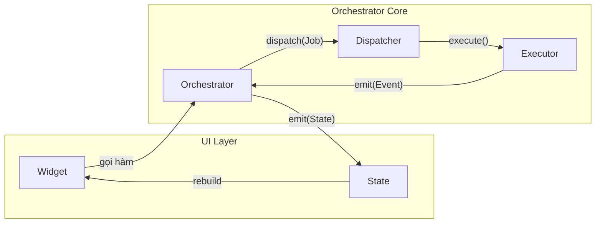

# Flutter Orchestrator

<p align="center">
  <strong>Kiến trúc Orchestrator hướng sự kiện cho ứng dụng Flutter</strong>
</p>

<p align="center">
  <a href="README.md">🇬🇧 English</a> •
  <a href="docs/vi/README.md">📚 Tài liệu Kỹ thuật</a> •
  <a href="book/vi/README.md">📖 Đọc Sách (Tư duy kiến trúc)</a> •
  <a href="packages/orchestrator_core">📦 Core Package</a>
</p>

---

## Giới thiệu

**Flutter Orchestrator** là một kiến trúc hướng sự kiện (Event-driven) được thiết kế để giải quyết vấn đề "God Classes" trong các ứng dụng Flutter lớn. Thay vì để Controller/BLoC quản lý cả UI State nhận Business Logic, kiến trúc này tách biệt rõ ràng:

- **Orchestrator**: Quản lý UI State & Điều phối
- **Executor**: Thực thi Business Logic (Thuần Dart)
- **Dispatcher**: Trung tâm điều phối & Xử lý sự kiện (Offline, Logging...)



## Tại sao chọn Flutter Orchestrator?

1. **Tách biệt logic hoàn toàn**: Executor không biết gì về UI, Orchestrator không biết gì về logic gọi API/DB.
2. **Test dễ dàng**: Với logic được tách ra Executor thuần Dart, bạn có thể Unit Test 100% logic mà không cần Mock Context hay Widget.
3. **Hỗ trợ Offline tự động**: Implement `NetworkAction` để hỗ trợ queue khi offline (tuỳ chọn: `@NetworkJob` + codegen cho serialization/registry).
4. **Teamwork tốt hơn**: Dev A làm màn hình (Orchestrator), Dev B làm logic (Executor). Không còn conflict code trong một file Controller dài 2000 dòng.
5. **Tích hợp DevTools**: Debug real-time với Flutter DevTools extension (event timeline, metrics, network queue...).

## Bắt đầu ngay

Xem hướng dẫn chi tiết tại: [Tài liệu Framework](docs/vi/README.md)

### Cài đặt nhanh

```bash
# Core framework (BẮT BUỘC)
flutter pub add orchestrator_core

# Chọn 1 integration phù hợp:
flutter pub add orchestrator_bloc
# flutter pub add orchestrator_provider
# flutter pub add orchestrator_riverpod

# Flutter platform support (offline queue, cleanup, DevTools)
flutter pub add orchestrator_flutter

# Code Generation (Tuỳ chọn)
flutter pub add dev:orchestrator_generator dev:build_runner

# Testing Support (Dev Dependency)
flutter pub add dev:orchestrator_test
```

### Ví dụ đơn giản

**1. Định nghĩa Job:**
```dart
class LoginJob extends BaseJob {
  final String username;
  final String password;
  LoginJob(this.username, this.password) : super(id: generateJobId('login'));
}
```

**2. Viết Logic (Executor):**
```dart
class LoginExecutor extends BaseExecutor<LoginJob> {
  @override
  Future<User> process(LoginJob job) async {
    return api.login(job.username, job.password);
  }
}
```

**3. Gọi từ UI (Orchestrator):**
```dart
class LoginCubit extends OrchestratorCubit<LoginState> {
  void onLoginPressed() {
    dispatch(LoginJob('user', '123456'));
  }
}
```

---

## Cấu trúc dự án

```
flutter_orchestrator/
├── book/                    # Sách (Tư duy & Kiến trúc)
│   └── vi/                  # Tiếng Việt
│
├── docs/                    # Tài liệu kỹ thuật
│   ├── en/                  # English
│   │   ├── guide/           # Hướng dẫn cơ bản
│   │   ├── concepts/        # Khái niệm chi tiết
│   │   └── advanced/        # Tính năng nâng cao
│   └── vi/                  # Tiếng Việt
│
├── packages/                # Các gói thư viện
│   ├── orchestrator_core/   # Core framework
│   ├── orchestrator_flutter/# Flutter platform support
│   ├── orchestrator_bloc/   # Tích hợp BLoC
│   ├── orchestrator_provider/   # Tích hợp Provider
│   ├── orchestrator_riverpod/   # Tích hợp Riverpod
│   ├── orchestrator_generator/  # Code generation
│   ├── orchestrator_test/       # Testing utilities
│   ├── orchestrator_cli/        # CLI tool
│   └── orchestrator_devtools_extension/ # DevTools Extension
│
└── examples/                # Ứng dụng mẫu
    └── simple_counter/      # Ví dụ Hello World
```

## Packages

| Package | Version | Mô tả |
|---------|---------|------|
| [orchestrator_core](packages/orchestrator_core) | 0.3.3 | Core framework (Thuần Dart) - Jobs, Executors, Dispatcher, Events |
| [orchestrator_flutter](packages/orchestrator_flutter) | 0.3.3 | Flutter platform support - Offline storage, Connectivity, DevTools Observer |
| [orchestrator_bloc](packages/orchestrator_bloc) | 0.3.1 | Tích hợp flutter_bloc - OrchestratorCubit, OrchestratorBloc |
| [orchestrator_provider](packages/orchestrator_provider) | 0.3.1 | Tích hợp provider - OrchestratorNotifier |
| [orchestrator_riverpod](packages/orchestrator_riverpod) | 0.3.1 | Tích hợp riverpod - OrchestratorNotifier |
| [orchestrator_generator](packages/orchestrator_generator) | 0.3.3 | Code generation cho @NetworkJob, @AsyncState, @Orchestrator |
| [orchestrator_test](packages/orchestrator_test) | 0.1.1 | Testing utilities - Mocks, Fakes, Matchers, helpers |
| [orchestrator_cli](packages/orchestrator_cli) | 0.1.2 | CLI tool tạo scaffold |
| orchestrator_devtools_extension | - | DevTools Extension (bundled trong orchestrator_flutter) |

## License

MIT License.
