# Event-Driven Orchestrator Pattern Guide

A comprehensive guide to understanding and implementing the **Event-Driven Orchestrator** architecture for scalable Flutter applications.

> 🇻🇳 **[Phiên bản Tiếng Việt](vi/README.md)**

---

## About This Book

This book focuses on **concepts, patterns, and architectural thinking** — not implementation details. For working code and API documentation, see the [`docs/`](../docs/) folder.

```mermaid
graph LR
    Book["📚 This Book"] --> Philosophy["Philosophy & Patterns"]
    Docs["📖 Docs"] --> Implementation["Implementation & API"]
    
    Philosophy --> Timeless["Timeless knowledge"]
    Implementation --> Current["Up-to-date code"]
```

---

## Part I: The Philosophy

Understanding the *why* behind the architecture.

### [Chapter 1: The Problem Space](chapters/01_the_pain.md)
- The God Class syndrome
- Coupling and its consequences  
- Why traditional approaches fail

### [Chapter 2: The Solution Concept](chapters/02_architecture_concepts.md)
- Fire-and-Forget principle
- Command-Event pattern
- The architecture overview

### [Chapter 3: The Component Details](chapters/03_core_implementation.md)
- Job, Event, Executor anatomy
- Dispatcher and routing
- Orchestrator state machine

---

## Part II: The Patterns

Reusable solutions to common problems.

### [Chapter 4: Core Patterns](chapters/04_integration.md)
- Job-Executor pattern
- Event Routing pattern
- State Transition pattern
- Scoped Bus pattern

### [Chapter 5: Advanced Patterns](chapters/05_advanced_patterns.md)
- Cancellation pattern
- Timeout pattern
- Retry with backoff
- Progress reporting
- Circuit breaker

---

## Part III: The Practice

Applying patterns to real-world scenarios.

### [Chapter 6: Case Studies](chapters/06_case_study.md)
- AI Chatbot (chaining, streaming)
- File Upload (progress, cancellation)
- Shopping Cart (observer mode)
- Authentication (scoped bus)

### [Chapter 7: Best Practices](chapters/07_best_practices.md)
- Folder structure
- Naming conventions
- Testing strategy
- Performance guidelines
- AI agent integration

---

## Reading Guide

| You are... | Start with... |
|------------|---------------|
| New to the concept | Part I (Chapters 1-3) |
| Familiar with architecture | Part II (Chapters 4-5) |
| Want practical examples | Part III (Chapter 6) |
| Implementing a project | Chapter 7 + docs/ |

---

## Key Takeaways

```mermaid
mindmap
  root((Architecture))
    Separation
      Orchestration ≠ Execution
      State ≠ Business Logic
    Communication
      Fire-and-Forget
      Command-Event
      Correlation ID
    Patterns
      Core: Job-Executor, Routing
      Advanced: Retry, Cancel, Progress
    Practice
      Feature-first structure
      Test executors in isolation
      Handle all errors
```

---

## Further Resources

- **[Framework Documentation](../docs/)** — Implementation details, API reference
- **[CLI Tool](../packages/orchestrator_cli/)** — Scaffolding commands
- **[Examples](../examples/)** — Working code samples

---

*"The purpose of abstraction is not to be vague, but to create a new semantic level in which one can be absolutely precise."* — Edsger Dijkstra
