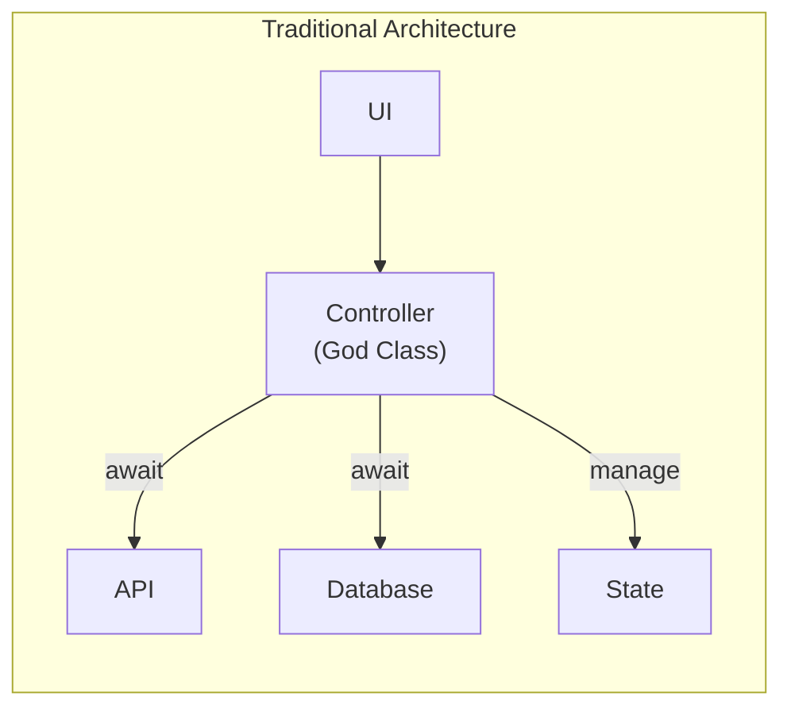
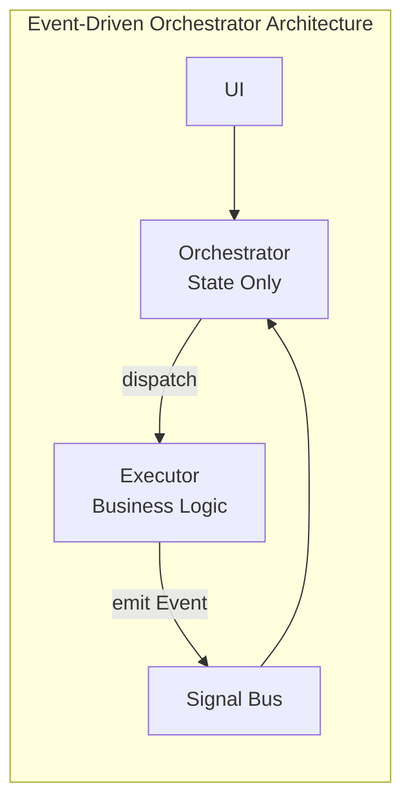

# Chapter 1: The Problem and Solution

## 1.1. Current State

In Flutter application development, state management patterns (MVVM, BLoC) have proven effective at small scales. However, as applications grow in functionality and complexity, Controller classes (BLoC/ViewModel) become overloaded with intertwined responsibilities:

1. **UI State Management**: Loading, Error, Success, Animation states.
2. **Business Execution**: API calls, database queries, data processing.
3. **Logic Processing**: Validation, calculations, data formatting.
4. **Flow Coordination**: Determining execution order of dependent tasks.

**Consequences:**
- **God Classes**: Controller files grow to thousands of lines.
- **Hard to Test**: Business logic tightly coupled with State Stream.
- **Hard to Reuse**: Logic localized within individual Controllers.

## 1.2. Root Cause

The core problem lies in confusing two distinct concepts:

- **UI State**: Describes what the user is seeing.
- **Business Process**: The chain of processing steps behind the scenes.

When using `await repository.doSomething()` syntax in Controllers, UI flow becomes directly bound to waiting for business results. This creates unnecessary coupling between two layers that should be separate.

## 1.3. Proposed Solution

To solve this fundamentally, architecture must follow two key principles:

### A. Fire-and-Forget
The UI layer should only dispatch execution commands without waiting for synchronous results. UI's responsibility is to transition to "processing" state and continue its lifecycle.

### B. Bi-directional Asynchronous Communication
Instead of traditional Request-Response, the system uses Command-Event pattern:
- Orchestrator dispatches commands and doesn't wait.
- Executor executes and emits result events.
- Orchestrator listens and reacts to events.

The **Event-Driven Orchestrator** architecture is designed to realize these two principles, returning the state management layer to its proper role: **reflecting what's happening, not doing it**.
