# Chapter 1: The Problem Space

> *"Any fool can write code that a computer can understand. Good programmers write code that humans can understand."* — Martin Fowler

---

## 1.1. The God Class Syndrome

In Flutter application development, a common anti-pattern emerges as applications grow: the **God Class**.


### Symptoms

| Symptom | Consequence |
|---------|-------------|
| Files > 500 lines | Hard to navigate, understand |
| Multiple responsibilities | Violates Single Responsibility |
| Tight coupling | Can't test in isolation |
| await chains | UI blocked during execution |

---

## 1.2. The Coupling Problem

Traditional architectures create **temporal coupling** between UI and business logic.

```mermaid
sequenceDiagram
    participant UI as 🖥️ UI
    participant BLoC as 📦 BLoC
    participant API as 🌐 API
    
    UI->>BLoC: login(user, pass)
    Note over BLoC: ⏳ UI is BLOCKED
    BLoC->>API: POST /auth
    API-->>BLoC: response (2-5 seconds)
    BLoC-->>UI: emit(Success)
    
    Note over UI,API: ❌ UI lifecycle is bound to API response time
```



### The await Problem

```dart
// ❌ Traditional: UI waits for business logic
Future<void> login(String user, String pass) async {
  emit(Loading());
  try {
    final result = await authRepository.login(user, pass);  // ⏳ BLOCKED
    emit(Success(result));
  } catch (e) {
    emit(Error(e));
  }
}
```

**Problems:**
1. If user navigates away, the operation continues but state update may fail
2. If API is slow, UI cannot respond to other events
3. Testing requires mocking the entire repository chain

---

## 1.3. The Reusability Problem

Business logic trapped inside Controllers cannot be reused.


### The Duplication Tax

Every time you need the same business logic:
1. **Copy-paste**: Creates maintenance nightmare
2. **Extract to Service**: Still coupled via await
3. **Inheritance**: Creates fragile base classes

---

## 1.4. The Testing Nightmare

```mermaid
graph TB
    subgraph TestingProblem["❌ Testing Traditional Architecture"]
        Test["Unit Test"] --> MockRepo["Mock Repository"]
        MockRepo --> MockAPI["Mock API Client"]
        MockAPI --> MockCache["Mock Cache"]
        MockCache --> MockDB["Mock Database"]
    end
    
    subgraph Result["Result"]
        Brittle["😰 Brittle Tests"]
        Slow["🐌 Slow Feedback"]
        Complex["🔧 Complex Setup"]
    end
    
    TestingProblem --> Result
```



**Pain points:**
- 50+ lines of mock setup for one test
- Tests break when implementation changes
- Can't test business logic without UI framework

---

## 1.5. Root Cause Analysis


### The Core Insight

> **UI State** tells us *what the user sees*.
> **Business Process** tells us *what the system does*.
>
> These are fundamentally different concerns that evolve at different rates.

---

## 1.6. What We Need


The next chapter introduces the **Event-Driven Orchestrator** architecture that addresses all these requirements.

---

## Summary

| Problem | Root Cause | Impact |
|---------|------------|--------|
| God Classes | No separation of concerns | Unmaintainable code |
| Temporal Coupling | await chains | UI responsiveness issues |
| Duplication | Logic trapped in Controllers | Maintenance burden |
| Testing Difficulty | Tight coupling | Slow development |

**Key Takeaway**: The problem isn't the state management library (BLoC, Provider, Riverpod). The problem is mixing *orchestration* with *execution*.
