# Chapter 1: The Problem Space

> *"Any fool can write code that a computer can understand. Good programmers write code that humans can understand."* — Martin Fowler

In this chapter, we explore the fundamental problems that plague large-scale Flutter applications, understanding not just *that* they happen, but *why* they happen.

---

## 1.1. The God Class Syndrome

In Flutter application development, a common anti-pattern emerges as applications grow: the **God Class**. This usually manifests in your `Controller`, `ViewModel`, or `BLoC` files.

It starts innocently enough—a few lines to handle a login form. Then you add validation. Then an API call. Then error handling. Then a caching layer. Before you know it, you have a 2,000-line monster that does everything.

```mermaid
graph TB
    subgraph GodClass["🔴 The God Class Problem"]
        UI["UI Layer"] --> Controller["Controller / BLoC<br/>📦 500+ lines"]
        Controller --> API["API Calls"]
        Controller --> DB["Database"]
        Controller --> Cache["Cache"]
        Controller --> Validation["Validation"]
        Controller --> State["State Management"]
        Controller --> Navigation["Navigation Logic"]
    end
    
    style GodClass fill:#f1f5f9,stroke:#334155,color:#1e293b
    style Controller fill:#fee2e2,stroke:#334155,stroke-width:2px,color:#1e293b
    style UI fill:#e0f2f1,stroke:#334155,color:#1e293b
    style API fill:#fef3c7,stroke:#334155,color:#1e293b
    style DB fill:#fef3c7,stroke:#334155,color:#1e293b
    style Cache fill:#fef3c7,stroke:#334155,color:#1e293b
    style Validation fill:#fef3c7,stroke:#334155,color:#1e293b
    style State fill:#fef3c7,stroke:#334155,color:#1e293b
    style Navigation fill:#fef3c7,stroke:#334155,color:#1e293b
```



### Symptoms

If your codebase exhibits these symptoms, you are likely suffering from the God Class syndrome:

| Symptom | Consequence |
|---------|-------------|
| **Files > 500 lines** | Code becomes hard to navigate. You spend more time scrolling than thinking. |
| **Multiple responsibilities** | The class knows too much. It handles UI state, business rules, and data fetching simultaneously, violating the Single Responsibility Principle. |
| **Tight coupling** | You cannot test the business logic without mocking the entire UI state management machinery. |
| **Unlimited await chains** | Every operation blocks the UI execution flow until it completes. |

---

## 1.2. The Coupling Problem

Traditional architectures (like standard MVVM or BLoC usage) often create **temporal coupling** between the UI and business logic.

When you use `await` inside a state management method, you are implicitly binding the lifecycle of the UI to the duration of the network request. If the network is slow, your "UI logic" is effectively paused, waiting for the "Business logic" to return.

```mermaid
sequenceDiagram
    participant UI as 🖥️ UI
    participant BLoC as 📦 BLoC
    participant API as 🌐 API
    
    rect rgb(241, 245, 249)
        Note over UI,BLoC: Input Phase
        UI->>BLoC: login(user, pass)
    end
    
    rect rgb(254, 226, 226)
        Note over BLoC: ⏳ UI LOGIC BLOCKED
        BLoC->>API: POST /auth
        API-->>BLoC: response (2-5 seconds)
    end
    
    rect rgb(254, 243, 199)
        Note over BLoC,UI: Result Phase
        BLoC-->>UI: emit(Success)
    end
    
    Note over UI,API: ❌ UI lifecycle is bound to API response time
```



### The `await` Problem

Consider this common code pattern:

```dart
// ❌ Traditional: UI waits for business logic
Future<void> login(String user, String pass) async {
  emit(Loading()); // Step 1: UI updates
  try {
    // Step 2: UI logic HANGS here waiting for IO
    final result = await authRepository.login(user, pass);  // ⏳ BLOCKED
    
    // Step 3: UI updates again (if still mounted)
    emit(Success(result));
  } catch (e) {
    emit(Error(e));
  }
}
```

**Why is this dangerous?**
1.  **Lifecycle Mismatches**: If the user navigates away while `await` is pending, the `emit(Success)` call might throw an error because the widget is unmounted or the BLoC is closed.
2.  **Unresponsive UX**: While the logic is "waiting" at the `await` line, it cannot easily process *other* incoming user intents unless you carefully manage concurrency (e.g., `transformer: restartable`).
3.  **Testing Complexity**: To test this `login` method, you *must* mock the `authRepository`, and often the `NetworkClient` behind it. You cannot test the "logic" (validation, data transformation) separately from the "orchestration" (state emission).

---

## 1.3. The Reusability Problem

Business logic trapped inside `Controllers` or `BLoCs` cannot be reused easily because it is inextricably linked to the specific state of that screen.


### The Duplication Tax

Every time you need the same business logic (e.g., "Refresh User Profile") in a different screen:
1.  **Copy-paste**: You copy the private method from one specific BLoC to another. This creates a maintenance nightmare where fixing a bug in one place leaves it broken in others.
2.  **Extract to Service**: You move it to a Service, but your BLoC still needs to know *how* to call it, *how* to handle its errors, and *how* to map its exceptions to UI states.
3.  **Inheritance**: You try to create a `BaseAuthBloc`, which leads to the "Fragile Base Class" problem, where inheritance chains become too deep and complex to manage.

---

## 1.4. The Testing Nightmare

Testing in traditional architectures is often painful. Because business logic is mixed with state management, you end up writing implementation detail tests rather than behavior tests.

```mermaid
graph TB
    subgraph TestingProblem["❌ Testing Traditional Architecture"]
        Test["Unit Test"] --> MockRepo["Mock Repository"]
        MockRepo --> MockAPI["Mock API Client"]
        MockAPI --> MockCache["Mock Cache"]
        MockCache --> MockDB["Mock Database"]
    end
    
    subgraph Result["Result"]
        Brittle["😰 Brittle Tests"]
        Slow["🐌 Slow Feedback"]
        Complex["🔧 Complex Setup"]
    end
    
    TestingProblem --> Result
    
    style TestingProblem fill:#f1f5f9,stroke:#334155,color:#1e293b
    style Result fill:#fee2e2,stroke:#334155,color:#1e293b
    style Test fill:#e0f2f1,stroke:#334155,color:#1e293b
    style MockRepo fill:#fef3c7,stroke:#334155,color:#1e293b
    style MockAPI fill:#fef3c7,stroke:#334155,color:#1e293b
    style MockCache fill:#fef3c7,stroke:#334155,color:#1e293b
    style MockDB fill:#fef3c7,stroke:#334155,color:#1e293b
    style Brittle fill:#fee2e2,stroke:#334155,color:#1e293b
    style Slow fill:#fee2e2,stroke:#334155,color:#1e293b
    style Complex fill:#fee2e2,stroke:#334155,color:#1e293b
```



**The Reality of Testing:**
- You spend 80% of your time writing `when(mockRepo.doSomething()).thenAnswer(...)`.
- Your tests break whenever you change an internal implementation detail, even if the external behavior is correct.
- You cannot verify "Business Logic" in isolation. You have to verify "Business Logic + State Emission" together.

---

## 1.5. Root Cause Analysis

Why do we keep falling into these traps? It's not because we are bad developers. It's because we have conflated two fundamentally different responsibilities.


### The Core Insight

The root of all these evils is the confusion between **Orchestration** and **Execution**.

> **UI State (Orchestration)** tells us *what the user sees* (Loading, Error, Success).
> 
> **Business Process (Execution)** tells us *what the system does* (Authenticate, Write to DB, Parse JSON).
>
> These are fundamentally different concerns that evolve at different rates. One belongs to the View layer's lifecycle; the other belongs to the Domain layer's lifecycle.

---

## 1.6. What We Need

To solve this, we need an architecture that enforces a clean separation between "deciding what to do" and "doing it".

```mermaid
graph LR
    subgraph Requirements["✅ Requirements"]
        R1["Fire-and-Forget<br/>Don't block UI"]
        R2["Decoupled Execution<br/>Business ≠ UI"]
        R3["Event-Driven<br/>React to completion"]
        R4["Testable<br/>Isolated units"]
    end
    
    style Requirements fill:#e0f2f1,stroke:#334155,color:#1e293b
    style R1 fill:#fef3c7,stroke:#334155,color:#1e293b
    style R2 fill:#fef3c7,stroke:#334155,color:#1e293b
    style R3 fill:#fef3c7,stroke:#334155,color:#1e293b
    style R4 fill:#fef3c7,stroke:#334155,color:#1e293b
```



1.  **Fire-and-Forget**: The UI should be able to say "Do this" and immediately return to handling user input, without waiting for the network.
2.  **Decoupled Execution**: The code that executes business logic should run independently of any specific UI screen.
3.  **Event-Driven**: The system should react to results via events, rather than linear callbacks.
4.  **Testable**: We should be able to test logic without mocking the UI, and test UI/State without mocking complex logic.

The next chapter introduces the **Event-Driven Orchestrator** architecture that addresses all these requirements.

---

## Summary

| Problem | Root Cause | Impact |
|---------|------------|--------|
| **God Classes** | No separation of concerns | Code becomes unmaintainable and scary to touch. |
| **Temporal Coupling** | `await` chains | UI responsiveness issues and lifecycle bugs. |
| **Duplication** | Logic trapped in Controllers | High maintenance burden and inconsistent behavior. |
| **Testing Difficulty** | Tight coupling | Development slows down; devs stop writing tests. |

**Key Takeaway**: The problem isn't the state management library (BLoC, Provider, Riverpod). The problem is mixing *orchestration* (managing various parts) with *execution* (doing the actual work).
