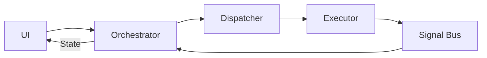

# Chapter 2: Architecture Overview

This chapter presents the overall structure, core components, and operating mechanisms of the **Event-Driven Orchestrator** architecture.

---

## 2.1. Overview

The **Event-Driven Orchestrator** architecture is designed to completely separate two responsibilities:
- **Orchestration**: Managing state and processing flow.
- **Execution**: Performing specific tasks.

These two components communicate through **bi-directional asynchronous communication**, forming a closed loop:

---

## 2.2. Core Components

The system consists of three main functional blocks with clearly defined responsibilities.

### A. Orchestrator (Coordinator)
Acts as the central coordinator and state manager.

| Property | Description |
|----------|-------------|
| **Responsibility** | Receive requests from UI, convert to Jobs, manage Feature State |
| **Input** | User/System Intents, Passive Events |
| **Output** | UI State, Jobs |
| **Characteristics** | Stateful, Context-Aware |

### B. Dispatcher (Router)
Acts as the intermediate transport layer.

| Property | Description |
|----------|-------------|
| **Responsibility** | Route Jobs to correct Executor, assign Correlation ID |
| **Input** | Jobs from Orchestrator |
| **Output** | Execution commands for Executor |
| **Characteristics** | Stateless, High Performance |

### C. Executor (Worker)
Acts as the business logic execution unit.

| Property | Description |
|----------|-------------|
| **Responsibility** | Perform heavy tasks (API, Database), emit results via Signal Bus |
| **Input** | Commands from Dispatcher |
| **Output** | Broadcast Events |
| **Characteristics** | Stateless, Specialized, Decoupled |

### D. Signal Bus (Communication Channel)
Acts as the central communication infrastructure using Publish-Subscribe pattern.

| Property | Description |
|----------|-------------|
| **Mechanism** | Broadcast Stream - one event sent to all subscribers |
| **Single Consumer** | Only Orchestrators are allowed to listen to Signal Bus |

---

## 2.3. Operating Mechanism

### A. Transaction Lifecycle

A request is processed through 5 sequential steps:

1. **Trigger**: UI calls a method on Orchestrator.
2. **Dispatch**: Orchestrator packages data into Job, sends via Dispatcher, receives Correlation ID.
3. **Execute**: Dispatcher routes Job to Executor. Executor performs async processing.
4. **Broadcast**: Executor completes, emits result event on Signal Bus.
5. **Reaction**: Orchestrator receives event, updates corresponding state.

### B. Two Listening Modes

Each Orchestrator operates in two modes simultaneously:

| Mode | Filter Mechanism | Purpose |
|------|-----------------|---------|
| **Direct Mode** | By `Correlation ID` | Manage lifecycle of self-initiated tasks |
| **Observer Mode** | By `Event Type` | Sync data when changes occur from other sources |

### C. State Segregation Strategy

When both modes affect State, the system applies these rules:

- **Data**: Updated by both modes. Latest event takes precedence.
- **Control State**: Only updated by Direct Mode. Events from Observer Mode cannot interrupt ongoing processing.

---

## 2.4. Design Principles

1. **Fire-and-Forget**: Caller doesn't wait for synchronous results.
2. **Decoupled Execution**: Execution logic doesn't depend on UI or State Management.
3. **Single Source of Truth**: Results always come from Events, no hidden return channels.

---

## 2.5. Example: Login Flow

### Scenario
User enters credentials and presses Login button.

### Sequence

1. **UI Layer**: Calls `authOrchestrator.login(username, password)`. Displays Loading state.

2. **Orchestrator**: Creates `LoginJob` with credentials. Calls `dispatch(job)` and receives `Correlation ID`. Switches to Direct Mode to await result.

3. **Dispatcher**: Routes `LoginJob` to `AuthExecutor`.

4. **Executor**: Calls authentication API. Receives success result. Creates and emits `AuthSuccessEvent` on Signal Bus.

5. **Orchestrator**: Receives event, updates state to `Authenticated`, stores user info.

6. **UI Layer**: Observes state change, navigates to Home screen.
