# Chapter 2: The Solution Concept

> *"The purpose of abstraction is not to be vague, but to create a new semantic level in which one can be absolutely precise."* — Edsger Dijkstra

In the previous chapter, we identified that the core problem is the mixing of orchestration and execution. In this chapter, we introduce the solution: breaking them apart.

---

## 2.1. The Core Insight

The solution is based on one fundamental architectural insight:

**The code that manages UI state (Orchestration) and the code that performs business operations (Execution) should never live in the same class.**

```mermaid
graph TB
    subgraph Separation["🎯 The Core Separation"]
        direction LR
        Orchestration["🎭 ORCHESTRATION<br/>What should happen"]
        Execution["⚙️ EXECUTION<br/>How it happens"]
    end
    
    Orchestration -.->|"Decoupled"| Execution
    
    style Separation fill:#f1f5f9,stroke:#334155,color:#1e293b
    style Orchestration fill:#e0f2f1,stroke:#334155,color:#1e293b
    style Execution fill:#fef3c7,stroke:#334155,color:#1e293b
```

By enforcing this separation, we clarify the role of each component:

| Aspect | Orchestration | Execution |
|--------|--------------|-----------|
| **Responsibility** | Deciding **what** needs to happen next based on user input or system events. | Knowing **how** to perform a specific technical task (API call, DB write). |
| **Knowledge** | Knows about the User, the UI flow, and the current screen state. Knows **nothing** about HTTP, SQL, or JSON. | Knows about Data Sources, APIs, and business rules. Knows **nothing** about Screens, Widgets, or context. |
| **Lifecycle** | Tied to the UI lifecycle (created when screen opens, destroyed when closed). | Independent lifecycle (usually singletons or transient workers). |
| **State** | **Stateful**: Holds the current snapshot of the UI. | **Stateless**: Processes an input and produces an output. |

---

## 2.2. Fire-and-Forget Principle

Traditional architectures block the UI thread's logical flow while waiting for results. We flip this model. Instead of waiting (`await`), we **dispatch and move on**.

```mermaid
%%{init: {'theme': 'base', 'themeVariables': { 'primaryTextColor': '#1e293b', 'noteTextColor': '#1e293b', 'actorTextColor': '#1e293b' }}}%%
sequenceDiagram
    participant UI as 🖥️ UI
    participant Orch as 🎭 Orchestrator
    participant Exec as ⚙️ Executor
    
    rect rgb(241, 245, 249)
        Note over UI,Orch: Input Phase
        UI->>Orch: login(user, pass)
        Orch->>Orch: emit(Loading)
    end
    
    rect rgb(224, 242, 241)
        Note right of Orch: ⚡ The logic splits here
        Orch--)Exec: dispatch(LoginJob)
        Note over Orch: ✅ Returns immediately
    end
    
    rect rgb(254, 243, 199)
        Note over Exec: ⚙️ Works in background
        Exec--)Orch: emit(LoginSuccessEvent)
        Orch->>Orch: emit(Success)
        Orch->>UI: State updated
    end
```

**Key difference**: The Orchestrator does not `await` the result of `dispatch`. It dispatches the job and effectively says, *"I have started this process. I am now free to handle other things. Let me know when you are done."*

This makes the UI **non-blocking by default**.

---

## 2.3. The Command-Event Pattern

To achieve this decoupled communication, we use two different channels:

```mermaid
graph TB
    subgraph Pattern["Command-Event Pattern"]
        Orch["🎭 Orchestrator"]
        Exec["⚙️ Executor"]
        Bus["📡 Signal Bus"]
        
        Orch -->|"① Command (Job)"| Exec
        Exec -->|"② Event"| Bus
        Bus -->|"③ Notification"| Orch
    end
    
    style Pattern fill:#f1f5f9,stroke:#334155,color:#1e293b
    style Orch fill:#e0f2f1,stroke:#334155,color:#1e293b
    style Exec fill:#fef3c7,stroke:#334155,color:#1e293b
    style Bus fill:#0d9488,stroke:#334155,color:#ffffff
```

1.  **Command (Job)**: The Orchestrator sends a **Job** (a command object) directly to the Executor via a Dispatcher. This is a one-way "fire" action.
2.  **Event**: When the Executor finishes (or fails, or has progress), it emits an **Event** onto a shared bus.
3.  **Notification**: The Orchestrator (and anyone else listening) receives this Event and reacts to it.

| Channel | Direction | Content | Mechanism |
|---------|-----------|---------|-----------|
| **Command** | Orch → Exec | "Do this specific task" (Intent) | Direct dispatch to a registered handler. |
| **Event** | Exec → Orch | "This just happened" (Fact) | Pub/Sub broadcast via SignalBus. |

---

## 2.4. The Architecture Overview

Putting it all together, the architecture looks like this:

The data flow is unidirectional and cyclical:
`UI -> Orchestrator -> Job -> Executor -> Event -> Orchestrator -> State -> UI`

---

## 2.5. Component Roles

### The Orchestrator (🎭 Coordinator)

The Orchestrator is the brain of a specific screen or feature.

```mermaid
graph LR
    subgraph Orchestrator["🎭 Orchestrator"]
        State["📊 State"]
        ActiveJobs["🏃 Active Jobs"]
        Handlers["📨 Event Handlers"]
    end
    
    Input["User Intent"] --> Orchestrator
    Orchestrator --> Output["State Changes"]
    Orchestrator --> Jobs["Job Dispatch"]
    
    style Orchestrator fill:#e0f2f1,stroke:#334155,color:#1e293b
    style State fill:#f1f5f9,stroke:#334155,color:#1e293b
    style ActiveJobs fill:#f1f5f9,stroke:#334155,color:#1e293b
    style Handlers fill:#f1f5f9,stroke:#334155,color:#1e293b
    style Input fill:#f1f5f9,stroke:#334155,color:#1e293b
    style Output fill:#fef3c7,stroke:#334155,color:#1e293b
    style Jobs fill:#fef3c7,stroke:#334155,color:#1e293b
```

**Responsibilities:**
-   **Receive User Intents**: Methods like `login()`, `refreshData()`, `submitForm()`.
-   **Manage UI State**: Emits states like `Loading`, `Success`, `Error`.
-   **Dispatch Jobs**: Creates `Job` objects and sends them to the Dispatcher.
-   **Handle Events**: Listens for `JobSuccessEvent` or `JobFailureEvent` to update state.
-   **Track Active Operations**: Knows which jobs are currently running (to show loading spinners or prevent duplicate submissions).

### The Dispatcher (📮 Router)

The Dispatcher is the traffic controller. It ensures the Orchestrator doesn't need a direct reference to a specific Executor class.

```mermaid
graph LR
    subgraph Dispatcher["📮 Dispatcher"]
        Registry["Job → Executor<br/>Registry"]
    end
    
    Job["Job"] --> Dispatcher
    Dispatcher --> Exec["Matched Executor"]
    
    style Dispatcher fill:#e0f2f1,stroke:#334155,color:#1e293b
    style Registry fill:#f1f5f9,stroke:#334155,color:#1e293b
    style Job fill:#f1f5f9,stroke:#334155,color:#1e293b
    style Exec fill:#fef3c7,stroke:#334155,color:#1e293b
```

**Responsibilities:**
-   **Registration**: Maintains a registry mapping `Job Types` to `Executor Instances`.
-   **Routing**: When a job comes in, finds the right executor in O(1) time.
-   **Decoupling**: Allows replacing an implementation (e.g., `MockExecutor`) without changing the Orchestrator code.

### The Executor (⚙️ Worker)

The Executor is where the actual work happens. It is a pure Dart class, often reusable across different apps.

```mermaid
graph LR
    subgraph Executor["⚙️ Executor"]
        Process["process(job)"]
    end
    
    Job["Job"] --> Executor
    Executor --> Success["✅ Success Event"]
    Executor --> Failure["❌ Failure Event"]
    Executor --> Progress["📊 Progress Event"]
    
    style Executor fill:#e0f2f1,stroke:#334155,color:#1e293b
    style Process fill:#f1f5f9,stroke:#334155,color:#1e293b
    style Job fill:#f1f5f9,stroke:#334155,color:#1e293b
    style Success fill:#fef3c7,stroke:#334155,color:#1e293b
    style Failure fill:#fee2e2,stroke:#334155,color:#1e293b
    style Progress fill:#fef3c7,stroke:#334155,color:#1e293b
```

**Responsibilities:**
-   **Execute Logic**: Calls APIs, parses data, writes to DB.
-   **Error Boundary**: Catching all exceptions and converting them to `FailureEvents`. The Orchestrator never crashes due to an unhandled exception here.
-   **Emit Events**: Reports results back to the system.

### The Signal Bus (📡 Broadcaster)

The Signal Bus is the nervous system. It carries signals from the muscles (executors) back to the brain (orchestrators).

**Responsibilities:**
-   **Decoupling**: Executors don't know who is listening. Orchestrators don't know who emitted the event.
-   **Fan-out**: One event (e.g., `UserLoggedOut`) can trigger reactions in multiple Orchestrators (Home screen clears data, Profile screen resets, Settings screen disables options).

---

## 2.6. The Two Listening Modes

A unique power of this architecture is how Orchestrators listen to events. They have two simultaneous modes:

```mermaid
graph TB
    Event["📨 Incoming Event"]
    
    Event --> Check{"Is this MY job?<br/>(correlationId)"}
    
    Check -->|"YES"| Direct["🎯 DIRECT MODE<br/>I dispatched this"]
    Check -->|"NO"| Observer["👀 OBSERVER MODE<br/>Someone else's event"]
    
    Direct --> OnSuccess["onActiveSuccess()"]
    Direct --> OnFailure["onActiveFailure()"]
    Observer --> OnPassive["onPassiveEvent()"]
    
    style Event fill:#f1f5f9,stroke:#334155,color:#1e293b
    style Check fill:#e0f2f1,stroke:#334155,color:#1e293b
    style Direct fill:#0d9488,stroke:#334155,color:#ffffff
    style Observer fill:#fef3c7,stroke:#334155,color:#1e293b
    style OnSuccess fill:#fef3c7,stroke:#334155,color:#1e293b
    style OnFailure fill:#fee2e2,stroke:#334155,color:#1e293b
    style OnPassive fill:#fef3c7,stroke:#334155,color:#1e293b
```

### When to use each mode

| Mode | Context | Typical Use Case | Example |
|------|---------|------------------|---------|
| **Direct Mode** | "I asked for this." | Handling the direct result of a user action on this screen. | User clicked "Login". I am waiting for the "Login Result". |
| **Observer Mode** | "I am interested in this." | Reacting to system-wide changes caused by other screens or background processes. | The "Settings" screen changed the language. My screen needs to reload content, even though I didn't ask for the change. |

---

## 2.7. The Correlation ID

How does the Orchestrator know "This is MY job"? **Correlation IDs**.

Every `Job` is assigned a unique ID (UUID) upon creation. When an Executor processes that Job, it stamps the resulting `Event` with the *same* ID.

This simple mechanism allows asynchronous, decoupled communication without losing track of context.

---

## 2.8. Visual Summary

```mermaid
flowchart TB
    subgraph Principles["🎯 Core Principles"]
        P1["1️⃣ Fire-and-Forget<br/>Don't block, dispatch"]
        P2["2️⃣ Command-Event<br/>Two-way async"]
        P3["3️⃣ Correlation ID<br/>Track ownership"]
    end
    
    subgraph Components["🧩 Components"]
        C1["🎭 Orchestrator<br/>State + Flow"]
        C2["📮 Dispatcher<br/>Router"]
        C3["⚙️ Executor<br/>Worker"]
        C4["📡 Signal Bus<br/>Broadcaster"]
    end
    
    subgraph Modes["👁️ Listening Modes"]
        M1["🎯 Direct<br/>My jobs"]
        M2["👀 Observer<br/>Global events"]
    end
    
    Principles --> Components
    Components --> Modes
    
    style Principles fill:#e0f2f1,stroke:#334155,color:#1e293b
    style Components fill:#fef3c7,stroke:#334155,color:#1e293b
    style Modes fill:#0d9488,stroke:#334155,color:#ffffff
    style P1 fill:#f1f5f9,stroke:#334155,color:#1e293b
    style P2 fill:#f1f5f9,stroke:#334155,color:#1e293b
    style P3 fill:#f1f5f9,stroke:#334155,color:#1e293b
    style C1 fill:#f1f5f9,stroke:#334155,color:#1e293b
    style C2 fill:#f1f5f9,stroke:#334155,color:#1e293b
    style C3 fill:#f1f5f9,stroke:#334155,color:#1e293b
    style C4 fill:#f1f5f9,stroke:#334155,color:#1e293b
    style M1 fill:#f1f5f9,stroke:#334155,color:#1e293b
    style M2 fill:#f1f5f9,stroke:#334155,color:#1e293b
```

---

## Summary

| Concept | Description |
|---------|-------------|
| **Separation** | Orchestration (State) ≠ Execution (Logic). They should never mix. |
| **Fire-and-Forget** | Dispatch commands without waiting. Keep the UI fluid. |
| **Command-Event** | One way to order work, another way to hear about results. |
| **Correlation ID** | The glue that binds a specific Request to its Response in an async world. |
| **Active vs Passive** | Choose whether you are the "Owner" (Active) or just a "Watcher" (Passive). |

**Key Takeaway**: By adopting this architecture, you restore the State Management layer to its proper role: **reflecting what is happening, not doing the work itself.**
