# Chapter 2: The Solution Concept

> *"The purpose of abstraction is not to be vague, but to create a new semantic level in which one can be absolutely precise."* — Edsger Dijkstra

---

## 2.1. The Core Insight

The solution is based on one fundamental insight:

```mermaid
graph TB
    subgraph Separation["🎯 The Core Separation"]
        direction LR
        Orchestration["🎭 ORCHESTRATION<br/>What should happen"]
        Execution["⚙️ EXECUTION<br/>How it happens"]
    end
    
    Orchestration -.->|"Decoupled"| Execution
    
    style Orchestration fill:#4c6ef5,color:#fff
    style Execution fill:#37b24d,color:#fff
```

| Aspect | Orchestration | Execution |
|--------|--------------|-----------|
| **Responsibility** | Manage state & flow | Perform work |
| **Knowledge** | What user sees | How APIs work |
| **Lifecycle** | Tied to UI | Independent |
| **State** | Stateful | Stateless |

---

## 2.2. Fire-and-Forget Principle

Instead of waiting for results, we **dispatch and move on**.

```mermaid
sequenceDiagram
    participant UI as 🖥️ UI
    participant Orch as 🎭 Orchestrator
    participant Exec as ⚙️ Executor
    
    UI->>Orch: login(user, pass)
    Orch->>Orch: emit(Loading)
    Orch--)Exec: dispatch(LoginJob)
    Note over Orch: ✅ Returns immediately
    Note over Exec: ⚙️ Works in background
    
    Exec--)Orch: emit(LoginSuccessEvent)
    Orch->>Orch: emit(Success)
    Orch->>UI: State updated
```

**Key difference**: The Orchestrator doesn't `await`. It dispatches and continues.

---

## 2.3. The Command-Event Pattern

Communication flows in two directions through different channels.

```mermaid
graph TB
    subgraph Pattern["Command-Event Pattern"]
        Orch["🎭 Orchestrator"]
        Exec["⚙️ Executor"]
        Bus["📡 Signal Bus"]
        
        Orch -->|"① Command (Job)"| Exec
        Exec -->|"② Event"| Bus
        Bus -->|"③ Notification"| Orch
    end
    
    style Orch fill:#4c6ef5,color:#fff
    style Exec fill:#37b24d,color:#fff
    style Bus fill:#f59f00,color:#fff
```

| Channel | Direction | Content | Mechanism |
|---------|-----------|---------|-----------|
| Command | Orch → Exec | "Do this" | Direct dispatch |
| Event | Exec → Orch | "This happened" | Pub/Sub broadcast |

---

## 2.4. The Architecture Overview

---

## 2.5. Component Roles

### The Orchestrator (🎭 Coordinator)

```mermaid
graph LR
    subgraph Orchestrator["🎭 Orchestrator"]
        State["📊 State"]
        ActiveJobs["🏃 Active Jobs"]
        Handlers["📨 Event Handlers"]
    end
    
    Input["User Intent"] --> Orchestrator
    Orchestrator --> Output["State Changes"]
    Orchestrator --> Jobs["Job Dispatch"]
```

**Responsibilities:**
- Receive user intents
- Manage UI state
- Dispatch jobs
- Handle events
- Track active operations

### The Dispatcher (📮 Router)

```mermaid
graph LR
    subgraph Dispatcher["📮 Dispatcher"]
        Registry["Job → Executor<br/>Registry"]
    end
    
    Job["Job"] --> Dispatcher
    Dispatcher --> Exec["Matched Executor"]
```

**Responsibilities:**
- Maintain Job-to-Executor mapping
- Route jobs to correct executor
- O(1) lookup performance

### The Executor (⚙️ Worker)

```mermaid
graph LR
    subgraph Executor["⚙️ Executor"]
        Process["process(job)"]
    end
    
    Job["Job"] --> Executor
    Executor --> Success["✅ Success Event"]
    Executor --> Failure["❌ Failure Event"]
    Executor --> Progress["📊 Progress Event"]
```

**Responsibilities:**
- Execute business logic
- Handle errors (Error Boundary)
- Emit result events
- Support cancellation

### The Signal Bus (📡 Broadcaster)

```mermaid
graph TB
    subgraph SignalBus["📡 Signal Bus"]
        Stream["Broadcast Stream"]
    end
    
    Exec1["Executor 1"] --> SignalBus
    Exec2["Executor 2"] --> SignalBus
    
    SignalBus --> Orch1["Orchestrator A"]
    SignalBus --> Orch2["Orchestrator B"]
    SignalBus --> Orch3["Orchestrator C"]
```

**Responsibilities:**
- Single point of event emission
- Fan-out to all listeners
- Decoupled communication

---

## 2.6. The Two Listening Modes

Each Orchestrator operates in two modes simultaneously:

```mermaid
graph TB
    Event["📨 Incoming Event"]
    
    Event --> Check{"Is this MY job?<br/>(correlationId)"}
    
    Check -->|"YES"| Direct["🎯 DIRECT MODE<br/>I dispatched this"]
    Check -->|"NO"| Observer["👀 OBSERVER MODE<br/>Someone else's event"]
    
    Direct --> OnSuccess["onActiveSuccess()"]
    Direct --> OnFailure["onActiveFailure()"]
    Observer --> OnPassive["onPassiveEvent()"]
    
    style Direct fill:#4c6ef5,color:#fff
    style Observer fill:#37b24d,color:#fff
```

### When to use each mode

| Mode | Use Case | Example |
|------|----------|---------|
| **Direct** | Handle results of my own jobs | Login result, fetch data |
| **Observer** | React to global events | User logged out, theme changed |

---

## 2.7. The Correlation ID

Every job carries a unique ID that connects request to response.

---

## 2.8. Visual Summary

```mermaid
flowchart TB
    subgraph Principles["🎯 Core Principles"]
        P1["1️⃣ Fire-and-Forget<br/>Don't block, dispatch"]
        P2["2️⃣ Command-Event<br/>Two-way async"]
        P3["3️⃣ Correlation ID<br/>Track ownership"]
    end
    
    subgraph Components["🧩 Components"]
        C1["🎭 Orchestrator<br/>State + Flow"]
        C2["📮 Dispatcher<br/>Router"]
        C3["⚙️ Executor<br/>Worker"]
        C4["📡 Signal Bus<br/>Broadcaster"]
    end
    
    subgraph Modes["👁️ Listening Modes"]
        M1["🎯 Direct<br/>My jobs"]
        M2["👀 Observer<br/>Global events"]
    end
    
    Principles --> Components
    Components --> Modes
```

---

## Summary

| Concept | Description |
|---------|-------------|
| **Separation** | Orchestration ≠ Execution |
| **Fire-and-Forget** | Dispatch without waiting |
| **Command-Event** | Two-way async communication |
| **Correlation ID** | Track job ownership |
| **Direct Mode** | Handle my job results |
| **Observer Mode** | React to global events |

**Key Takeaway**: The architecture restores the state management layer to its proper role: *reflecting what's happening, not doing it*.
