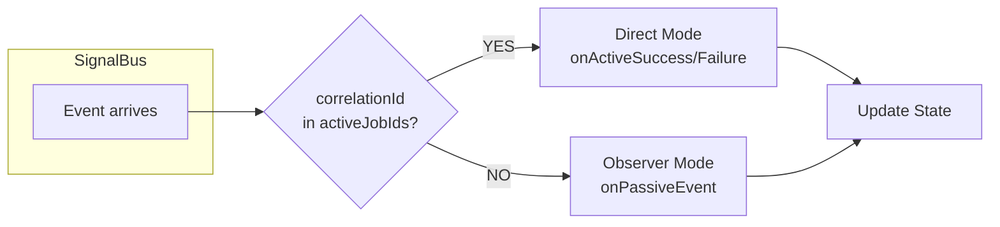

# Chapter 3: Building the Core Framework

This chapter guides you through building the `orchestrator_core` package - the technical foundation of the entire architecture. The goal is to create a lightweight, high-performance framework independent of Flutter (Pure Dart).

> **Note**: All source code in this chapter has been tested and confirmed working.

---

## 3.1. Basic Data Models

### BaseJob

Base class for all work requests in the system. The `id` property serves as Correlation ID to identify transactions.

```dart
// lib/src/models/job.dart
import 'package:meta/meta.dart';

@immutable
abstract class BaseJob {
  /// Unique transaction identifier (Correlation ID)
  final String id;

  /// Optional metadata
  final Map<String, dynamic>? metadata;

  const BaseJob({required this.id, this.metadata});
  
  @override
  String toString() => '$runtimeType(id: $id)';
}

/// Utility function to generate unique ID
String generateJobId([String? prefix]) {
  final timestamp = DateTime.now().millisecondsSinceEpoch;
  final random = timestamp.hashCode.abs() % 10000;
  return '${prefix ?? 'job'}-$timestamp-$random';
}
```

### BaseEvent

Base class for all events emitted from Executors. The `correlationId` property allows Orchestrators to identify the event's origin.

```dart
// lib/src/models/event.dart
@immutable
abstract class BaseEvent {
  /// ID of the Job that generated this event
  final String correlationId;
  final DateTime timestamp;

  BaseEvent(this.correlationId) : timestamp = DateTime.now();
}

/// Event when Job completes successfully
class JobSuccessEvent<T> extends BaseEvent {
  final T data;
  JobSuccessEvent(super.correlationId, this.data);
}

/// Event when Job encounters error
class JobFailureEvent extends BaseEvent {
  final Object error;
  final StackTrace? stackTrace;
  JobFailureEvent(super.correlationId, this.error, [this.stackTrace]);
}
```

---

## 3.2. Communication Infrastructure

### Signal Bus

Central communication channel using Dart's `StreamController.broadcast()`. Singleton design ensures the entire application has only one broadcast point.

```dart
// lib/src/infra/signal_bus.dart
import 'dart:async';

class SignalBus {
  static final SignalBus _instance = SignalBus._internal();
  factory SignalBus() => _instance;
  SignalBus._internal();

  final _controller = StreamController<BaseEvent>.broadcast();

  /// Stream allowing multiple Orchestrators to listen simultaneously
  Stream<BaseEvent> get stream => _controller.stream;

  /// Emit event on Bus
  void emit(BaseEvent event) {
    if (!_controller.isClosed) {
      _controller.add(event);
    }
  }

  void dispose() => _controller.close();
}
```

### Dispatcher

Router using Registry Pattern to map Job types to corresponding Executors. O(1) lookup complexity.

```dart
// lib/src/infra/dispatcher.dart
class ExecutorNotFoundException implements Exception {
  final Type jobType;
  ExecutorNotFoundException(this.jobType);
  @override
  String toString() => 'No Executor found for type $jobType';
}

class Dispatcher {
  final Map<Type, BaseExecutor> _registry = {};
  
  static final Dispatcher _instance = Dispatcher._internal();
  factory Dispatcher() => _instance;
  Dispatcher._internal();

  /// Register Executor for a specific Job type
  void register<J extends BaseJob>(BaseExecutor<J> executor) {
    _registry[J] = executor;
  }

  /// Route Job to appropriate Executor
  String dispatch(BaseJob job) {
    final executor = _registry[job.runtimeType];
    if (executor == null) {
      throw ExecutorNotFoundException(job.runtimeType);
    }
    
    executor.execute(job);
    return job.id;
  }
  
  void clear() => _registry.clear();
}
```

---

## 3.3. BaseExecutor

Abstract class defining the interface for all Workers. Includes built-in Error Boundary to ensure all exceptions are handled and converted to error events.

```dart
// lib/src/base/base_executor.dart
abstract class BaseExecutor<T extends BaseJob> {
  final SignalBus _bus = SignalBus();

  /// Abstract method - subclasses implement business logic
  Future<dynamic> process(T job);

  /// Entry point called by Dispatcher
  Future<void> execute(T job) async {
    try {
      final result = await process(job);
      emitResult(job.id, result);
    } catch (e, stack) {
      emitFailure(job.id, e, stack);
    }
  }

  /// Emit success event
  void emitResult<R>(String correlationId, R data) {
    _bus.emit(JobSuccessEvent<R>(correlationId, data));
  }

  /// Emit error event
  void emitFailure(String correlationId, Object error, [StackTrace? stack]) {
    _bus.emit(JobFailureEvent(correlationId, error, stack));
  }
}
```

---

## 3.4. BaseOrchestrator

Abstract class implementing State Machine mechanism with automatic event classification.



```dart
// lib/src/base/base_orchestrator.dart
abstract class BaseOrchestrator<S> {
  S _state;
  final StreamController<S> _stateController = StreamController<S>.broadcast();
  final SignalBus _bus = SignalBus();
  final Dispatcher _dispatcher = Dispatcher();
  
  /// Set of Jobs being tracked
  final Set<String> _activeJobIds = {};
  
  StreamSubscription? _busSubscription;

  BaseOrchestrator(this._state) {
    _stateController.add(_state);
    _subscribeToBus();
  }

  S get state => _state;
  Stream<S> get stream => _stateController.stream;
  bool get hasActiveJobs => _activeJobIds.isNotEmpty;

  @protected
  void emit(S newState) {
    if (_stateController.isClosed) return;
    _state = newState;
    _stateController.add(newState);
  }

  @protected
  String dispatch(BaseJob job) {
    final id = _dispatcher.dispatch(job);
    _activeJobIds.add(id);
    return id;
  }

  void _subscribeToBus() {
    _busSubscription = _bus.stream.listen(_routeEvent);
  }

  void _routeEvent(BaseEvent event) {
    final isActive = _activeJobIds.contains(event.correlationId);
    
    if (isActive) {
      if (event is JobSuccessEvent) onActiveSuccess(event);
      else if (event is JobFailureEvent) onActiveFailure(event);
      _activeJobIds.remove(event.correlationId);
    } else {
      onPassiveEvent(event);
    }
  }

  @protected void onActiveSuccess(JobSuccessEvent event) {}
  @protected void onActiveFailure(JobFailureEvent event) {}
  @protected void onPassiveEvent(BaseEvent event) {}

  @mustCallSuper
  void dispose() {
    _busSubscription?.cancel();
    _stateController.close();
    _activeJobIds.clear();
  }
}
```

---

## 3.5. Summary

With approximately 200 lines of core code, we've built a complete framework:

- **Separation**: Executor and Orchestrator operate independently.
- **Reactivity**: Orchestrator automatically handles incoming events.
- **High Performance**: Uses Broadcast Stream and O(1) lookup.

Advanced features like Cancellation, Timeout, Retry are covered in **Chapter 5**.
