# Chapter 3: The Component Details

> *"Simplicity is the ultimate sophistication."* — Leonardo da Vinci

This chapter dives deeper into each component's internal structure and behavior, using diagrams to explain the mechanics.

---

## 3.1. The Job

A Job is a **request for work** — an immutable data object describing what needs to be done.

### Job Properties

| Property | Purpose |
|----------|---------|
| `id` | Correlation ID for tracking |
| `metadata` | Optional context data |
| `cancellationToken` | For explicit cancellation |
| `timeout` | Maximum execution time |
| `retryPolicy` | Retry configuration |

---

## 3.2. The Event

An Event is a **notification of what happened** — the result of job execution.

### Event Types

| Event Type | When Emitted |
|------------|--------------|
| `JobSuccessEvent` | Job completed successfully |
| `JobFailureEvent` | Job encountered an error |
| `JobProgressEvent` | Job is partially complete |
| `JobTimeoutEvent` | Job exceeded time limit |
| `JobRetryingEvent` | Job is being retried |

---

## 3.3. The Dispatcher (Routing)

The Dispatcher maintains a registry mapping Job types to Executors.

```mermaid
graph LR
    subgraph Registry["📮 Dispatcher Registry"]
        R1["FetchUserJob → UserExecutor"]
        R2["LoginJob → AuthExecutor"]
        R3["UploadJob → UploadExecutor"]
    end
    
    Job["Incoming Job"] --> Lookup{"Type Lookup<br/>O(1)"}
    Lookup --> Executor["Matched Executor"]
    
    style Registry fill:#f3f0ff
```

### Registration Flow

```mermaid
sequenceDiagram
    participant App as 🚀 App Startup
    participant Disp as 📮 Dispatcher
    participant Exec as ⚙️ Executor
    
    App->>Disp: register<FetchUserJob>(UserExecutor())
    App->>Disp: register<LoginJob>(AuthExecutor())
    
    Note over Disp: Registry populated
    
    App->>Disp: dispatch(FetchUserJob(...))
    Disp->>Exec: execute(job)
```

---

## 3.4. The Executor (Processing)

The Executor is a **stateless worker** with built-in error handling.

```mermaid
flowchart TB
    subgraph Executor["⚙️ Executor"]
        Start["execute(job)"] --> CheckCancel{"Cancelled?"}
        CheckCancel -->|"YES"| Cancelled["❌ CancelledException"]
        CheckCancel -->|"NO"| Process["process(job)"]
        Process --> Success{"Success?"}
        Success -->|"YES"| EmitSuccess["emit(SuccessEvent)"]
        Success -->|"ERROR"| CheckRetry{"Can Retry?"}
        CheckRetry -->|"YES"| Wait["Wait (backoff)"]
        Wait --> Process
        CheckRetry -->|"NO"| EmitFailure["emit(FailureEvent)"]
    end
    
    style EmitSuccess fill:#37b24d,color:#fff
    style EmitFailure fill:#f03e3e,color:#fff
```

### Error Boundary

Every Executor has an automatic error boundary:

---

## 3.5. The Orchestrator (State Machine)

The Orchestrator is a **stateful coordinator** managing UI state and job tracking.

### Internal Structure

```mermaid
graph TB
    subgraph Orchestrator["🎭 Orchestrator"]
        State["📊 Current State"]
        ActiveJobs["🏃 Active Job IDs<br/>{abc123, xyz789}"]
        Subscription["📡 Bus Subscription"]
        
        Handlers["Event Handlers"]
        Handlers --> OnSuccess["onActiveSuccess()"]
        Handlers --> OnFailure["onActiveFailure()"]
        Handlers --> OnPassive["onPassiveEvent()"]
    end
```

### Event Routing Logic

```mermaid
flowchart TD
    Event["📨 Event Received"] --> Extract["Extract correlationId"]
    Extract --> Check{"correlationId ∈ activeJobIds?"}
    
    Check -->|"YES"| Direct["🎯 Direct Mode"]
    Check -->|"NO"| Observer["👀 Observer Mode"]
    
    Direct --> Remove["Remove from activeJobIds"]
    Remove --> TypeCheck{"Event Type?"}
    TypeCheck -->|"Success"| OnSuccess["onActiveSuccess()"]
    TypeCheck -->|"Failure"| OnFailure["onActiveFailure()"]
    
    Observer --> OnPassive["onPassiveEvent()"]
```

---

## 3.6. The Signal Bus (Broadcasting)

The Signal Bus is a **publish-subscribe** mechanism for event distribution.

```mermaid
graph TB
    subgraph Publishers["Publishers"]
        E1["Executor 1"]
        E2["Executor 2"]
        E3["Executor 3"]
    end
    
    subgraph Bus["📡 Signal Bus"]
        Stream["Broadcast Stream"]
    end
    
    subgraph Subscribers["Subscribers"]
        O1["Orchestrator A"]
        O2["Orchestrator B"]
        O3["Orchestrator C"]
    end
    
    E1 & E2 & E3 --> Stream
    Stream --> O1 & O2 & O3
    
    style Stream fill:#f59f00,color:#fff
```

### Global vs Scoped Bus

```mermaid
graph TB
    subgraph GlobalBus["🌍 Global Bus"]
        GB["All events visible<br/>to all orchestrators"]
    end
    
    subgraph ScopedBus["🔒 Scoped Bus"]
        SB1["Auth Module Bus"]
        SB2["Chat Module Bus"]
        SB3["Cart Module Bus"]
    end
    
    GlobalBus -.->|"Use for"| Public["Public Events<br/>(UserLoggedIn, ThemeChanged)"]
    ScopedBus -.->|"Use for"| Private["Private Events<br/>(Internal state changes)"]
```

---

## 3.7. Complete System Flow

---

## Summary

**Key Takeaway**: Each component has a single responsibility, connected through well-defined interfaces. This makes the system testable, maintainable, and scalable.
