# Chapter 4: Core Patterns

> *"A pattern is a solution to a problem in a context."* — Christopher Alexander

This chapter describes the fundamental patterns that make the architecture work.

---

## 4.1. The Job-Executor Pattern

**Problem**: How to decouple what needs to be done from how it's done?

**Solution**: Separate the request (Job) from the handler (Executor).

```mermaid
graph LR
    subgraph Pattern["Job-Executor Pattern"]
        Job["📋 Job<br/>(What)"] --> Executor["⚙️ Executor<br/>(How)"]
        Executor --> Event["📨 Event<br/>(Result)"]
    end
    
    style Job fill:#4c6ef5,color:#fff
    style Executor fill:#37b24d,color:#fff
    style Event fill:#f59f00,color:#fff
```

### Structure

### Consequences

| Benefit | Description |
|---------|-------------|
| **Testability** | Test Executor without UI |
| **Reusability** | Same Executor for multiple callers |
| **Single Responsibility** | Each Executor does one thing |

---

## 4.2. The Event Routing Pattern

**Problem**: How does the right Orchestrator receive the right Event?

**Solution**: Use Correlation ID to match events to their originators.

```mermaid
sequenceDiagram
    participant OrcA as Orchestrator A
    participant OrcB as Orchestrator B
    participant Bus as Signal Bus
    
    Note over OrcA: activeJobs = [job-001]
    Note over OrcB: activeJobs = [job-002]
    
    Bus->>OrcA: Event(id=job-001)
    Bus->>OrcB: Event(id=job-001)
    
    Note over OrcA: ✅ job-001 in activeJobs<br/>→ Direct Mode
    Note over OrcB: ❌ job-001 not mine<br/>→ Observer Mode
```

### The Routing Algorithm

---

## 4.3. The State Transition Pattern

**Problem**: How to manage UI state consistently across async operations?

**Solution**: Define clear states and transitions triggered by events.

### State Categories

```mermaid
graph TB
    subgraph ControlState["🎮 Control State"]
        Loading["isLoading"]
        Error["hasError"]
        Submitted["isSubmitted"]
    end
    
    subgraph DataState["📊 Data State"]
        User["user: User?"]
        Items["items: List"]
        Count["count: int"]
    end
    
    Note["Control = UI behavior<br/>Data = Business content"]
```

### Rule

> **Control State** should only be modified by **Direct Mode** events.
> **Data State** can be modified by both Direct and Observer modes.

---

## 4.4. The Scoped Bus Pattern

**Problem**: How to prevent event leakage between modules?

**Solution**: Create isolated buses for independent modules.

### When to Use Each

| Bus Type | Use Case | Example Events |
|----------|----------|----------------|
| **Scoped** | Internal module state | LoadingStarted, StepComplete |
| **Global** | Cross-module communication | UserLoggedIn, ThemeChanged |

---

## 4.5. The Registry Pattern

**Problem**: How to efficiently route Jobs to Executors?

**Solution**: Maintain a type-based registry with O(1) lookup.

```mermaid
graph TB
    subgraph Registry["📮 Registry"]
        Map["Map<Type, Executor>"]
        
        E1["FetchUserJob → UserExecutor"]
        E2["LoginJob → AuthExecutor"]
        E3["UploadJob → FileExecutor"]
    end
    
    Job["Job (Type: FetchUserJob)"] --> Lookup["registry[job.type]"]
    Lookup --> Match["UserExecutor"]
    
    style Map fill:#f3f0ff
```

### Registration Strategies

```mermaid
flowchart LR
    subgraph Strategies["Registration Timing"]
        Startup["🚀 At App Startup"]
        Lazy["⏳ Lazy Registration"]
        DI["💉 Dependency Injection"]
    end
    
    Startup --> Pro1["✅ Simple, predictable"]
    Lazy --> Pro2["✅ Smaller initial load"]
    DI --> Pro3["✅ Testable, mockable"]
```

---

## 4.6. The Error Boundary Pattern

**Problem**: How to prevent executor errors from crashing the app?

**Solution**: Wrap all executor logic in try-catch and convert to events.

### Guarantee

> **Every job dispatch results in exactly one event**: Success OR Failure.
> The Orchestrator can always rely on receiving a response.

---

## 4.7. Pattern Relationships

---

## Summary

| Pattern | Problem Solved | Key Mechanism |
|---------|----------------|---------------|
| **Job-Executor** | Decouple request from handler | Type-based routing |
| **Event Routing** | Match events to originators | Correlation ID |
| **State Transition** | Consistent UI state | State machine |
| **Scoped Bus** | Prevent event leakage | Isolated channels |
| **Registry** | Efficient routing | O(1) lookup map |
| **Error Boundary** | Prevent crashes | Automatic try-catch |

**Key Takeaway**: These patterns work together to create a robust, testable, and scalable architecture.
