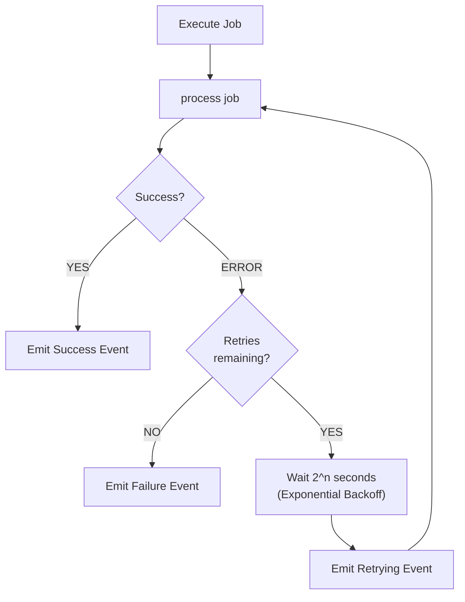
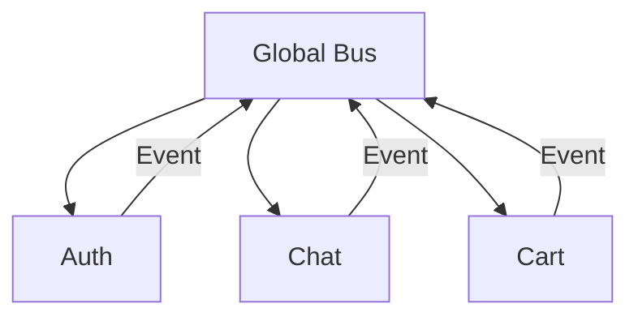
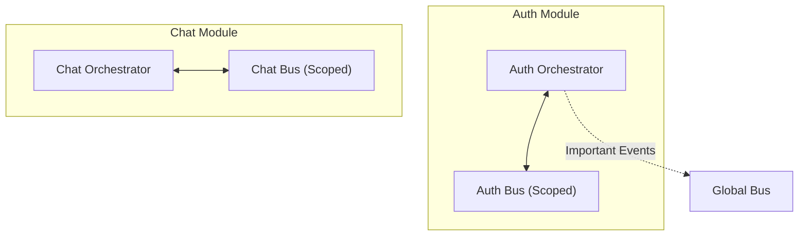

# Chapter 5: Advanced Patterns

This chapter adds essential features for the framework to be Production-Ready. These features help the system handle real-world scenarios like network timeouts, request cancellation, and automatic retry on errors.

---

## 5.1. Task Cancellation

**Philosophy:** Jobs run independently of UI lifecycle. Only cancel when:
- User EXPLICITLY presses Cancel button
- Business logic determines result is no longer needed (e.g., user sends new request replacing old one)

**Note:** DO NOT auto-cancel when user navigates away. Results are still cached and displayed when user returns.

### CancellationToken

```dart
// lib/src/utils/cancellation_token.dart
class CancellationToken {
  bool _isCancelled = false;
  final List<void Function()> _listeners = [];

  bool get isCancelled => _isCancelled;

  void cancel() {
    if (_isCancelled) return;
    _isCancelled = true;
    for (final listener in _listeners) {
      listener();
    }
    _listeners.clear();
  }

  /// Register callback when token is cancelled
  void onCancel(void Function() callback) {
    if (_isCancelled) {
      callback();
    } else {
      _listeners.add(callback);
    }
  }

  /// Check and throw exception if cancelled
  void throwIfCancelled() {
    if (_isCancelled) throw CancelledException();
  }
}

class CancelledException implements Exception {
  @override
  String toString() => 'CancelledException: Operation was cancelled.';
}
```

### Integration with Job

```dart
abstract class BaseJob {
  final String id;
  final CancellationToken? cancellationToken;
  
  const BaseJob({required this.id, this.cancellationToken});
}
```

### Practical Usage

```dart
class _MyScreenState extends State<MyScreen> {
  CancellationToken? _token;

  void _loadData() {
    _token = CancellationToken();
    orchestrator.dispatch(FetchDataJob(cancellationToken: _token));
  }

  // User EXPLICITLY presses Cancel button
  void _onCancelPressed() {
    _token?.cancel();
  }
  
  // User sends new request replacing old one
  void _loadNewData() {
    _token?.cancel(); // Cancel old request as no longer needed
    _token = CancellationToken();
    orchestrator.dispatch(FetchDataJob(cancellationToken: _token));
  }

  @override
  void dispose() {
    // DO NOT cancel here - results are still cached
    super.dispose();
  }
}
```

---

## 5.2. Timeout

Long-running tasks need handling to prevent UI from hanging.

### Timeout Event

```dart
class JobTimeoutEvent extends BaseEvent {
  final Duration timeout;
  JobTimeoutEvent(super.correlationId, this.timeout);
}
```

### Executor Implementation

```dart
Future<void> execute(T job) async {
  try {
    Future<dynamic> executionFuture = process(job);
    
    if (job.timeout != null) {
      executionFuture = executionFuture.timeout(
        job.timeout!,
        onTimeout: () {
          _bus.emit(JobTimeoutEvent(job.id, job.timeout!));
          throw TimeoutException('Task exceeded allowed time', job.timeout);
        },
      );
    }
    
    final result = await executionFuture;
    emitResult(job.id, result);
  } catch (e, stack) {
    emitFailure(job.id, e, stack);
  }
}
```

---

## 5.3. Automatic Retry

Automatic retry with Exponential Backoff algorithm improves reliability when encountering temporary errors.



### RetryPolicy

```dart
// lib/src/utils/retry_policy.dart
class RetryPolicy {
  final int maxRetries;
  final Duration baseDelay;
  final bool exponentialBackoff;
  final Duration maxDelay;
  final bool Function(Object error)? shouldRetry;

  const RetryPolicy({
    this.maxRetries = 3,
    this.baseDelay = const Duration(seconds: 1),
    this.exponentialBackoff = true,
    this.maxDelay = const Duration(seconds: 30),
    this.shouldRetry,
  });
  
  /// Calculate wait time for attempt n
  Duration getDelay(int attempt) {
    if (!exponentialBackoff) return baseDelay;
    
    final delay = baseDelay * (1 << attempt); // 2^attempt
    return delay > maxDelay ? maxDelay : delay;
  }
  
  bool canRetry(Object error, int currentAttempt) {
    if (currentAttempt >= maxRetries) return false;
    if (shouldRetry != null) return shouldRetry!(error);
    return true;
  }
}
```

### Retry Event

```dart
class JobRetryingEvent extends BaseEvent {
  final int attempt;
  final int maxRetries;
  final Object lastError;
  final Duration delayBeforeRetry;

  JobRetryingEvent(super.correlationId, {
    required this.attempt,
    required this.maxRetries,
    required this.lastError,
    required this.delayBeforeRetry,
  });
}
```

---

## 5.4. Progress Reporting

For long-running tasks (file upload, AI processing), progress reporting helps users track status.

### JobProgressEvent

```dart
class JobProgressEvent extends BaseEvent {
  final double progress; // 0.0 to 1.0
  final String? message;
  final int? currentStep;
  final int? totalSteps;

  JobProgressEvent(super.correlationId, {
    required this.progress,
    this.message,
    this.currentStep,
    this.totalSteps,
  });
}
```

### Usage in Executor

```dart
class UploadExecutor extends BaseExecutor<UploadJob> {
  @override
  Future<dynamic> process(UploadJob job) async {
    final totalChunks = 10;
    
    for (int i = 1; i <= totalChunks; i++) {
      await uploadChunk(i);
      
      emitProgress(
        job.id,
        progress: i / totalChunks,
        message: 'Uploading part $i/$totalChunks',
        currentStep: i,
        totalSteps: totalChunks,
      );
    }
    
    return 'Complete';
  }
}
```

---

## 5.5. Logging System

Flexible logging system supports debugging during development and monitoring in production.

### Logger Interface

```dart
// lib/src/utils/logger.dart
enum LogLevel { debug, info, warning, error }

abstract class OrchestratorLogger {
  void log(LogLevel level, String message, [Object? error, StackTrace? stack]);
  
  void debug(String message) => log(LogLevel.debug, message);
  void info(String message) => log(LogLevel.info, message);
  void warning(String message, [Object? error]) => log(LogLevel.warning, message, error);
  void error(String message, Object error, [StackTrace? stack]) => 
      log(LogLevel.error, message, error, stack);
}

/// Console logger (for development)
class ConsoleLogger extends OrchestratorLogger {
  final LogLevel minLevel;
  ConsoleLogger({this.minLevel = LogLevel.info});
  
  @override
  void log(LogLevel level, String message, [Object? error, StackTrace? stack]) {
    if (level.index < minLevel.index) return;
    print('[${level.name.toUpperCase()}] $message');
  }
}

/// Silent logger (for production)
class NoOpLogger extends OrchestratorLogger {
  @override
  void log(LogLevel level, String message, [Object? error, StackTrace? stack]) {}
}
```

---
---

## 5.6. Scalable Architecture with Scoped Bus

For large applications composed of loosely coupled modules (e.g., Auth, Chat, Cart), using a single global event bus can lead to:
1.  **Noise**: All modules receive all events.
2.  **Security Risks**: Sensitive events leak to unintended listeners.
3.  **Performance Bottlenecks**: High traffic on a single stream.

The **Scoped Bus** architecture solves this by creating isolated communication channels.

### Architecture Comparison

**Global Bus (Default)**: Everyone hears everything.



**Scoped Bus (Isolated)**: Events stay within their module.



### Implementation

1. **Create a Scoped Bus**:

```dart
// Create a private bus for this module
final authBus = SignalBus.scoped();
```

2. **Inject into Orchestrator**:

```dart
// Orchestrator will listen/emit to this bus ONLY
final orchestrator = AuthOrchestrator(bus: authBus);
```

3. **Execution**:
   - When `orchestrator.dispatch(job)` is called, the job is explicitly tagged with `authBus`.
   - The Executor automatically routes events (Success/Failure/Progress) back to `authBus`.
   - Global listeners (on `SignalBus.instance`) will **NOT** see these events.

### Best Practice

- Use **Scoped Bus** for internal module logic (loading states, step transitions).
- Use **Global Bus** (`SignalBus.instance`) only for public events that other modules need to react to (e.g., `UserLoggedInEvent`, `ThemeChangedEvent`).

---

## 5.7. Safety Mechanisms

To prevent application crashes and infinite loops, the core framework includes built-in safety mechanisms.

### Circuit Breaker (Loop Protection)

The framework automatically detects if an Orchestrator processes too many events in a short period (Infinite Loop).

- **Default Limit**: 50 events/second.
- **Behavior**: Stops processing events and logs an error to `OrchestratorLogger`.
- **Configuration**:

```dart
// 1. Global limit (applies to all events)
OrchestratorConfig.maxEventsPerSecond = 100;

// 2. Specific limit override (e.g., for high-frequency sensor data)
OrchestratorConfig.setTypeLimit<MouseMovementEvent>(500);
```

### Type Safety Isolation

All event handlers (`onActiveSuccess`, `onPassiveEvent`, etc.) are wrapped in a `try-catch` block.

#### Safe Data Casting
To avoid runtime exceptions when casting event data, use `dataAs<T>()`:

```dart
@override
void onActiveSuccess(JobSuccessEvent event) {
  // Returns 'User?' (null if type mismatch), instead of crashing
  final user = event.dataAs<User>(); 
  if (user != null) {
    emit(state.copyWith(user: user));
  }
}
```

### Preventing UI Race Conditions

When multiple jobs run in parallel, checking simple `isLoading` can be risky. Use `isJobTypeRunning<T>` for precise UI updates:

```dart
// Check valid state before emitting
if (isJobTypeRunning<FetchUserJob>() && !isJobTypeRunning<LogoutJob>()) {
  emit(state.copyWith(isLoading: false));
}
```

---

## 5.8. Summary

With these advanced features, the framework meets Production-Ready requirements:

| Feature | Benefit |
|---------|---------|
| **Cancellation** | Cancel when user explicitly requests or by business logic |
| **Timeout** | Ensure system doesn't hang indefinitely |
| **Retry** | Auto-recover from temporary errors |
| **Progress** | Improve user experience with long tasks |
| **Logging** | Support debugging and system monitoring |

The next chapter applies all knowledge to a real-world case study.
