# Chapter 5: Advanced Patterns

> *"Make it work, make it right, make it fast."* — Kent Beck

This chapter covers patterns for production-ready systems: handling failures, managing long-running tasks, and scaling.

---

## 5.1. The Cancellation Pattern

**Problem**: How to stop unnecessary work when it's no longer needed?

**Solution**: Cooperative cancellation through tokens.

```mermaid
%%{init: {'theme': 'base', 'themeVariables': { 'primaryTextColor': '#1e293b', 'noteTextColor': '#1e293b', 'actorTextColor': '#1e293b' }}}%%
sequenceDiagram
    participant UI as 🖥️ UI
    participant Orch as 🎭 Orchestrator
    participant Exec as ⚙️ Executor
    participant Token as 🎫 Token
    
    rect rgb(241, 245, 249)
        Note over UI,Token: Initialization
        UI->>Orch: startSearch(query)
        Orch->>Token: create()
        Orch->>Orch: track token
        Orch->>Exec: dispatch(SearchJob, token)
    end
    
    rect rgb(224, 242, 241)
        Note over Exec: Processing...
    end
    
    rect rgb(254, 243, 199)
        Note over UI,Token: Cancellation Trigger
        UI->>Orch: newSearch(newQuery)
        Orch->>Token: cancel()
    end
    
    rect rgb(254, 226, 226)
        Exec->>Token: isCancelled?
        Token-->>Exec: true
        Exec->>Exec: throw CancelledException
    end
```

### When to Cancel

```mermaid
graph TB
    subgraph CancelTriggers["🛑 When to Cancel"]
        User["User clicks Cancel button"]
        Replace["New request replaces old"]
        Timeout["Timeout exceeded"]
    end
    
    subgraph DontCancel["✅ When NOT to Cancel"]
        Navigate["User navigates away"]
        Background["App goes to background"]
    end
    
    Note["💡 Results are cached.<br/>Don't cancel just because view is gone."]
    
    style CancelTriggers fill:#fee2e2,stroke:#334155,color:#1e293b
    style DontCancel fill:#fef3c7,stroke:#334155,color:#1e293b
    style User fill:#f1f5f9,stroke:#334155,color:#1e293b
    style Replace fill:#f1f5f9,stroke:#334155,color:#1e293b
    style Timeout fill:#f1f5f9,stroke:#334155,color:#1e293b
    style Navigate fill:#f1f5f9,stroke:#334155,color:#1e293b
    style Background fill:#f1f5f9,stroke:#334155,color:#1e293b
    style Note fill:#0d9488,stroke:#334155,color:#ffffff
```

### Cancellation Checkpoints

---

## 5.2. The Timeout Pattern

**Problem**: How to prevent operations from running forever?

**Solution**: Wrap execution with a time limit.

### Timeout Strategy

```mermaid
graph LR
    subgraph Strategy["⏱️ Timeout Strategy"]
        Overall["Overall Timeout<br/>Total time allowed"]
        PerStep["Per-Step Timeout<br/>Each operation limited"]
    end
    
    Overall --> Total["e.g., 60 seconds total"]
    PerStep --> Each["e.g., 10 seconds per API call"]
    
    style Strategy fill:#e0f2f1,stroke:#334155,color:#1e293b
    style Overall fill:#f1f5f9,stroke:#334155,color:#1e293b
    style PerStep fill:#f1f5f9,stroke:#334155,color:#1e293b
    style Total fill:#fef3c7,stroke:#334155,color:#1e293b
    style Each fill:#fef3c7,stroke:#334155,color:#1e293b
```

---

## 5.3. The Retry Pattern

**Problem**: How to recover from transient failures?

**Solution**: Automatic retry with exponential backoff.

### Backoff Visualization

### Retry Policy Configuration

| Parameter | Description | Default |
|-----------|-------------|---------|
| `maxRetries` | Maximum attempts | 3 |
| `baseDelay` | Initial wait | 1 second |
| `maxDelay` | Cap on wait time | 30 seconds |
| `shouldRetry` | Condition function | Always true |

---

## 5.4. The Progress Pattern

**Problem**: How to show progress for long-running tasks?

**Solution**: Emit progress events during execution.

```mermaid
%%{init: {'theme': 'base', 'themeVariables': { 'primaryTextColor': '#1e293b', 'noteTextColor': '#1e293b', 'actorTextColor': '#1e293b' }}}%%
sequenceDiagram
    participant Orch as 🎭 Orchestrator
    participant Exec as ⚙️ Executor
    participant Bus as 📡 Bus
    
    rect rgb(241, 245, 249)
        Orch->>Exec: dispatch(UploadJob)
    end
    
    rect rgb(224, 242, 241)
        loop For each chunk
            Exec->>Bus: emit(Progress 10%)
            Bus->>Orch: progress update
            Exec->>Bus: emit(Progress 50%)
            Bus->>Orch: progress update
            Exec->>Bus: emit(Progress 90%)
            Bus->>Orch: progress update
        end
    end
    
    rect rgb(254, 243, 199)
        Exec->>Bus: emit(Success)
        Bus->>Orch: complete
    end
```

### Progress Reporting Structure

### UI Binding

---

## 5.5. The Circuit Breaker Pattern

**Problem**: How to prevent cascading failures?

**Solution**: Stop calling failing services temporarily.

### Circuit States

| State | Behavior |
|-------|----------|
| **Closed** | Normal operation, counting failures |
| **Open** | Requests fail immediately, no execution |
| **Half-Open** | Testing if service recovered |

---

## 5.6. The Logging Pattern

**Problem**: How to debug and monitor the system?

**Solution**: Pluggable logging at key points.

```mermaid
graph TB
    subgraph LogPoints["📝 Logging Points"]
        Dispatch["Job dispatched"]
        Start["Executor started"]
        Progress["Progress emitted"]
        Success["Success emitted"]
        Failure["Failure emitted"]
        Retry["Retry attempted"]
    end
    
    subgraph Levels["Log Levels"]
        Debug["🔍 Debug"]
        Info["ℹ️ Info"]
        Warn["⚠️ Warning"]
        Error["❌ Error"]
    end
    
    Dispatch --> Info
    Start --> Debug
    Progress --> Debug
    Success --> Info
    Failure --> Error
    Retry --> Warn
    
    style LogPoints fill:#e0f2f1,stroke:#334155,color:#1e293b
    style Levels fill:#fef3c7,stroke:#334155,color:#1e293b
    style Dispatch fill:#f1f5f9,stroke:#334155,color:#1e293b
    style Start fill:#f1f5f9,stroke:#334155,color:#1e293b
    style Progress fill:#f1f5f9,stroke:#334155,color:#1e293b
    style Success fill:#f1f5f9,stroke:#334155,color:#1e293b
    style Failure fill:#f1f5f9,stroke:#334155,color:#1e293b
    style Retry fill:#f1f5f9,stroke:#334155,color:#1e293b
    style Debug fill:#f1f5f9,stroke:#334155,color:#1e293b
    style Info fill:#e0f2f1,stroke:#334155,color:#1e293b
    style Warn fill:#fef3c7,stroke:#334155,color:#1e293b
    style Error fill:#fee2e2,stroke:#334155,color:#1e293b
```

### Logger Configuration

```mermaid
flowchart LR
    subgraph Development["🛠️ Development"]
        ConsoleLogger["Console Logger<br/>Level: Debug"]
    end
    
    subgraph Production["🚀 Production"]
        CloudLogger["Cloud Logger<br/>Level: Warning+"]
        NoOpLogger["No-Op Logger<br/>Disabled"]
    end
    
    style Development fill:#e0f2f1,stroke:#334155,color:#1e293b
    style Production fill:#fef3c7,stroke:#334155,color:#1e293b
    style ConsoleLogger fill:#f1f5f9,stroke:#334155,color:#1e293b
    style CloudLogger fill:#f1f5f9,stroke:#334155,color:#1e293b
    style NoOpLogger fill:#f1f5f9,stroke:#334155,color:#1e293b
```

---

## 5.7. The Deduplication Pattern

**Problem**: How to prevent duplicate concurrent requests?

**Solution**: Track in-flight jobs and reject duplicates.

```mermaid
%%{init: {'theme': 'base', 'themeVariables': { 'primaryTextColor': '#1e293b', 'noteTextColor': '#1e293b', 'actorTextColor': '#1e293b' }}}%%
sequenceDiagram
    participant UI as 🖥️ UI
    participant Orch as 🎭 Orchestrator
    
    UI->>Orch: fetchUser("123")
    Note over Orch: inFlight["user:123"] = true
    Orch->>Orch: dispatch(FetchUserJob)
    
    UI->>Orch: fetchUser("123")
    Note over Orch: Already in flight!
    Orch-->>UI: Ignored (or return existing job ID)
    
    Note over Orch: Job completes
    Note over Orch: inFlight["user:123"] = false
```

### Deduplication Key

```mermaid
graph LR
    Job["Job"] --> Key["Deduplication Key"]
    
    subgraph Examples["Key Examples"]
        E1["FetchUserJob(123) → 'user:123'"]
        E2["SearchJob('flutter') → 'search:flutter'"]
        E3["RefreshJob → 'refresh'"]
    end
    
    style Job fill:#f1f5f9,stroke:#334155,color:#1e293b
    style Key fill:#e0f2f1,stroke:#334155,color:#1e293b
    style Examples fill:#fef3c7,stroke:#334155,color:#1e293b
    style E1 fill:#f1f5f9,stroke:#334155,color:#1e293b
    style E2 fill:#f1f5f9,stroke:#334155,color:#1e293b
    style E3 fill:#f1f5f9,stroke:#334155,color:#1e293b
```

---

## 5.8. Pattern Combinations

```mermaid
flowchart TB
    subgraph FullFlow["🔄 Production-Ready Flow"]
        Start["dispatch(Job)"] --> Dedup{"Duplicate?"}
        Dedup -->|"YES"| Skip["Skip"]
        Dedup -->|"NO"| Execute["Execute"]
        
        Execute --> Timeout{"Timeout?"}
        Timeout -->|"YES"| Fail1["Fail"]
        Timeout -->|"NO"| Success1{"Success?"}
        
        Success1 -->|"YES"| EmitSuccess["✅ Success"]
        Success1 -->|"NO"| Retry{"Retry?"}
        
        Retry -->|"YES"| Wait["Wait (backoff)"]
        Wait --> Execute
        Retry -->|"NO"| Circuit{"Circuit Open?"}
        
        Circuit -->|"YES"| OpenCircuit["Open Circuit"]
        Circuit -->|"NO"| Fail2["❌ Failure"]
    end
    
    style FullFlow fill:#f1f5f9,stroke:#334155,color:#1e293b
    style Start fill:#f1f5f9,stroke:#334155,color:#1e293b
    style Dedup fill:#e0f2f1,stroke:#334155,color:#1e293b
    style Skip fill:#f1f5f9,stroke:#334155,color:#1e293b
    style Execute fill:#e0f2f1,stroke:#334155,color:#1e293b
    style Timeout fill:#e0f2f1,stroke:#334155,color:#1e293b
    style Success1 fill:#e0f2f1,stroke:#334155,color:#1e293b
    style EmitSuccess fill:#fef3c7,stroke:#334155,color:#1e293b
    style Retry fill:#e0f2f1,stroke:#334155,color:#1e293b
    style Wait fill:#f1f5f9,stroke:#334155,color:#1e293b
    style Circuit fill:#e0f2f1,stroke:#334155,color:#1e293b
    style OpenCircuit fill:#fef3c7,stroke:#334155,color:#1e293b
    style Fail1 fill:#fee2e2,stroke:#334155,color:#1e293b
    style Fail2 fill:#fee2e2,stroke:#334155,color:#1e293b
```

---

## Summary

| Pattern | Solves | Key Mechanism |
|---------|--------|---------------|
| **Cancellation** | Stop unwanted work | Cooperative tokens |
| **Timeout** | Prevent infinite waits | Time limits |
| **Retry** | Recover from failures | Exponential backoff |
| **Progress** | Show long task status | Intermediate events |
| **Circuit Breaker** | Prevent cascading failures | State machine |
| **Logging** | Debug and monitor | Pluggable loggers |
| **Deduplication** | Prevent duplicate requests | In-flight tracking |

**Key Takeaway**: Production systems require defense in depth. These patterns layer together to create resilient applications.
