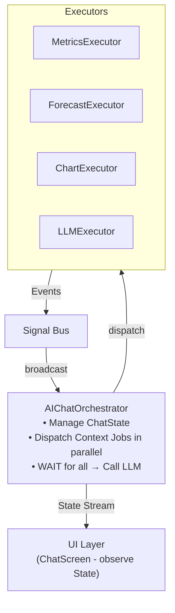
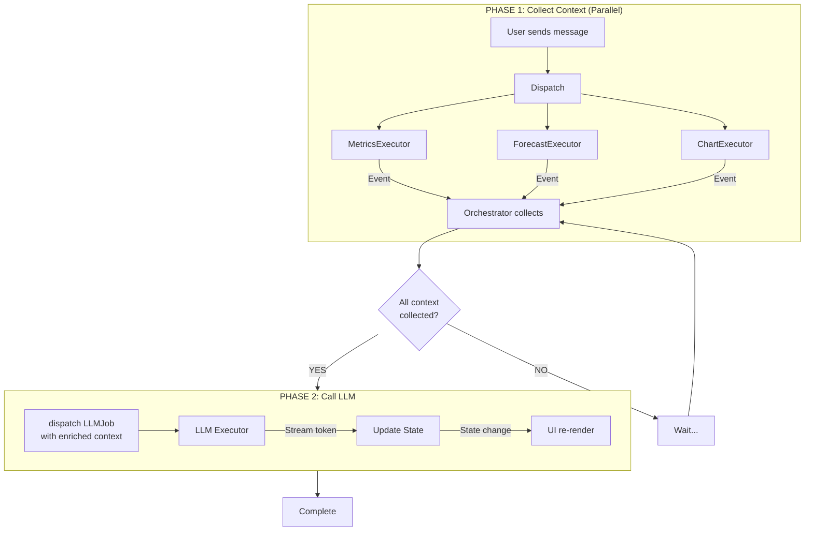

# Chapter 6: Case Study - AI Chatbot with Context Enrichment

This chapter applies the entire Event-Driven Orchestrator architecture to a real-world application: **an intelligent AI Chatbot** capable of accessing and understanding context from multiple data sources.

---

## 6.1. Use Case Description

### Requirements
Build an AI Chatbot that can:
- Answer questions based on **real application data**
- Access multiple sources: Metrics, Forecast, Charts, ETL data
- Streaming response (typing effect)
- Run in background (results are cached when user navigates away)

### Example Interaction
```
User: "How is this month's financial situation?"

AI: [Collecting data...]
    → Calls MetricsExecutor (revenue, expenses, profit)
    → Calls ForecastExecutor (next month forecast)
    → Calls ChartExecutor (trend data)
    
AI: "This month's revenue reached $150K, up 12% from last month.
     Expenses stable at $80K. Net profit $70K.
     Next month forecast: revenue could reach $165K if..."
```

---

## 6.2. System Architecture



### Sequential Processing Flow



**Key Point:** LLM Job is **NOT** dispatched in parallel with Context Jobs. Must wait for all context to complete first.

---

## 6.3. Components

### Jobs

```dart
// Collect metrics
class GetMetricsJob extends BaseJob {
  final String period;
  GetMetricsJob({required this.period}) 
    : super(id: generateJobId('metrics'));
}

// Forecast
class GetForecastJob extends BaseJob {
  final String period;
  GetForecastJob({required this.period})
    : super(id: generateJobId('forecast'));
}

// Call LLM
class LLMJob extends BaseJob {
  final String prompt;
  final String context;
  
  LLMJob({
    required this.prompt, 
    required this.context,
    super.cancellationToken,
  }) : super(id: generateJobId('llm'));
}
```

### Executors

```dart
class MetricsExecutor extends BaseExecutor<GetMetricsJob> {
  @override
  Future<dynamic> process(GetMetricsJob job) async {
    final metrics = await metricsRepository.getForPeriod(job.period);
    return metrics;
  }
}

class LLMExecutor extends BaseExecutor<LLMJob> {
  @override
  Future<dynamic> process(LLMJob job) async {
    final stream = await llmService.streamCompletion(
      prompt: job.prompt,
      context: job.context,
    );
    
    final buffer = StringBuffer();
    
    await for (final chunk in stream) {
      job.cancellationToken?.throwIfCancelled();
      
      buffer.write(chunk);
      // Emit progress for each chunk (streaming effect)
      emitProgress(job.id, 
        progress: 0.5,
        message: chunk,
      );
    }
    
    return buffer.toString();
  }
}
```

---

## 6.4. AIChatOrchestrator

```dart
class ChatState {
  final List<Message> messages;
  final ChatStatus status;
  final String streamingText;
  final double contextProgress;
  
  const ChatState({
    this.messages = const [],
    this.status = ChatStatus.idle,
    this.streamingText = '',
    this.contextProgress = 0,
  });
}

enum ChatStatus { idle, collectingContext, generatingResponse }

class AIChatOrchestrator extends OrchestratorCubit<ChatState> {
  final Set<String> _pendingContextJobs = {};
  final Map<String, dynamic> _collectedContext = {};
  String _currentPrompt = '';
  CancellationToken? _llmToken;

  AIChatOrchestrator() : super(const ChatState());

  void sendMessage(String text) {
    // Cancel old LLM request if running (business logic)
    if (state.status == ChatStatus.generatingResponse) {
      _llmToken?.cancel();
    }
    
    _currentPrompt = text;
    _collectedContext.clear();
    
    // Add user message to state
    emit(state.copyWith(
      messages: [...state.messages, UserMessage(text)],
      status: ChatStatus.collectingContext,
      streamingText: '',
      contextProgress: 0,
    ));
    
    // Dispatch context jobs in parallel
    _pendingContextJobs.addAll({
      dispatch(GetMetricsJob(period: 'this_month')),
      dispatch(GetForecastJob(period: 'next_month')),
    });
  }

  @override
  void onActiveSuccess(JobSuccessEvent event) {
    if (_pendingContextJobs.contains(event.correlationId)) {
      // Collect context
      _pendingContextJobs.remove(event.correlationId);
      _collectedContext[event.correlationId] = event.data;
      
      emit(state.copyWith(
        contextProgress: 1 - (_pendingContextJobs.length / 2),
      ));
      
      // When all context collected → Call LLM
      if (_pendingContextJobs.isEmpty) {
        _dispatchLLM();
      }
    } else {
      // LLM completed
      emit(state.copyWith(
        status: ChatStatus.idle,
        messages: [...state.messages, AIMessage(state.streamingText)],
        streamingText: '',
      ));
    }
  }

  @override
  void onProgress(JobProgressEvent event) {
    // LLM streaming tokens
    emit(state.copyWith(
      streamingText: state.streamingText + (event.message ?? ''),
    ));
  }

  void _dispatchLLM() {
    _llmToken = CancellationToken();
    
    final context = '''
=== CONTEXT DATA ===
Metrics: ${_collectedContext.values.first}
Forecast: ${_collectedContext.values.last}
''';

    emit(state.copyWith(status: ChatStatus.generatingResponse));
    dispatch(LLMJob(
      prompt: _currentPrompt,
      context: context,
      cancellationToken: _llmToken,
    ));
  }

  void cancelCurrentRequest() {
    _llmToken?.cancel();
    emit(state.copyWith(
      status: ChatStatus.idle,
      streamingText: '',
    ));
  }
}
```

---

## 6.5. UI Layer

```dart
class ChatScreen extends StatelessWidget {
  @override
  Widget build(BuildContext context) {
    return BlocBuilder<AIChatOrchestrator, ChatState>(
      builder: (context, state) {
        return Column(
          children: [
            Expanded(
              child: ListView(
                children: [
                  for (final msg in state.messages)
                    MessageBubble(message: msg),
                  
                  // Context loading indicator
                  if (state.status == ChatStatus.collectingContext)
                    ContextLoadingWidget(
                      progress: state.contextProgress,
                    ),
                  
                  // Streaming text (typing effect)
                  if (state.streamingText.isNotEmpty)
                    TypingBubble(text: state.streamingText),
                ],
              ),
            ),
            
            // Input
            ChatInput(
              onSend: (text) => context.read<AIChatOrchestrator>().sendMessage(text),
              onCancel: () => context.read<AIChatOrchestrator>().cancelCurrentRequest(),
              isLoading: state.status != ChatStatus.idle,
            ),
          ],
        );
      },
    );
  }
}
```

---

## 6.6. Key Points

| Principle | Implementation |
|-----------|----------------|
| **Parallel Fetching** | Dispatch multiple jobs in parallel, wait for all |
| **Context Enrichment** | Collect data from multiple sources into LLM context |
| **Streaming** | `JobProgressEvent` for each token |
| **Background Processing** | Jobs run independently of UI lifecycle |
| **Explicit Cancellation** | Only cancel when user sends new message |

---

## 6.7. Security Analysis

### Problem: Fake Events
If an attacker injects fake events into Signal Bus, UI may display incorrect information.

### Solutions

| Mechanism | Description |
|-----------|-------------|
| **Encapsulation** | Only classes extending `BaseExecutor` can emit events |
| **Server Authority** | Client state is just "optimistic UI", server validates all transactions |
| **Event Signature** | (Optional) Server signs events sent via websocket |

### Note
This architecture focuses on **UX and decoupling**, not security layer. Real security must be at Server level.

---

## 6.8. Summary

This case study demonstrates:
1. **Chaining Actions**: Context → LLM → Display
2. **Parallel Execution**: Multiple workers running simultaneously
3. **Streaming Response**: Real-time typing effect
4. **State as Single Source of Truth**: UI only observes, no logic
5. **Proper Cancellation Philosophy**: Only cancel when business logic requires

The Event-Driven Orchestrator architecture enables building complex applications with clean, testable, and maintainable code.
