# Chapter 6: Case Studies

> *"In theory, there is no difference between theory and practice. In practice, there is."* — Yogi Berra

This chapter moves away from abstract patterns and dives into detailed, real-world scenarios. We will explore how to combine multiple patterns to solve complex business requirements.

---

## 6.1. Case Study: AI Chatbot

Building an AI Chatbot involves several complex challenges: the operations are long-running (LLM latency), the data comes in streams (token by token), and the process involves multiple distinct steps (retrieve context -> generate answer -> save history).

### System Overview

We model the system using three distinct Executors, orchestrated by a single `ChatOrchestrator`.

```mermaid
graph TB
    subgraph UI["🖥️ Chat UI"]
        Input["Message Input"]
        Messages["Message List"]
        Typing["Typing Indicator"]
    end
    
    subgraph Orchestrator["🎭 Chat Orchestrator"]
        State["Chat State"]
        ActiveJobs["Active Jobs"]
    end
    
    subgraph Executors["⚙️ Executors"]
        Context["Context Executor<br/>(RAG)"]
        AI["AI Executor<br/>(LLM)"]
        Save["Save Executor<br/>(Persistence)"]
    end
    
    UI --> Orchestrator
    Orchestrator --> Context
    Context -->|"Context Ready"| AI
    AI -->|"AI Response"| Save
    Save -->|"Saved"| Orchestrator
    Orchestrator --> UI
    
    style UI fill:#f1f5f9,stroke:#334155,color:#1e293b
    style Orchestrator fill:#e0f2f1,stroke:#334155,color:#1e293b
    style Executors fill:#fef3c7,stroke:#334155,color:#1e293b
    style Input fill:#f1f5f9,stroke:#334155,color:#1e293b
    style Messages fill:#f1f5f9,stroke:#334155,color:#1e293b
    style Typing fill:#f1f5f9,stroke:#334155,color:#1e293b
    style State fill:#e0f2f1,stroke:#334155,color:#1e293b
    style ActiveJobs fill:#e0f2f1,stroke:#334155,color:#1e293b
    style Context fill:#fef3c7,stroke:#334155,color:#1e293b
    style AI fill:#fef3c7,stroke:#334155,color:#1e293b
    style Save fill:#fef3c7,stroke:#334155,color:#1e293b
```

### The Flow

The message flow is broken down into three phases. Notice how the Orchestrator remains the central coordinator, dispatching new jobs as previous ones complete.

```mermaid
%%{init: {'theme': 'base', 'themeVariables': { 'primaryTextColor': '#1e293b', 'noteTextColor': '#1e293b', 'actorTextColor': '#1e293b' }}}%%
sequenceDiagram
    participant User as 👤 User
    participant Chat as 🎭 ChatOrchestrator
    participant RAG as 📚 ContextExecutor
    participant LLM as 🤖 AIExecutor
    participant DB as 💾 SaveExecutor
    
    User->>Chat: sendMessage("What is...")
    
    rect rgb(241, 245, 249)
        Note over Chat: Phase 1: Context Retrieval
        Chat->>RAG: dispatch(GetContextJob)
        RAG-->>Chat: ContextReadyEvent
    end
    
    rect rgb(224, 242, 241)
        Note over Chat: Phase 2: AI Generation
        Chat->>LLM: dispatch(GenerateResponseJob)
        loop Streaming
            LLM-->>Chat: ProgressEvent(token)
            Note right of Chat: Update UI immediately
        end
        LLM-->>Chat: AIResponseEvent
    end
    
    rect rgb(254, 243, 199)
        Note over Chat: Phase 3: Persistence
        Chat->>DB: dispatch(SaveMessageJob)
        DB-->>Chat: SavedEvent
    end
    
    Chat-->>User: Final State Updated
```

### Chained Jobs Pattern

Instead of a monolithic function, we handle the workflow as a state machine. This allows us to handle errors specifically for each phase (e.g., if Saving fails, we don't lose the AI response, we just show a "Retry Save" button, because the AI response is already in memory).

### Key Decisions

| Decision | Rationale |
|----------|-----------|
| **Separate RAG Executor** | The context retrieval logic (vector DB lookup) is complex and might be used by other features (e.g., "Related Articles"). Separating it makes it reusable. |
| **Streaming via Progress** | We re-purpose the `ProgressEvent` to carry partial string data (tokens). This gives instant feedback to the user. |
| **Save after AI complete** | We only persist the message once the full response is available to ensure database consistency. |

---

## 6.2. Case Study: File Upload

File upload is a classic "long-running operation" that requires careful handling of network instability and user interaction (cancellation).

### The Flow

Here, we use a `CancellationToken` to allow the user to interrupt the process. The Executor checks this token before every chunk upload.

```mermaid
%%{init: {'theme': 'base', 'themeVariables': { 'primaryTextColor': '#1e293b', 'noteTextColor': '#1e293b', 'actorTextColor': '#1e293b' }}}%%
sequenceDiagram
    participant User as 👤 User
    participant UI as 🖥️ Upload UI
    participant Orch as 🎭 Orchestrator
    participant Exec as ⚙️ UploadExecutor
    participant S3 as ☁️ Cloud Storage
    
    rect rgb(241, 245, 249)
        User->>UI: Select file
        UI->>Orch: startUpload(file)
        Orch->>Orch: token = new CancellationToken()
        Orch->>Exec: dispatch(UploadJob, token)
    end
    
    rect rgb(224, 242, 241)
        loop Chunks
            Exec->>S3: Upload chunk
            Exec-->>Orch: Progress(30%)
            Exec->>S3: Upload chunk
            Exec-->>Orch: Progress(60%)
            
            alt User cancels
                User->>Orch: cancel()
                Orch->>Token: cancel()
                Exec->>Exec: throw CancelledException
                Exec-->>Orch: CancelledEvent
            end
        end
    end
    
    rect rgb(254, 243, 199)
        Exec->>S3: Complete multipart
        Exec-->>Orch: SuccessEvent(url)
        Orch-->>UI: Upload complete
    end
```

### Chunked Upload State

The state object needs to track detailed progress, not just "loading".

```mermaid
graph LR
    subgraph UploadState["📤 Upload State"]
        File["file: File"]
        Progress["progress: 0.65"]
        Status["status: uploading"]
        URL["url: null"]
        ChunksDone["chunksComplete: 6/10"]
    end
    
    style UploadState fill:#e0f2f1,stroke:#334155,color:#1e293b
    style File fill:#f1f5f9,stroke:#334155,color:#1e293b
    style Progress fill:#f1f5f9,stroke:#334155,color:#1e293b
    style Status fill:#f1f5f9,stroke:#334155,color:#1e293b
    style URL fill:#f1f5f9,stroke:#334155,color:#1e293b
    style ChunksDone fill:#f1f5f9,stroke:#334155,color:#1e293b
```

### Retry Strategy

Not all errors are equal. We implement smart retry logic inside the Executor:
- **Transient Errors** (Network timeout, 502 Bad Gateway): Retry with exponential backoff.
- **Permanent Errors** (401 Unauthorized, 413 Payload Too Large): Fail immediately.

---

## 6.3. Case Study: Shopping Cart

The Shopping Cart feature introduces cross-module communication. When a user adds an item to the cart, the "Product Detail" screen (which might be active in the background) needs to know about it to update its stock level display.

### System Architecture

We use a **Global Bus** to broadcast events that interest multiple modules.

### Observer Mode Example

This sequence shows how `ProductOrchestrator` passively updates itself based on an action triggered by `CartOrchestrator`.

```mermaid
%%{init: {'theme': 'base', 'themeVariables': { 'primaryTextColor': '#1e293b', 'noteTextColor': '#1e293b', 'actorTextColor': '#1e293b' }}}%%
sequenceDiagram
    participant Cart as 🛒 CartOrchestrator
    participant Product as 📦 ProductOrchestrator
    participant Bus as 📡 Global Bus
    participant Exec as ⚙️ CartExecutor
    
    rect rgb(241, 245, 249)
        Note over Cart: User adds item
        Cart->>Exec: dispatch(AddToCartJob)
    end
    
    rect rgb(224, 242, 241)
        Exec->>Bus: CartUpdatedEvent
    end
    
    rect rgb(254, 243, 199)
        Bus->>Cart: event (Direct Mode)
        Note over Cart: Update cart state
        
        Bus->>Product: event (Observer Mode)
        Note over Product: Update product stock display
    end
```

### Optimistic Update Pattern

For a snappy feel, we assume success. We update the UI *before* the network request returns. If it fails, we rollback.

---

## 6.4. Case Study: Authentication

Authentication is special because it affects the entire app (Global State) but requires high security.

### Architecture

We use a **Scoped Bus** for internal auth logic (like token parsing) to prevent other modules from spying on sensitive events, but expose high-level `UserLoggedIn` events to the Global Bus.

### Token Refresh Flow

This is a background process that happens transparently to the user. When any request fails with 401, the `AuthExecutor` intercepts, refreshes the token, and retries the original request.

```mermaid
%%{init: {'theme': 'base', 'themeVariables': { 'primaryTextColor': '#1e293b', 'noteTextColor': '#1e293b', 'actorTextColor': '#1e293b' }}}%%
sequenceDiagram
    participant Any as 📱 Any Executor
    participant Auth as 🔐 AuthExecutor
    participant API as 🌐 API
    
    rect rgb(254, 226, 226)
        Any->>API: Request with token
        API-->>Any: 401 Unauthorized
    end
    
    rect rgb(224, 242, 241)
        Any->>Auth: dispatch(RefreshTokenJob)
        Auth->>API: POST /refresh
        API-->>Auth: New token
        Auth-->>Any: TokenRefreshedEvent
    end
    
    rect rgb(254, 243, 199)
        Any->>API: Retry request with new token
        API-->>Any: Success
    end
```

---

## 6.5. Lessons Learned

---

## Summary

| Case Study | Key Patterns Used |
|------------|-------------------|
| **AI Chatbot** | **Chaining**: Linking tasks sequentially. **Streaming**: Real-time feedback. |
| **File Upload** | **Cancellation**: Putting user in control. **Retry**: Handling network bumps. |
| **Shopping Cart** | **Observer Mode**: Reacting to others. **Optimistic Update**: Instant feedback. |
| **Authentication** | **Scoped Bus**: Encapsulation. **Interceptor**: Transparent recovery. |

**Key Takeaway**: Real production applications are rarely simple linear flows. They require robust error handling, cross-module communication, and user-centric features like cancellation and optimistic updates. This architecture provides standard patterns for all of these.
