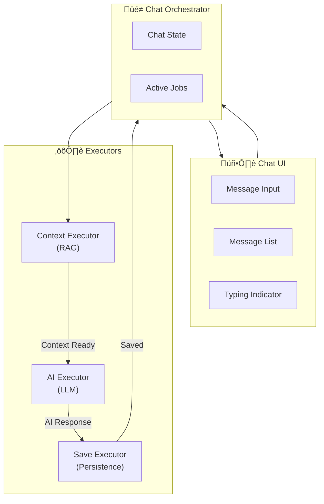
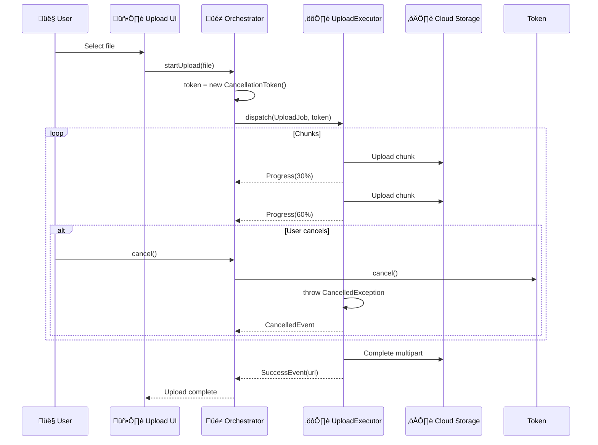
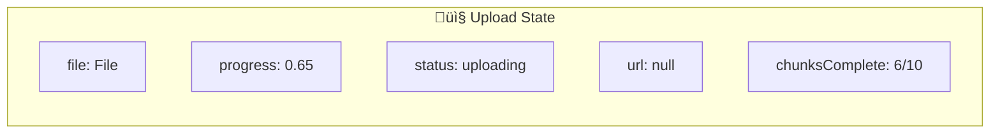
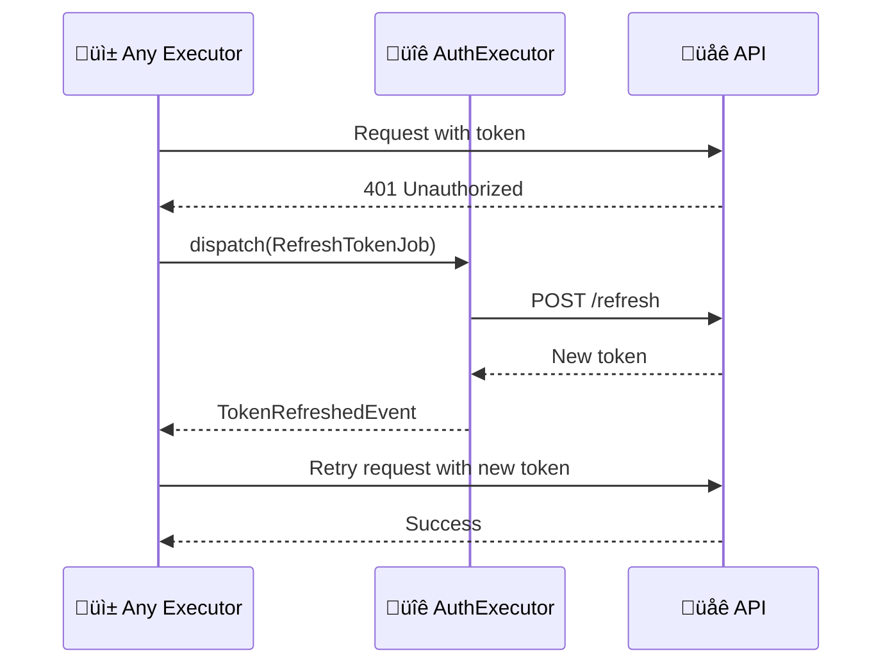

# Chapter 6: Case Studies

> *"In theory, there is no difference between theory and practice. In practice, there is."* — Yogi Berra

This chapter applies the architecture to real-world scenarios.

---

## 6.1. Case Study: AI Chatbot

An AI chatbot demonstrates multiple patterns working together:
- Long-running execution
- Streaming responses
- Multi-step processing
- Cross-cutting concerns (analytics, logging)

### System Overview

### The Flow

```mermaid
sequenceDiagram
    participant User as 👤 User
    participant Chat as 🎭 ChatOrchestrator
    participant RAG as 📚 ContextExecutor
    participant LLM as 🤖 AIExecutor
    participant DB as 💾 SaveExecutor
    
    User->>Chat: sendMessage("What is...")
    
    rect rgb(240, 247, 255)
        Note over Chat: Phase 1: Context
        Chat->>RAG: dispatch(GetContextJob)
        RAG-->>Chat: ContextReadyEvent
    end
    
    rect rgb(240, 255, 240)
        Note over Chat: Phase 2: AI Response
        Chat->>LLM: dispatch(GenerateResponseJob)
        loop Streaming
            LLM-->>Chat: ProgressEvent(token)
        end
        LLM-->>Chat: AIResponseEvent
    end
    
    rect rgb(255, 250, 240)
        Note over Chat: Phase 3: Persist
        Chat->>DB: dispatch(SaveMessageJob)
        DB-->>Chat: SavedEvent
    end
    
    Chat-->>User: Updated State
```

### Chained Jobs Pattern

### Key Decisions

| Decision | Rationale |
|----------|-----------|
| **Separate RAG executor** | Can be reused, tested independently |
| **Streaming via Progress** | User sees tokens as they arrive |
| **Save after AI complete** | Ensures complete response is persisted |

---

## 6.2. Case Study: File Upload

File upload demonstrates:
- Progress reporting
- Cancellation
- Retry on failure
- Large file handling

### The Flow

### Chunked Upload State

### Retry Strategy

---

## 6.3. Case Study: Shopping Cart

Shopping cart demonstrates:
- Observer mode for cross-module updates
- Optimistic updates
- Conflict resolution

### System Architecture

```mermaid
graph TB
    subgraph ProductModule["📦 Product Module"]
        ProductOrch["Product Orchestrator"]
        ProductExec["Product Executor"]
    end
    
    subgraph CartModule["🛒 Cart Module"]
        CartOrch["Cart Orchestrator"]
        CartExec["Cart Executor"]
    end
    
    subgraph GlobalBus["📡 Global Bus"]
        Events["CartUpdatedEvent<br/>StockChangedEvent"]
    end
    
    ProductExec --> GlobalBus
    CartExec --> GlobalBus
    GlobalBus --> ProductOrch
    GlobalBus --> CartOrch
    
    Note["💡 Both orchestrators observe<br/>each other's events"]
```

### Observer Mode Example

### Optimistic Update Pattern

---

## 6.4. Case Study: Authentication

Authentication demonstrates:
- Scoped bus for security
- Global events for cross-app notification
- Token refresh handling

### Architecture

```mermaid
graph TB
    subgraph AuthModule["🔐 Auth Module"]
        AuthBus["Scoped Bus"]
        AuthOrch["Auth Orchestrator"]
        AuthExec["Auth Executor"]
        
        AuthOrch <-.-> AuthBus
        AuthExec --> AuthBus
    end
    
    subgraph OtherModules["📱 Other Modules"]
        Home["Home Orchestrator"]
        Profile["Profile Orchestrator"]
        Settings["Settings Orchestrator"]
    end
    
    subgraph GlobalBus["🌍 Global Bus"]
        Public["UserLoggedInEvent<br/>UserLoggedOutEvent"]
    end
    
    AuthExec -->|"Public events"| GlobalBus
    GlobalBus --> OtherModules
    
    Note["🔒 Internal auth state stays private<br/>Only login/logout events are public"]
```

### Token Refresh Flow

---

## 6.5. Lessons Learned

---

## Summary

| Case Study | Key Patterns Used |
|------------|-------------------|
| **AI Chatbot** | Chaining, Progress, Streaming |
| **File Upload** | Cancellation, Retry, Progress |
| **Shopping Cart** | Observer Mode, Optimistic Update |
| **Authentication** | Scoped Bus, Token Refresh |

**Key Takeaway**: Real applications combine multiple patterns. The architecture's strength is how patterns compose together cleanly.
