# Chapter 7: Best Practices & Guidelines

> *"Rules are for the obedience of fools and the guidance of wise men."* — Douglas Bader

This chapter provides practical guidelines for implementing the architecture successfully.

---

## 7.1. The Golden Rules

### ✅ DO

```mermaid
graph TB
    subgraph Do["✅ Best Practices"]
        D1["Separate Orchestration from Execution"]
        D2["Use immutable State with copyWith"]
        D3["Include correlationId in all events"]
        D4["Handle cancellation in long operations"]
        D5["Use Scoped Bus for module privacy"]
        D6["Test Executors in isolation"]
    end
```



### ❌ DON'T

```mermaid
graph TB
    subgraph Dont["❌ Anti-Patterns"]
        X1["Call Repository in Orchestrator"]
        X2["Create 'God Events' (generic types)"]
        X3["Skip cancellation checkpoints"]
        X4["Mix control and data state"]
        X5["Use global bus for private events"]
        X6["Ignore error handling"]
    end
    
    style Dont fill:#fff5f5
```



---

## 7.2. Folder Structure

### Feature-First (Recommended)


```
lib/
├── core/
│   ├── base/           # Base classes
│   └── di/             # Dependency injection
├── features/
│   ├── auth/
│   │   ├── jobs/
│   │   ├── executors/
│   │   ├── orchestrator/
│   │   └── ui/
│   └── chat/
│       ├── jobs/
│       ├── executors/
│       ├── orchestrator/
│       └── ui/
└── main.dart
```

### Why Feature-First?

| Benefit | Description |
|---------|-------------|
| **Locality** | Related code stays together |
| **Isolation** | Features can be developed independently |
| **Scalability** | Easy to add new features |
| **Deletion** | Remove a feature = delete a folder |

---

## 7.3. Naming Conventions


| Component | Pattern | Example |
|-----------|---------|---------|
| Job | `{Action}{Resource}Job` | `FetchUserJob`, `UploadFileJob` |
| Executor | `{Resource}Executor` | `UserExecutor`, `FileExecutor` |
| Event | `{Resource}{Action}Event` | `UserLoadedEvent`, `FileSavedEvent` |
| State | `{Feature}State` | `AuthState`, `ChatState` |

---

## 7.4. Testing Strategy

```mermaid
graph TB
    subgraph TestPyramid["🔺 Test Pyramid"]
        Unit["⬢ Unit Tests<br/>(Executors)"]
        Integration["⬡ Integration Tests<br/>(Orchestrators)"]
        E2E["△ E2E Tests<br/>(Full flows)"]
    end
    
    Unit --> Fast["Fast, Many"]
    Integration --> Medium["Medium, Moderate"]
    E2E --> Slow["Slow, Few"]
```



### Testing an Executor

```mermaid
flowchart LR
    subgraph ExecutorTest["Testing Executor"]
        Input["Mock Input"]
        Exec["Executor"]
        Output["Verify Output"]
    end
    
    Input --> Exec
    Exec --> Output
    
    Note["✅ No UI, No State<br/>Pure input → output"]
```



### Testing an Orchestrator

```mermaid
flowchart LR
    subgraph OrchestratorTest["Testing Orchestrator"]
        MockBus["Mock Bus"]
        Orch["Orchestrator"]
        States["Verify State Transitions"]
    end
    
    MockBus --> Orch
    Orch --> States
    
    Note["✅ Inject mock events<br/>Verify state changes"]
```



---

## 7.5. Dependency Injection

```mermaid
graph TB
    subgraph DI["💉 Dependency Injection"]
        GetIt["get_it / Injectable"]
        Riverpod["riverpod"]
        Manual["Manual Factory"]
    end
    
    subgraph Registration["Registration"]
        Exec["Executors (Singleton)"]
        Disp["Dispatcher (Singleton)"]
        Bus["SignalBus (Singleton/Scoped)"]
        Orch["Orchestrators (Factory)"]
    end
    
    DI --> Registration
```



### Registration Order

```mermaid
sequenceDiagram
    participant App as 🚀 App Start
    participant DI as 💉 DI Container
    participant Disp as 📮 Dispatcher
    
    App->>DI: Register SignalBus
    App->>DI: Register Executors
    App->>DI: Register Dispatcher
    
    DI->>Disp: dispatcher.register<FetchUserJob>(UserExecutor())
    DI->>Disp: dispatcher.register<LoginJob>(AuthExecutor())
    
    Note over App: Now register Orchestrators<br/>(they depend on Dispatcher)
```



---

## 7.6. Error Handling Strategy


### Error Categories

| Category | Examples | Handling |
|----------|----------|----------|
| **Transient** | Network timeout, 5xx | Auto-retry |
| **Business** | Validation error, 4xx | Show to user |
| **System** | Null pointer, assertion | Log & report |

---

## 7.7. Performance Guidelines

```mermaid
graph LR
    subgraph Performance["⚡ Performance Tips"]
        Dedup["Deduplicate requests"]
        Cache["Cache responses"]
        Stream["Stream large data"]
        Lazy["Lazy load executors"]
    end
```



### Common Optimizations

| Optimization | When to Use | Mechanism |
|--------------|-------------|-----------|
| **Deduplication** | Same request may fire multiple times | Check in-flight jobs |
| **Caching** | Data doesn't change often | Check cache before dispatch |
| **Streaming** | Large responses | Use ProgressEvent |
| **Lazy Registration** | Many executors | Register on first use |

---

## 7.8. AI Agent Integration

When using AI coding assistants (Cursor, Copilot, ChatGPT), provide this context:

```mermaid
graph TB
    subgraph AIPrompt["🤖 AI Agent Prompt"]
        Context["Describe Architecture"]
        Rules["List Coding Rules"]
        Examples["Provide Examples"]
    end
```



### Sample System Prompt

```
You are an expert Flutter Developer using Event-Driven Orchestrator Architecture.

CORE RULES:
1. Orchestrator ONLY manages state, NEVER calls APIs directly
2. Executor ONLY executes logic, emits events
3. Jobs are immutable, always have correlationId
4. Use copyWith for state updates

PATTERNS:
- dispatch(Job) → never await
- onActiveSuccess → handle my job results
- onPassiveEvent → react to global events
```

---

## 7.9. Troubleshooting

```mermaid
flowchart TD
    Problem["🔍 Problem"] --> Symptom{"Symptom?"}
    
    Symptom -->|"Event not received"| Check1["Check correlationId match"]
    Symptom -->|"State not updating"| Check2["Check emit() called"]
    Symptom -->|"Memory leak"| Check3["Check dispose() called"]
    Symptom -->|"Infinite loop"| Check4["Check dispatch in handler"]
    
    Check1 --> Fix1["Ensure executor uses job.id"]
    Check2 --> Fix2["Ensure copyWith returns new object"]
    Check3 --> Fix3["Call orchestrator.dispose()"]
    Check4 --> Fix4["Add condition before dispatch"]
```



| Symptom | Likely Cause | Solution |
|---------|--------------|----------|
| Event ignored | Wrong correlationId | Use `job.id` in event |
| State unchanged | copyWith returns same | Fix equality check |
| Memory leak | Undisposed subscription | Call `dispose()` |
| Infinite loop | Unconditional dispatch | Add state check |

---

## Summary


**Final Takeaway**: The architecture provides guardrails, but success depends on consistent application of these practices across the team.

---

## Further Reading

- **Documentation**: `docs/` for implementation details
- **Examples**: `examples/` for working code
- **CLI**: `orchestrator` for scaffolding components

Thank you for reading. Happy building! 🚀
