# Chapter 7: Best Practices & Guidelines

> *"Rules are for the obedience of fools and the guidance of wise men."* — Douglas Bader

This chapter provides practical guidelines, golden rules, and structured advice to help your team implement the Flutter Orchestrator architecture successfully.

---

## 7.1. The Golden Rules

Every architecture has its non-negotiable rules. These are ours.

### ✅ DO

```mermaid
graph TB
    subgraph Do["✅ Best Practices"]
        D1["Separate Orchestration from Execution"]
        D2["Use immutable State with copyWith"]
        D3["Include correlationId in all events"]
        D4["Handle cancellation in long operations"]
        D5["Use Scoped Bus for module privacy"]
        D6["Test Executors in isolation"]
    end
    
    style Do fill:#fef3c7,stroke:#334155,color:#1e293b
    style D1 fill:#f1f5f9,stroke:#334155,color:#1e293b
    style D2 fill:#f1f5f9,stroke:#334155,color:#1e293b
    style D3 fill:#f1f5f9,stroke:#334155,color:#1e293b
    style D4 fill:#f1f5f9,stroke:#334155,color:#1e293b
    style D5 fill:#f1f5f9,stroke:#334155,color:#1e293b
    style D6 fill:#f1f5f9,stroke:#334155,color:#1e293b
```



1.  **Separate Orchestration from Execution**: This is the prime directive. Never mix them.
2.  **Immutable State**: Always return a *new* state object. Never mutate fields on an existing state object.
3.  **Correlation IDs**: Without them, you cannot safely distinguish between multiple concurrent requests.
4.  **Cancellation Service**: Respect the user's time and battery. If they leave a screen, kill the background work.

### ❌ DON'T

```mermaid
graph TB
    subgraph Dont["❌ Anti-Patterns"]
        X1["Call Repository in Orchestrator"]
        X2["Create 'God Events' (generic types)"]
        X3["Skip cancellation checkpoints"]
        X4["Mix control and data state"]
        X5["Use global bus for private events"]
        X6["Ignore error handling"]
    end
    
    style Dont fill:#fee2e2,stroke:#334155,color:#1e293b
    style X1 fill:#f1f5f9,stroke:#334155,color:#1e293b
    style X2 fill:#f1f5f9,stroke:#334155,color:#1e293b
    style X3 fill:#f1f5f9,stroke:#334155,color:#1e293b
    style X4 fill:#f1f5f9,stroke:#334155,color:#1e293b
    style X5 fill:#f1f5f9,stroke:#334155,color:#1e293b
    style X6 fill:#f1f5f9,stroke:#334155,color:#1e293b
```



1.  **No Repositories in Orchestrator**: The Orchestrator should not even import your repository classes.
2.  **No God Events**: Avoid `GenericSuccessEvent` or `DataLoadedEvent`. Be specific: `UserLoginSuccessEvent`, `ProductDetailsLoadedEvent`.
3.  **Check Cancellation**: An executor that runs for 5 seconds but never checks `isCancelled` is a battery drainer.


### 7.1.3. State & Logic Classification

Do not use a sledgehammer to crack a nut. Distinguish clearly between two types of state:

#### Ephemeral State (Show/Hide, Animation, Scroll)
*   **Characteristics**: Visual only, lost when widget closes.
*   **Handling**: Use **StatefulWidget** or **Hooks**. Orchestrator is NOT needed.
*   **Example**: Toggle show password, Expand/Collapse item.

#### App/Business State (User, Cart, Data)
*   **Characteristics**: Affects business logic, IO/API calls, needs persistence.
*   **Handling**: Use **Orchestrator + Job**.
*   **Example**: Login, Checkout, Fetch Data, "Agree Terms" (if triggers logic).

> **The "Render Unto Caesar" Rule**:
> *   UI things (Visuals) -> Widget.
> *   Business things (Logic) -> Orchestrator.
> *   Provider is just a bridge (binding), no logic.

---

## 7.2. Folder Structure

A consistent folder structure helps onboard new developers and keeps the codebase scalable.

### Feature-First (Recommended)

We strongly recommend organizing code by **Cluster/Feature**, not by layer.


The typical file structure looks like this:

```
lib/
├── core/
│   ├── base/           # Base classes (BaseJob, BaseExecutor)
│   └── di/             # Dependency injection setup
├── features/
│   ├── auth/
│   │   ├── jobs/       # LoginJob, LogoutJob
│   │   ├── executors/  # AuthExecutor
│   │   ├── orchestrator/ # AuthOrchestrator, AuthState
│   │   └── ui/         # LoginScreen, ProfileWidget
│   └── chat/
│       ├── jobs/
│       ├── executors/
│       ├── orchestrator/
│       └── ui/
└── main.dart
```

### Why Feature-First?

| Benefit | Description |
|---------|-------------|
| **Locality** | Everything related to "Auth" is in one place. You don't have to jump between 5 different top-level folders. |
| **Isolation** | Features can be developed, tested, and even extracted into packages independently. |
| **Scalability** | Adding a new feature doesn't clutter global folders. |
| **Deletion** | "Deleting a feature" means deleting one folder. No leftover zombie files. |

---

## 7.3. Naming Conventions

Consistency makes code readable.


| Component | Pattern | Example |
|-----------|---------|---------|
| **Job** | `{Action}{Resource}Job` | `FetchUserJob`, `UploadFileJob` |
| **Executor** | `{Resource}Executor` | `UserExecutor` (handles all user-related jobs), `FileExecutor` |
| **Event** | `{Resource}{Action}{Result}Event` | `UserLoadedEvent`, `FileSavedEvent`, `LoginFailureEvent` |
| **State** | `{Feature}State` | `AuthState`, `ChatState` |

---

## 7.4. Testing Strategy

The architecture is designed to make testing easier. Use the Test Pyramid as your guide.

```mermaid
graph TB
    subgraph TestPyramid["🔺 Test Pyramid"]
        Unit["⬢ Unit Tests<br/>(Executors)"]
        Integration["⬡ Integration Tests<br/>(Orchestrators)"]
        E2E["△ E2E Tests<br/>(Full flows)"]
    end
    
    Unit --> Fast["Fast, Many"]
    Integration --> Medium["Medium, Moderate"]
    E2E --> Slow["Slow, Few"]
    
    style TestPyramid fill:#e0f2f1,stroke:#334155,color:#1e293b
    style Unit fill:#fef3c7,stroke:#334155,color:#1e293b
    style Integration fill:#fef3c7,stroke:#334155,color:#1e293b
    style E2E fill:#fef3c7,stroke:#334155,color:#1e293b
    style Fast fill:#f1f5f9,stroke:#334155,color:#1e293b
    style Medium fill:#f1f5f9,stroke:#334155,color:#1e293b
    style Slow fill:#f1f5f9,stroke:#334155,color:#1e293b
```



### Testing an Executor (Unit Test)

Executors are pure Dart classes. They take a Job input and emit Events. They are the easiest to test.

```mermaid
flowchart LR
    subgraph ExecutorTest["Testing Executor"]
        Input["Mock Input"]
        Exec["Executor"]
        Output["Verify Output"]
    end
    
    Input --> Exec
    Exec --> Output
    
    Note["✅ No UI, No State, No BuildContext<br/>Pure function: input → output"]
    
    style ExecutorTest fill:#e0f2f1,stroke:#334155,color:#1e293b
    style Input fill:#f1f5f9,stroke:#334155,color:#1e293b
    style Exec fill:#fef3c7,stroke:#334155,color:#1e293b
    style Output fill:#f1f5f9,stroke:#334155,color:#1e293b
    style Note fill:#0d9488,stroke:#334155,color:#ffffff
```



### Testing an Orchestrator (Integration Test)

Orchestrators need a simulated environment (BlocTest) to verify state changes given specific events.


---

## 7.5. Dependency Injection

We rely on DI to wire everything up.

```mermaid
graph TB
    subgraph DI["💉 Dependency Injection"]
        GetIt["get_it / Injectable"]
        Riverpod["riverpod"]
        Manual["Manual Factory"]
    end
    
    subgraph Registration["Registration"]
        Exec["Executors (Singleton)"]
        Disp["Dispatcher (Singleton)"]
        Bus["SignalBus (Singleton/Scoped)"]
        Orch["Orchestrators (Factory/Provider)"]
    end
    
    DI --> Registration
    
    style DI fill:#e0f2f1,stroke:#334155,color:#1e293b
    style Registration fill:#fef3c7,stroke:#334155,color:#1e293b
    style GetIt fill:#f1f5f9,stroke:#334155,color:#1e293b
    style Riverpod fill:#f1f5f9,stroke:#334155,color:#1e293b
    style Manual fill:#f1f5f9,stroke:#334155,color:#1e293b
    style Exec fill:#f1f5f9,stroke:#334155,color:#1e293b
    style Disp fill:#f1f5f9,stroke:#334155,color:#1e293b
    style Bus fill:#f1f5f9,stroke:#334155,color:#1e293b
    style Orch fill:#f1f5f9,stroke:#334155,color:#1e293b
```



### Registration Order

Order matters. You can't register an Orchestrator before the Dispatcher it depends on.


---

## 7.6. Error Handling Strategy

Errors happen. Your app should handle them gracefully.


| Category | Examples | Handling Strategy |
|----------|----------|-------------------|
| **Transient** | Connection timeout, 503 Service Unavailable | **Auto-retry** silently. Do not bother the user yet. |
| **Business** | Invalid email, 401 Unauthorized, Insufficient funds | **Show User**. Display a friendly error message or redirect (e.g., to login). |
| **System** | NullPointerException, FormatException on parse | **Log & Report**. These are bugs. Send to Sentry/Firebase. |

---

## 7.7. Performance Guidelines

```mermaid
graph LR
    subgraph Performance["⚡ Performance Tips"]
        Dedup["Deduplicate requests"]
        Cache["Cache responses"]
        Stream["Stream large data"]
        Lazy["Lazy load executors"]
    end
    
    style Performance fill:#e0f2f1,stroke:#334155,color:#1e293b
    style Dedup fill:#f1f5f9,stroke:#334155,color:#1e293b
    style Cache fill:#f1f5f9,stroke:#334155,color:#1e293b
    style Stream fill:#f1f5f9,stroke:#334155,color:#1e293b
    style Lazy fill:#f1f5f9,stroke:#334155,color:#1e293b
```



### Common Optimizations

| Optimization | Use Case | Mechanism |
|--------------|----------|-----------|
| **Deduplication** | User mashes the "Refresh" button. | Check `activeJobs` before dispatching. If running, ignore. |
| **Caching** | Static data (e.g., Countries list). | Check local DB/Memory before dispatching network job. |
| **Streaming** | Large lists or files. | Emit `ProgressEvent` or partial `DataEvent` instead of waiting for everything. |
| **Lazy Registration** | startup time is slow. | Use `GetIt` lazy singletons for Executors so they instantiate only when used. |

---

## 7.8. AI Agent Integration

This architecture is **AI-friendly**. Because rules are strict, AI agents (Cursor, Copilot) can generate very high-quality code if you give them the right prompt.

```mermaid
graph TB
    subgraph AIPrompt["🤖 AI Agent Prompt"]
        Context["Describe Architecture"]
        Rules["List Coding Rules"]
        Examples["Provide Examples"]
    end
    
    style AIPrompt fill:#e0f2f1,stroke:#334155,color:#1e293b
    style Context fill:#f1f5f9,stroke:#334155,color:#1e293b
    style Rules fill:#f1f5f9,stroke:#334155,color:#1e293b
    style Examples fill:#f1f5f9,stroke:#334155,color:#1e293b
```



### Sample System Prompt

Copy this into your AI assistant:

```
You are an expert Flutter Developer using the Event-Driven Orchestrator Architecture.

CORE RULES:
1. Orchestrator ONLY manages state, NEVER calls APIs directly.
2. Executor ONLY executes logic (API/DB), emits events to SignalBus.
3. Jobs are immutable commands, ALWAYS have a correlationId.
4. Use copyWith for all state updates. Do not mutate state.

PATTERNS:
- dispatch(Job) → fire-and-forget, never await.
- onActiveSuccess → handle results of jobs initiated by this orchestrator.
- onPassiveEvent → react to global system events.
```

---

## 7.9. Troubleshooting

Common issues and how to fix them.

```mermaid
flowchart TD
    Problem["🔍 Problem"] --> Symptom{"Symptom?"}
    
    Symptom -->|"Event not received"| Check1["Check correlationId match"]
    Symptom -->|"State not updating"| Check2["Check emit() called"]
    Symptom -->|"Memory leak"| Check3["Check dispose() called"]
    Symptom -->|"Infinite loop"| Check4["Check dispatch in handler"]
    
    Check1 --> Fix1["Ensure executor includes job.id in event"]
    Check2 --> Fix2["Ensure copyWith creates NEW object"]
    Check3 --> Fix3["Call orchestrator.dispose()/close()"]
    Check4 --> Fix4["Add state check before dispatching"]
    
    style Problem fill:#f1f5f9,stroke:#334155,color:#1e293b
    style Symptom fill:#e0f2f1,stroke:#334155,color:#1e293b
    style Check1 fill:#fef3c7,stroke:#334155,color:#1e293b
    style Check2 fill:#fef3c7,stroke:#334155,color:#1e293b
    style Check3 fill:#fef3c7,stroke:#334155,color:#1e293b
    style Check4 fill:#fef3c7,stroke:#334155,color:#1e293b
    style Fix1 fill:#f1f5f9,stroke:#334155,color:#1e293b
    style Fix2 fill:#f1f5f9,stroke:#334155,color:#1e293b
    style Fix3 fill:#f1f5f9,stroke:#334155,color:#1e293b
    style Fix4 fill:#f1f5f9,stroke:#334155,color:#1e293b
```



---

## Summary


**Final Takeaway**: The Flutter Orchestrator architecture provides the guardrails (rules, patterns, structure). But the safety and speed of the car depend on the driver (you) following the road signs (best practices).
