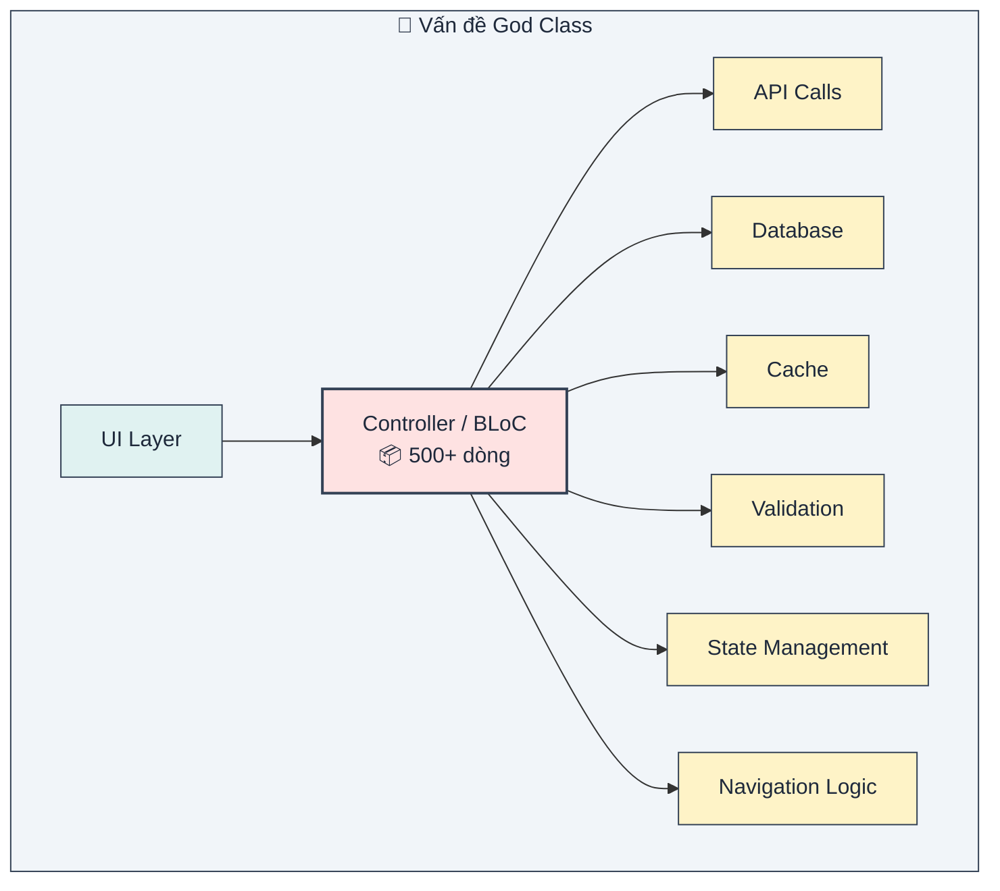
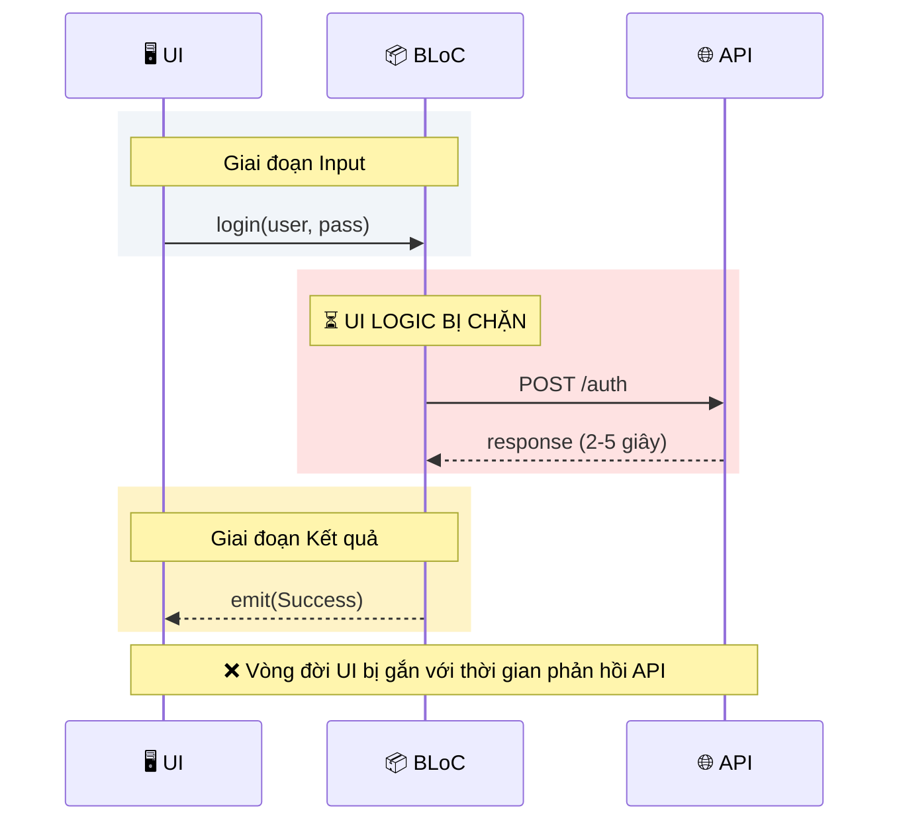
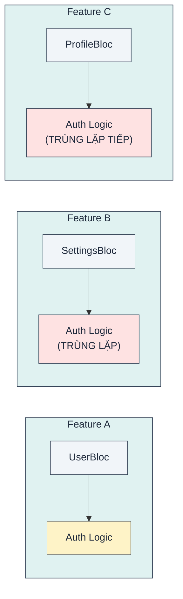
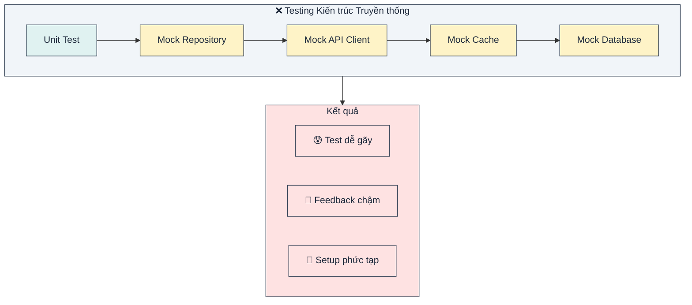
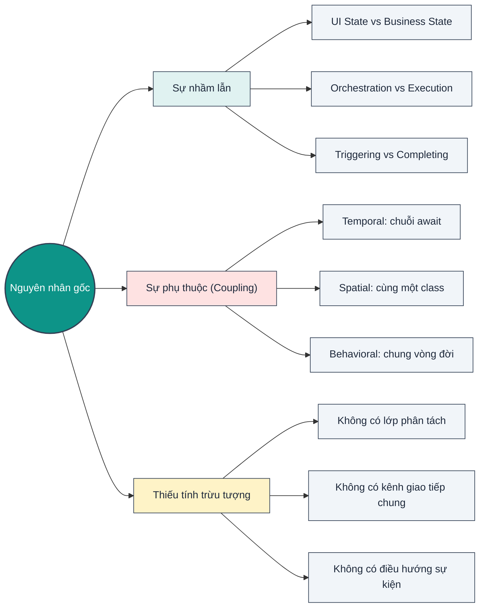
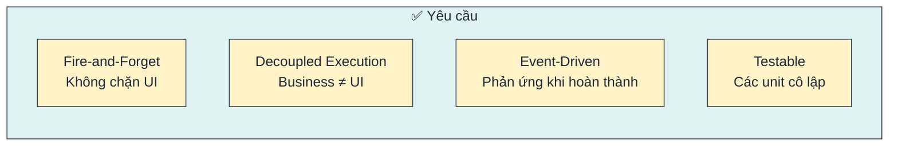

# Chương 1: Không gian Vấn đề (The Problem Space)

> *"Bất kỳ ai cũng có thể viết code mà máy tính hiểu được. Lập trình viên giỏi viết code mà con người có thể hiểu được."* — Martin Fowler

Trong chương này, chúng ta sẽ khám phá những vấn đề cơ bản làm khổ các ứng dụng Flutter quy mô lớn, không chỉ hiểu *chúng xảy ra* mà còn hiểu *tại sao chúng xảy ra*.

---

## 1.1. Hội chứng God Class

Trong phát triển ứng dụng Flutter, một anti-pattern phổ biến xuất hiện khi ứng dụng lớn dần: **God Class**. Điều này thường xuất hiện trong các file `Controller`, `ViewModel`, hoặc `BLoC` của bạn.

Nó bắt đầu một cách vô hại — vài dòng code để xử lý form đăng nhập. Sau đó bạn thêm validation. Rồi API call. Rồi xử lý lỗi. Rồi caching layer. Trước khi bạn nhận ra, bạn đã có một con quái vật 2,000 dòng làm mọi thứ.



### Triệu chứng

Nếu codebase của bạn có những triệu chứng này, bạn có thể đang mắc phải hội chứng God Class:

| Triệu chứng | Hậu quả |
|-------------|---------|
| **File > 500 dòng** | Code khó điều hướng. Bạn dành nhiều thời gian cuộn trang hơn là suy nghĩ. |
| **Nhiều trách nhiệm** | Class biết quá nhiều. Nó xử lý UI state, business rules, và data fetching cùng lúc, vi phạm Single Responsibility Principle. |
| **Coupling chặt** | Bạn không thể test business logic mà không mock toàn bộ bộ máy quản lý state UI. |
| **Chuỗi await vô tận** | Mọi operation đều chặn luồng thực thi UI cho đến khi hoàn thành. |

---

## 1.2. Vấn đề Coupling

Các kiến trúc truyền thống (như MVVM hoặc BLoC chuẩn) thường tạo ra **temporal coupling** giữa UI và business logic.

Khi bạn sử dụng `await` bên trong một phương thức quản lý state, bạn đang ngầm gắn vòng đời của UI với thời gian của network request. Nếu mạng chậm, "UI logic" của bạn thực tế bị tạm dừng, chờ "Business logic" trả về.



### Vấn đề `await`

Hãy xem xét mẫu code phổ biến này:

```dart
// ❌ Truyền thống: UI chờ business logic
Future<void> login(String user, String pass) async {
  emit(Loading()); // Bước 1: UI cập nhật
  try {
    // Bước 2: UI logic BỊ TREO ở đây chờ IO
    final result = await authRepository.login(user, pass);  // ⏳ BỊ CHẶN
    
    // Bước 3: UI cập nhật lại (nếu vẫn còn mounted)
    emit(Success(result));
  } catch (e) {
    emit(Error(e));
  }
}
```

**Tại sao điều này nguy hiểm?**
1.  **Không khớp vòng đời (Lifecycle Mismatches)**: Nếu người dùng điều hướng đi trong khi `await` đang chờ, lệnh `emit(Success)` có thể throw lỗi vì widget đã unmounted hoặc BLoC đã đóng.
2.  **UX không phản hồi**: Trong khi logic đang "chờ" tại dòng `await`, nó không thể dễ dàng xử lý các intent khác từ người dùng trừ khi bạn quản lý concurrency cẩn thận (vd: `transformer: restartable`).
3.  **Testing phức tạp**: Để test phương thức `login` này, bạn *phải* mock `authRepository`, và thường cả `NetworkClient` đằng sau nó. Bạn không thể test "logic" (validation, data transformation) tách biệt khỏi "orchestration" (state emission).

---

## 1.3. Vấn đề Tái sử dụng

Business logic bị mắc kẹt trong `Controllers` hoặc `BLoCs` không thể được tái sử dụng dễ dàng vì nó gắn chặt với state cụ thể của màn hình đó.



### Chi phí của sự trùng lặp (The Duplication Tax)

Mỗi khi bạn cần cùng một business logic (vd: "Refresh User Profile") ở một màn hình khác:
1.  **Copy-paste**: Bạn sao chép phương thức private từ một BLoC cụ thể sang BLoC khác. Điều này tạo ra cơn ác mộng bảo trì khi sửa bug ở một nơi lại để nó bị lỗi ở nơi khác.
2.  **Trích xuất thành Service**: Bạn chuyển nó sang Service, nhưng BLoC của bạn vẫn cần biết *cách* gọi nó, *cách* xử lý lỗi của nó, và *cách* ánh xạ exceptions sang UI states.
3.  **Kế thừa (Inheritance)**: Bạn cố tạo một `BaseAuthBloc`, dẫn đến vấn đề "Fragile Base Class", nơi chuỗi kế thừa trở nên quá sâu và phức tạp để quản lý.

---

## 1.4. Cơn ác mộng Testing

Testing trong kiến trúc truyền thống thường rất đau khổ. Vì business logic bị trộn lẫn với state management, bạn kết thúc việc viết các test chi tiết triển khai thay vì test hành vi.



**Thực tế của Testing:**
- Bạn dành 80% thời gian viết `when(mockRepo.doSomething()).thenAnswer(...)`.
- Test của bạn bị break mỗi khi bạn thay đổi chi tiết triển khai nội bộ, ngay cả khi hành vi bên ngoài vẫn đúng.
- Bạn không thể xác minh "Business Logic" một cách cô lập. Bạn phải xác minh "Business Logic + State Emission" cùng nhau.

---

## 1.5. Phân tích nguyên nhân gốc rễ (Root Cause Analysis)

Tại sao chúng ta cứ rơi vào những cái bẫy này? Không phải vì chúng ta là những lập trình viên tồi. Đó là vì chúng ta đã gộp chung hai trách nhiệm hoàn toàn khác nhau.



### Insight cốt lõi

Gốc rễ của mọi điều ác này là sự nhầm lẫn giữa **Orchestration** và **Execution**.

> **UI State (Orchestration)** cho chúng ta biết *người dùng thấy gì* (Loading, Error, Success).
> 
> **Business Process (Execution)** cho chúng ta biết *hệ thống làm gì* (Authenticate, Write to DB, Parse JSON).
>
> Đây là hai mối quan tâm khác nhau về cơ bản, phát triển với tốc độ khác nhau. Một thuộc về vòng đời của View layer; cái còn lại thuộc về vòng đời của Domain layer.

---

## 1.6. Chúng ta cần gì

Để giải quyết điều này, chúng ta cần một kiến trúc thực thi sự phân tách rõ ràng giữa "quyết định làm gì" và "làm nó".



1.  **Fire-and-Forget**: UI nên có thể nói "Làm cái này đi" và ngay lập tức quay lại xử lý input từ người dùng, mà không cần chờ mạng.
2.  **Decoupled Execution**: Code thực thi business logic nên chạy độc lập với bất kỳ màn hình UI cụ thể nào.
3.  **Event-Driven**: Hệ thống nên phản ứng với kết quả qua events, thay vì linear callbacks.
4.  **Testable**: Chúng ta nên có thể test logic mà không cần mock UI, và test UI/State mà không cần mock logic phức tạp.

Chương tiếp theo giới thiệu kiến trúc **Event-Driven Orchestrator** giải quyết tất cả các yêu cầu này.

---

## Tổng kết

| Vấn đề | Nguyên nhân gốc | Tác động |
|--------|-----------------|----------|
| **God Classes** | Không phân tách mối quan tâm | Code trở nên khó bảo trì và đáng sợ khi chạm vào. |
| **Temporal Coupling** | Chuỗi `await` | Vấn đề phản hồi UI và lỗi vòng đời. |
| **Trùng lặp** | Logic bị mắc kẹt trong Controllers | Gánh nặng bảo trì cao và hành vi không nhất quán. |
| **Khó Testing** | Coupling chặt | Phát triển chậm lại; dev ngừng viết test. |

**Bài học chính**: Vấn đề không phải là thư viện quản lý state (BLoC, Provider, Riverpod). Vấn đề là trộn lẫn *orchestration* (điều phối các phần khác nhau) với *execution* (thực hiện công việc thực tế).
