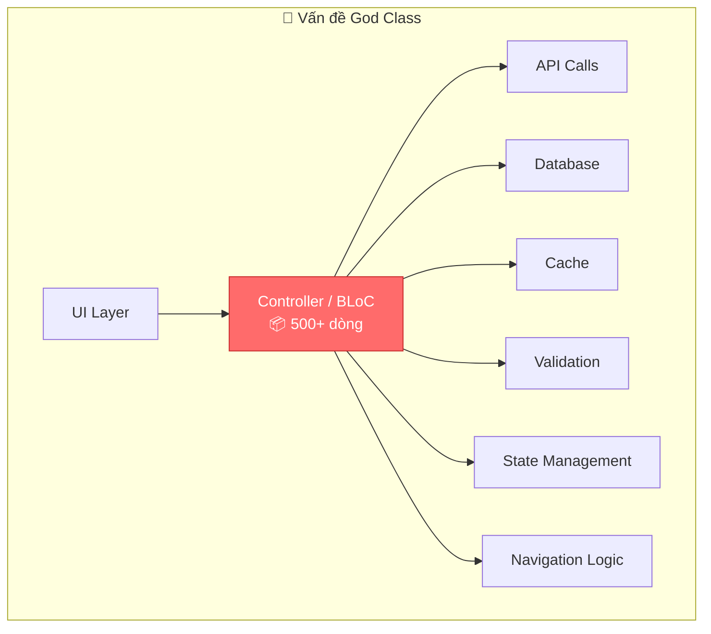
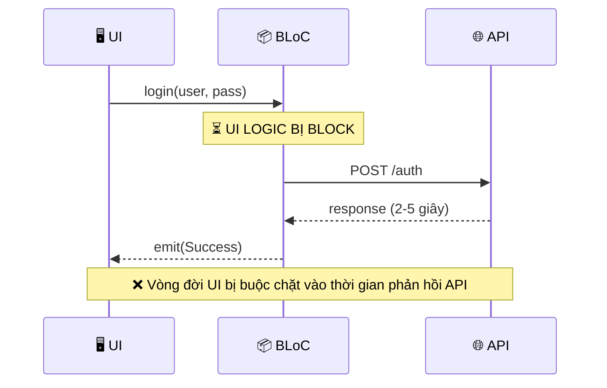
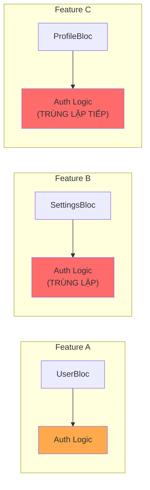
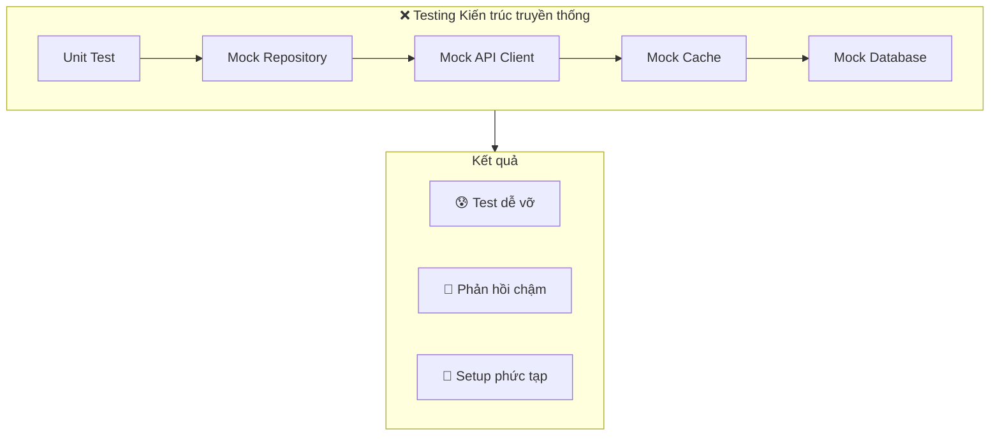
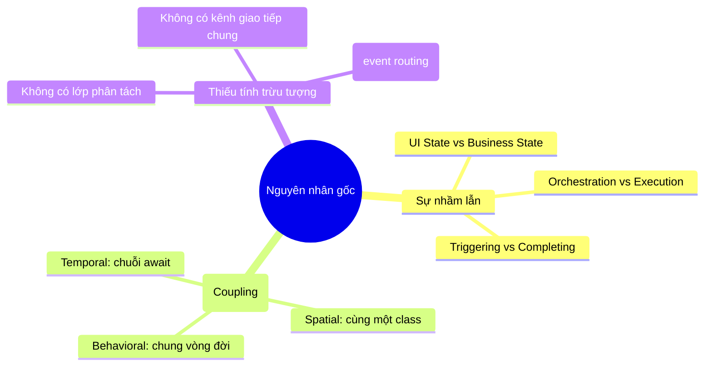
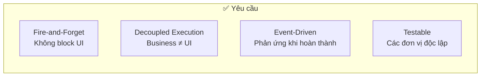

# Chương 1: Vấn đề (The Problem Space)

> *"Bất kỳ kẻ ngốc nào cũng có thể viết code mà máy tính hiểu được. Lập trình viên giỏi viết code mà con người có thể hiểu được."* — Martin Fowler

Trong chương này, chúng ta sẽ khám phá những vấn đề cốt lõi thường gặp trong các ứng dụng Flutter quy mô lớn, không chỉ để biết chúng là gì, mà còn để hiểu *tại sao* chúng lại xảy ra.

---

## 1.1. Hội chứng God Class (The God Class Syndrome)

Trong phát triển ứng dụng Flutter, một anti-pattern phổ biến xuất hiện khi ứng dụng lớn dần: **God Class** (Lớp Thần thánh). Điều này thường biểu hiện rõ nhất trong các file `Controller`, `ViewModel` hoặc `BLoC` của bạn.

Nó bắt đầu rất vô tội—chỉ vài dòng để xử lý một form đăng nhập. Sau đó bạn thêm validation (kiểm tra dữ liệu). Rồi một API call. Rồi xử lý lỗi. Rồi thêm một lớp caching. Trước khi bạn kịp nhận ra, bạn đã có một con quái vật 2.000 dòng code làm đủ mọi thứ trên đời.



### Triệu chứng

Nếu codebase của bạn có những triệu chứng này, bạn có thể đang mắc hội chứng God Class:

| Triệu chứng | Hậu quả |
|-------------|---------|
| **Files > 500 dòng code** | Code trở nên cực kỳ khó điều hướng. Bạn dành nhiều thời gian để cuộn chuột hơn là để suy nghĩ. |
| **Quá nhiều trách nhiệm** | Class này "biết quá nhiều". Nó xử lý cả UI state, nghiệp vụ kinh doanh, và lấy dữ liệu cùng một lúc, vi phạm nguyên tắc Single Responsibility (Đơn nhiệm). |
| **Dính kết chặt (Tight coupling)** | Bạn không thể viết test cho business logic mà không phải mock toàn bộ bộ máy quản lý state của UI. |
| **Chuỗi `await` bất tận** | Mọi thao tác đều block (chặn) luồng thực thi của UI cho đến khi nó hoàn thành. |

---

## 1.2. Vấn đề Coupling (The Coupling Problem)

Các kiến trúc truyền thống (như MVVM tiêu chuẩn hoặc dùng BLoC theo cách thông thường) thường tạo ra **temporal coupling** (phụ thuộc thời gian) giữa UI và business logic.

Khi bạn dùng `await` bên trong một hàm quản lý state, bạn đang vô tình buộc chặt vòng đời của UI vào thời gian phản hồi của network request. Nếu mạng chậm, "logic UI" của bạn coi như bị tạm dừng, chờ đợi "logic Business" trả về.



### Vấn đề của `await`

Hãy xem xét mẫu code phổ biến này:

```dart
// ❌ Cách truyền thống: UI phải chờ business logic
Future<void> login(String user, String pass) async {
  emit(Loading()); // Bước 1: UI cập nhật
  try {
    // Bước 2: Logic UI bị "TREO" ở đây chờ IO
    final result = await authRepository.login(user, pass);  // ⏳ BLOCKED
    
    // Bước 3: UI cập nhật lại (nếu widget vẫn còn đó)
    emit(Success(result));
  } catch (e) {
    emit(Error(e));
  }
}
```

**Tại sao điều này nguy hiểm?**
1.  **Lệch pha vòng đời (Lifecycle Mismatches)**: Nếu người dùng chuyển sang màn hình khác khi `await` đang chờ, lệnh `emit(Success)` có thể gây lỗi vì widget đã bị unmounted hoặc BLoC đã đóng (closed).
2.  **Trải nghiệm kém (Unresponsive UX)**: Khi logic đang "chờ" ở dòng `await`, nó khó có thể xử lý các ý định (intents) *khác* từ người dùng trừ khi bạn quản lý concurrency rất cẩn thận (ví dụ: `transformer: restartable`).
3.  **Phức tạp hóa Testing**: Để test hàm `login` này, bạn *bắt buộc* phải mock `authRepository`, và thường là cả `NetworkClient` phía sau nó. Bạn không thể test "logic" (validation, transform dữ liệu) tách biệt khỏi "orchestration" (phát ra state).

---

## 1.3. Vấn đề Tái sử dụng (The Reusability Problem)

Business logic bị kẹt bên trong `Controller` hoặc `BLoC` rất khó để tái sử dụng vì nó dính liền với state cụ thể của màn hình đó.



### Chi phí của sự trùng lặp (The Duplication Tax)

Mỗi khi bạn cần cùng một logic nghiệp vụ (ví dụ: "Cập nhật hồ sơ người dùng") ở một màn hình khác:
1.  **Copy-paste**: Bạn copy hàm private từ BLoC này sang BLoC kia. Điều này tạo ra cơn ác mộng bảo trì: sửa lỗi ở chỗ này nhưng quên chỗ kia.
2.  **Tách ra Service**: Bạn chuyển nó vào một Service, nhưng BLoC của bạn vẫn cần biết *cách* gọi nó, *cách* bắt lỗi của nó, và *cách* map exception sang UI state.
3.  **Thừa kế (Inheritance)**: Bạn cố tạo ra `BaseAuthBloc`, dẫn đến vấn đề "Fragile Base Class" (Lớp cơ sở dễ vỡ), nơi chuỗi thừa kế trở nên quá sâu và phức tạp để quản lý.

---

## 1.4. Cơn ác mộng Testing (The Testing Nightmare)

Testing trong các kiến trúc truyền thống thường rất đau khổ. Vì business logic bị trộn lẫn với quản lý state, bạn kết thúc bằng việc viết test cho "chi tiết triển khai" (implementation details) thay vì test hành vi (behavior).



**Thực tế của việc Testing:**
- Bạn dành 80% thời gian để viết `when(mockRepo.doSomething()).thenAnswer(...)`.
- Test của bạn bị break (hỏng) mỗi khi bạn thay đổi một chi tiết triển khai nội bộ, ngay cả khi hành vi bên ngoài vẫn đúng.
- Bạn không thể kiểm chứng "Business Logic" một cách cô lập. Bạn phải kiểm chứng "Business Logic + State Emission" cùng lúc.

---

## 1.5. Phân tích nguyên nhân gốc rễ (Root Cause Analysis)

Tại sao chúng ta cứ rơi vào những cái bẫy này? Không phải vì chúng ta là những lập trình viên tồi. Đó là vì chúng ta đã gộp chung hai trách nhiệm hoàn toàn khác nhau.



### Insight cốt lõi

Gốc rễ của mọi vấn đề trên là sự nhầm lẫn giữa **Orchestration (Điều phối)** và **Execution (Thực thi)**.

> **UI State (Orchestration)** cho chúng ta biết *người dùng đang thấy gì* (Đang tải, Lỗi, Thành công).
> 
> **Business Process (Execution)** cho chúng ta biết *hệ thống đang làm gì* (Xác thực, Ghi DB, Parse JSON).
>
> Đây là hai mối quan tâm hoàn toàn khác nhau và phát triển với tốc độ khác nhau. Một cái thuộc về vòng đời của View; cái kia thuộc về vòng đời của Domain.

---

## 1.6. Chúng ta cần gì (What We Need)

Để giải quyết vấn đề này, chúng ta cần một kiến trúc buộc phải tách biệt rõ ràng giữa "quyết định làm gì" và "thực hiện nó".



1.  **Fire-and-Forget**: UI có thể nói "Làm cái này đi" và quay lại xử lý input của người dùng ngay lập tức, không cần chờ network.
2.  **Decoupled Execution**: Code thực thi business logic phải chạy độc lập với bất kỳ màn hình UI cụ thể nào.
3.  **Event-Driven**: Hệ thống nên phản ứng với kết quả thông qua sự kiện (events), thay vì callback tuyến tính.
4.  **Testable**: Chúng ta phải có thể test logic mà không cần mock UI, và test UI/State mà không cần mock logic phức tạp.

Chương tiếp theo sẽ giới thiệu kiến trúc **Event-Driven Orchestrator** giải quyết tất cả các yêu cầu này.

---

## Tổng kết

| Vấn đề | Nguyên nhân gốc | Ảnh hưởng |
|--------|-----------------|-----------|
| **God Classes** | Không tách biệt mối quan tâm | Code trở nên khó bảo trì và đáng sợ khi phải động vào. |
| **Temporal Coupling** | Chuỗi `await` | Vấn đề phản hồi UI và lỗi vòng đời (lifecycle bugs). |
| **Duplication** | Logic kẹt trong Controller | Gánh nặng bảo trì cao và hành vi không nhất quán. |
| **Testing Difficulty** | Coupling chặt | Quá trình phát triển chậm lại; devs ngừng viết test. |

**Bài học chính**: Vấn đề không nằm ở thư viện quản lý trạng thái (BLoC, Provider, Riverpod). Vấn đề nằm ở việc trộn lẫn *điều phối - orchestration* (quản lý các bộ phận) với *thực thi - execution* (làm công việc thực tế).
