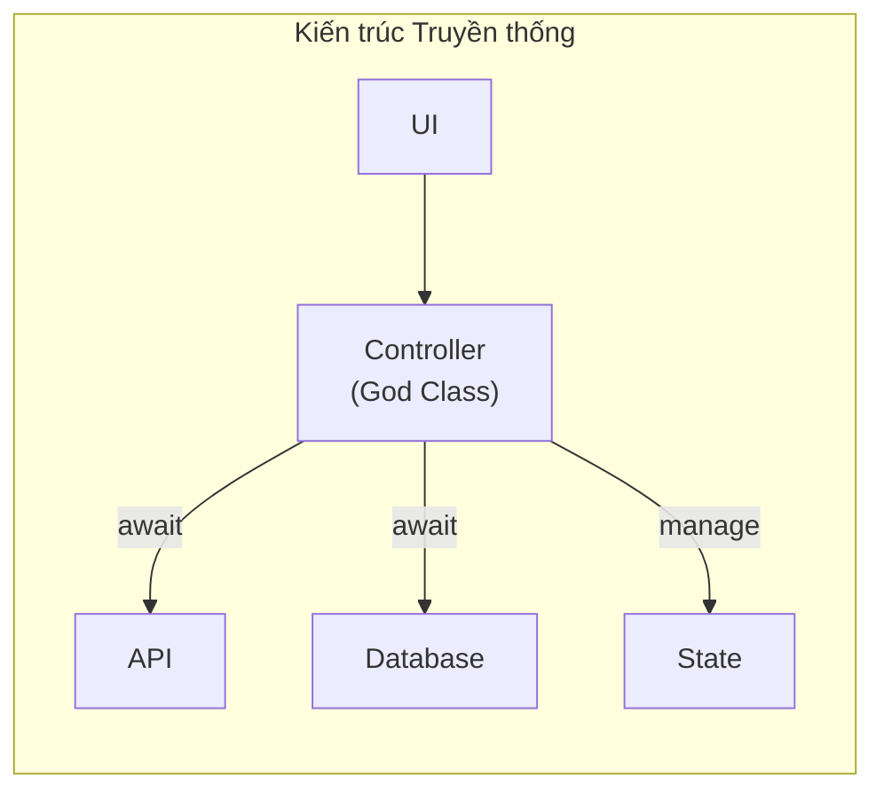
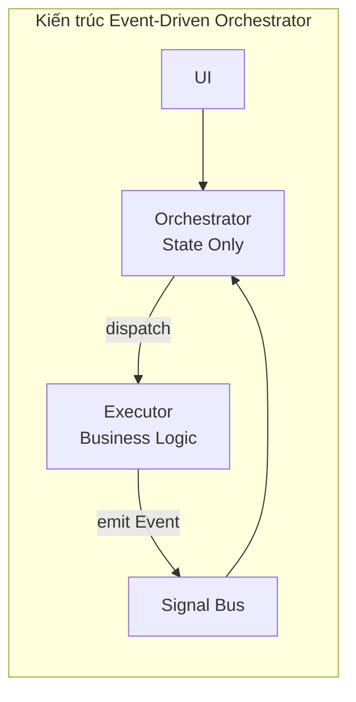

# Chương 1: Bài toán và Giải pháp

## 1.1. Thực trạng hiện tại

Trong quá trình phát triển ứng dụng Flutter, các mô hình quản lý trạng thái (State Management) như MVVM hoặc BLoC đã chứng minh hiệu quả ở quy mô nhỏ. Tuy nhiên, khi ứng dụng mở rộng về chức năng và độ phức tạp, các lớp Controller (BLoC/ViewModel) dần trở nên quá tải với nhiều trách nhiệm đan xen:

1. **Quản lý trạng thái giao diện**: Loading, Error, Success, Animation states.
2. **Thực thi nghiệp vụ**: Gọi API, truy vấn cơ sở dữ liệu, xử lý dữ liệu.
3. **Xử lý logic**: Validation, tính toán, format dữ liệu.
4. **Điều phối luồng**: Xác định thứ tự thực thi các tác vụ phụ thuộc.

**Hệ quả:**
- **God Classes**: Các file Controller phình to đến hàng nghìn dòng code.
- **Khó kiểm thử**: Logic nghiệp vụ bị ràng buộc chặt với State Stream.
- **Khó tái sử dụng**: Logic bị cục bộ hóa trong từng Controller riêng lẻ.

## 1.2. Nguyên nhân gốc rễ

Vấn đề cốt lõi nằm ở sự nhầm lẫn giữa hai khái niệm khác biệt:

- **Trạng thái giao diện (UI State)**: Mô tả những gì người dùng đang nhìn thấy.
- **Tiến trình nghiệp vụ (Business Process)**: Chuỗi các bước xử lý logic phía sau.

Khi sử dụng cú pháp `await repository.doSomething()` trong Controller, luồng xử lý giao diện bị ràng buộc trực tiếp với việc chờ đợi kết quả nghiệp vụ. Điều này dẫn đến sự phụ thuộc không cần thiết giữa hai tầng vốn nên được tách biệt.

## 1.3. Giải pháp đề xuất

Để giải quyết triệt để, kiến trúc cần tuân thủ hai nguyên tắc then chốt:

### A. Fire-and-Forget (Gửi và Quên)
Tầng giao diện chỉ nên phát lệnh thực thi mà không cần chờ đợi kết quả đồng bộ. Trách nhiệm của UI là chuyển trạng thái sang "đang xử lý" và tiếp tục vòng đời của mình.

### B. Giao tiếp Bất đồng bộ Hai chiều
Thay vì mô hình Request-Response truyền thống, hệ thống áp dụng mô hình Command-Event:
- Orchestrator phát lệnh (Command) và không chờ đợi.
- Executor thực thi và phát sự kiện kết quả (Event).
- Orchestrator lắng nghe và phản ứng với sự kiện.

Kiến trúc **Event-Driven Orchestrator** được thiết kế để hiện thực hóa hai nguyên tắc này, đưa lớp quản lý trạng thái trở về đúng vai trò của nó: **phản ánh những gì đang diễn ra, thay vì thực hiện chúng**.
