# Chương 2: Khái niệm Giải pháp (The Solution Concept)

> *"Mục đích của sự trừu tượng hóa không phải là sự mơ hồ, mà là tạo ra một cấp độ ngữ nghĩa mới, trong đó người ta có thể chính xác tuyệt đối."* — Edsger Dijkstra

Trong chương trước, chúng ta đã xác định vấn đề cốt lõi là sự pha trộn giữa điều phối (orchestration) và thực thi (execution). Trong chương này, chúng ta sẽ giới thiệu giải pháp: tách biệt chúng hoàn toàn.

---

## 2.1. Insight Cốt lõi (The Core Insight)

Giải pháp dựa trên một insight kiến trúc nền tảng:

**Code quản lý trạng thái UI (Orchestration) và code thực hiện các nghiệp vụ kinh doanh (Execution) không bao giờ nên nằm trong cùng một class.**

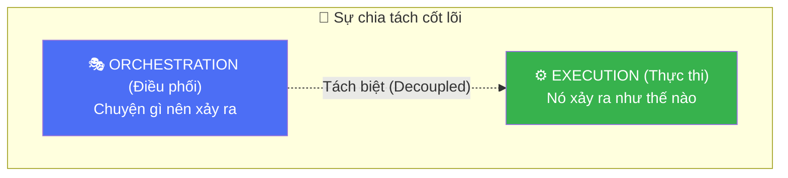

Bằng cách cưỡng chế sự chia tách này, chúng ta làm rõ vai trò của từng thành phần:

| Khía cạnh | Orchestration (Điều phối) | Execution (Thực thi) |
|-----------|---------------------------|----------------------|
| **Trách nhiệm** | Quyết định **cái gì** cần xảy ra tiếp theo dựa trên input của người dùng hoặc sự kiện hệ thống. | Biết **làm thế nào** để thực hiện một tác vụ kỹ thuật cụ thể (gọi API, ghi DB). |
| **Kiến thức** | Biết về Người dùng, luồng UI, và trạng thái màn hình hiện tại. **Không biết gì** về HTTP, SQL hay JSON. | Biết về Data Sources, APIs, và quy tắc nghiệp vụ. **Không biết gì** về Màn hình, Widget hay Context. |
| **Vòng đời** | Gắn liền với vòng đời UI (tạo ra khi mở màn hình, hủy khi đóng). | Vòng đời độc lập (thường là singleton hoặc worker ngắn hạn). |
| **State** | **Stateful**: Giữ bản chụp (snapshot) hiện tại của UI. | **Stateless**: Xử lý một đầu vào và tạo ra một đầu ra. |

---

## 2.2. Nguyên tắc Fire-and-Forget

Các kiến trúc truyền thống chặn (block) luồng logic của UI trong khi chờ kết quả. Chúng ta đảo ngược mô hình này. Thay vì chờ đợi (`await`), chúng ta **dispatch (gửi đi) và tiếp tục**.

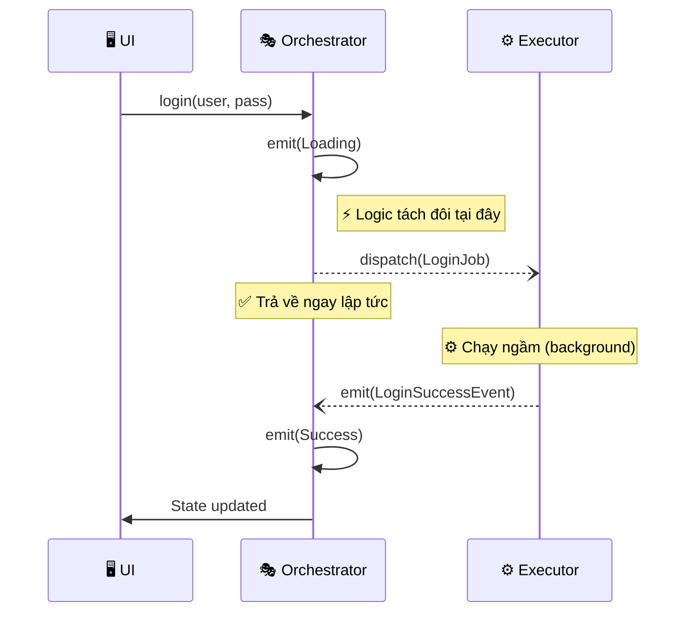

**Khác biệt chính**: Orchestrator không `await` kết quả của `dispatch`. Nó gửi job đi và coi như nói rằng: *"Tôi đã bắt đầu quy trình này. Giờ tôi rảnh để xử lý việc khác. Hãy báo cho tôi biết khi nào xong việc."*

Điều này làm cho UI **non-blocking theo mặc định**.

---

## 2.3. Mẫu Command-Event (The Command-Event Pattern)
Để đạt được sự giao tiếp tách biệt này, chúng ta sử dụng hai kênh khác nhau:

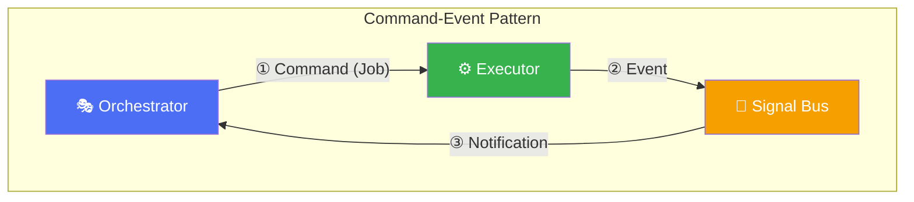

1.  **Command (Job)**: Orchestrator gửi một **Job** (đối tượng lệnh) trực tiếp đến Executor thông qua Dispatcher. Đây là hành động "bắn" một chiều.
2.  **Event**: Khi Executor hoàn thành (hoặc thất bại, hoặc có tiến độ), nó phát ra một **Event** lên bus chung.
3.  **Notification**: Orchestrator (và bất kỳ ai đang lắng nghe) nhận Event này và phản ứng lại.

| Kênh | Hướng | Nội dung | Cơ chế |
|------|-------|----------|--------|
| **Command** | Orch → Exec | "Làm việc này đi" (Ý định) | Direct dispatch đến handler đã đăng ký. |
| **Event** | Exec → Orch | "Việc này đã xảy ra" (Sự thật) | Pub/Sub broadcast qua SignalBus. |

---

## 2.4. Tổng quan Kiến trúc

Đặt tất cả lại với nhau, kiến trúc trông như sau:

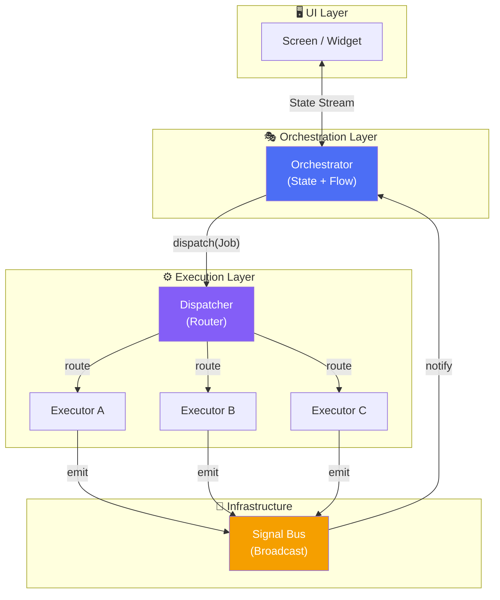

Luồng dữ liệu là đơn hướng và theo vòng tròn:
`UI -> Orchestrator -> Job -> Executor -> Event -> Orchestrator -> State -> UI`

---

## 2.5. Vai trò các thành phần

### The Orchestrator (🎭 Điều phối viên)

Orchestrator là bộ não của một màn hình hoặc tính năng cụ thể.

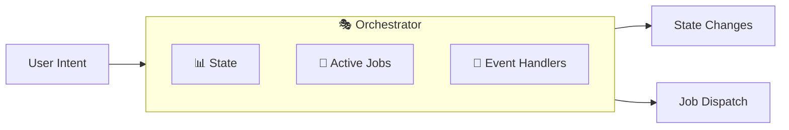

**Trách nhiệm:**
-   **Nhận ý định (Intents)**: Các hàm như `login()`, `refreshData()`, `submitForm()`.
-   **Quản lý UI State**: Phát ra các trạng thái như `Loading`, `Success`, `Error`.
-   **Dispatch Jobs (Giao việc)**: Tạo đối tượng `Job` và gửi chúng đến Dispatcher.
-   **Xử lý Events**: Lắng nghe `JobSuccessEvent` hoặc `JobFailureEvent` để cập nhật state.
-   **Theo dõi tác vụ đang chạy**: Biết job nào đang chạy (để hiện loading spinner hoặc chặn submit trùng lặp).

### The Dispatcher (📮 Bộ định tuyến)

Dispatcher là kiểm soát viên không lưu. Nó đảm bảo Orchestrator không cần biết trực tiếp về class Executor cụ thể nào.

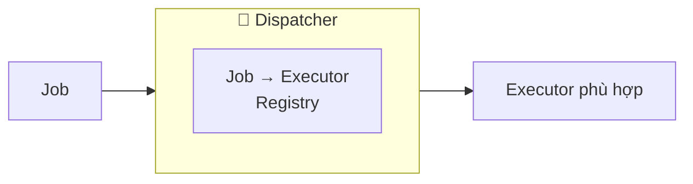

**Trách nhiệm:**
-   **Đăng ký**: Duy trì bản đồ ánh xạ `Loại Job` → `Executor Instance`.
-   **Định tuyến**: Khi job đến, tìm executor phù hợp với độ phức tạp O(1).
-   **Tách biệt (Decoupling)**: Cho phép thay thế implementation (ví dụ: `MockExecutor`) mà không cần sửa code Orchestrator.

### The Executor (⚙️ Công nhân)

Executor là nơi công việc thực sự diễn ra. Nó là một class thuần Dart, thường có thể tái sử dụng giữa các app khác nhau.

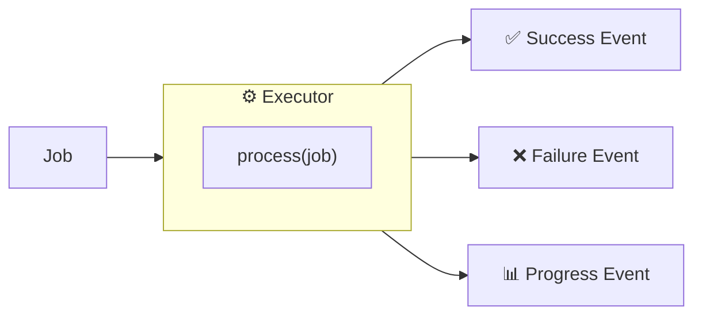

**Trách nhiệm:**
-   **Thực thi Logic**: Gọi API, parse dữ liệu, ghi DB.
-   **Rào chắn lỗi (Error Boundary)**: Bắt tất cả exception và chuyển đổi chúng thành `FailureEvents`. Orchestrator không bao giờ bị crash vì unhandled exception ở đây.
-   **Phát Events**: Báo cáo kết quả lại cho hệ thống.

### The Signal Bus (📡 Trạm phát sóng)

Signal Bus là hệ thần kinh. Nó mang tín hiệu từ cơ bắp (executors) về lại não bộ (orchestrators).

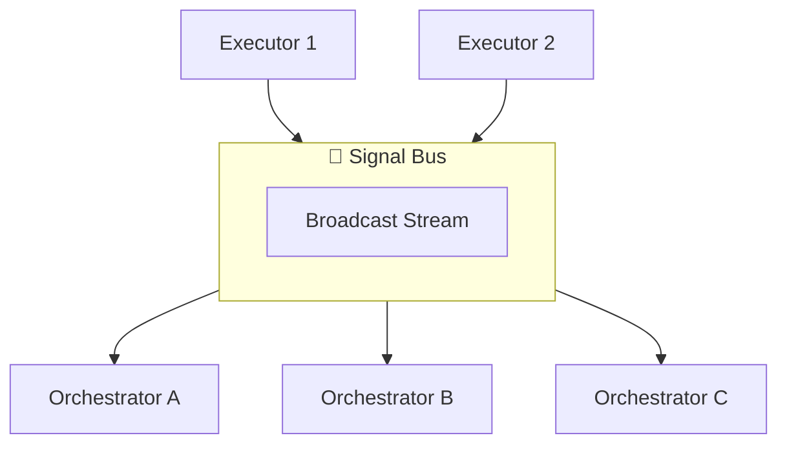

**Trách nhiệm:**
-   **Tách biệt (Decoupling)**: Executors không biết ai đang nghe. Orchestrators không biết ai đã phát sự kiện.
-   **Fan-out (Phân tán)**: Một sự kiện (ví dụ `UserLoggedOut`) có thể kích hoạt phản ứng ở nhiều Orchestrator khác nhau (Màn hình Home xóa data, Profile reset, Settings vô hiệu hóa tùy chọn).

---

## 2.6. Hai chế độ lắng nghe (The Two Listening Modes)

Một sức mạnh độc đáo của kiến trúc này là cách các Orchestrator lắng nghe sự kiện. Chúng có hai chế độ hoạt động song song:

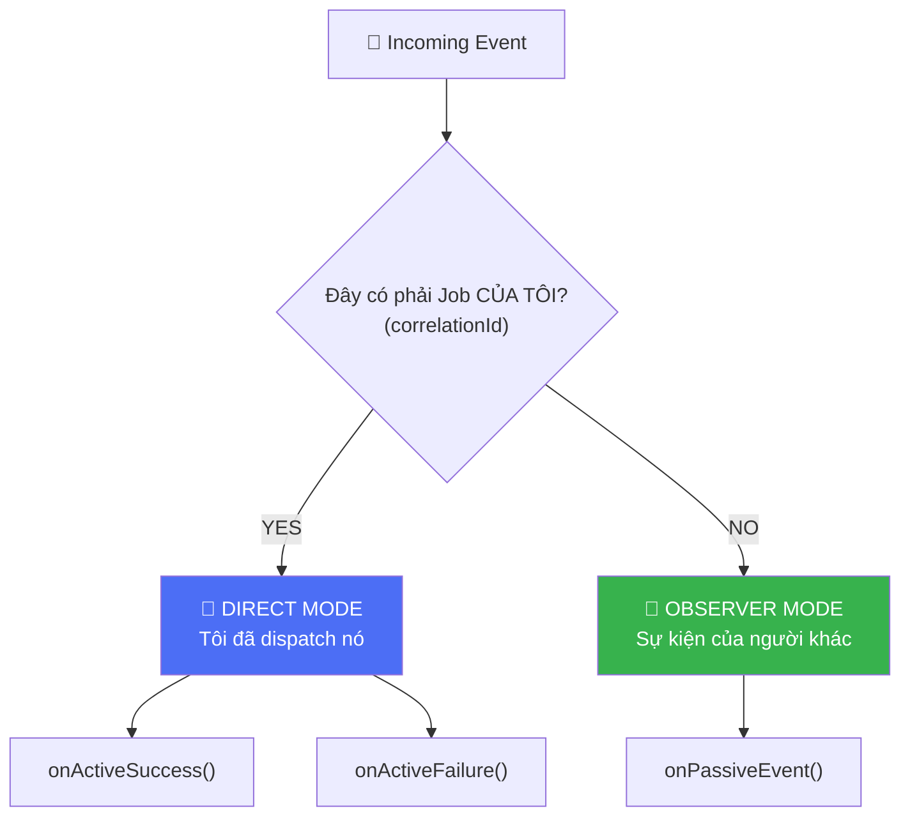

### Khi nào dùng chế độ nào

| Chế độ | Ngữ cảnh | Use Case điển hình | Ví dụ |
|--------|----------|--------------------|-------|
| **Direct Mode** | "Tôi đã yêu cầu việc này." | Xử lý kết quả trực tiếp của hành động người dùng trên màn hình này. | User bấm "Login". Tôi đang chờ "Kết quả Login". |
| **Observer Mode** | "Tôi quan tâm đến việc này." | Phản ứng với thay đổi toàn hệ thống do màn hình khác hoặc tiến trình ngầm gây ra. | Màn hình "Settings" đổi ngôn ngữ. Màn hình của tôi cần load lại nội dung, dù tôi không yêu cầu đổi ngôn ngữ. |

---

## 2.7. Correlation ID

Làm sao Orchestrator biết "Đây là job CỦA TÔI"? **Correlation IDs**.

Mọi `Job` được gán một ID duy nhất (UUID) khi khởi tạo. Khi Executor xử lý Job đó, nó đóng dấu `Event` kết quả với *cùng* ID đó.

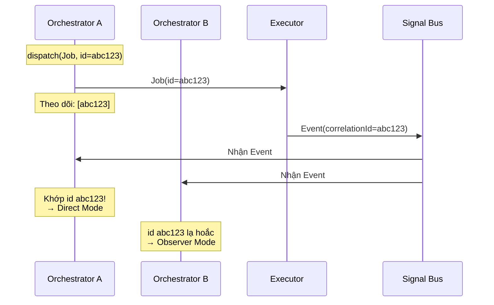

Cơ chế đơn giản này cho phép giao tiếp bất đồng bộ, tách biệt mà không làm mất ngữ cảnh (context).

---

## 2.8. Tóm tắt trực quan

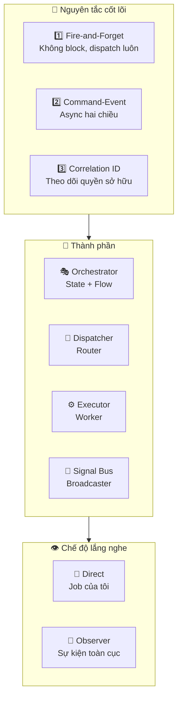

---

## Tổng kết

| Khái niệm | Mô tả |
|-----------|-------|
| **Separation** | Điều phối (State) ≠ Thực thi (Logic). Chúng không bao giờ nên trộn lẫn. |
| **Fire-and-Forget** | Gửi lệnh đi mà không chờ đợi. Giữ cho UI luôn mượt mà. |
| **Command-Event** | Một chiều để ra lệnh làm việc, chiều kia để nghe kết quả. |
| **Correlation ID** | Keo dính kết nối Yêu cầu với Phản hồi trong thế giới bất đồng bộ. |
| **Active vs Passive** | Chọn xem bạn là "Chủ sở hữu" (Active) hay chỉ là "Người quan sát" (Passive). |

**Bài học chính**: Bằng cách áp dụng kiến trúc này, bạn khôi phục lớp Quản lý Trạng thái về đúng vai trò của nó: **phản ánh những gì đang xảy ra, chứ không phải tự mình làm việc đó.**
