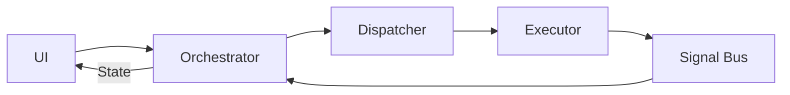

# Chương 2: Tổng quan Kiến trúc

Chương này trình bày cấu trúc tổng thể, các thành phần cốt lõi và cơ chế vận hành của kiến trúc **Event-Driven Orchestrator**.

---

## 2.1. Tổng quan

Kiến trúc **Event-Driven Orchestrator** được thiết kế nhằm tách biệt hoàn toàn giữa hai trách nhiệm:
- **Điều phối quy trình (Orchestration)**: Quản lý trạng thái và luồng xử lý.
- **Thực thi nghiệp vụ (Execution)**: Thực hiện các tác vụ cụ thể.

Hai thành phần này giao tiếp thông qua cơ chế **bất đồng bộ hai chiều** (Bi-directional Asynchronous Communication), tạo thành một vòng khép kín:

---

## 2.2. Các thành phần cốt lõi

Hệ thống bao gồm ba khối chức năng chính với trách nhiệm được phân định rõ ràng.

### A. Orchestrator (Bộ điều phối)
Đóng vai trò trung tâm điều phối và quản lý trạng thái.

| Thuộc tính | Mô tả |
|------------|-------|
| **Trách nhiệm** | Tiếp nhận yêu cầu từ UI, chuyển đổi thành Job, quản lý Feature State |
| **Đầu vào** | User/System Intents, Passive Events |
| **Đầu ra** | UI State, Jobs |
| **Đặc tính** | Stateful, Context-Aware |

### B. Dispatcher (Bộ định tuyến)
Đóng vai trò tầng vận chuyển trung gian.

| Thuộc tính | Mô tả |
|------------|-------|
| **Trách nhiệm** | Định tuyến Job đến đúng Executor, gán Correlation ID |
| **Đầu vào** | Jobs từ Orchestrator |
| **Đầu ra** | Lệnh thực thi cho Executor |
| **Đặc tính** | Stateless, High Performance |

### C. Executor (Bộ thực thi)
Đóng vai trò đơn vị thực thi logic nghiệp vụ.

| Thuộc tính | Mô tả |
|------------|-------|
| **Trách nhiệm** | Thực hiện tác vụ nặng (API, Database), phát kết quả qua Signal Bus |
| **Đầu vào** | Lệnh từ Dispatcher |
| **Đầu ra** | Broadcast Events |
| **Đặc tính** | Stateless, Specialized, Decoupled |

### D. Signal Bus (Kênh truyền tín hiệu)
Đóng vai trò hạ tầng giao tiếp trung tâm theo mô hình Publish-Subscribe.

| Thuộc tính | Mô tả |
|------------|-------|
| **Cơ chế** | Broadcast Stream - một sự kiện được phát đến tất cả người đăng ký |
| **Consumer duy nhất** | Chỉ Orchestrator được phép lắng nghe Signal Bus |

---

## 2.3. Cơ chế vận hành

### A. Vòng đời tác vụ (Transaction Lifecycle)

Một yêu cầu được xử lý qua 5 bước tuần tự:

1. **Trigger**: UI gọi phương thức trên Orchestrator.
2. **Dispatch**: Orchestrator đóng gói dữ liệu thành Job, gửi qua Dispatcher, nhận về Correlation ID.
3. **Execute**: Dispatcher chuyển Job cho Executor. Executor thực hiện xử lý bất đồng bộ.
4. **Broadcast**: Executor hoàn thành, phát sự kiện kết quả lên Signal Bus.
5. **Reaction**: Orchestrator nhận sự kiện, cập nhật trạng thái tương ứng.

### B. Hai chế độ lắng nghe (Listening Modes)

Mỗi Orchestrator hoạt động đồng thời ở hai chế độ:

| Chế độ | Cơ chế lọc | Mục đích |
|--------|------------|----------|
| **Direct Mode** | Theo `Correlation ID` | Quản lý vòng đời tác vụ do chính mình khởi tạo |
| **Observer Mode** | Theo `Event Type` | Đồng bộ hóa dữ liệu khi có thay đổi từ nguồn khác |

### C. Chiến lược phân tách trạng thái (State Segregation)

Khi cả hai chế độ cùng tác động lên State, hệ thống áp dụng quy tắc:

- **Dữ liệu (Data)**: Được cập nhật bởi cả hai chế độ. Sự kiện mới nhất được ưu tiên.
- **Trạng thái điều khiển (Control State)**: Chỉ được cập nhật bởi Direct Mode. Sự kiện từ Observer Mode không được phép làm gián đoạn trạng thái đang xử lý.

---

## 2.4. Nguyên tắc thiết kế

1. **Fire-and-Forget**: Người gọi không chờ đợi kết quả đồng bộ.
2. **Decoupled Execution**: Logic thực thi không phụ thuộc vào UI hay State Management.
3. **Single Source of Truth**: Kết quả luôn đến từ Event, không có kênh trả về ẩn.

---

## 2.5. Ví dụ minh họa: Luồng đăng nhập

### Kịch bản
Người dùng nhập thông tin và nhấn nút Đăng nhập.

### Diễn biến

1. **UI Layer**: Gọi `authOrchestrator.login(username, password)`. Hiển thị trạng thái Loading.

2. **Orchestrator**: Tạo `LoginJob` với thông tin đăng nhập. Gọi `dispatch(job)` và nhận về `Correlation ID`. Chuyển sang chế độ Direct Mode để chờ kết quả.

3. **Dispatcher**: Định tuyến `LoginJob` đến `AuthExecutor`.

4. **Executor**: Gọi API xác thực. Nhận kết quả thành công. Tạo và phát `AuthSuccessEvent` lên Signal Bus.

5. **Signal Bus**: Phát sự kiện đến tất cả Orchestrator đang lắng nghe.

6. **Kết quả**:
   - **AuthOrchestrator** (Direct Mode): Nhận diện Correlation ID khớp, cập nhật trạng thái thành Success.
   - **UserOrchestrator** (Observer Mode): Nhận sự kiện `AuthSuccess`, tự động tải thông tin hồ sơ người dùng.
