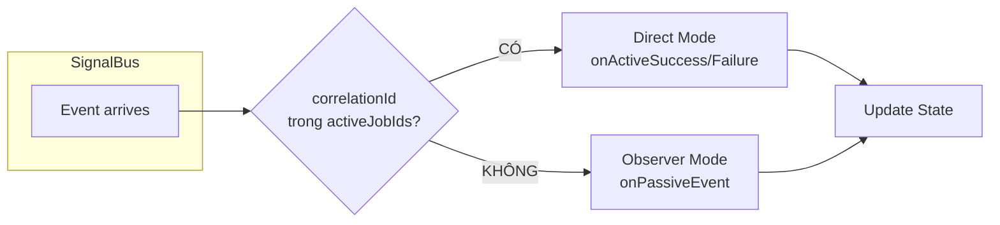

# Chương 3: Xây dựng Core Framework

Chương này hướng dẫn xây dựng package `orchestrator_core` - nền tảng kỹ thuật của toàn bộ kiến trúc. Mục tiêu là tạo ra một framework nhẹ, hiệu năng cao và độc lập với Flutter (Pure Dart).

> **Ghi chú**: Toàn bộ mã nguồn trong chương này đã được kiểm thử và xác nhận hoạt động chính xác.

---

## 3.1. Mô hình Dữ liệu Cơ bản

### BaseJob

Lớp cơ sở cho tất cả các yêu cầu công việc trong hệ thống. Thuộc tính `id` đóng vai trò Correlation ID để định danh giao dịch.

```dart
// lib/src/models/job.dart
import '../utils/cancellation_token.dart';
import '../utils/retry_policy.dart';
import '../infra/signal_bus.dart';

abstract class BaseJob {
  /// Định danh duy nhất cho giao dịch (Correlation ID)
  final String id;

  /// Metadata tùy chọn
  final Map<String, dynamic>? metadata;

  /// Chiến lược dữ liệu (Cache, Placeholder, SWR)
  final DataStrategy? strategy;

  /// Context: Bus mà job này thuộc về
  SignalBus? bus;

  BaseJob({required this.id, this.metadata, this.strategy});
  
  @override
  String toString() => '$runtimeType(id: $id)';
}

/// Hàm tiện ích tạo ID duy nhất
String generateJobId([String? prefix]) {
  final timestamp = DateTime.now().millisecondsSinceEpoch;
  final random = timestamp.hashCode.abs() % 10000;
  return '${prefix ?? 'job'}-$timestamp-$random';
}
```

### BaseEvent

Lớp cơ sở cho tất cả các sự kiện phát ra từ Executor. Thuộc tính `correlationId` cho phép Orchestrator xác định nguồn gốc của sự kiện.

```dart
// lib/src/models/event.dart
@immutable
abstract class BaseEvent {
  /// ID của Job sinh ra sự kiện này
  final String correlationId;
  final DateTime timestamp;

  BaseEvent(this.correlationId) : timestamp = DateTime.now();
}

/// Sự kiện khi Job hoàn thành thành công
class JobSuccessEvent<T> extends BaseEvent {
  final T data;
  JobSuccessEvent(super.correlationId, this.data);
}

/// Sự kiện khi Job gặp lỗi
class JobFailureEvent extends BaseEvent {
  final Object error;
  final StackTrace? stackTrace;
  JobFailureEvent(super.correlationId, this.error, [this.stackTrace]);
}

### DataStrategy & CachePolicy

Cấu hình hành vi cache và dữ liệu tạm thời cho từng Job.

```dart
// lib/src/models/data_strategy.dart
class DataStrategy {
  final dynamic placeholder; // Dữ liệu hiển thị ngay lập tức (Skeleton/Optimistic)
  final CachePolicy? cachePolicy; // Cấu hình Cache

  const DataStrategy({this.placeholder, this.cachePolicy});
}

class CachePolicy {
  final String key;
  final Duration? ttl;
  final bool revalidate; // True: SWR (trả cache rồi fetch mới), False: Cache-First
  final bool forceRefresh; // True: Bỏ qua đọc cache (Pull-to-Refresh)

  const CachePolicy({
    required this.key, 
    this.ttl, 
    this.revalidate = true,
    this.forceRefresh = false,
  });
}
```
```

---

## 3.2. Hạ tầng Giao tiếp & Lưu trữ

### Cache Provider

Giao diện trừu tượng cho việc lưu trữ cache, giúp tách biệt logic nghiệp vụ khỏi giải pháp lưu trữ cụ thể (In-Memory, Hive, SQLite).

```dart
// lib/src/infra/cache/cache_provider.dart
abstract class CacheProvider {
  Future<void> write(String key, dynamic value, {Duration? ttl});
  Future<dynamic> read(String key);
  Future<void> delete(String key);
  Future<void> deleteMatching(bool Function(String key) predicate);
  Future<void> clear();
}
```

### Signal Bus

Kênh truyền tín hiệu trung tâm sử dụng `StreamController.broadcast()` của Dart. Thiết kế Singleton đảm bảo toàn ứng dụng chỉ có một điểm phát sóng duy nhất.

```dart
// lib/src/infra/signal_bus.dart
import 'dart:async';

class SignalBus {
  static final SignalBus _instance = SignalBus._internal();
  
  /// Factory mặc định trả về Global Singleton
  factory SignalBus() => _instance;

  /// Global singleton instance
  static SignalBus get instance => _instance;

  /// Tạo một bus cô lập mới
  factory SignalBus.scoped() => SignalBus._internal();

  SignalBus._internal();

  final _controller = StreamController<BaseEvent>.broadcast();

  /// Stream cho phép nhiều Orchestrator đồng thời lắng nghe
  Stream<BaseEvent> get stream => _controller.stream;

  /// Phát sự kiện lên Bus
  void emit(BaseEvent event) {
    if (!_controller.isClosed) {
      _controller.add(event);
    }
  }

  void dispose() => _controller.close();
}
```

### Dispatcher

Bộ định tuyến sử dụng Registry Pattern để ánh xạ loại Job với Executor tương ứng. Độ phức tạp tra cứu O(1).

```dart
// lib/src/infra/dispatcher.dart
class ExecutorNotFoundException implements Exception {
  final Type jobType;
  ExecutorNotFoundException(this.jobType);
  @override
  String toString() => 'Không tìm thấy Executor cho loại $jobType';
}

class Dispatcher {
  final Map<Type, BaseExecutor> _registry = {};
  
  static final Dispatcher _instance = Dispatcher._internal();
  factory Dispatcher() => _instance;
  Dispatcher._internal();

  /// Đăng ký Executor cho một loại Job cụ thể
  void register<J extends BaseJob>(BaseExecutor<J> executor) {
    _registry[J] = executor;
  }

  /// Định tuyến Job đến Executor phù hợp
  String dispatch(BaseJob job) {
    final executor = _registry[job.runtimeType];
    if (executor == null) {
      throw ExecutorNotFoundException(job.runtimeType);
    }
    
    executor.execute(job);
    return job.id;
  }
  
  void clear() => _registry.clear();
}
```

---

## 3.3. Bộ Thực thi (BaseExecutor)

Lớp trừu tượng định nghĩa giao diện cho tất cả các Worker. Tích hợp sẵn Error Boundary để đảm bảo mọi exception đều được xử lý và chuyển thành sự kiện lỗi.

```dart
// lib/src/base/base_executor.dart
abstract class BaseExecutor<T extends BaseJob> {
  // Theo dõi bus đang hoạt động cho từng job
  final Map<String, SignalBus> _activeBus = {};

  /// Phương thức trừu tượng - lớp con triển khai logic nghiệp vụ
  Future<dynamic> process(T job);

  /// Điểm vào được gọi bởi Dispatcher
  Future<void> execute(T job) async {
    final bus = job.bus ?? SignalBus.instance;
    _activeBus[job.id] = bus;

    try {
      // 1. Unified Data Flow: Placeholder
      if (job.strategy?.placeholder != null) {
        bus.emit(JobPlaceholderEvent(job.id, job.strategy!.placeholder));
      }

      // 2. Unified Data Flow: Cache Read
      final cachePolicy = job.strategy?.cachePolicy;
      if (cachePolicy != null && !cachePolicy.forceRefresh) {
        final cached = await OrchestratorConfig.cacheProvider.read(cachePolicy.key);
        if (cached != null) {
          bus.emit(JobCacheHitEvent(job.id, cached));
          if (!cachePolicy.revalidate) return; // Cache-First: Dừng tại đây
        }
      }

      // 3. Process (Thực thi logic chính)
      final result = await process(job);
      
      // 4. Unified Data Flow: Cache Write
      if (cachePolicy != null) {
        await OrchestratorConfig.cacheProvider.write(
          cachePolicy.key, 
          result, 
          ttl: cachePolicy.ttl
        );
      }

      emitResult(job.id, result);
    } catch (e, stack) {
      emitFailure(job.id, e, stack);
    } finally {
      _activeBus.remove(job.id);
    }
  }

  /// Phát sự kiện thành công
  void emitResult<R>(String correlationId, R data) {
    // Tìm bus đúng cho job này
    final bus = _activeBus[correlationId] ?? SignalBus.instance;
    bus.emit(JobSuccessEvent<R>(correlationId, data));
  }

  /// Phát sự kiện lỗi
  void emitFailure(String correlationId, Object error, [StackTrace? stack]) {
    final bus = _activeBus[correlationId] ?? SignalBus.instance;
    bus.emit(JobFailureEvent(correlationId, error, stack));
  }
}
```

---

## 3.4. Bộ Điều phối (BaseOrchestrator)

Lớp trừu tượng triển khai cơ chế State Machine với khả năng phân loại sự kiện tự động.



```dart
// lib/src/base/base_orchestrator.dart
abstract class BaseOrchestrator<S> {
  S _state;
  final StreamController<S> _stateController = StreamController<S>.broadcast();
  final SignalBus _bus;
  final Dispatcher _dispatcher = Dispatcher();
  
  /// Tập hợp các Job đang được theo dõi
  final Set<String> _activeJobIds = {};
  
  StreamSubscription? _busSubscription;

  BaseOrchestrator(this._state, {SignalBus? bus}) 
      : _bus = bus ?? SignalBus.instance {
    _stateController.add(_state);
    _subscribeToBus();
  }

  S get state => _state;
  Stream<S> get stream => _stateController.stream;
  bool get hasActiveJobs => _activeJobIds.isNotEmpty;

  @protected
  void emit(S newState) {
    if (_stateController.isClosed) return;
    _state = newState;
    _stateController.add(newState);
  }

  @protected
  String dispatch(BaseJob job) {
    // Gắn bus hiện tại vào job
    job.bus = _bus;

    final id = _dispatcher.dispatch(job);
    _activeJobIds.add(id);
    return id;
  }

  void _subscribeToBus() {
    _busSubscription = _bus.stream.listen(_routeEvent);
  }

  void _routeEvent(BaseEvent event) {
    final isActive = _activeJobIds.contains(event.correlationId);
    
    if (isActive) {
      if (event is JobSuccessEvent) onActiveSuccess(event);
      else if (event is JobFailureEvent) onActiveFailure(event);
      _activeJobIds.remove(event.correlationId);
    } else {
      onPassiveEvent(event);
    }
  }

  @protected void onActiveSuccess(JobSuccessEvent event) {}
  @protected void onActiveFailure(JobFailureEvent event) {}
  @protected void onPassiveEvent(BaseEvent event) {}

  @mustCallSuper
  void dispose() {
    _busSubscription?.cancel();
    _stateController.close();
    _activeJobIds.clear();
  }
}
```

---

## 3.5. Tổng kết

Với khoảng 200 dòng mã nguồn lõi, chúng ta đã xây dựng được một framework hoàn chỉnh:

- **Tính tách biệt**: Executor và Orchestrator hoạt động độc lập.
- **Tính phản ứng**: Orchestrator tự động xử lý sự kiện đến.
- **Hiệu năng cao**: Sử dụng Broadcast Stream và tra cứu O(1).

Các tính năng nâng cao như Cancellation, Timeout, Retry sẽ được trình bày trong **Chương 5**.
