# Chương 3: Chi tiết Thành phần (The Component Details)

> *"Đơn giản là đỉnh cao của sự tinh tế."* — Leonardo da Vinci

Chương này đi sâu vào cấu trúc bên trong và hành vi của từng thành phần, sử dụng biểu đồ để giải thích cơ chế hoạt động.

---

## 3.1. Job

Job là một **yêu cầu thực hiện công việc** — một data object bất biến mô tả những gì cần làm.

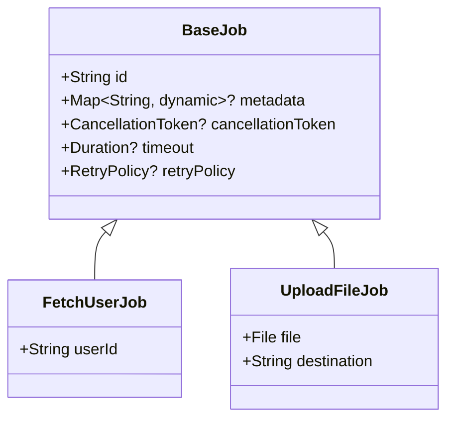

### Các thuộc tính của Job

| Thuộc tính | Mục đích |
|------------|----------|
| `id` | Correlation ID để theo dõi |
| `metadata` | Dữ liệu ngữ cảnh tùy chọn |
| `cancellationToken` | Hỗ trợ hủy chủ động |
| `timeout` | Thời gian thực thi tối đa |
| `retryPolicy` | Cấu hình tự động thử lại |

---

## 3.2. Event

Event là **thông báo về những gì đã xảy ra** — kết quả của việc thực thi job.

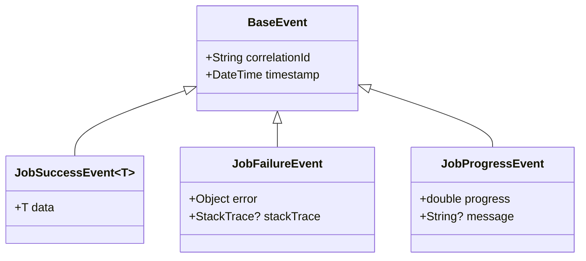

### Các loại Event

| Loại Event | Khi nào emit |
|------------|--------------|
| `JobSuccessEvent` | Job hoàn thành thành công |
| `JobFailureEvent` | Job gặp lỗi |
| `JobProgressEvent` | Job đang chạy và báo tiến độ |
| `JobTimeoutEvent` | Job vượt quá thời gian giới hạn |
| `JobRetryingEvent` | Job đang được thử lại |

---

## 3.3. Dispatcher (Routing)

Dispatcher duy trì một sổ đăng ký (registry) ánh xạ các loại Job tới các Executor.

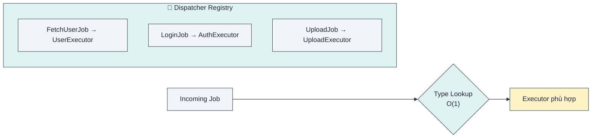

### Luồng đăng ký

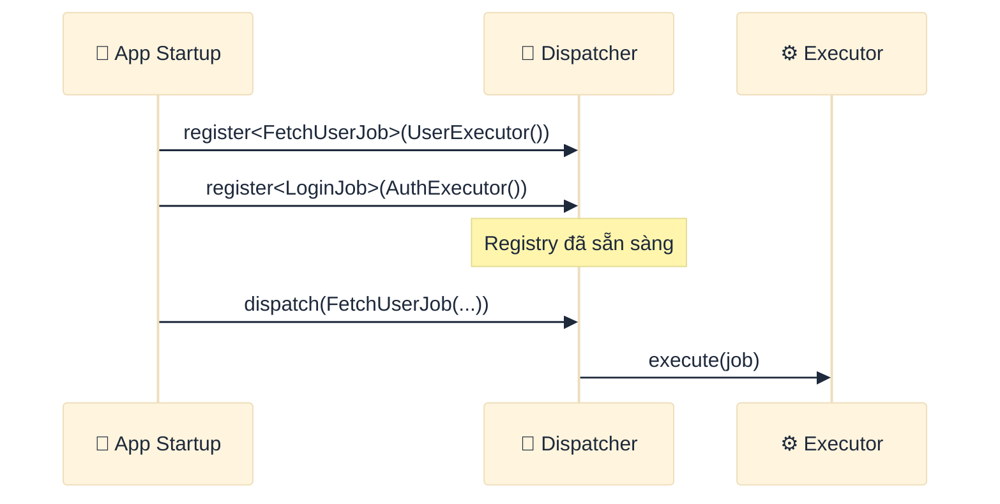

---

## 3.4. Executor (Processing)

Executor là **công nhân không trạng thái (stateless worker)** được tích hợp sẵn xử lý lỗi.

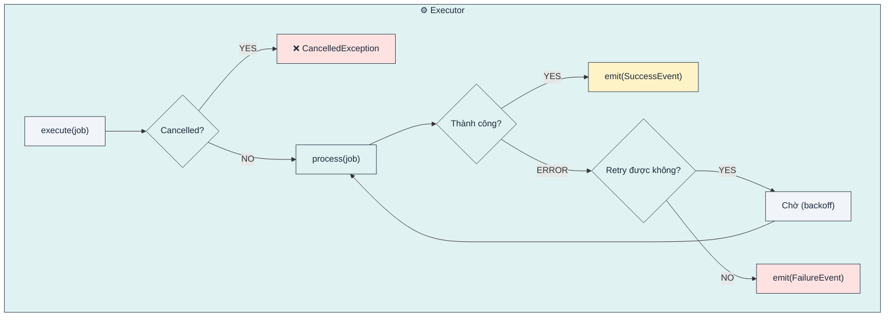

### Error Boundary (Rào chắn lỗi)

Mọi Executor đều có cơ chế bắt lỗi tự động:

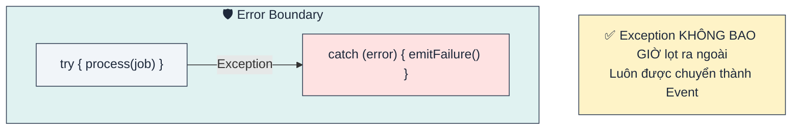

---

## 3.5. Orchestrator (Máy trạng thái)

Orchestrator là **người điều phối có trạng thái (stateful coordinator)** quản lý UI state và theo dõi job.

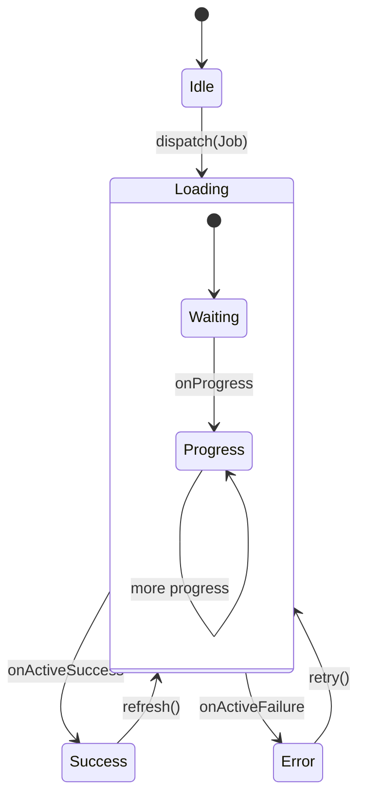

### Cấu trúc bên trong

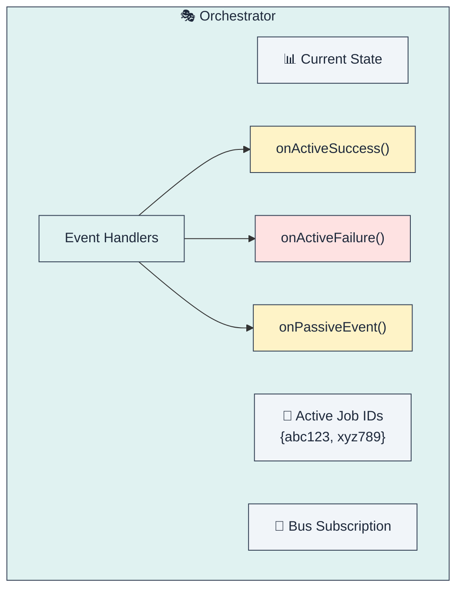

### Logic định tuyến Event

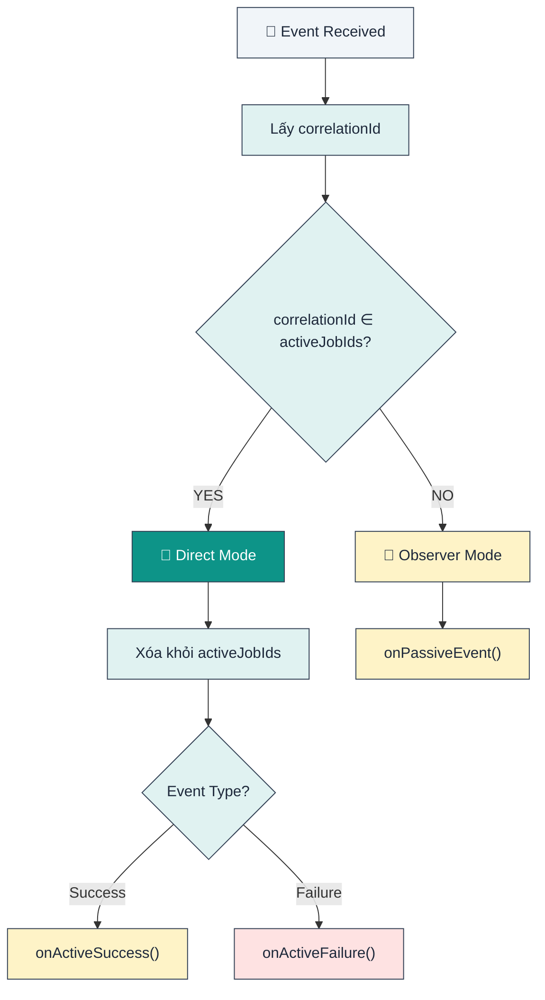

---

## 3.6. Signal Bus (Broadcasting)

Signal Bus là cơ chế **publish-subscribe** để phân phối sự kiện.

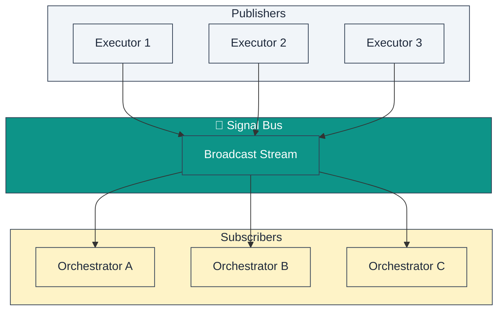

### Global vs Scoped Bus

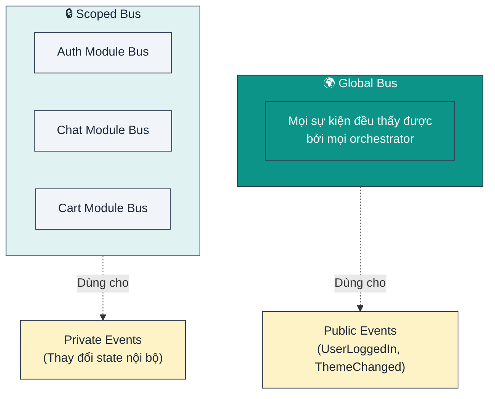

---

## 3.7. Luồng hệ thống hoàn chỉnh

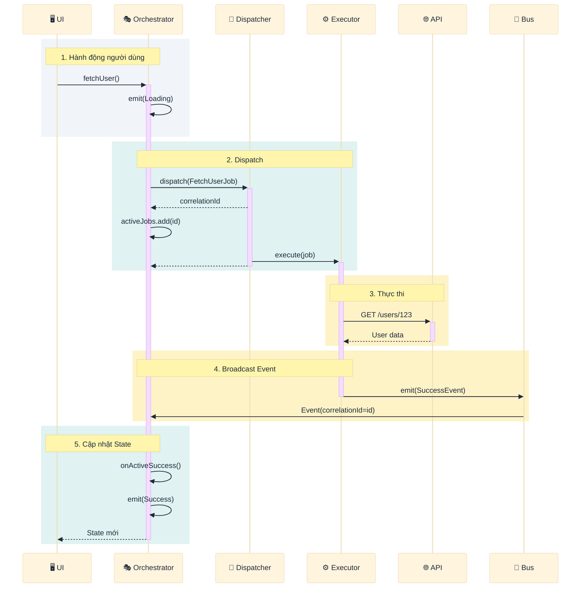

---

## Tổng kết

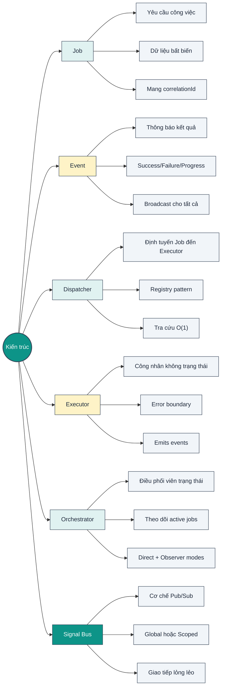

**Bài học chính**: Mỗi thành phần có một trách nhiệm duy nhất, được kết nối thông qua các giao diện rõ ràng. Điều này làm cho hệ thống dễ kiểm thử, dễ bảo trì và dễ mở rộng.
