# Chương 3: Chi tiết Thành phần (The Component Details)

> *"Đơn giản là đỉnh cao của sự tinh tế."* — Leonardo da Vinci

Chương này đi sâu vào cấu trúc bên trong và hành vi của từng thành phần, sử dụng biểu đồ để giải thích cơ chế hoạt động.

---

## 3.1. Job

Job là một **yêu cầu thực hiện công việc** — một data object bất biến mô tả những gì cần làm.

### Các thuộc tính của Job

| Thuộc tính | Mục đích |
|------------|----------|
| `id` | Correlation ID để theo dõi |
| `metadata` | Dữ liệu ngữ cảnh tùy chọn |
| `cancellationToken` | Hỗ trợ hủy chủ động |
| `timeout` | Thời gian thực thi tối đa |
| `retryPolicy` | Cấu hình tự động thử lại |

---

## 3.2. Event

Event là **thông báo về những gì đã xảy ra** — kết quả của việc thực thi job.

### Các loại Event

| Loại Event | Khi nào emit |
|------------|--------------|
| `JobSuccessEvent` | Job hoàn thành thành công |
| `JobFailureEvent` | Job gặp lỗi |
| `JobProgressEvent` | Job đang chạy và báo tiến độ |
| `JobTimeoutEvent` | Job vượt quá thời gian giới hạn |
| `JobRetryingEvent` | Job đang được thử lại |

---

## 3.3. Dispatcher (Routing)

Dispatcher duy trì một sổ đăng ký (registry) ánh xạ các loại Job tới các Executor.

```mermaid
graph LR
    subgraph Registry["📮 Dispatcher Registry"]
        R1["FetchUserJob → UserExecutor"]
        R2["LoginJob → AuthExecutor"]
        R3["UploadJob → UploadExecutor"]
    end
    
    Job["Incoming Job"] --> Lookup{"Type Lookup<br/>O(1)"}
    Lookup --> Executor["Executor phù hợp"]
    
    style Registry fill:#f3f0ff
```

### Luồng đăng ký

```mermaid
sequenceDiagram
    participant App as 🚀 App Startup
    participant Disp as 📮 Dispatcher
    participant Exec as ⚙️ Executor
    
    App->>Disp: register<FetchUserJob>(UserExecutor())
    App->>Disp: register<LoginJob>(AuthExecutor())
    
    Note over Disp: Registry đã sẵn sàng
    
    App->>Disp: dispatch(FetchUserJob(...))
    Disp->>Exec: execute(job)
```

---

## 3.4. Executor (Processing)

Executor là **công nhân không trạng thái (stateless worker)** được tích hợp sẵn xử lý lỗi.

```mermaid
flowchart TB
    subgraph Executor["⚙️ Executor"]
        Start["execute(job)"] --> CheckCancel{"Cancelled?"}
        CheckCancel -->|"YES"| Cancelled["❌ CancelledException"]
        CheckCancel -->|"NO"| Process["process(job)"]
        Process --> Success{"Thành công?"}
        Success -->|"YES"| EmitSuccess["emit(SuccessEvent)"]
        Success -->|"ERROR"| CheckRetry{"Retry được không?"}
        CheckRetry -->|"YES"| Wait["Chờ (backoff)"]
        Wait --> Process
        CheckRetry -->|"NO"| EmitFailure["emit(FailureEvent)"]
    end
    
    style EmitSuccess fill:#37b24d,color:#fff
    style EmitFailure fill:#f03e3e,color:#fff
```

### Error Boundary (Rào chắn lỗi)

Mọi Executor đều có cơ chế bắt lỗi tự động:

```mermaid
graph TB
    subgraph ErrorBoundary["🛡️ Error Boundary"]
        Try["try { process(job) }"]
        Catch["catch (error) { emitFailure() }"]
    end
    
    Try -->|"Exception"| Catch
    
    Note["✅ Exception KHÔNG BAO GIỜ lọt ra ngoài<br/>Luôn được chuyển thành Event"]
```

---

## 3.5. Orchestrator (Máy trạng thái)

Orchestrator là **người điều phối có trạng thái (stateful coordinator)** quản lý UI state và theo dõi job.

### Cấu trúc bên trong

```mermaid
graph TB
    subgraph Orchestrator["🎭 Orchestrator"]
        State["📊 Current State"]
        ActiveJobs["🏃 Active Job IDs<br/>{abc123, xyz789}"]
        Subscription["📡 Bus Subscription"]
        
        Handlers["Event Handlers"]
        Handlers --> OnSuccess["onActiveSuccess()"]
        Handlers --> OnFailure["onActiveFailure()"]
        Handlers --> OnPassive["onPassiveEvent()"]
    end
```

### Logic định tuyến Event

```mermaid
flowchart TD
    Event["📨 Event Received"] --> Extract["Lấy correlationId"]
    Extract --> Check{"correlationId ∈ activeJobIds?"}
    
    Check -->|"YES"| Direct["🎯 Direct Mode"]
    Check -->|"NO"| Observer["👀 Observer Mode"]
    
    Direct --> Remove["Xóa khỏi activeJobIds"]
    Remove --> TypeCheck{"Event Type?"}
    TypeCheck -->|"Success"| OnSuccess["onActiveSuccess()"]
    TypeCheck -->|"Failure"| OnFailure["onActiveFailure()"]
    
    Observer --> OnPassive["onPassiveEvent()"]
```

---

## 3.6. Signal Bus (Broadcasting)

Signal Bus là cơ chế **publish-subscribe** để phân phối sự kiện.

```mermaid
graph TB
    subgraph Publishers["Publishers"]
        E1["Executor 1"]
        E2["Executor 2"]
        E3["Executor 3"]
    end
    
    subgraph Bus["📡 Signal Bus"]
        Stream["Broadcast Stream"]
    end
    
    subgraph Subscribers["Subscribers"]
        O1["Orchestrator A"]
        O2["Orchestrator B"]
        O3["Orchestrator C"]
    end
    
    E1 & E2 & E3 --> Stream
    Stream --> O1 & O2 & O3
    
    style Stream fill:#f59f00,color:#fff
```

### Global vs Scoped Bus

```mermaid
graph TB
    subgraph GlobalBus["🌍 Global Bus"]
        GB["Mọi sự kiện đều thấy được<br/>bởi mọi orchestrator"]
    end
    
    subgraph ScopedBus["🔒 Scoped Bus"]
        SB1["Auth Module Bus"]
        SB2["Chat Module Bus"]
        SB3["Cart Module Bus"]
    end
    
    GlobalBus -.->|"Dùng cho"| Public["Public Events<br/>(UserLoggedIn, ThemeChanged)"]
    ScopedBus -.->|"Dùng cho"| Private["Private Events<br/>(Thay đổi state nội bộ)"]
```

---

## 3.7. Luồng hệ thống hoàn chỉnh

```mermaid
sequenceDiagram
    participant UI as 🖥️ UI
    participant Orch as 🎭 Orchestrator
    participant Disp as 📮 Dispatcher
    participant Exec as ⚙️ Executor
    participant API as 🌐 API
    participant Bus as 📡 Bus
    
    rect rgb(240, 247, 255)
        Note over UI,Orch: 1. Hành động người dùng
        UI->>+Orch: fetchUser()
        Orch->>Orch: emit(Loading)
    end
    
    rect rgb(240, 255, 240)
        Note over Orch,Exec: 2. Dispatch
        Orch->>+Disp: dispatch(FetchUserJob)
        Disp-->>Orch: correlationId
        Orch->>Orch: activeJobs.add(id)
        Disp->>+Exec: execute(job)
        Disp-->>-Orch: 
    end
    
    rect rgb(255, 250, 240)
        Note over Exec,API: 3. Thực thi
        Exec->>+API: GET /users/123
        API-->>-Exec: User data
    end
    
    rect rgb(255, 240, 240)
        Note over Exec,Orch: 4. Broadcast Event
        Exec->>-Bus: emit(SuccessEvent)
        Bus->>Orch: Event(correlationId=id)
    end
    
    rect rgb(240, 240, 255)
        Note over Orch,UI: 5. Cập nhật State
        Orch->>Orch: onActiveSuccess()
        Orch->>Orch: emit(Success)
        Orch-->>-UI: State mới
    end
```

---

## Tổng kết

```mermaid
mindmap
  root((Kiến trúc))
    Job
      Yêu cầu công việc
      Dữ liệu bất biến
      Mang correlationId
    Event
      Thông báo kết quả
      Success/Failure/Progress
      Broadcast cho tất cả
    Dispatcher
      Định tuyến Job đến Executor
      Registry pattern
      Tra cứu O(1)
    Executor
      Công nhân không trạng thái
      Error boundary
      Emits events
    Orchestrator
      Điều phối viên trạng thái
      Theo dõi active jobs
      Direct + Observer modes
    Signal Bus
      Cơ chế Pub/Sub
      Global hoặc Scoped
      Giao tiếp lỏng lẻo
```

**Bài học chính**: Mỗi thành phần có một trách nhiệm duy nhất, được kết nối thông qua các giao diện rõ ràng. Điều này làm cho hệ thống dễ kiểm thử, dễ bảo trì và dễ mở rộng.
