# Chương 4: Các mẫu cốt lõi (Core Patterns)

> *"Một pattern (mẫu) là giải pháp cho một vấn đề trong một ngữ cảnh cụ thể."* — Christopher Alexander

Chương này mô tả các pattern nền tảng giúp kiến trúc hoạt động trơn tru.

---

## 4.1. Mẫu Job-Executor

**Vấn đề**: Làm thế nào để tách biệt "việc cần làm" khỏi "cách làm việc đó"?

**Giải pháp**: Tách yêu cầu (Job) khỏi bộ xử lý (Executor).

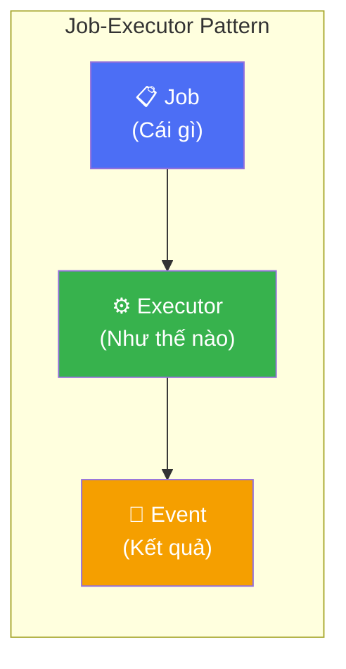

### Cấu trúc

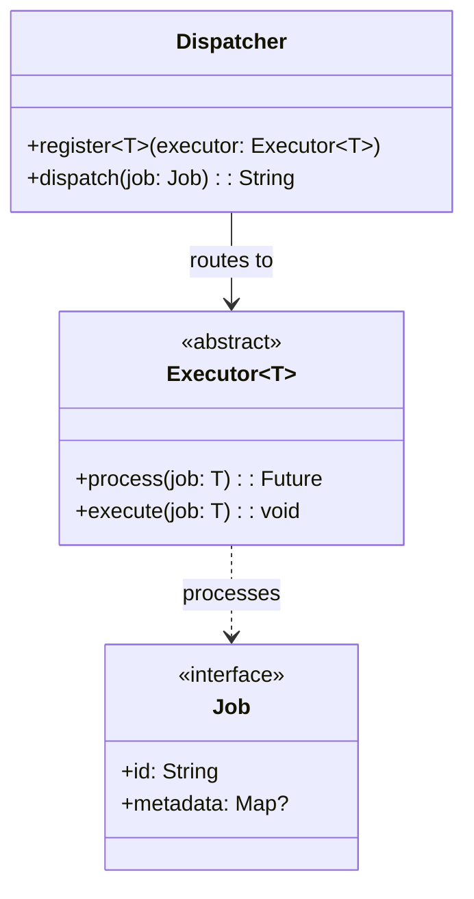

### Lợi ích

| Lợi ích | Mô tả |
|---------|-------|
| **Testability** | Test Executor không cần UI |
| **Reusability** | Một Executor có thể được dùng bởi nhiều nơi |
| **Single Responsibility** | Mỗi Executor chỉ làm một việc |

---

## 4.2. Mẫu Định tuyến Sự kiện (Event Routing Pattern)

**Vấn đề**: Làm sao để đúng Orchestrator nhận được đúng Event?

**Giải pháp**: Sử dụng Correlation ID để khớp sự kiện với nguồn phát sinh.

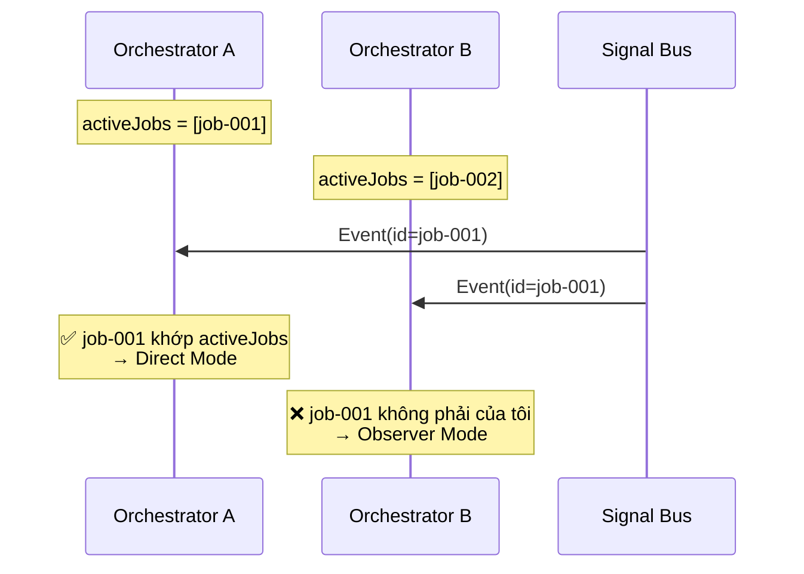

### Thuật toán định tuyến

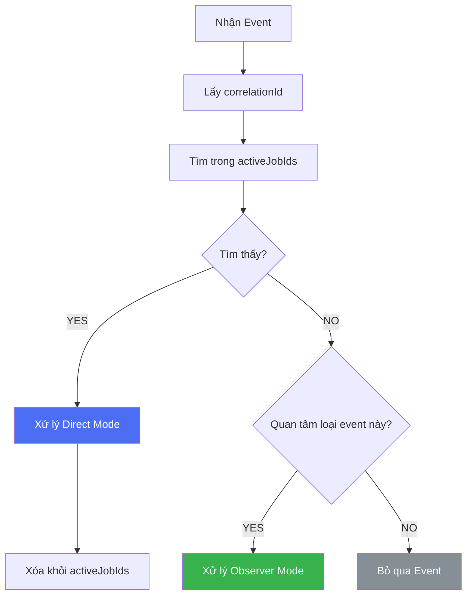

---

## 4.3. Mẫu Chuyển đổi Trạng thái (State Transition Pattern)

**Vấn đề**: Làm thế nào để quản lý UI state nhất quán qua các tác vụ bất đồng bộ?

**Giải pháp**: Định nghĩa rõ ràng các trạng thái và chuyển đổi được kích hoạt bởi sự kiện.

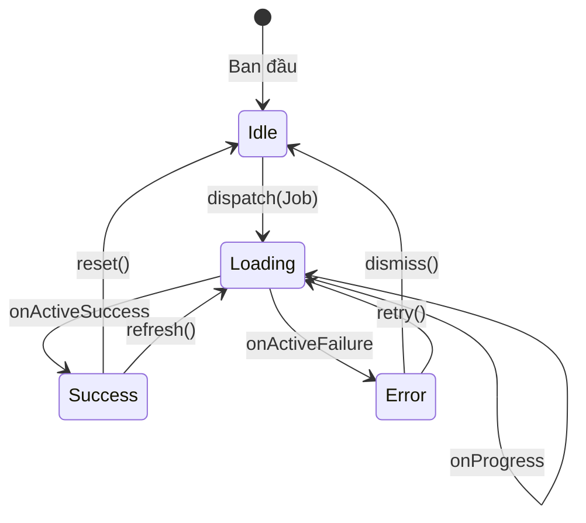

### Phân loại State

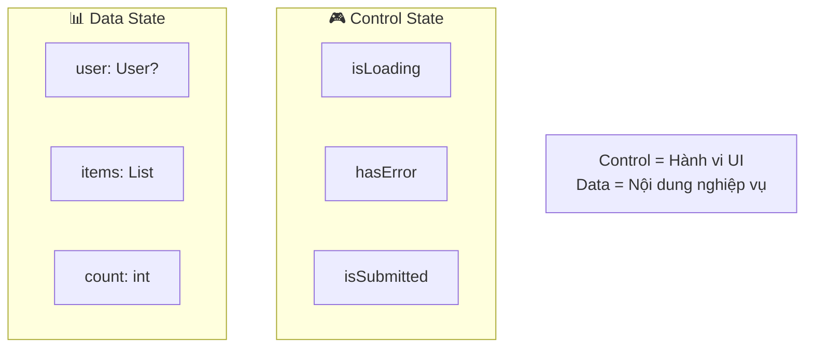

### Quy tắc

> **Control State** chỉ nên được sửa đổi bởi các sự kiện **Direct Mode**.
> **Data State** có thể được sửa đổi bởi cả Direct và Observer mode.

---

## 4.4. Mẫu Scoped Bus

**Vấn đề**: Làm sao để tránh rò rỉ sự kiện giữa các module?

**Giải pháp**: Tạo các bus cô lập cho các module độc lập.

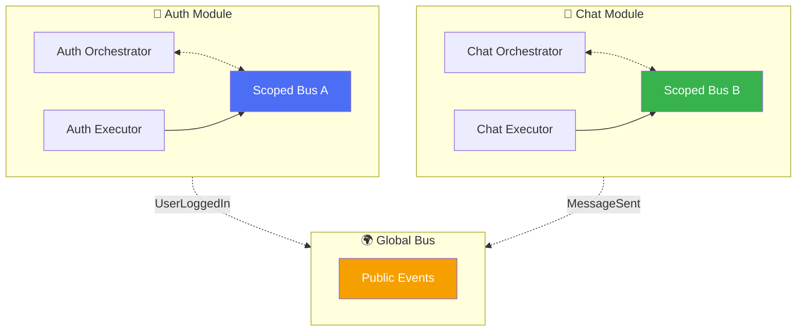

### Khi nào dùng loại nào

| Loại Bus | Use Case | Ví dụ |
|----------|----------|-------|
| **Scoped** | State nội bộ module | LoadingStarted, StepComplete |
| **Global** | Giao tiếp liên module | UserLoggedIn, ThemeChanged |

---

## 4.5. Mẫu Registry

**Vấn đề**: Làm sao định tuyến Job tới Executor hiệu quả?

**Giải pháp**: Duy trì một registry dựa theo Type với tốc độ tra cứu O(1).

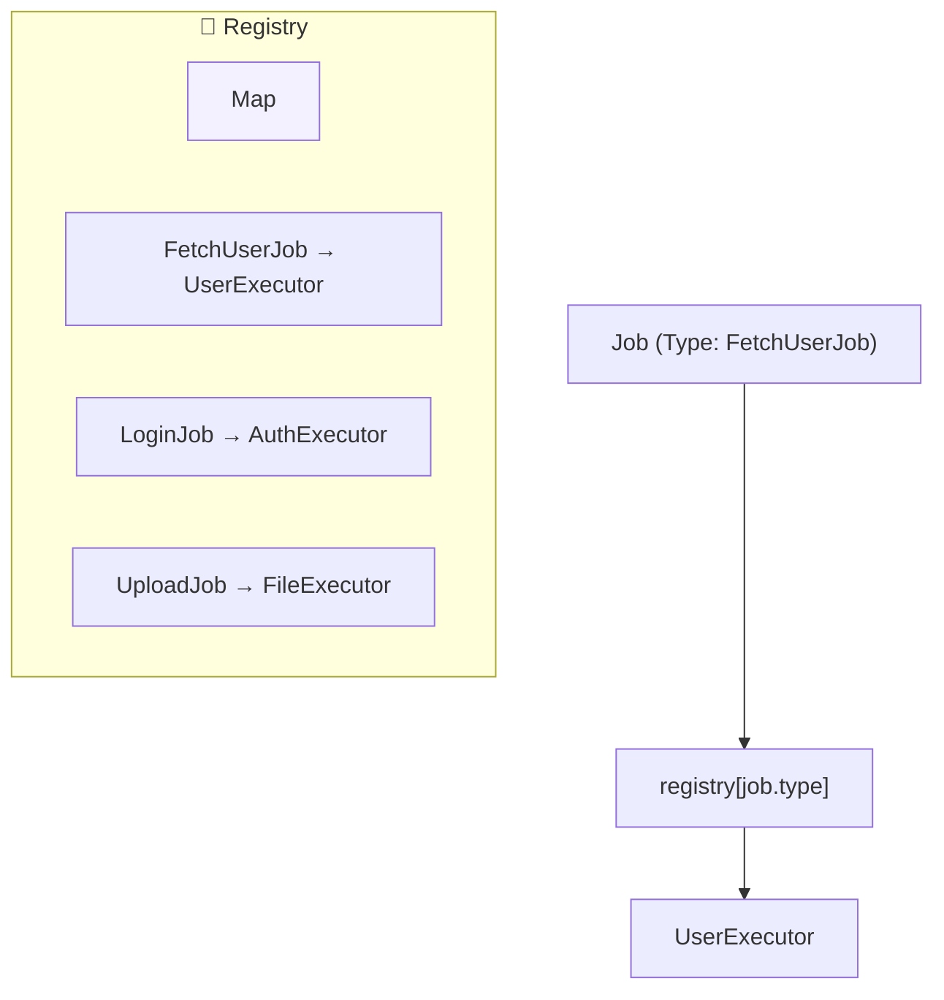

### Chiến lược đăng ký

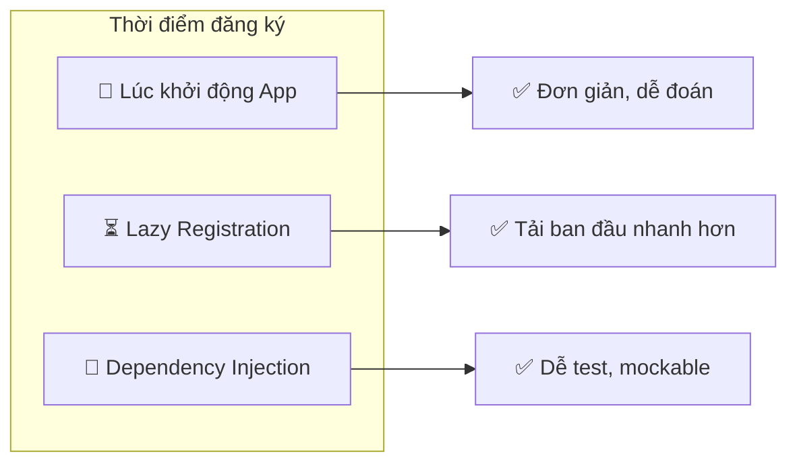

---

## 4.6. Mẫu Error Boundary (Rào chắn lỗi)

**Vấn đề**: Làm sao để ngăn lỗi của executor làm crash app?

**Giải pháp**: Bọc toàn bộ logic executor trong try-catch và chuyển đổi thành sự kiện.

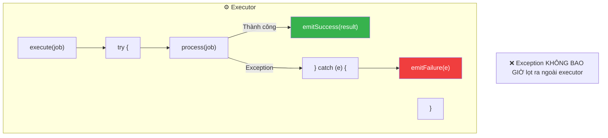

### Sự đảm bảo

> **Mỗi lần dispatch job luôn trả về đúng một event kết quả**: Success HOẶC Failure.
> Orchestrator luôn có thể tin tưởng rằng sẽ nhận được phản hồi.

---

## 4.7. Mối quan hệ giữa các mẫu

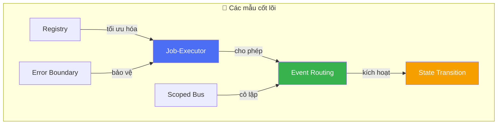

---

## Tổng kết

| Mẫu (Pattern) | Giải quyết vấn đề gì | Cơ chế chính |
|---------------|----------------------|--------------|
| **Job-Executor** | Tách yêu cầu khỏi xử lý | Định tuyến theo Type |
| **Event Routing** | Khớp sự kiện với nguồn | Correlation ID |
| **State Transition** | UI state nhất quán | State machine |
| **Scoped Bus** | Ngăn rò rỉ sự kiện | Kênh cô lập |
| **Registry** | Định tuyến hiệu quả | O(1) lookup map |
| **Error Boundary** | Ngăn crash app | Tự động try-catch |

**Bài học chính**: Các mẫu này kết hợp với nhau tạo nên một kiến trúc mạnh mẽ, dễ kiểm thử và có khả năng mở rộng.
