# Chương 4: Các mẫu cốt lõi (Core Patterns)

> *"Một pattern (mẫu) là giải pháp cho một vấn đề trong một ngữ cảnh cụ thể."* — Christopher Alexander

Chương này mô tả các pattern nền tảng giúp kiến trúc hoạt động trơn tru.

---

## 4.1. M·∫´u Job-Executor

**Vấn đề**: Làm thế nào để tách biệt "việc cần làm" khỏi "cách làm việc đó"?

**Giải pháp**: Tách yêu cầu (Job) khỏi bộ xử lý (Executor).

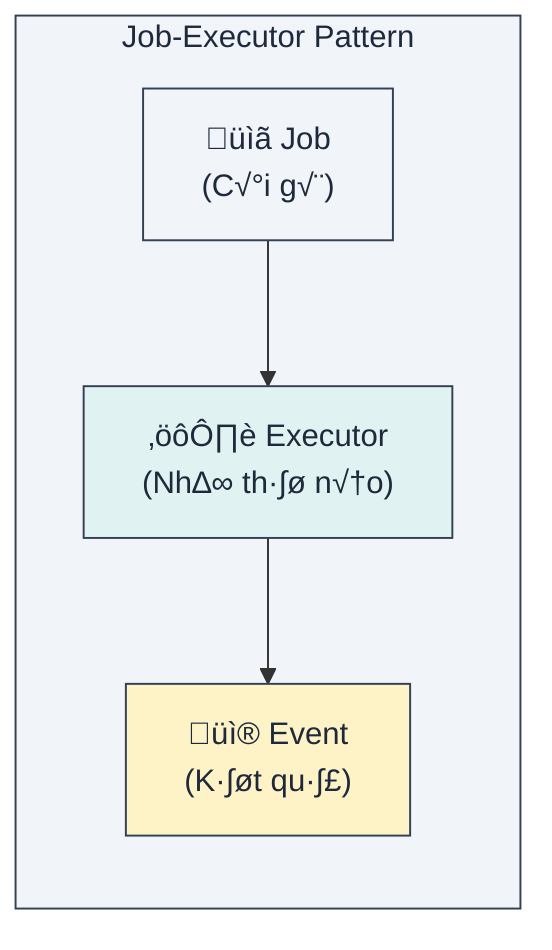
```mermaid
graph LR
    subgraph Pattern["Job-Executor Pattern"]
        Job["📋 Job<br/>(Cái gì)"] --> Executor["⚙️ Executor<br/>(Như thế nào)"]
        Executor --> Event["üì® Event<br/>(K·∫øt qu·∫£)"]
    end
    
    style Pattern fill:#f1f5f9,stroke:#334155,color:#1e293b
    style Job fill:#f1f5f9,stroke:#334155,color:#1e293b
    style Executor fill:#e0f2f1,stroke:#334155,color:#1e293b
    style Event fill:#fef3c7,stroke:#334155,color:#1e293b
```

### Cấu trúc

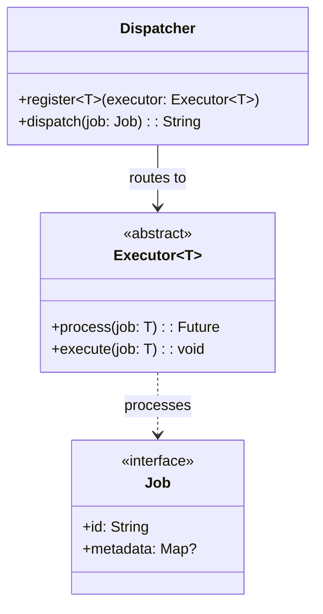
```mermaid
classDiagram
    class Job {
        <<interface>>
        +id: String
        +metadata: Map?
    }
    
    class Executor~T~ {
        <<abstract>>
        +process(job: T): Future
        +execute(job: T): void
    }
    
    class Dispatcher {
        +register~T~(executor: Executor~T~)
        +dispatch(job: Job): String
    }
    
    Dispatcher --> Executor : routes to
    Executor ..> Job : processes
```

### Lợi ích

| Lợi ích | Mô tả |
|---------|-------|
| **Testability** | Test Executor không cần UI |
| **Reusability** | Một Executor có thể được dùng bởi nhiều nơi |
| **Single Responsibility** | Mỗi Executor chỉ làm một việc |

---

## 4.2. Mẫu Định tuyến Sự kiện (Event Routing Pattern)

**Vấn đề**: Làm sao để đúng Orchestrator nhận được đúng Event?

**Giải pháp**: Sử dụng Correlation ID để khớp sự kiện với nguồn phát sinh.

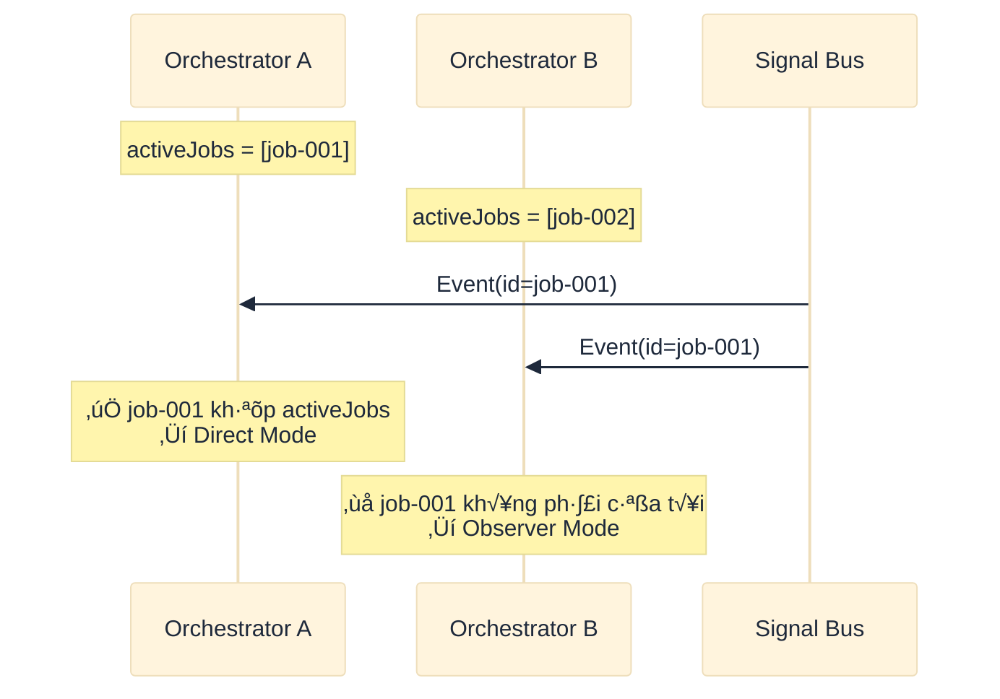
```mermaid
%%{init: {'theme': 'base', 'themeVariables': { 'primaryTextColor': '#1e293b', 'noteTextColor': '#1e293b', 'actorTextColor': '#1e293b' }}}%%
sequenceDiagram
    participant OrcA as Orchestrator A
    participant OrcB as Orchestrator B
    participant Bus as Signal Bus
    
    Note over OrcA: activeJobs = [job-001]
    Note over OrcB: activeJobs = [job-002]
    
    Bus->>OrcA: Event(id=job-001)
    Bus->>OrcB: Event(id=job-001)
    
    Note over OrcA: ‚úÖ job-001 kh·ªõp activeJobs<br/>‚Üí Direct Mode
    Note over OrcB: ❌ job-001 không phải của tôi<br/>→ Observer Mode
```

### Thuật toán định tuyến

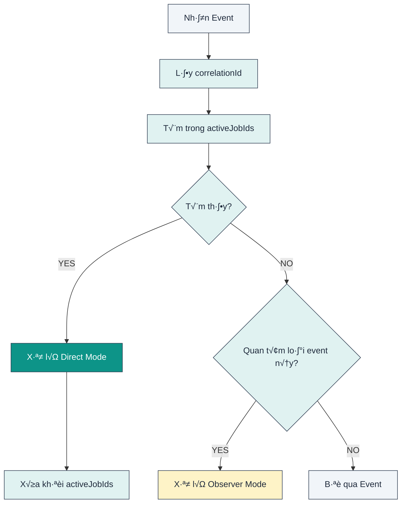
```mermaid
flowchart TD
    Start["Nhận Event"] --> Extract["Lấy correlationId"]
    Extract --> Lookup["Tìm trong activeJobIds"]
    Lookup --> Found{"Tìm thấy?"}
    
    Found -->|"YES"| Direct["Xử lý Direct Mode"]
    Found -->|"NO"| PassiveCheck{"Quan tâm loại event này?"}
    
    PassiveCheck -->|"YES"| Observer["Xử lý Observer Mode"]
    PassiveCheck -->|"NO"| Ignore["Bỏ qua Event"]
    
    Direct --> Remove["Xóa khỏi activeJobIds"]
    
    style Start fill:#f1f5f9,stroke:#334155,color:#1e293b
    style Extract fill:#e0f2f1,stroke:#334155,color:#1e293b
    style Lookup fill:#e0f2f1,stroke:#334155,color:#1e293b
    style Found fill:#e0f2f1,stroke:#334155,color:#1e293b
    style Direct fill:#0d9488,stroke:#334155,color:#ffffff
    style PassiveCheck fill:#e0f2f1,stroke:#334155,color:#1e293b
    style Observer fill:#fef3c7,stroke:#334155,color:#1e293b
    style Ignore fill:#f1f5f9,stroke:#334155,color:#1e293b
    style Remove fill:#e0f2f1,stroke:#334155,color:#1e293b
```

---

## 4.3. Mẫu Chuyển đổi Trạng thái (State Transition Pattern)

**Vấn đề**: Làm thế nào để quản lý UI state nhất quán qua các tác vụ bất đồng bộ?

**Giải pháp**: Định nghĩa rõ ràng các trạng thái và chuyển đổi được kích hoạt bởi sự kiện.

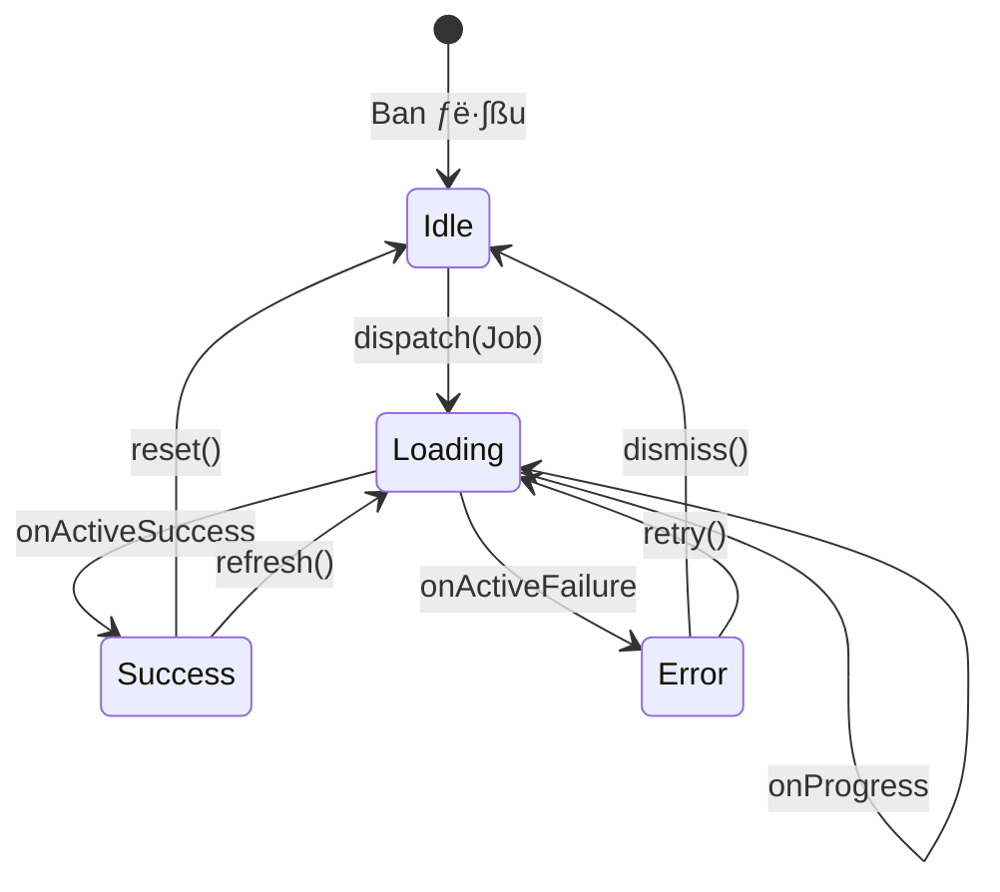
```mermaid
stateDiagram-v2
    [*] --> Idle: Ban đầu
    
    Idle --> Loading: dispatch(Job)
    
    Loading --> Success: onActiveSuccess
    Loading --> Error: onActiveFailure
    Loading --> Loading: onProgress
    
    Success --> Idle: reset()
    Success --> Loading: refresh()
    
    Error --> Idle: dismiss()
    Error --> Loading: retry()
```

### Ph√¢n lo·∫°i State

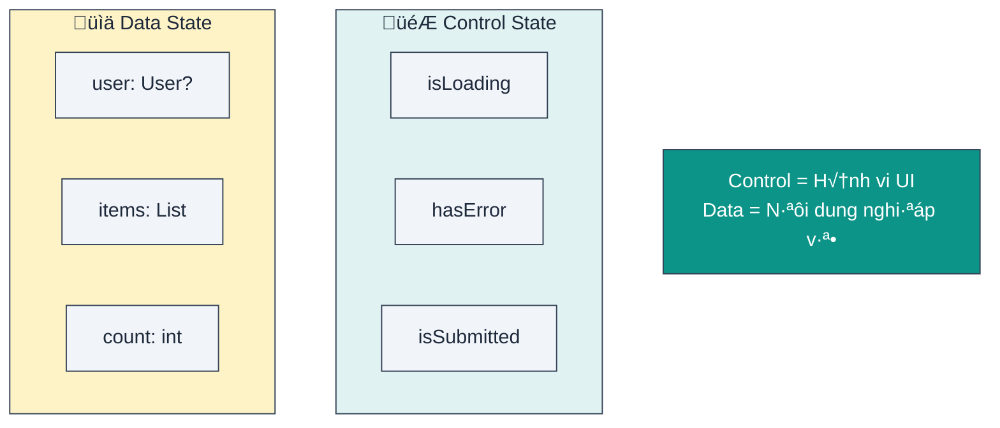
```mermaid
graph TB
    subgraph ControlState["🎮 Control State"]
        Loading["isLoading"]
        Error["hasError"]
        Submitted["isSubmitted"]
    end
    
    subgraph DataState["üìä Data State"]
        User["user: User?"]
        Items["items: List"]
        Count["count: int"]
    end
    
    Note["Control = Hành vi UI<br/>Data = Nội dung nghiệp vụ"]
    
    style ControlState fill:#e0f2f1,stroke:#334155,color:#1e293b
    style DataState fill:#fef3c7,stroke:#334155,color:#1e293b
    style Loading fill:#f1f5f9,stroke:#334155,color:#1e293b
    style Error fill:#f1f5f9,stroke:#334155,color:#1e293b
    style Submitted fill:#f1f5f9,stroke:#334155,color:#1e293b
    style User fill:#f1f5f9,stroke:#334155,color:#1e293b
    style Items fill:#f1f5f9,stroke:#334155,color:#1e293b
    style Count fill:#f1f5f9,stroke:#334155,color:#1e293b
    style Note fill:#0d9488,stroke:#334155,color:#ffffff
```

### Quy tắc

> **Control State** chỉ nên được sửa đổi bởi các sự kiện **Direct Mode**.
> **Data State** có thể được sửa đổi bởi cả Direct và Observer mode.

---

## 4.4. M·∫´u Scoped Bus

**Vấn đề**: Làm sao để tránh rò rỉ sự kiện giữa các module?

**Giải pháp**: Tạo các bus cô lập cho các module độc lập.

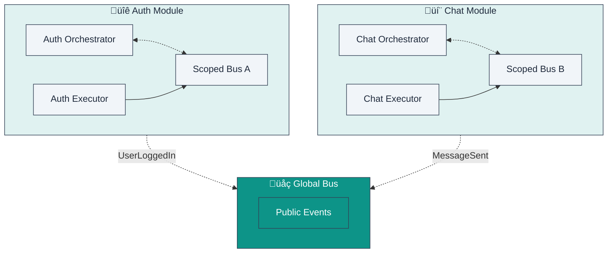
```mermaid
graph TB
    subgraph AuthModule["üîê Auth Module"]
        AuthBus["Scoped Bus A"]
        AuthOrch["Auth Orchestrator"]
        AuthExec["Auth Executor"]
        
        AuthOrch <-.-> AuthBus
        AuthExec --> AuthBus
    end
    
    subgraph ChatModule["💬 Chat Module"]
        ChatBus["Scoped Bus B"]
        ChatOrch["Chat Orchestrator"]
        ChatExec["Chat Executor"]
        
        ChatOrch <-.-> ChatBus
        ChatExec --> ChatBus
    end
    
    subgraph GlobalBus["üåç Global Bus"]
        GB["Public Events"]
    end
    
    AuthModule -.->|"UserLoggedIn"| GlobalBus
    ChatModule -.->|"MessageSent"| GlobalBus
    
    style AuthModule fill:#e0f2f1,stroke:#334155,color:#1e293b
    style ChatModule fill:#e0f2f1,stroke:#334155,color:#1e293b
    style GlobalBus fill:#0d9488,stroke:#334155,color:#ffffff
    style AuthBus fill:#f1f5f9,stroke:#334155,color:#1e293b
    style ChatBus fill:#f1f5f9,stroke:#334155,color:#1e293b
    style GB fill:#0d9488,stroke:#334155,color:#ffffff
    style AuthOrch fill:#f1f5f9,stroke:#334155,color:#1e293b
    style AuthExec fill:#f1f5f9,stroke:#334155,color:#1e293b
    style ChatOrch fill:#f1f5f9,stroke:#334155,color:#1e293b
    style ChatExec fill:#f1f5f9,stroke:#334155,color:#1e293b
```

### Khi nào dùng loại nào

| Loại Bus | Use Case | Ví dụ |
|----------|----------|-------|
| **Scoped** | State n·ªôi b·ªô module | LoadingStarted, StepComplete |
| **Global** | Giao tiếp liên module | UserLoggedIn, ThemeChanged |

---

## 4.5. M·∫´u Registry

**Vấn đề**: Làm sao định tuyến Job tới Executor hiệu quả?

**Giải pháp**: Duy trì một registry dựa theo Type với tốc độ tra cứu O(1).

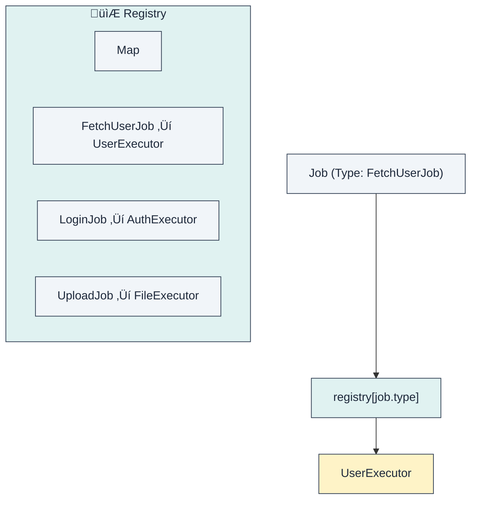
```mermaid
graph TB
    subgraph Registry["📮 Registry"]
        Map["Map<Type, Executor>"]
        
        E1["FetchUserJob ‚Üí UserExecutor"]
        E2["LoginJob ‚Üí AuthExecutor"]
        E3["UploadJob ‚Üí FileExecutor"]
    end
    
    Job["Job (Type: FetchUserJob)"] --> Lookup["registry[job.type]"]
    Lookup --> Match["UserExecutor"]
    
    style Registry fill:#e0f2f1,stroke:#334155,color:#1e293b
    style Map fill:#f1f5f9,stroke:#334155,color:#1e293b
    style E1 fill:#f1f5f9,stroke:#334155,color:#1e293b
    style E2 fill:#f1f5f9,stroke:#334155,color:#1e293b
    style E3 fill:#f1f5f9,stroke:#334155,color:#1e293b
    style Job fill:#f1f5f9,stroke:#334155,color:#1e293b
    style Lookup fill:#e0f2f1,stroke:#334155,color:#1e293b
    style Match fill:#fef3c7,stroke:#334155,color:#1e293b
```

### Chiến lược đăng ký

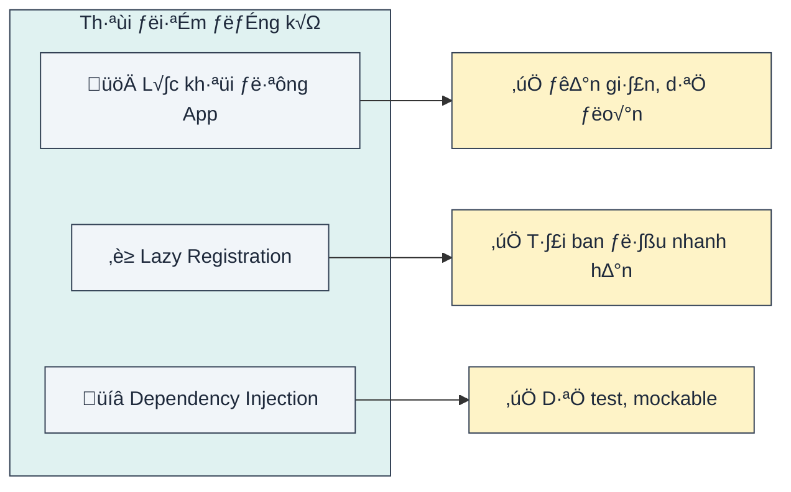
```mermaid
flowchart LR
    subgraph Strategies["Thời điểm đăng ký"]
        Startup["🚀 Lúc khởi động App"]
        Lazy["‚è≥ Lazy Registration"]
        DI["üíâ Dependency Injection"]
    end
    
    Startup --> Pro1["✅ Đơn giản, dễ đoán"]
    Lazy --> Pro2["✅ Tải ban đầu nhanh hơn"]
    DI --> Pro3["‚úÖ D·ªÖ test, mockable"]
    
    style Strategies fill:#e0f2f1,stroke:#334155,color:#1e293b
    style Startup fill:#f1f5f9,stroke:#334155,color:#1e293b
    style Lazy fill:#f1f5f9,stroke:#334155,color:#1e293b
    style DI fill:#f1f5f9,stroke:#334155,color:#1e293b
    style Pro1 fill:#fef3c7,stroke:#334155,color:#1e293b
    style Pro2 fill:#fef3c7,stroke:#334155,color:#1e293b
    style Pro3 fill:#fef3c7,stroke:#334155,color:#1e293b
```

---

## 4.6. Mẫu Error Boundary (Rào chắn lỗi)

**Vấn đề**: Làm sao để ngăn lỗi của executor làm crash app?

**Giải pháp**: Bọc toàn bộ logic executor trong try-catch và chuyển đổi thành sự kiện.

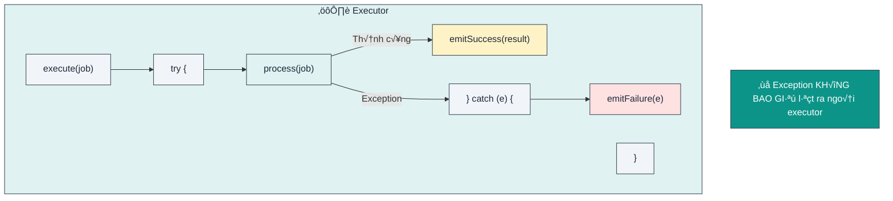
```mermaid
flowchart TD
    subgraph Executor["⚙️ Executor"]
        Start["execute(job)"]
        Try["try {"]
        Process["process(job)"]
        TryCatch["} catch (e) {"]
        EmitFail["emitFailure(e)"]
        End["}"]
        
        Start --> Try
        Try --> Process
        Process -->|"Thành công"| EmitSuccess["emitSuccess(result)"]
        Process -->|"Exception"| TryCatch
        TryCatch --> EmitFail
    end
    
    Note["❌ Exception KHÔNG BAO GIỜ lọt ra ngoài executor"]
    
    style Executor fill:#e0f2f1,stroke:#334155,color:#1e293b
    style Start fill:#f1f5f9,stroke:#334155,color:#1e293b
    style Try fill:#f1f5f9,stroke:#334155,color:#1e293b
    style Process fill:#e0f2f1,stroke:#334155,color:#1e293b
    style TryCatch fill:#f1f5f9,stroke:#334155,color:#1e293b
    style End fill:#f1f5f9,stroke:#334155,color:#1e293b
    style EmitSuccess fill:#fef3c7,stroke:#334155,color:#1e293b
    style EmitFail fill:#fee2e2,stroke:#334155,color:#1e293b
    style Note fill:#0d9488,stroke:#334155,color:#ffffff
```

### Sự đảm bảo

> **Mỗi lần dispatch job luôn trả về đúng một event kết quả**: Success HOẶC Failure.
> Orchestrator luôn có thể tin tưởng rằng sẽ nhận được phản hồi.

---

## 4.7. Mối quan hệ giữa các mẫu

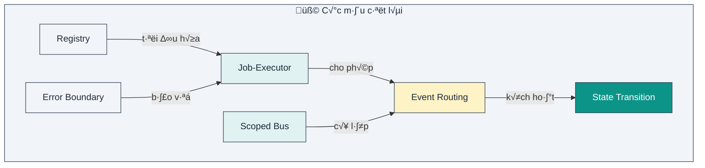
```mermaid
graph TB
    subgraph Patterns["🧩 Các mẫu cốt lõi"]
        JE["Job-Executor"]
        ER["Event Routing"]
        ST["State Transition"]
        SB["Scoped Bus"]
        RG["Registry"]
        EB["Error Boundary"]
    end
    
    JE -->|"cho phép"| ER
    ER -->|"kích hoạt"| ST
    SB -->|"cô lập"| ER
    RG -->|"tối ưu hóa"| JE
    EB -->|"bảo vệ"| JE
    
    style Patterns fill:#f1f5f9,stroke:#334155,color:#1e293b
    style JE fill:#e0f2f1,stroke:#334155,color:#1e293b
    style ER fill:#fef3c7,stroke:#334155,color:#1e293b
    style ST fill:#0d9488,stroke:#334155,color:#ffffff
    style SB fill:#e0f2f1,stroke:#334155,color:#1e293b
    style RG fill:#f1f5f9,stroke:#334155,color:#1e293b
    style EB fill:#f1f5f9,stroke:#334155,color:#1e293b
```

---

## Tổng kết

| Mẫu (Pattern) | Giải quyết vấn đề gì | Cơ chế chính |
|---------------|----------------------|--------------|
| **Job-Executor** | Tách yêu cầu khỏi xử lý | Định tuyến theo Type |
| **Event Routing** | Khớp sự kiện với nguồn | Correlation ID |
| **State Transition** | UI state nhất quán | State machine |
| **Scoped Bus** | Ngăn rò rỉ sự kiện | Kênh cô lập |
| **Registry** | Định tuyến hiệu quả | O(1) lookup map |
| **Error Boundary** | Ngăn crash app | Tự động try-catch |

**Bài học chính**: Các mẫu này kết hợp với nhau tạo nên một kiến trúc mạnh mẽ, dễ kiểm thử và có khả năng mở rộng.
