# Chương 5: Các mẫu nâng cao (Advanced Patterns)

> *"Hãy làm nó chạy, làm nó đúng, rồi hãy làm nó nhanh."* — Kent Beck

Chương này bao gồm các pattern cho hệ thống quy mô production: xử lý lỗi, quản lý tác vụ chạy lâu và mở rộng.

---

## 5.1. Mẫu Hủy bỏ (The Cancellation Pattern)

**Vấn đề**: Làm sao dừng những công việc không còn cần thiết?

**Giải pháp**: Hủy bỏ hợp tác (Cooperative cancellation) thông qua token.

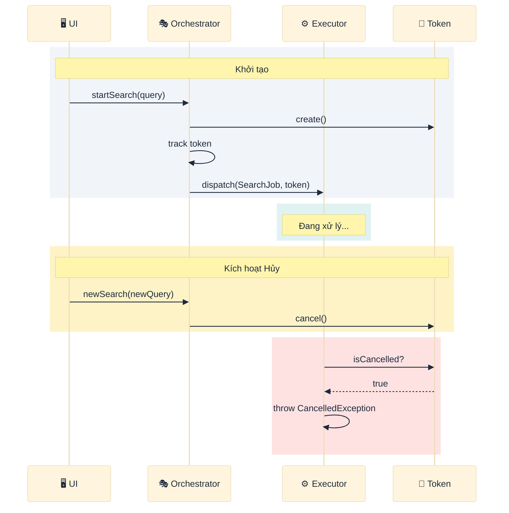

### Khi nào nên Hủy

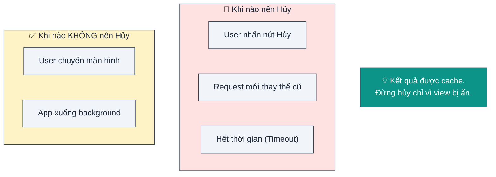

### Các điểm kiểm tra (Checkpoints)

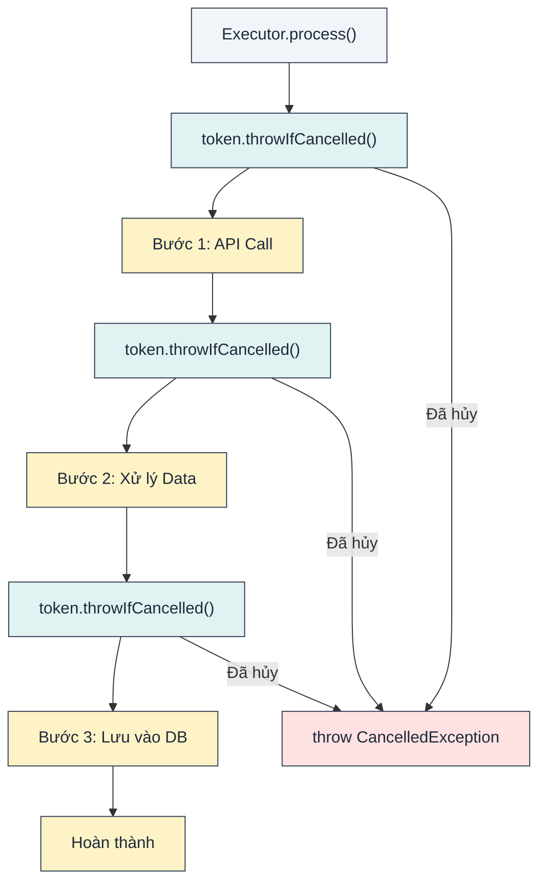

---

## 5.2. Mẫu Timeout

**Vấn đề**: Làm sao ngăn chặn operation chạy mãi mãi?

**Giải pháp**: Bọc quá trình thực thi với giới hạn thời gian.

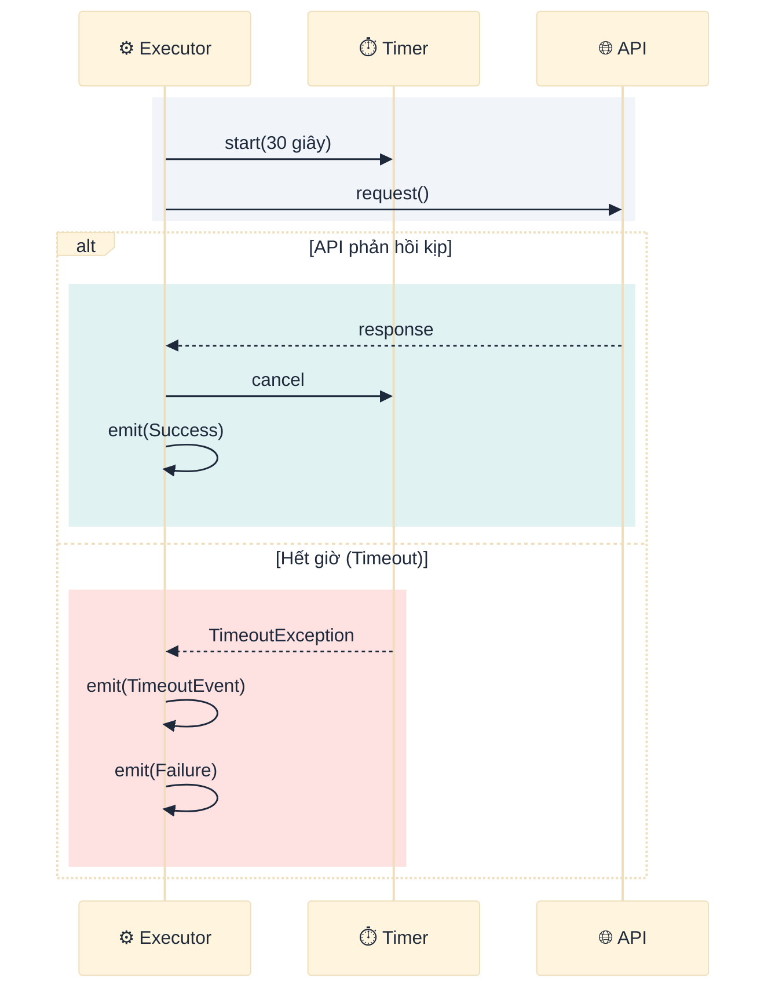

### Chiến lược Timeout

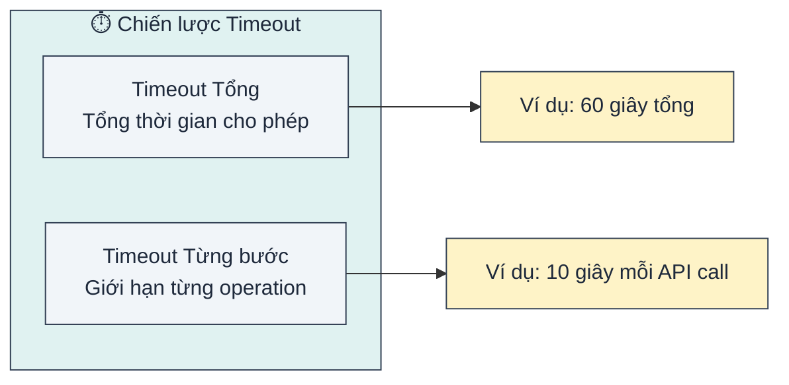

---

## 5.3. Mẫu Retry (Thử lại)

**Vấn đề**: Làm sao phục hồi từ các lỗi tạm thời (transient failures)?

**Giải pháp**: Tự động thử lại với thời gian chờ tăng dần (exponential backoff).

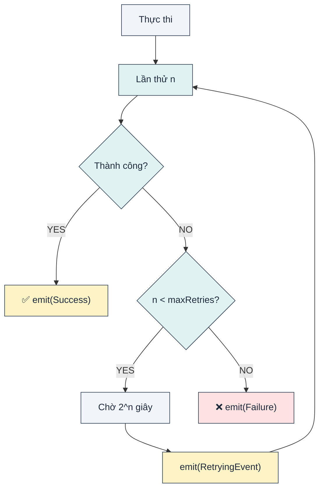

### Minh họa Backoff

```mermaid
gantt
    title Exponential Backoff
    dateFormat s
    axisFormat %S
    
    section Lần 1
    Execute :a1, 0, 1s
    
    section Chờ 1s
    Backoff :crit, w1, after a1, 1s
    
    section Lần 2
    Execute :a2, after w1, 1s
    
    section Chờ 2s
    Backoff :crit, w2, after a2, 2s
    
    section Lần 3
    Execute :a3, after w2, 1s
    
    section Chờ 4s
    Backoff :crit, w3, after a3, 4s
    
    section Lần 4
    Execute :a4, after w3, 1s
```

### Cấu hình chính sách Retry

| Tham số | Mô tả | Mặc định |
|---------|-------|----------|
| `maxRetries` | Số lần thử tối đa | 3 |
| `baseDelay` | Thời gian chờ ban đầu | 1 giây |
| `maxDelay` | Thời gian chờ tối đa | 30 giây |
| `shouldRetry` | Hàm điều kiện retry | Luôn true |

---

## 5.4. Mẫu Tiến trình (Progress Pattern)

**Vấn đề**: Làm sao hiển thị tiến độ cho các tác vụ chạy lâu?

**Giải pháp**: Emit các sự kiện progress trong quá trình thực thi.

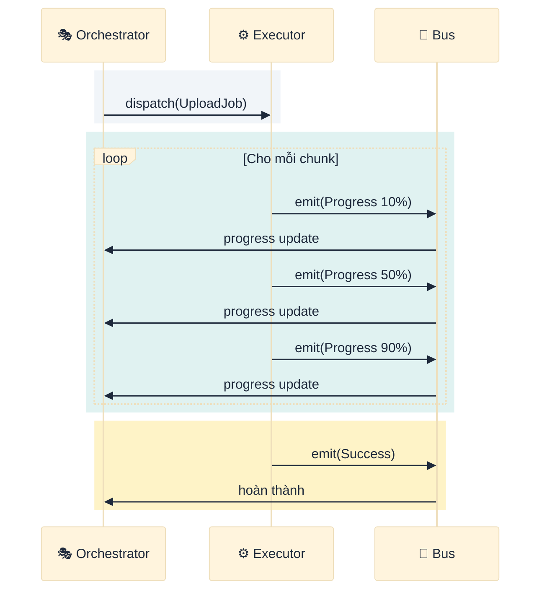

### Cấu trúc báo cáo tiến độ

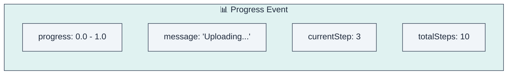

### Gắn kết UI (UI Binding)

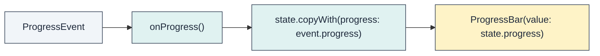

---

## 5.5. Mẫu Ngắt Mạch (Circuit Breaker)

**Vấn đề**: Làm sao ngăn chặn lỗi dây chuyền (cascading failures)?

**Giải pháp**: Ngừng gọi các service đang lỗi tạm thời.

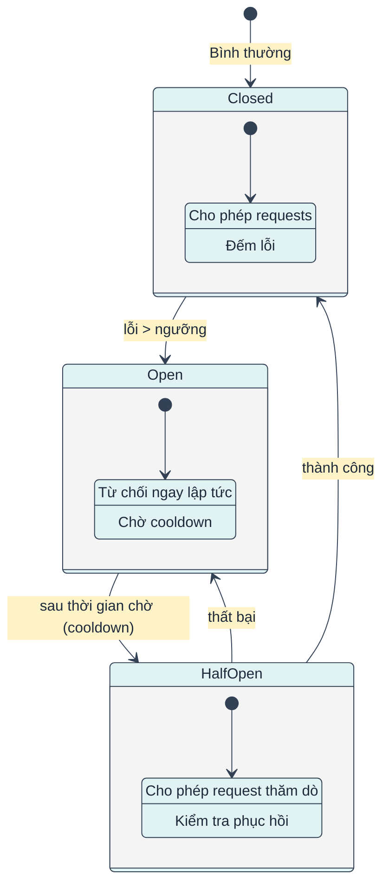

### Các trạng thái mạch

| Trạng thái | Hành vi |
|------------|---------|
| **Closed** | Hoạt động bình thường, đếm lỗi |
| **Open** | Request fail ngay lập tức, không thực thi |
| **Half-Open** | Thử nghiệm xem service đã phục hồi chưa |

---

## 5.6. Mẫu Logging

**Vấn đề**: Làm sao debug và giám sát hệ thống?

**Giải pháp**: Logging có thể plug-in tại các điểm then chốt.

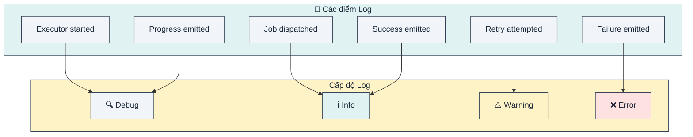

### Cấu hình Logger

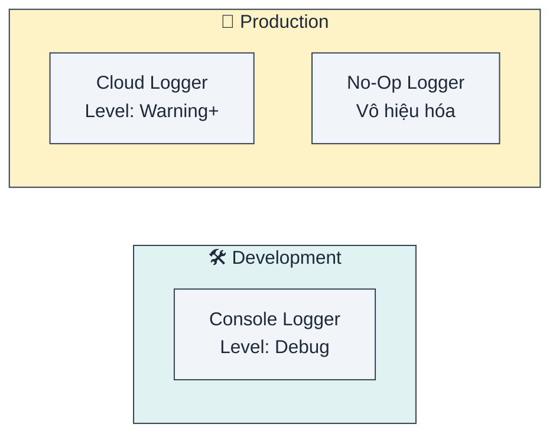

---

## 5.7. Mẫu Chống trùng lặp (Deduplication)

**Vấn đề**: Làm sao ngăn chặn các request trùng lặp đồng thời?

**Giải pháp**: Theo dõi các job đang chạy (in-flight) và từ chối nếu trùng.

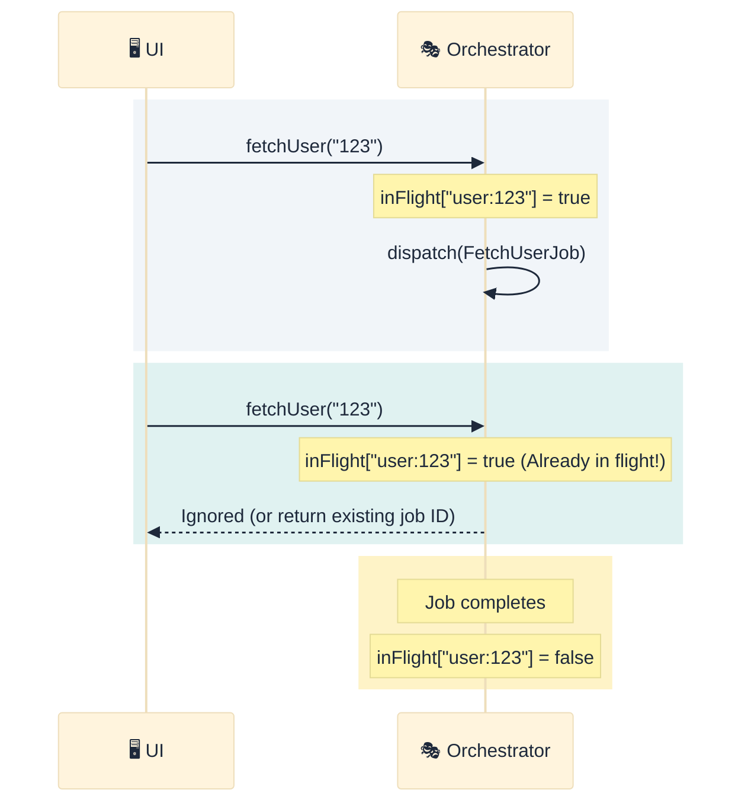

### Key chống trùng lặp (Deduplication Key)

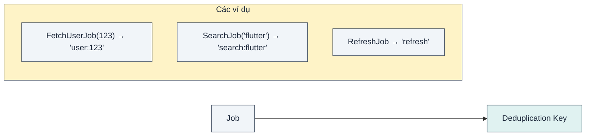

---

## 5.8. Kết hợp các Pattern

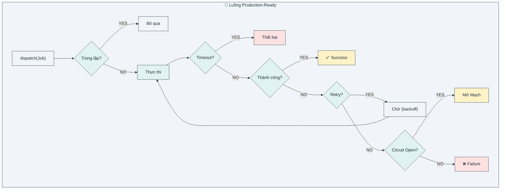

---

## Tổng kết

| Pattern | Giải quyết | Cơ chế chính |
|---------|------------|--------------|
| **Cancellation** | Dừng việc không cần thiết | Token hợp tác |
| **Timeout** | Ngăn chờ vô hạn | Giới hạn thời gian |
| **Retry** | Phục hồi lỗi | Exponential backoff |
| **Progress** | Hiển thị trạng thái | Sự kiện trung gian |
| **Circuit Breaker** | Ngăn lỗi dây chuyền | Máy trạng thái |
| **Logging** | Debug và giám sát | Pluggable loggers |
| **Deduplication** | Chống request trùng | Theo dõi in-flight |

**Bài học chính**: Hệ thống production đòi hỏi sự phòng thủ nhiều tầng. Các pattern này xếp chồng lên nhau tạo nên ứng dụng kiên cường (resilient).
