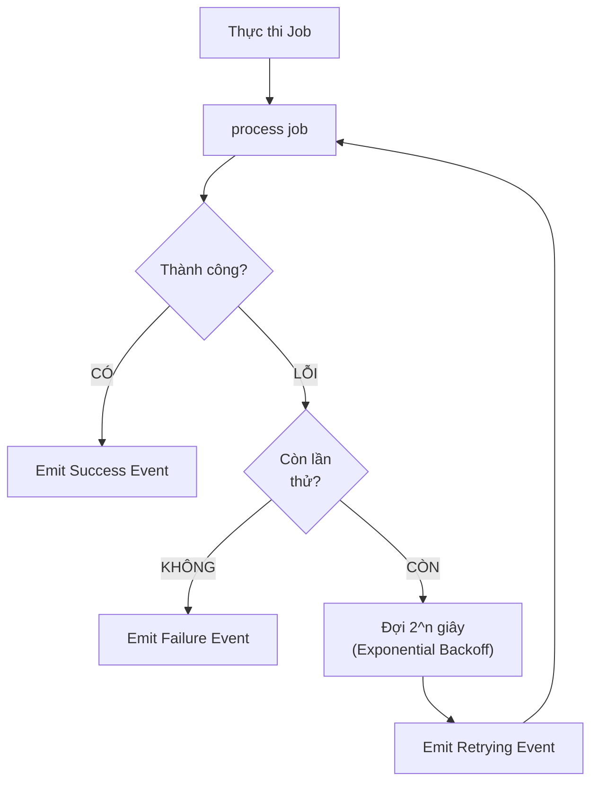

# Chương 5: Các Kỹ thuật Nâng cao

Chương này bổ sung các tính năng cần thiết để framework đạt tiêu chuẩn Production-Ready. Những tính năng này giúp hệ thống xử lý các tình huống thực tế như timeout mạng, hủy yêu cầu, và tự động thử lại khi gặp lỗi.

---

## 5.1. Hủy Tác vụ (Cancellation)

**Triết lý:** Job chạy độc lập với UI lifecycle. Chỉ hủy khi:
- User CHỦ ĐỘNG nhấn nút Cancel
- Logic nghiệp vụ xác định không cần kết quả (ví dụ: user gửi request mới thay thế cũ)

**Lưu ý:** KHÔNG tự động hủy khi user rời màn hình. Kết quả vẫn được cache và hiển thị khi user quay lại.

### CancellationToken

```dart
// lib/src/utils/cancellation_token.dart
class CancellationToken {
  bool _isCancelled = false;
  final List<void Function()> _listeners = [];

  bool get isCancelled => _isCancelled;

  void cancel() {
    if (_isCancelled) return;
    _isCancelled = true;
    for (final listener in _listeners) {
      listener();
    }
    _listeners.clear();
  }

  /// Đăng ký callback khi token bị hủy
  void onCancel(void Function() callback) {
    if (_isCancelled) {
      callback();
    } else {
      _listeners.add(callback);
    }
  }

  /// Kiểm tra và ném exception nếu đã bị hủy
  void throwIfCancelled() {
    if (_isCancelled) throw CancelledException();
  }
}

class CancelledException implements Exception {
  @override
  String toString() => 'CancelledException: Tác vụ đã bị hủy.';
}
```

### Tích hợp vào Job

```dart
abstract class BaseJob {
  final String id;
  final CancellationToken? cancellationToken;
  
  const BaseJob({required this.id, this.cancellationToken});
}
```

### Ứng dụng thực tế

```dart
class _MyScreenState extends State<MyScreen> {
  CancellationToken? _token;

  void _loadData() {
    _token = CancellationToken();
    orchestrator.dispatch(FetchDataJob(cancellationToken: _token));
  }

  // User CHỦ ĐỘNG nhấn nút Cancel
  void _onCancelPressed() {
    _token?.cancel();
  }
  
  // User gửi request mới thay thế cũ
  void _loadNewData() {
    _token?.cancel(); // Hủy request cũ vì không còn cần
    _token = CancellationToken();
    orchestrator.dispatch(FetchDataJob(cancellationToken: _token));
  }

  @override
  void dispose() {
    // KHÔNG cancel ở đây - kết quả vẫn được cache
    super.dispose();
  }
}
```

---

## 5.2. Giới hạn Thời gian (Timeout)

Các tác vụ chạy quá lâu cần được xử lý để tránh treo giao diện người dùng.

### Sự kiện Timeout

```dart
class JobTimeoutEvent extends BaseEvent {
  final Duration timeout;
  JobTimeoutEvent(super.correlationId, this.timeout);
}
```

### Xử lý trong Executor

```dart
Future<void> execute(T job) async {
  try {
    Future<dynamic> executionFuture = process(job);
    
    if (job.timeout != null) {
      executionFuture = executionFuture.timeout(
        job.timeout!,
        onTimeout: () {
          _bus.emit(JobTimeoutEvent(job.id, job.timeout!));
          throw TimeoutException('Tác vụ vượt quá thời gian cho phép', job.timeout);
        },
      );
    }
    
    final result = await executionFuture;
    emitResult(job.id, result);
  } catch (e, stack) {
    emitFailure(job.id, e, stack);
  }
}
```

---

## 5.3. Thử lại Tự động (Retry)

Cơ chế tự động thử lại với thuật toán Exponential Backoff giúp cải thiện độ tin cậy khi gặp lỗi tạm thời.



### RetryPolicy

```dart
// lib/src/utils/retry_policy.dart
class RetryPolicy {
  final int maxRetries;
  final Duration baseDelay;
  final bool exponentialBackoff;
  final Duration maxDelay;
  final bool Function(Object error)? shouldRetry;

  const RetryPolicy({
    this.maxRetries = 3,
    this.baseDelay = const Duration(seconds: 1),
    this.exponentialBackoff = true,
    this.maxDelay = const Duration(seconds: 30),
    this.shouldRetry,
  });
  
  /// Tính toán thời gian chờ cho lần thử thứ n
  Duration getDelay(int attempt) {
    if (!exponentialBackoff) return baseDelay;
    
    final delay = baseDelay * (1 << attempt); // 2^attempt
    return delay > maxDelay ? maxDelay : delay;
  }
  
  bool canRetry(Object error, int currentAttempt) {
    if (currentAttempt >= maxRetries) return false;
    if (shouldRetry != null) return shouldRetry!(error);
    return true;
  }
}
```

### Sự kiện Retry

```dart
class JobRetryingEvent extends BaseEvent {
  final int attempt;
  final int maxRetries;
  final Object lastError;
  final Duration delayBeforeRetry;

  JobRetryingEvent(super.correlationId, {
    required this.attempt,
    required this.maxRetries,
    required this.lastError,
    required this.delayBeforeRetry,
  });
}
```

### Logic Retry trong Executor

```dart
Future<dynamic> _executeWithRetry(T job) async {
  final policy = job.retryPolicy!;
  int attempt = 0;

  while (true) {
    try {
      job.cancellationToken?.throwIfCancelled();
      return await process(job);
    } catch (e) {
      if (!policy.canRetry(e, attempt)) rethrow;

      final delay = policy.getDelay(attempt);
      
      _bus.emit(JobRetryingEvent(
        job.id,
        attempt: attempt + 1,
        maxRetries: policy.maxRetries,
        lastError: e,
        delayBeforeRetry: delay,
      ));

      await Future.delayed(delay);
      attempt++;
    }
  }
}
```

---

## 5.4. Báo cáo Tiến độ (Progress Reporting)

Với các tác vụ kéo dài (upload file, xử lý AI), việc báo cáo tiến độ giúp người dùng theo dõi trạng thái.

### JobProgressEvent

```dart
class JobProgressEvent extends BaseEvent {
  final double progress; // Giá trị từ 0.0 đến 1.0
  final String? message;
  final int? currentStep;
  final int? totalSteps;

  JobProgressEvent(super.correlationId, {
    required this.progress,
    this.message,
    this.currentStep,
    this.totalSteps,
  });
}
```

### Sử dụng trong Executor

```dart
class UploadExecutor extends BaseExecutor<UploadJob> {
  @override
  Future<dynamic> process(UploadJob job) async {
    final totalChunks = 10;
    
    for (int i = 1; i <= totalChunks; i++) {
      await uploadChunk(i);
      
      emitProgress(
        job.id,
        progress: i / totalChunks,
        message: 'Đang tải lên phần $i/$totalChunks',
        currentStep: i,
        totalSteps: totalChunks,
      );
    }
    
    return 'Hoàn thành';
  }
}
```

---

## 5.5. Hệ thống Ghi nhật ký (Logging)

Hệ thống log linh hoạt hỗ trợ debug trong quá trình phát triển và giám sát trong môi trường production.

### Giao diện Logger

```dart
// lib/src/utils/logger.dart
enum LogLevel { debug, info, warning, error }

abstract class OrchestratorLogger {
  void log(LogLevel level, String message, [Object? error, StackTrace? stack]);
  
  void debug(String message) => log(LogLevel.debug, message);
  void info(String message) => log(LogLevel.info, message);
  void warning(String message, [Object? error]) => log(LogLevel.warning, message, error);
  void error(String message, Object error, [StackTrace? stack]) => 
      log(LogLevel.error, message, error, stack);
}

/// Logger xuất ra console (dùng trong development)
class ConsoleLogger extends OrchestratorLogger {
  final LogLevel minLevel;
  ConsoleLogger({this.minLevel = LogLevel.info});
  
  @override
  void log(LogLevel level, String message, [Object? error, StackTrace? stack]) {
    if (level.index < minLevel.index) return;
    print('[${level.name.toUpperCase()}] $message');
  }
}

/// Logger im lặng (dùng trong production)
class NoOpLogger extends OrchestratorLogger {
  @override
  void log(LogLevel level, String message, [Object? error, StackTrace? stack]) {}
}
```

### Cấu hình toàn cục

```dart
class OrchestratorConfig {
  static OrchestratorLogger _logger = NoOpLogger();
  
  static OrchestratorLogger get logger => _logger;
  
  static void setLogger(OrchestratorLogger logger) => _logger = logger;
  
  static void enableDebugLogging() {
    _logger = ConsoleLogger(minLevel: LogLevel.debug);
  }
}
```

---

---

## 5.7. Cơ chế An toàn (Safety Mechanisms)

Để ngăn chặn app bị crash hoặc rơi vào vòng lặp vô tận, framework tích hợp sẵn các cơ chế bảo vệ.

### Circuit Breaker (Chống vòng lặp)

Framework tự động phát hiện nếu một Orchestrator xử lý quá nhiều event trong thời gian ngắn (Infinite Loop).

- **Giới hạn mặc định**: 50 events/giây.
- **Hành vi**: Ngừng xử lý event và log lỗi vào `OrchestratorLogger`.
- **Cấu hình**:

```dart
// 1. Giới hạn chung (áp dụng cho tất cả event)
OrchestratorConfig.maxEventsPerSecond = 100;

// 2. Giới hạn riêng cho từng loại (ví dụ: sự kiện di chuyển chuột liên tục)
OrchestratorConfig.setTypeLimit<MouseMovementEvent>(500);
```

### Type Safety Isolation (Cô lập lỗi)

Tất cả các hàm xử lý event đều được bọc trong khối `try-catch`.

#### Safe Data Casting (Ép kiểu an toàn)
Để tránh lỗi runtime khi ép kiểu dữ liệu event, hãy sử dụng `dataAs<T>()`:

```dart
@override
void onActiveSuccess(JobSuccessEvent event) {
  // Trả về 'User?' (null nếu sai kiểu), thay vì crash ứng dụng
  final user = event.dataAs<User>(); 
  if (user != null) {
    emit(state.copyWith(user: user));
  }
}
```

### Ngăn chặn Race Condition ở UI

Khi nhiều job chạy song song, việc chỉ check `isLoading` chung chung rất rủi ro. Hãy dùng `isJobTypeRunning<T>` để cập nhật UI chính xác:

```dart
// Kiểm tra trạng thái job cụ thể
if (isJobTypeRunning<FetchUserJob>() && !isJobTypeRunning<LogoutJob>()) {
  emit(state.copyWith(isLoading: false));
}
```

---

## 5.8. Tổng kết

Với các tính năng nâng cao trên, framework đã đáp ứng đầy đủ yêu cầu Production-Ready:

| Tính năng | Lợi ích |
|-----------|---------|
| **Cancellation** | Hủy khi user chủ động hoặc theo logic nghiệp vụ |
| **Timeout** | Đảm bảo hệ thống không bị treo vô thời hạn |
| **Retry** | Tự động phục hồi khi gặp lỗi tạm thời |
| **Progress** | Cải thiện trải nghiệm người dùng với tác vụ dài |
| **Logging** | Hỗ trợ debug và giám sát hệ thống |

Chương tiếp theo sẽ áp dụng tất cả kiến thức vào một nghiên cứu điển hình thực tế.
