# Chương 5: Các mẫu nâng cao (Advanced Patterns)

> *"Hãy làm nó chạy, làm nó đúng, rồi hãy làm nó nhanh."* — Kent Beck

Chương này bao gồm các pattern cho hệ thống quy mô production: xử lý lỗi, quản lý tác vụ chạy lâu và mở rộng.

---

## 5.1. Mẫu Hủy bỏ (The Cancellation Pattern)

**Vấn đề**: Làm sao dừng những công việc không còn cần thiết?

**Giải pháp**: Hủy bỏ hợp tác (Cooperative cancellation) thông qua token.

```mermaid
sequenceDiagram
    participant UI as 🖥️ UI
    participant Orch as 🎭 Orchestrator
    participant Exec as ⚙️ Executor
    participant Token as 🎫 Token
    
    UI->>Orch: startSearch(query)
    Orch->>Token: create()
    Orch->>Orch: track token
    Orch->>Exec: dispatch(SearchJob, token)
    
    Note over Exec: Đang xử lý...
    
    UI->>Orch: newSearch(newQuery)
    Orch->>Token: cancel()
    
    Exec->>Token: isCancelled?
    Token-->>Exec: true
    Exec->>Exec: throw CancelledException
```

### Khi nào nên Hủy

```mermaid
graph TB
    subgraph CancelTriggers["🛑 Khi nào nên Hủy"]
        User["User nhấn nút Hủy"]
        Replace["Request mới thay thế cũ"]
        Timeout["Hết thời gian (Timeout)"]
    end
    
    subgraph DontCancel["✅ Khi nào KHÔNG nên Hủy"]
        Navigate["User chuyển màn hình"]
        Background["App xuống background"]
    end
    
    Note["💡 Kết quả được cache.<br/>Đừng hủy chỉ vì view bị ẩn."]
```

### Các điểm kiểm tra (Checkpoints)

```mermaid
flowchart TD
    Start["Executor.process()"] --> Check1["token.throwIfCancelled()"]
    Check1 --> Step1["Bước 1: API Call"]
    Step1 --> Check2["token.throwIfCancelled()"]
    Check2 --> Step2["Bước 2: Xử lý Data"]
    Step2 --> Check3["token.throwIfCancelled()"]
    Check3 --> Step3["Bước 3: Lưu vào DB"]
    Step3 --> Done["Hoàn thành"]
    
    Check1 & Check2 & Check3 -->|"Đã hủy"| Throw["throw CancelledException"]
```

---

## 5.2. Mẫu Timeout

**Vấn đề**: Làm sao ngăn chặn operation chạy mãi mãi?

**Giải pháp**: Bọc quá trình thực thi với giới hạn thời gian.

```mermaid
sequenceDiagram
    participant Exec as ⚙️ Executor
    participant Timer as ⏱️ Timer
    participant API as 🌐 API
    
    Exec->>Timer: start(30 giây)
    Exec->>API: request()
    
    alt API phản hồi kịp
        API-->>Exec: response
        Exec->>Timer: cancel
        Exec->>Exec: emit(Success)
    else Hết giờ (Timeout)
        Timer-->>Exec: TimeoutException
        Exec->>Exec: emit(TimeoutEvent)
        Exec->>Exec: emit(Failure)
    end
```

### Chiến lược Timeout

```mermaid
graph LR
    subgraph Strategy["⏱️ Chiến lược Timeout"]
        Overall["Timeout Tổng<br/>Tổng thời gian cho phép"]
        PerStep["Timeout Từng bước<br/>Giới hạn từng operation"]
    end
    
    Overall --> Total["Ví dụ: 60 giây tổng"]
    PerStep --> Each["Ví dụ: 10 giây mỗi API call"]
```

---

## 5.3. Mẫu Retry (Thử lại)

**Vấn đề**: Làm sao phục hồi từ các lỗi tạm thời (transient failures)?

**Giải pháp**: Tự động thử lại với thời gian chờ tăng dần (exponential backoff).

```mermaid
flowchart TD
    Start["Thực thi"] --> Try["Lần thử n"]
    Try --> Success{"Thành công?"}
    
    Success -->|"YES"| Done["✅ emit(Success)"]
    Success -->|"NO"| CanRetry{"n < maxRetries?"}
    
    CanRetry -->|"YES"| Wait["Chờ 2^n giây"]
    Wait --> Notify["emit(RetryingEvent)"]
    Notify --> Try
    
    CanRetry -->|"NO"| Fail["❌ emit(Failure)"]
    
    style Done fill:#37b24d,color:#fff
    style Fail fill:#f03e3e,color:#fff
```

### Minh họa Backoff

### Cấu hình chính sách Retry

| Tham số | Mô tả | Mặc định |
|---------|-------|----------|
| `maxRetries` | Số lần thử tối đa | 3 |
| `baseDelay` | Thời gian chờ ban đầu | 1 giây |
| `maxDelay` | Thời gian chờ tối đa | 30 giây |
| `shouldRetry` | Hàm điều kiện retry | Luôn true |

---

## 5.4. Mẫu Tiến trình (Progress Pattern)

**Vấn đề**: Làm sao hiển thị tiến độ cho các tác vụ chạy lâu?

**Giải pháp**: Emit các sự kiện progress trong quá trình thực thi.

```mermaid
sequenceDiagram
    participant Orch as 🎭 Orchestrator
    participant Exec as ⚙️ Executor
    participant Bus as 📡 Bus
    
    Orch->>Exec: dispatch(UploadJob)
    
    loop Cho mỗi chunk
        Exec->>Bus: emit(Progress 10%)
        Bus->>Orch: progress update
        Exec->>Bus: emit(Progress 50%)
        Bus->>Orch: progress update
        Exec->>Bus: emit(Progress 90%)
        Bus->>Orch: progress update
    end
    
    Exec->>Bus: emit(Success)
    Bus->>Orch: hoàn thành
```

### Cấu trúc báo cáo tiến độ

```mermaid
graph LR
    subgraph ProgressEvent["📊 Progress Event"]
        Value["progress: 0.0 - 1.0"]
        Message["message: 'Uploading...'"]
        Current["currentStep: 3"]
        Total["totalSteps: 10"]
    end
```

### Gắn kết UI (UI Binding)

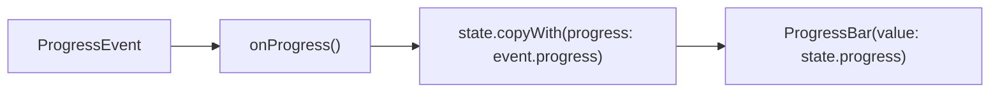

---

## 5.5. Mẫu Ngắt Mạch (Circuit Breaker)

**Vấn đề**: Làm sao ngăn chặn lỗi dây chuyền (cascading failures)?

**Giải pháp**: Ngừng gọi các service đang lỗi tạm thời.

```mermaid
stateDiagram-v2
    [*] --> Closed: Bình thường
    
    Closed --> Open: lỗi > ngưỡng
    Open --> HalfOpen: sau thời gian chờ (cooldown)
    HalfOpen --> Closed: thành công
    HalfOpen --> Open: thất bại
    
    state Closed {
        [*] --> Operational
        Operational: Cho phép requests
        Operational: Đếm lỗi
    }
    
    state Open {
        [*] --> Blocked
        Blocked: Từ chối ngay lập tức
        Blocked: Chờ cooldown
    }
    
    state HalfOpen {
        [*] --> Testing
        Testing: Cho phép request thăm dò
        Testing: Kiểm tra phục hồi
    }
```

### Các trạng thái mạch

| Trạng thái | Hành vi |
|------------|---------|
| **Closed** | Hoạt động bình thường, đếm lỗi |
| **Open** | Request fail ngay lập tức, không thực thi |
| **Half-Open** | Thử nghiệm xem service đã phục hồi chưa |

---

## 5.6. Mẫu Logging

**Vấn đề**: Làm sao debug và giám sát hệ thống?

**Giải pháp**: Logging có thể plug-in tại các điểm then chốt.

```mermaid
graph TB
    subgraph LogPoints["📝 Các điểm Log"]
        Dispatch["Job dispatched"]
        Start["Executor started"]
        Progress["Progress emitted"]
        Success["Success emitted"]
        Failure["Failure emitted"]
        Retry["Retry attempted"]
    end
    
    subgraph Levels["Cấp độ Log"]
        Debug["🔍 Debug"]
        Info["ℹ️ Info"]
        Warn["⚠️ Warning"]
        Error["❌ Error"]
    end
    
    Dispatch --> Info
    Start --> Debug
    Progress --> Debug
    Success --> Info
    Failure --> Error
    Retry --> Warn
```

### Cấu hình Logger

```mermaid
flowchart LR
    subgraph Development["🛠️ Development"]
        ConsoleLogger["Console Logger<br/>Level: Debug"]
    end
    
    subgraph Production["🚀 Production"]
        CloudLogger["Cloud Logger<br/>Level: Warning+"]
        NoOpLogger["No-Op Logger<br/>Vô hiệu hóa"]
    end
```

---

## 5.7. Mẫu Chống trùng lặp (Deduplication)

**Vấn đề**: Làm sao ngăn chặn các request trùng lặp đồng thời?

**Giải pháp**: Theo dõi các job đang chạy (in-flight) và từ chối nếu trùng.

```mermaid
sequenceDiagram
    participant UI as 🖥️ UI
    participant Orch as 🎭 Orchestrator
    
    UI->>Orch: fetchUser("123")
    Note over Orch: inFlight["user:123"] = true
    Orch->>Orch: dispatch(FetchUserJob)
    
    UI->>Orch: fetchUser("123")
    Note over Orch: Đang chạy rồi!
    Orch-->>UI: Bỏ qua (hoặc trả về job ID hiện có)
    
    Note over Orch: Job hoàn thành
    Note over Orch: inFlight["user:123"] = false
```

### Key chống trùng lặp (Deduplication Key)

```mermaid
graph LR
    Job["Job"] --> Key["Deduplication Key"]
    
    subgraph Examples["Các ví dụ"]
        E1["FetchUserJob(123) → 'user:123'"]
        E2["SearchJob('flutter') → 'search:flutter'"]
        E3["RefreshJob → 'refresh'"]
    end
```

---

## 5.8. Kết hợp các Pattern

```mermaid
flowchart TB
    subgraph FullFlow["🔄 Luồng Production-Ready"]
        Start["dispatch(Job)"] --> Dedup{"Trùng lặp?"}
        Dedup -->|"YES"| Skip["Bỏ qua"]
        Dedup -->|"NO"| Execute["Thực thi"]
        
        Execute --> Timeout{"Timeout?"}
        Timeout -->|"YES"| Fail1["Thất bại"]
        Timeout -->|"NO"| Success1{"Thành công?"}
        
        Success1 -->|"YES"| EmitSuccess["✅ Success"]
        Success1 -->|"NO"| Retry{"Retry?"}
        
        Retry -->|"YES"| Wait["Chờ (backoff)"]
        Wait --> Execute
        Retry -->|"NO"| Circuit{"Circuit Open?"}
        
        Circuit -->|"YES"| OpenCircuit["Mở Mạch"]
        Circuit -->|"NO"| Fail2["❌ Failure"]
    end
```

---

## Tổng kết

| Pattern | Giải quyết | Cơ chế chính |
|---------|------------|--------------|
| **Cancellation** | Dừng việc không cần thiết | Token hợp tác |
| **Timeout** | Ngăn chờ vô hạn | Giới hạn thời gian |
| **Retry** | Phục hồi lỗi | Exponential backoff |
| **Progress** | Hiển thị trạng thái | Sự kiện trung gian |
| **Circuit Breaker** | Ngăn lỗi dây chuyền | Máy trạng thái |
| **Logging** | Debug và giám sát | Pluggable loggers |
| **Deduplication** | Chống request trùng | Theo dõi in-flight |

**Bài học chính**: Hệ thống production đòi hỏi sự phòng thủ nhiều tầng. Các pattern này xếp chồng lên nhau tạo nên ứng dụng kiên cường (resilient).
