# Chương 6: Case Studies (Thực hành)

> *"Về lý thuyết, không có sự khác biệt giữa lý thuyết và thực hành. Nhưng trong thực tế, có đấy."* — Yogi Berra

Chương này sẽ rời xa các pattern trừu tượng và đi sâu vào các kịch bản thực tế chi tiết. Chúng ta sẽ khám phá cách kết hợp nhiều pattern để giải quyết các yêu cầu nghiệp vụ phức tạp.

---

## 6.1. Case Study: AI Chatbot

Xây dựng một AI Chatbot bao gồm nhiều thử thách phức tạp: các tác vụ chạy rất lâu (độ trễ của LLM), dữ liệu đến dưới dạng dòng chảy (streaming từng token), và quy trình bao gồm nhiều bước riêng biệt (lấy ngữ cảnh -> sinh câu trả lời -> lưu lịch sử).

### Tổng quan hệ thống

Chúng ta mô hình hóa hệ thống bằng ba Executor riêng biệt, được điều phối bởi một `ChatOrchestrator` duy nhất.

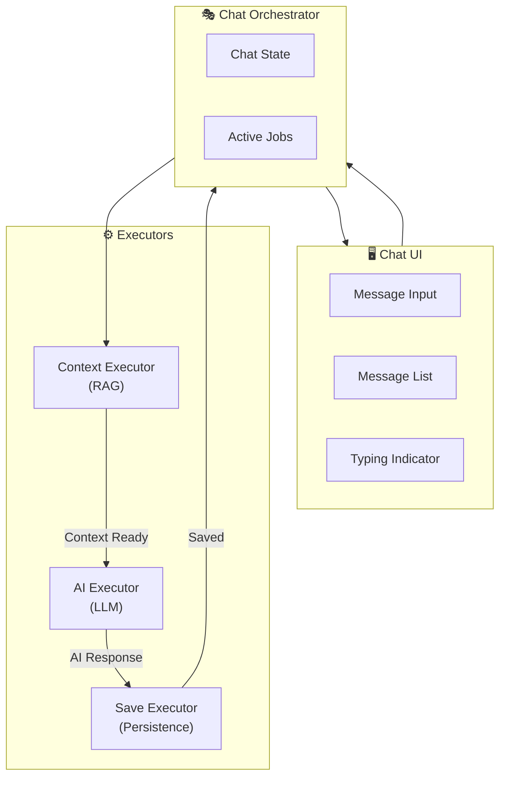

### Luồng xử lý (The Flow)

Luồng tin nhắn được chia thành ba giai đoạn. Hãy chú ý cách Orchestrator giữ vai trò điều phối trung tâm, gửi đi (dispatch) các job mới khi job trước đó hoàn thành.

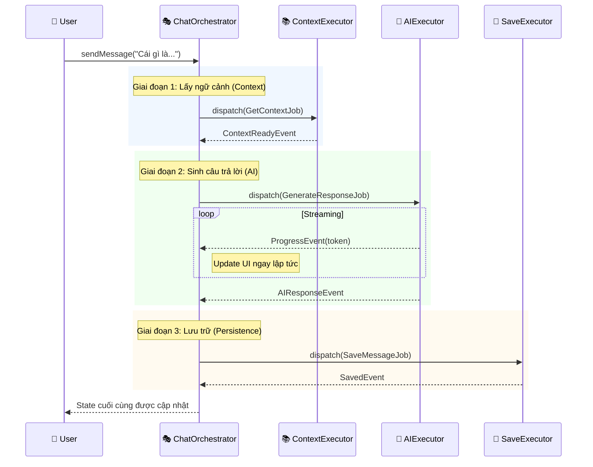

### Pattern Chuỗi công việc (Chained Jobs)

Thay vì viết một hàm khổng lồ, chúng ta xử lý quy trình làm việc như một máy trạng thái (state machine). Điều này cho phép chúng ta xử lý lỗi cụ thể cho từng giai đoạn (ví dụ: nếu Lưu thất bại, chúng ta không làm mất câu trả lời của AI, mà chỉ hiện nút "Thử lưu lại", vì câu trả lời AI đã có trong bộ nhớ).

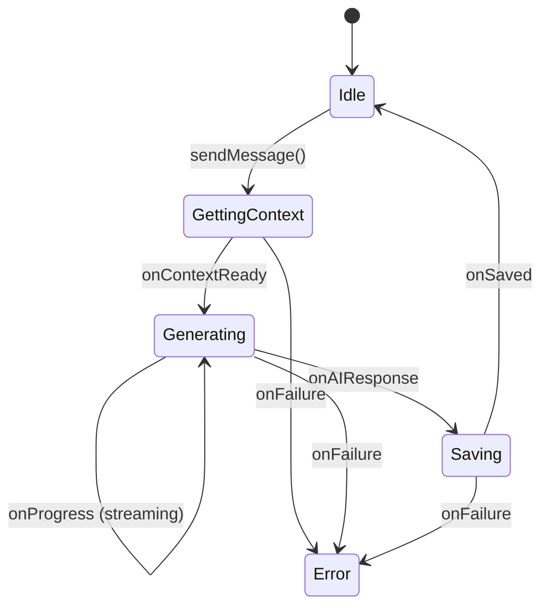

### Các quyết định chính

| Quyết định | Lý do |
|------------|-------|
| **Tách riêng RAG Executor** | Logic lấy ngữ cảnh (vector DB lookup) rất phức tạp và có thể được dùng bởi tính năng khác (ví dụ: "Bài viết liên quan"). Tách ra giúp tái sử dụng. |
| **Streaming qua Progress** | Chúng ta tái sử dụng `ProgressEvent` để mang dữ liệu chuỗi một phần (tokens). Điều này mang lại phản hồi tức thì cho người dùng. |
| **Lưu sau khi AI xong** | Chúng ta chỉ lưu tin nhắn khi đã có đầy đủ câu trả lời để đảm bảo tính nhất quán của cơ sở dữ liệu. |

---

## 6.2. Case Study: File Upload

File upload là một tác vụ "chạy lâu" (long-running) điển hình, đòi hỏi sự xử lý cẩn thận đối với mạng không ổn định và tương tác người dùng (hủy bỏ).

### Luồng xử lý

Ở đây, chúng ta sử dụng `CancellationToken` để cho phép người dùng ngắt quy trình. Executor kiểm tra token này trước khi upload mỗi chunk (phần nhỏ của file).

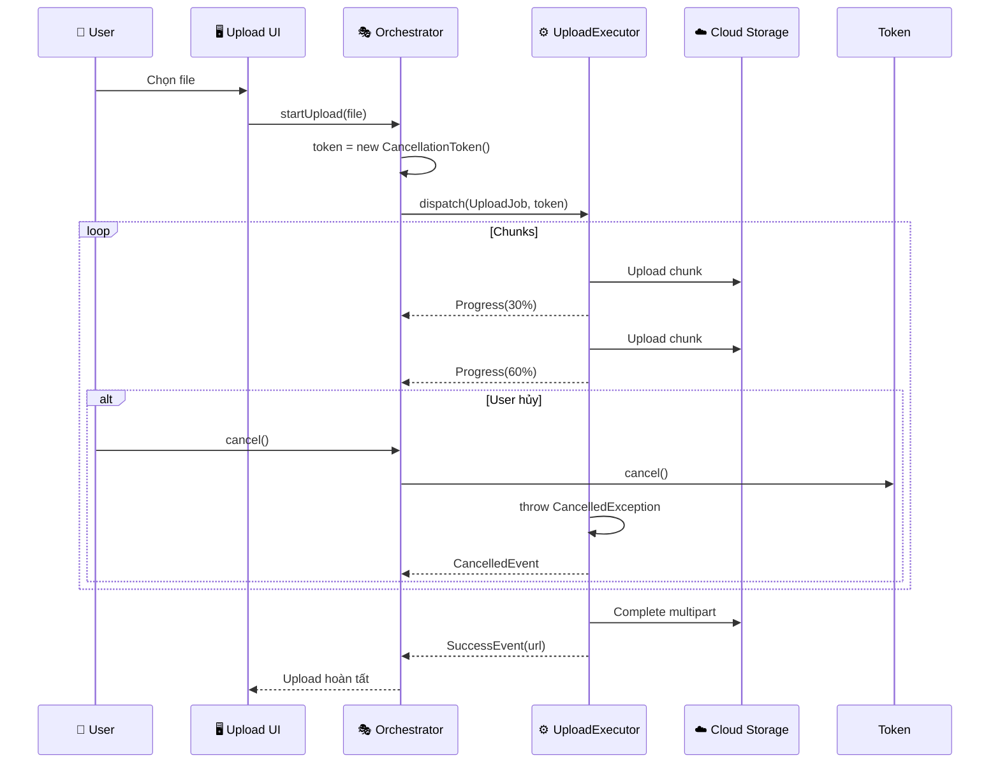

### Trạng thái Upload Chunk

Đối tượng state cần theo dõi tiến độ chi tiết, chứ không chỉ đơn giản là "đang tải".

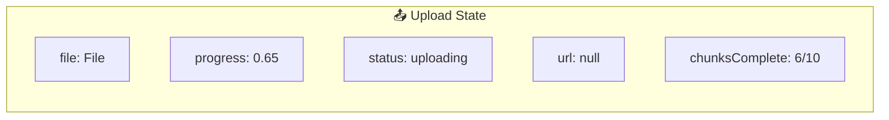

### Chiến lược Retry (Thử lại)

Không phải lỗi nào cũng giống nhau. Chúng ta triển khai logic retry thông minh bên trong Executor:
- **Lỗi tạm thời (Transient Errors)** (Network timeout, 502 Bad Gateway): Thử lại với thời gian chờ tăng dần (exponential backoff).
- **Lỗi vĩnh viễn (Permanent Errors)** (401 Unauthorized, 413 Payload Too Large): Báo lỗi ngay lập tức.

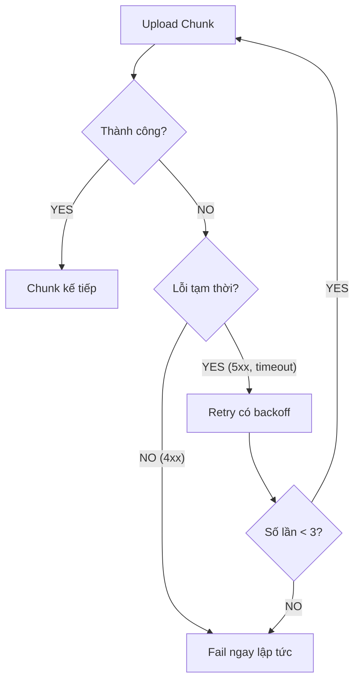

---

## 6.3. Case Study: Giỏ hàng (Shopping Cart)

Tính năng Giỏ hàng giới thiệu giao tiếp liên module (cross-module). Khi người dùng thêm một món vào giỏ, màn hình "Chi tiết sản phẩm" (có thể đang active ở background) cần biết về điều đó để cập nhật hiển thị số lượng tồn kho.

### Kiến trúc hệ thống

Chúng ta sử dụng **Global Bus** để phát (broadcast) các sự kiện mà nhiều module cùng quan tâm.

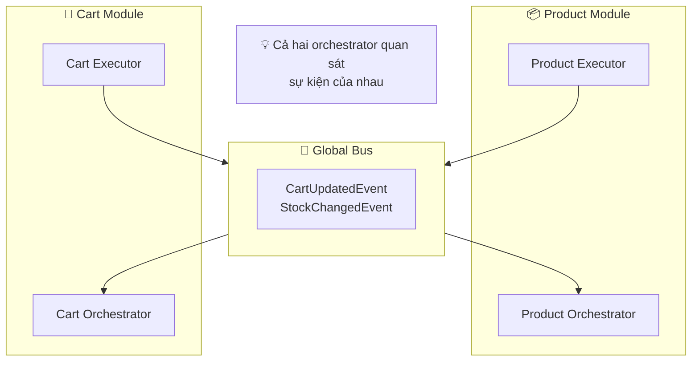

### Ví dụ Observer Mode

Sequence này cho thấy cách `ProductOrchestrator` cập nhật thụ động dựa trên một hành động được kích hoạt bởi `CartOrchestrator`.

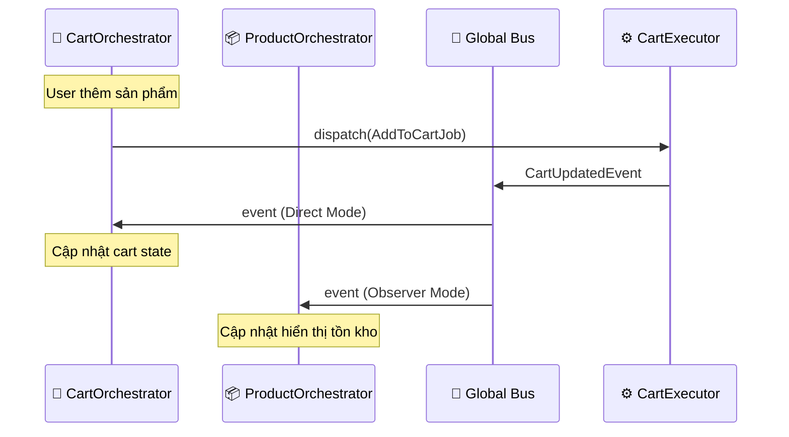

### Mẫu Cập nhật Lạc quan (Optimistic Update)

Để tạo cảm giác mượt mà, chúng ta giả định là sẽ thành công. Chúng ta cập nhật UI *trước khi* network request trả về. Nếu thất bại, chúng ta sẽ hoàn tác (rollback).

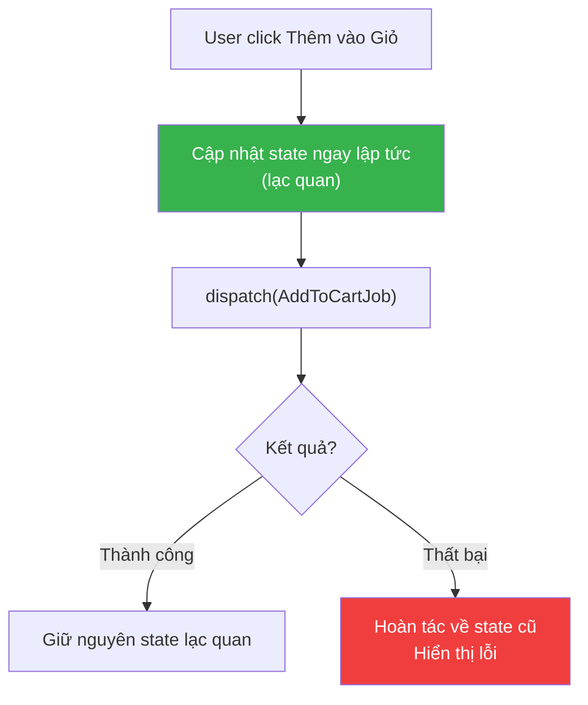

---

## 6.4. Case Study: Xác thực (Authentication)

Authentication (Xác thực) là trường hợp đặc biệt vì nó ảnh hưởng đến toàn bộ app (Global State) nhưng lại yêu cầu bảo mật cao.

### Kiến trúc

Chúng ta dùng **Scoped Bus** cho các logic auth nội bộ (như parse token) để ngăn các module khác "nghe lén" các sự kiện nhạy cảm, nhưng lại public các sự kiện cấp cao như `UserLoggedIn` ra Global Bus.

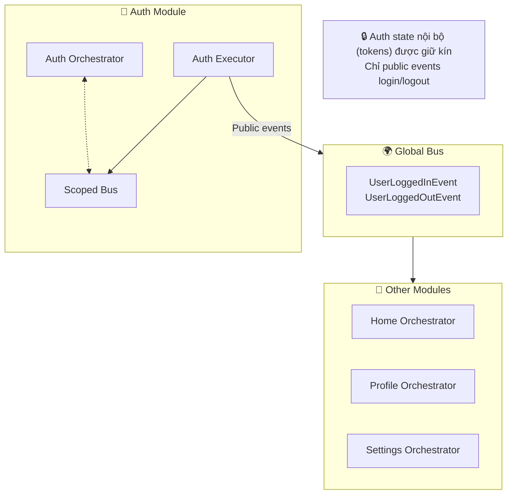

### Luồng Token Refresh

Đây là một quy trình chạy ngầm trong suốt với người dùng. Khi bất kỳ request nào thất bại với lỗi 401, `AuthExecutor` sẽ chặn lại (intercept), làm mới token, và thử lại request gốc.

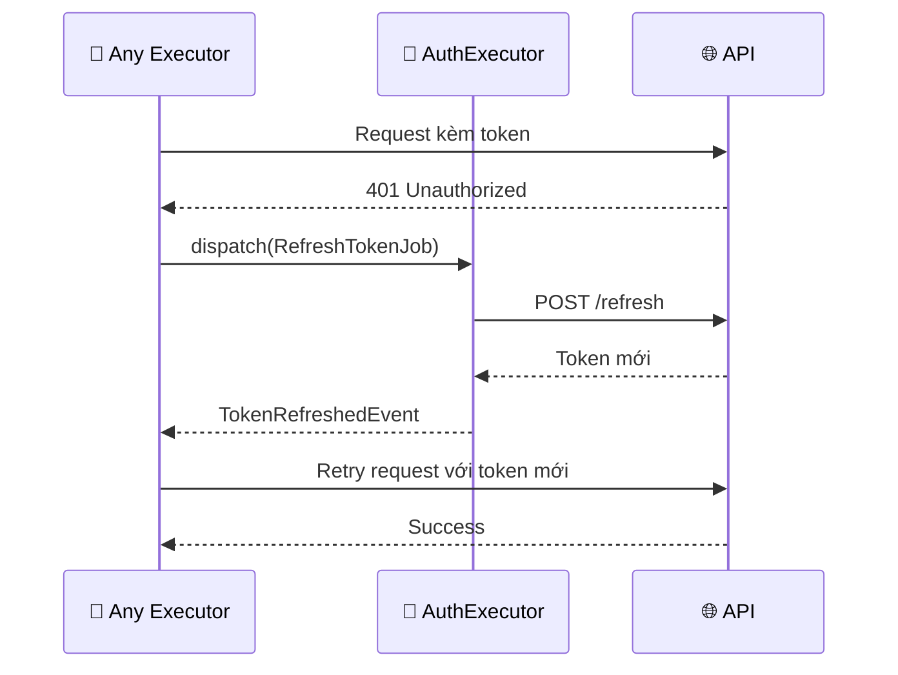

---

## 6.5. Bài học rút ra

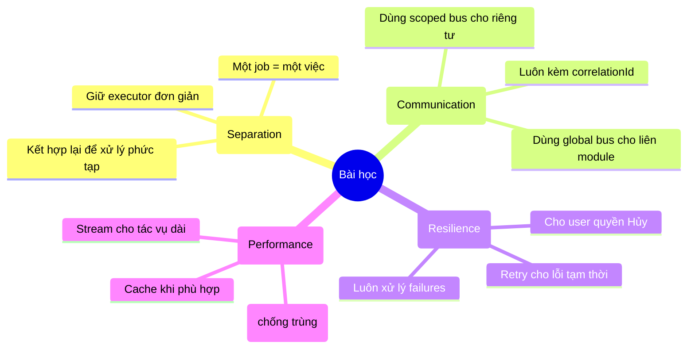

---

## Tổng kết

| Case Study | Các Pattern chính |
|------------|-------------------|
| **AI Chatbot** | **Chaining**: Nối các tác vụ tuần tự. **Streaming**: Phản hồi thời gian thực. |
| **File Upload** | **Cancellation**: Trao quyền cho user. **Retry**: Xử lý biến động mạng. |
| **Shopping Cart** | **Observer Mode**: Phản ứng với người khác. **Optimistic Update**: Phản hồi tức thì. |
| **Authentication** | **Scoped Bus**: Đóng gói (Encapsulation). **Interceptor**: Phục hồi trong suốt. |

**Bài học chính**: Các ứng dụng production thực tế hiếm khi là các luồng tuyến tính đơn giản. Chúng đòi hỏi xử lý lỗi mạnh mẽ, giao tiếp liên module, và các tính năng lấy người dùng làm trung tâm như hủy bỏ và cập nhật lạc quan. Kiến trúc này cung cấp các pattern chuẩn cho tất cả những điều đó.
