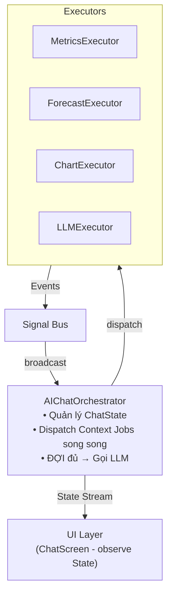
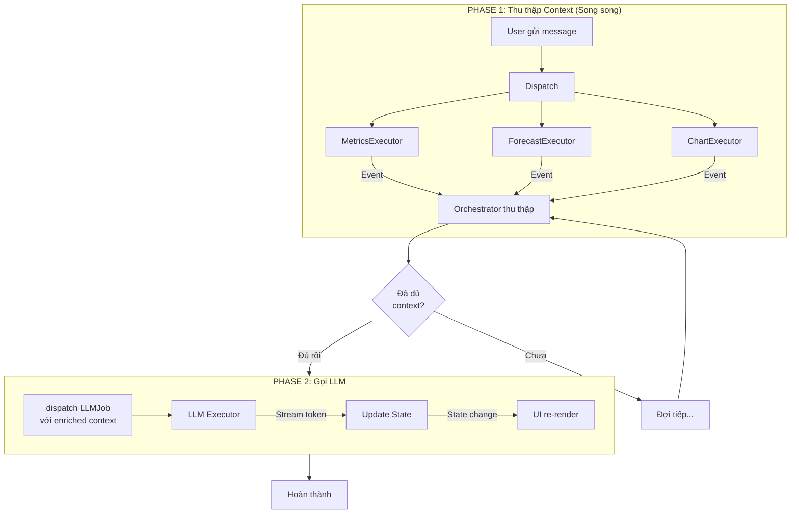

# Chương 6: Case Study - AI Chatbot với Context Enrichment

Chương này áp dụng toàn bộ kiến trúc Event-Driven Orchestrator vào một ứng dụng thực tế: **AI Chatbot thông minh** có khả năng truy cập và hiểu ngữ cảnh từ nhiều nguồn dữ liệu.

---

## 6.1. Mô tả Use Case

### Yêu cầu
Xây dựng AI Chatbot có thể:
- Trả lời câu hỏi dựa trên **dữ liệu thực** của ứng dụng
- Truy cập nhiều nguồn: Metrics, Forecast, Charts, ETL data
- Streaming response (hiệu ứng typing)
- Chạy background (kết quả được cache khi user rời màn hình)

### Ví dụ tương tác
```
User: "Tình hình tài chính tháng này thế nào?"

AI: [Đang thu thập dữ liệu...]
    → Gọi MetricsExecutor (revenue, expenses, profit)
    → Gọi ForecastExecutor (dự báo tháng sau)
    → Gọi ChartExecutor (trend data)
    
AI: "Tháng này doanh thu đạt 150 triệu, tăng 12% so với tháng trước.
     Chi phí ổn định ở mức 80 triệu. Lợi nhuận ròng 70 triệu.
     Dự báo tháng sau: doanh thu có thể đạt 165 triệu nếu..."
```

---

## 6.2. Kiến trúc Hệ thống



### Luồng Xử lý Tuần tự



**Điểm quan trọng:** LLM Job **KHÔNG** được dispatch song song với Context Jobs. Phải đợi tất cả context hoàn thành trước.

---

## 6.3. Các Thành phần

### Jobs

```dart
// Thu thập metrics
class GetMetricsJob extends BaseJob {
  final String period;
  GetMetricsJob({required this.period}) 
    : super(id: generateJobId('metrics'));
}

// Dự báo
class GetForecastJob extends BaseJob {
  final String period;
  GetForecastJob({required this.period})
    : super(id: generateJobId('forecast'));
}

// Gọi LLM
class LLMJob extends BaseJob {
  final String prompt;
  final String context;
  
  LLMJob({
    required this.prompt, 
    required this.context,
    super.cancellationToken,
  }) : super(id: generateJobId('llm'));
}
```

### Events

```dart
// Kết quả từ Metrics
class MetricsDataEvent extends BaseEvent {
  final Map<String, dynamic> metrics;
  MetricsDataEvent(super.correlationId, this.metrics);
}

// Kết quả từ Forecast
class ForecastDataEvent extends BaseEvent {
  final Map<String, dynamic> forecast;
  ForecastDataEvent(super.correlationId, this.forecast);
}
```

### Executors

```dart
class MetricsExecutor extends BaseExecutor<GetMetricsJob> {
  @override
  Future<dynamic> process(GetMetricsJob job) async {
    final metrics = await metricsRepository.getForPeriod(job.period);
    return metrics;
  }
}

class LLMExecutor extends BaseExecutor<LLMJob> {
  @override
  Future<dynamic> process(LLMJob job) async {
    final stream = await llmService.streamCompletion(
      prompt: job.prompt,
      context: job.context,
    );
    
    final buffer = StringBuffer();
    
    await for (final chunk in stream) {
      job.cancellationToken?.throwIfCancelled();
      
      buffer.write(chunk);
      // Emit progress cho từng chunk (streaming effect)
      emitProgress(job.id, 
        progress: 0.5, // Unknown total
        message: chunk,
      );
    }
    
    return buffer.toString();
  }
}
```

---

## 6.4. AIChatOrchestrator

```dart
class ChatState {
  final List<Message> messages;
  final ChatStatus status;
  final String streamingText;
  final double contextProgress;
  
  const ChatState({
    this.messages = const [],
    this.status = ChatStatus.idle,
    this.streamingText = '',
    this.contextProgress = 0,
  });
}

enum ChatStatus { idle, collectingContext, generatingResponse }

class AIChatOrchestrator extends OrchestratorCubit<ChatState> {
  final Set<String> _pendingContextJobs = {};
  final Map<String, dynamic> _collectedContext = {};
  String _currentPrompt = '';
  CancellationToken? _llmToken;

  AIChatOrchestrator() : super(const ChatState());

  void sendMessage(String text) {
    // Hủy request LLM cũ nếu đang chạy (theo logic nghiệp vụ)
    if (state.status == ChatStatus.generatingResponse) {
      _llmToken?.cancel();
    }
    
    _currentPrompt = text;
    _collectedContext.clear();
    
    // Thêm message của user vào state
    emit(state.copyWith(
      messages: [...state.messages, UserMessage(text)],
      status: ChatStatus.collectingContext,
      streamingText: '',
      contextProgress: 0,
    ));
    
    // Dispatch song song các context jobs
    _pendingContextJobs.addAll({
      dispatch(GetMetricsJob(period: 'this_month')),
      dispatch(GetForecastJob(period: 'next_month')),
    });
  }

  @override
  void onActiveSuccess(JobSuccessEvent event) {
    if (_pendingContextJobs.contains(event.correlationId)) {
      // Thu thập context
      _pendingContextJobs.remove(event.correlationId);
      _collectedContext[event.correlationId] = event.data;
      
      emit(state.copyWith(
        contextProgress: 1 - (_pendingContextJobs.length / 2),
      ));
      
      // Khi đủ context → Gọi LLM
      if (_pendingContextJobs.isEmpty) {
        _dispatchLLM();
      }
    } else {
      // LLM hoàn thành
      emit(state.copyWith(
        status: ChatStatus.idle,
        messages: [...state.messages, AIMessage(state.streamingText)],
        streamingText: '',
      ));
    }
  }

  @override
  void onProgress(JobProgressEvent event) {
    // LLM đang stream từng token
    emit(state.copyWith(
      streamingText: state.streamingText + (event.message ?? ''),
    ));
  }

  void _dispatchLLM() {
    _llmToken = CancellationToken();
    
    final context = '''
=== CONTEXT DATA ===
Metrics: ${_collectedContext.values.first}
Forecast: ${_collectedContext.values.last}
''';

    emit(state.copyWith(status: ChatStatus.generatingResponse));
    dispatch(LLMJob(
      prompt: _currentPrompt,
      context: context,
      cancellationToken: _llmToken,
    ));
  }

  void cancelCurrentRequest() {
    _llmToken?.cancel();
    emit(state.copyWith(
      status: ChatStatus.idle,
      streamingText: '',
    ));
  }
}
```

---

## 6.5. UI Layer

```dart
class ChatScreen extends StatelessWidget {
  @override
  Widget build(BuildContext context) {
    return BlocBuilder<AIChatOrchestrator, ChatState>(
      builder: (context, state) {
        return Column(
          children: [
            // Message list
            Expanded(
              child: ListView(
                children: [
                  for (final msg in state.messages)
                    MessageBubble(message: msg),
                  
                  // Context loading indicator
                  if (state.status == ChatStatus.collectingContext)
                    ContextLoadingWidget(
                      progress: state.contextProgress,
                    ),
                  
                  // Streaming text (typing effect)
                  if (state.streamingText.isNotEmpty)
                    TypingBubble(text: state.streamingText),
                ],
              ),
            ),
            
            // Input
            ChatInput(
              onSend: (text) => context.read<AIChatOrchestrator>().sendMessage(text),
              onCancel: () => context.read<AIChatOrchestrator>().cancelCurrentRequest(),
              isLoading: state.status != ChatStatus.idle,
            ),
          ],
        );
      },
    );
  }
}
```

---

## 6.6. Điểm then chốt

| Nguyên tắc | Thực hiện |
|------------|-----------|
| **Parallel Fetching** | Dispatch nhiều jobs song song, chờ tất cả |
| **Context Enrichment** | Gom data từ nhiều nguồn thành context cho LLM |
| **Streaming** | `JobProgressEvent` cho từng token |
| **Background Processing** | Job chạy độc lập với UI lifecycle |
| **Explicit Cancellation** | Chỉ cancel khi user gửi message mới |

---

## 6.7. Phân tích Bảo mật

### Vấn đề: Fake Events
Nếu attacker inject event giả vào Signal Bus, UI có thể hiển thị sai thông tin.

### Giải pháp

| Cơ chế | Mô tả |
|--------|-------|
| **Encapsulation** | Chỉ các class kế thừa `BaseExecutor` mới có quyền emit event |
| **Server Authority** | Client state chỉ là "optimistic UI", server validate mọi giao dịch |
| **Event Signature** | (Optional) Server sign events gửi qua websocket |

### Lưu ý
Kiến trúc này tập trung vào **UX và decoupling**, không phải security layer. Bảo mật thực sự phải ở tầng Server.

---

## 6.8. Tổng kết

Case study này minh họa:
1. **Chaining Actions**: Context → LLM → Display
2. **Parallel Execution**: Nhiều workers chạy đồng thời
3. **Streaming Response**: Real-time typing effect
4. **State as Single Source of Truth**: UI chỉ observe, không có logic
5. **Đúng Triết lý Cancellation**: Chỉ hủy khi có lý do nghiệp vụ

Kiến trúc Event-Driven Orchestrator cho phép xây dựng các ứng dụng phức tạp với code sạch, dễ test và dễ maintain.
