# Chương 7: Thực hành tốt nhất & Hướng dẫn (Best Practices)

> *"Quy tắc là sự tuân phục của kẻ ngốc và là sự chỉ dẫn của người khôn ngoan."* — Douglas Bader

Chương này cung cấp các hướng dẫn thực tế, các nguyên tắc vàng và lời khuyên có cấu trúc để giúp đội ngũ của bạn triển khai kiến trúc Flutter Orchestrator thành công.

---

## 7.1. Nguyên tắc Vàng (The Golden Rules)

Mọi kiến trúc đều có những quy tắc bất di bất dịch. Đây là quy tắc của chúng ta.

### ✅ NÊN LÀM (DO)

```mermaid
graph TB
    subgraph Do["✅ Best Practices"]
        D1["Tách biệt Orchestration khỏi Execution"]
        D2["Sử dụng State bất biến với copyWith"]
        D3["Bao gồm correlationId trong mọi sự kiện"]
        D4["Xử lý hủy bỏ (cancellation) trong các tác vụ dài"]
        D5["Dùng Scoped Bus cho module riêng tư"]
        D6["Test Executor độc lập"]
    end
```

1.  **Tách biệt Orchestration khỏi Execution**: Đây là chỉ thị tối thượng. Đừng bao giờ trộn lẫn chúng.
2.  **State bất biến (Immutable State)**: Luôn trả về một đối tượng state *mới*. Không bao giờ thay đổi (mutate) các trường trên object state hiện tại.
3.  **Correlation IDs**: Không có chúng, bạn không thể phân biệt an toàn giữa nhiều request đồng thời.
4.  **Dịch vụ Hủy bỏ (Cancellation Service)**: Tôn trọng thời gian và pin của người dùng. Nếu họ rời màn hình, hãy giết các tác vụ chạy nền.

### ❌ KHÔNG NÊN LÀM (DON'T)

```mermaid
graph TB
    subgraph Dont["❌ Anti-Patterns"]
        X1["Gọi Repository trong Orchestrator"]
        X2["Tạo 'God Events' (các loại chung chung)"]
        X3["Bỏ qua các điểm kiểm tra cancel"]
        X4["Trộn lẫn control state và data state"]
        X5["Dùng global bus cho sự kiện riêng tư"]
        X6["Phớt lờ xử lý lỗi"]
    end
    
    style Dont fill:#fff5f5
```

1.  **Không gọi Repository trong Orchestrator**: Orchestrator thậm chí không nên import các class repository của bạn.
2.  **Không tạo God Events**: Tránh `GenericSuccessEvent` hoặc `DataLoadedEvent`. Hãy cụ thể: `UserLoginSuccessEvent`, `ProductDetailsLoadedEvent`.
3.  **Kiểm tra Cancellation**: Một executor chạy trong 5 giây mà không bao giờ kiểm tra `isCancelled` là kẻ ngốn pin.

---

## 7.2. Cấu trúc Thư mục

Một cấu trúc thư mục nhất quán giúp người mới dễ hòa nhập và giữ cho codebase có thể mở rộng.

### Feature-First (Khuyến nghị)

Chúng tôi thực sự khuyên bạn nên tổ chức code theo **Cụm tính năng (Feature/Cluster)**, không phải theo lớp (layer).

```mermaid
graph TB
    subgraph FeatureFirst["📁 Cấu trúc Feature-First"]
        Root["lib/"]
        Core["core/"]
        Features["features/"]
        
        Auth["auth/"]
        AuthJobs["jobs/"]
        AuthExec["executors/"]
        AuthOrch["orchestrator/"]
        AuthUI["ui/"]
        
        Root --> Core
        Root --> Features
        Features --> Auth
        Auth --> AuthJobs
        Auth --> AuthExec
        Auth --> AuthOrch
        Auth --> AuthUI
    end
```

Cấu trúc file điển hình trông như sau:

```
lib/
├── core/
│   ├── base/           # Base classes (BaseJob, BaseExecutor)
│   └── di/             # Dependency injection setup
├── features/
│   ├── auth/
│   │   ├── jobs/       # LoginJob, LogoutJob
│   │   ├── executors/  # AuthExecutor
│   │   ├── orchestrator/ # AuthOrchestrator, AuthState
│   │   └── ui/         # LoginScreen, ProfileWidget
│   └── chat/
│       ├── jobs/
│       ├── executors/
│       ├── orchestrator/
│       └── ui/
└── main.dart
```

### Tại sao lại là Feature-First?

| Lợi ích | Mô tả |
|---------|-------|
| **Locality** | Mọi thứ liên quan đến "Auth" đều ở một chỗ. Bạn không phải nhảy qua lại giữa 5 thư mục cấp cao khác nhau. |
| **Isolation** | Các tính năng có thể được phát triển, test, và thậm chí tách ra thành package một cách độc lập. |
| **Scalability** | Thêm tính năng mới không làm lộn xộn các thư mục toàn cục. |
| **Deletion** | "Xóa một tính năng" nghĩa là xóa một thư mục. Không còn các file zombie sót lại. |

---

## 7.3. Quy ước Đặt tên

Sự nhất quán làm cho code dễ đọc.

```mermaid
graph LR
    subgraph Naming["📝 Mẫu đặt tên"]
        Jobs["*Job<br/>FetchUserJob, LoginJob"]
        Executors["*Executor<br/>UserExecutor, AuthExecutor"]
        Events["*Event<br/>UserLoadedEvent, LoginSuccessEvent"]
        Orchestrators["*Orchestrator / *Cubit<br/>AuthOrchestrator, ChatCubit"]
    end
```

| Thành phần | Mẫu | Ví dụ |
|------------|-----|-------|
| **Job** | `{Hành động}{Tài nguyên}Job` | `FetchUserJob`, `UploadFileJob` |
| **Executor** | `{Tài nguyên}Executor` | `UserExecutor` (xử lý mọi job liên quan user), `FileExecutor` |
| **Event** | `{Tài nguyên}{Hành động}{Kết quả}Event` | `UserLoadedEvent`, `FileSavedEvent`, `LoginFailureEvent` |
| **State** | `{Tính năng}State` | `AuthState`, `ChatState` |

---

## 7.4. Chiến lược Testing

Kiến trúc này được thiết kế để làm cho việc testing dễ dàng hơn. Hãy dùng Kim tự tháp Test (Test Pyramid) làm kim chỉ nam.

```mermaid
graph TB
    subgraph TestPyramid["🔺 Kim tự tháp Test"]
        Unit["⬢ Unit Tests<br/>(Executors)"]
        Integration["⬡ Integration Tests<br/>(Orchestrators)"]
        E2E["△ E2E Tests<br/>(Full flows)"]
    end
    
    Unit --> Fast["Nhanh, Nhiều"]
    Integration --> Medium["Trung bình, Vừa phải"]
    E2E --> Slow["Chậm, Ít"]
```

### Test Executor (Unit Test)

Executor là các class Dart thuần túy. Chúng nhận đầu vào là Job và phát ra Events. Chúng dễ test nhất.

```mermaid
flowchart LR
    subgraph ExecutorTest["Testing Executor"]
        Input["Mock Input"]
        Exec["Executor"]
        Output["Verify Output"]
    end
    
    Input --> Exec
    Exec --> Output
    
    Note["✅ Không UI, Không State, Không BuildContext<br/>Hàm thuần túy: input → output"]
```

### Test Orchestrator (Integration Test)

Orchestrator cần một môi trường giả lập (BlocTest) để kiểm chứng sự thay đổi state dựa trên các event cụ thể.

```mermaid
flowchart LR
    subgraph OrchestratorTest["Testing Orchestrator"]
        MockBus["Mock Bus"]
        Orch["Orchestrator"]
        States["Check chuyển đổi State"]
    end
    
    MockBus --> Orch
    Orch --> States
    
    Note["✅ Inject mock events qua Bus<br/>Verify state phát ra đúng"]
```

---

## 7.5. Dependency Injection

Chúng ta dựa vào DI để kết nối mọi thứ.

```mermaid
graph TB
    subgraph DI["💉 Dependency Injection"]
        GetIt["get_it / Injectable"]
        Riverpod["riverpod"]
        Manual["Manual Factory"]
    end
    
    subgraph Registration["Đăng ký"]
        Exec["Executors (Singleton)"]
        Disp["Dispatcher (Singleton)"]
        Bus["SignalBus (Singleton/Scoped)"]
        Orch["Orchestrators (Factory/Provider)"]
    end
    
    DI --> Registration
```

### Thứ tự đăng ký

Thứ tự rất quan trọng. Bạn không thể đăng ký Orchestrator trước Dispatcher mà nó phụ thuộc vào.

```mermaid
sequenceDiagram
    participant App as 🚀 App Start
    participant DI as 💉 DI Container
    participant Disp as 📮 Dispatcher
    
    App->>DI: 1. Đăng ký SignalBus
    App->>DI: 2. Đăng ký Executors
    App->>DI: 3. Đăng ký Dispatcher
    
    DI->>Disp: dispatcher.register<FetchUserJob>(UserExecutor())
    DI->>Disp: dispatcher.register<LoginJob>(AuthExecutor())
    
    Note over App: 4. Đăng ký Orchestrators<br/>(Factory/Provider)
```

---

## 7.6. Chiến lược Xử lý lỗi

Lỗi là điều tất yếu. App của bạn nên xử lý chúng một cách duyên dáng.

```mermaid
flowchart TD
    Error["Lỗi xảy ra"] --> Type{"Loại lỗi?"}
    
    Type -->|"Tạm thời (Mạng)"| Retry["Retry với backoff"]
    Type -->|"Nghiệp vụ (Logic)"| UserMessage["Hiện thông báo cho user"]
    Type -->|"Hệ thống (Crash)"| Log["Log & Báo cáo"]
    
    Retry --> Success{"Thành công?"}
    Success -->|"YES"| Continue["Tiếp tục"]
    Success -->|"NO"| Escalate["Báo cho user"]
    
    UserMessage --> Dismiss["User đóng"]
    Log --> Monitor["Monitor cảnh báo"]
```

| Loại | Ví dụ | Chiến lược xử lý |
|------|-------|-------------------|
| **Tạm thời** | Time out kết nối, 503 Service Unavailable | **Tự động retry** âm thầm. Đừng làm phiền user vội. |
| **Nghiệp vụ** | Email sai, 401 Unauthorized, Không đủ tiền | **Báo User**. Hiển thị thông báo lỗi thân thiện hoặc chuyển hướng (vd: về trang login). |
| **Hệ thống** | NullPointerException, FormatException khi parse | **Log & Report**. Đây là bug. Gửi lên Sentry/Firebase. |

---

## 7.7. Hướng dẫn Hiệu năng

```mermaid
graph LR
    subgraph Performance["⚡ Tips Hiệu năng"]
        Dedup["Deduplicate requests"]
        Cache["Cache responses"]
        Stream["Stream dữ liệu lớn"]
        Lazy["Lazy load executors"]
    end
```

### Các tối ưu phổ biến

| Tối ưu | Use Case | Cơ chế |
|--------|----------|--------|
| **Deduplication** | User bấm liên tục nút "Refresh". | Kiểm tra `activeJobs` trước khi dispatch. Nếu đang chạy, bỏ qua. |
| **Caching** | Dữ liệu tĩnh (vd: Danh sách Quốc gia). | Kiểm tra Local DB/Memory trước khi dispatch network job. |
| **Streaming** | Danh sách lớn hoặc file lớn. | Emit `ProgressEvent` hoặc `DataEvent` từng phần thay vì chờ tất cả. |
| **Lazy Registration** | Thời gian khởi động app chậm. | Dùng `GetIt` lazy singletons cho Executor để chúng chỉ khởi tạo khi được dùng. |

---

## 7.8. Tích hợp AI Agent

Kiến trúc này rất **Thân thiện với AI**. Vì các quy tắc rất chặt chẽ, các AI agent (Cursor, Copilot) có thể sinh code chất lượng rất cao nếu bạn cung cấp prompt đúng.

```mermaid
graph TB
    subgraph AIPrompt["🤖 AI Agent Prompt"]
        Context["Mô tả Kiến trúc"]
        Rules["Liệt kê Quy tắc Code"]
        Examples["Cung cấp Ví dụ"]
    end
```

### Mẫu System Prompt

Copy đoạn này vào trợ lý AI của bạn:

```
Bạn là một chuyên gia lập trình Flutter sử dụng kiến trúc Event-Driven Orchestrator.

QUY TẮC CỐT LÕI:
1. Orchestrator CHỈ quản lý state, KHÔNG BAO GIỜ gọi API trực tiếp.
2. Executor CHỈ thực thi logic (API/DB), emit events lên SignalBus.
3. Jobs là các lệnh bất biến (immutable commands), LUÔN LUÔN có correlationId.
4. Dùng copyWith cho mọi update state. Không được mutate state.

PATTERNS:
- dispatch(Job) → fire-and-forget, không bao giờ await.
- onActiveSuccess → xử lý kết quả của các job do orchestrator này khởi tạo.
- onPassiveEvent → phản ứng với các sự kiện hệ thống toàn cục.
```

---

## 7.9. Xử lý sự cố (Troubleshooting)

Các vấn đề thường gặp và cách sửa.

```mermaid
flowchart TD
    Problem["🔍 Vấn đề"] --> Symptom{"Triệu chứng?"}
    
    Symptom -->|"Không nhận được Event"| Check1["Check khớp correlationId"]
    Symptom -->|"State không update"| Check2["Check có gọi emit() không"]
    Symptom -->|"Memory leak"| Check3["Check đã gọi dispose() chưa"]
    Symptom -->|"Vòng lặp vô tận"| Check4["Check dispatch trong handler"]
    
    Check1 --> Fix1["Đảm bảo executor bao gồm job.id trong event"]
    Check2 --> Fix2["Đảm bảo copyWith tạo ra object MỚI"]
    Check3 --> Fix3["Gọi orchestrator.dispose()/close()"]
    Check4 --> Fix4["Thêm kiểm tra state trước khi dispatch"]
```

---

## Tổng kết

```mermaid
mindmap
  root((Hướng dẫn))
    Cấu trúc
      Thư mục feature-first
      Đặt tên nhất quán
      Phân tách rõ ràng
    Testing
      Unit test executors
      Integration test orchestrators
      Hạn chế E2E tests
    Vận hành
      Xử lý mọi lỗi
      Log phù hợp
      Monitor circuit breakers
    Hiệu năng
      Deduplicate
      Cache
      Stream
```

**Lời kết**: Kiến trúc Flutter Orchestrator cung cấp các rào chắn (quy tắc, mẫu, cấu trúc). Nhưng sự an toàn và tốc độ của chiếc xe phụ thuộc vào việc người lái (bạn) tuân thủ các biển báo (thực hành tốt nhất).
