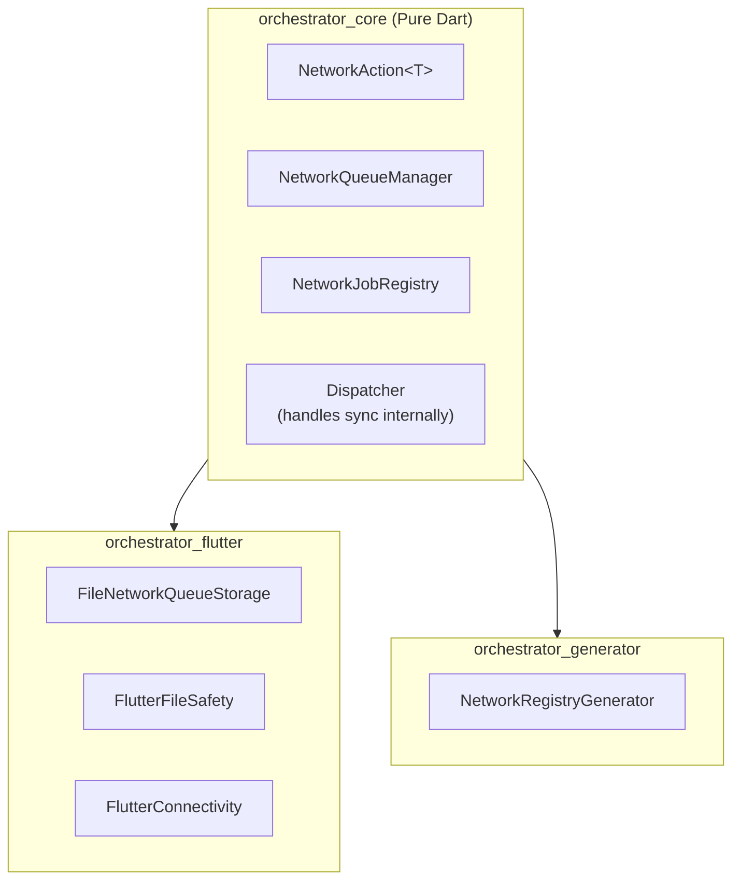
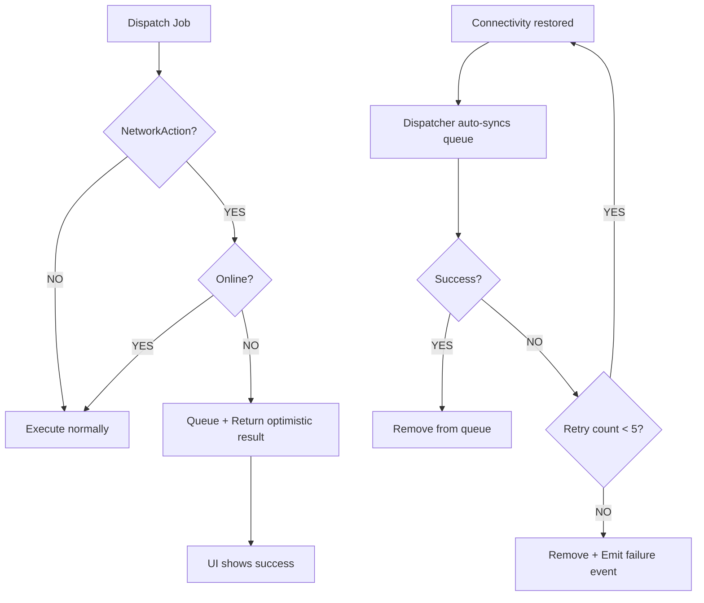
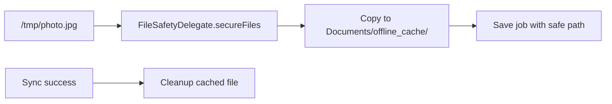

# RFC 001: Offline Support with NetworkAction

**Status**: ✅ Implemented  
**Context**: Support "Offline Write" (Store-and-Forward)

---

## 1. Problem Statement

Framework v0.1.0 covers **Offline Read** (SWR). We need **Offline Write** - queuing mutations when offline.

---

## 2. Solution Overview

**Simple principle**: Jobs implementing `NetworkAction` are automatically queued when offline and synced when connectivity restores. Dispatcher handles everything internally.

### 2.1. Package Structure



### 2.2. NetworkAction Interface

```dart
abstract class NetworkAction<T> {
  Map<String, dynamic> toJson();
  T createOptimisticResult();
  String? get deduplicationKey => null;
}
```

---

## 3. How It Works

### 3.1. Dispatcher Flow



---

## 4. Usage

### 4.1. Define a NetworkAction Job

```dart
@NetworkJob()
class SendMessageJob extends BaseJob implements NetworkAction<Message> {
  final String text;
  
  SendMessageJob(this.text);
  
  // Required: factory fromJson for deserialization
  factory SendMessageJob.fromJson(Map<String, dynamic> json) =>
      SendMessageJob(json['text']);
  
  @override
  Map<String, dynamic> toJson() => {'text': text};
  
  @override
  Message createOptimisticResult() => Message(text: text, status: 'sending');
}
```

### 4.2. Register Jobs (Code Generation)

Create a config file that lists all NetworkAction jobs:

```dart
// lib/app_network_config.dart
import 'package:orchestrator_core/orchestrator_core.dart';

@NetworkRegistry([
  SendMessageJob,
  LikePostJob,
  UploadPhotoJob,
])
void setupNetworkRegistry() {}
```

Run `build_runner`:
```bash
dart run build_runner build
```

Generated code (`app_network_config.g.dart`):
```dart
void registerNetworkJobs() {
  NetworkJobRegistry.register('SendMessageJob', SendMessageJob.fromJson);
  NetworkJobRegistry.register('LikePostJob', LikePostJob.fromJson);
  NetworkJobRegistry.register('UploadPhotoJob', UploadPhotoJob.fromJson);
}
```

### 4.3. App Setup

```dart
void main() {
  // Register job factories (generated)
  registerNetworkJobs();
  
  // Configure
  OrchestratorConfig.setConnectivityProvider(FlutterConnectivityProvider());
  OrchestratorConfig.setNetworkQueueManager(NetworkQueueManager(
    storage: FileNetworkQueueStorage(),
    fileDelegate: FlutterFileSafety(),
  ));
  
  runApp(MyApp());
}
```

### 4.4. Dispatch (Same as normal jobs)

```dart
dispatcher.dispatch(SendMessageJob('Hello'));
// If offline: queued + returns optimistic result
// If online: executed normally
```

---

## 5. Handling Sync Failures

When a job permanently fails after 5 retries, Dispatcher emits `NetworkSyncFailureEvent`. Orchestrators can listen and rollback:

```dart
class MessageOrchestrator extends BaseOrchestrator<MessageState> {
  @override
  void onPassiveEvent(BaseEvent event) {
    if (event is NetworkSyncFailureEvent && event.isPoisoned) {
      emit(state.markMessageFailed(event.correlationId));
    }
  }
}
```

---

## 6. File Safety

Files from temp directories are automatically copied to safe location before queuing:



---

## 7. Key Features

| Feature | Behavior |
|---------|----------|
| **Offline queue** | Automatic when NetworkAction + offline |
| **Optimistic UI** | `createOptimisticResult()` returned immediately |
| **Auto-sync** | Dispatcher listens to connectivity changes |
| **Retry** | Up to 5 times with 2s delay |
| **Poison pill** | After 5 failures, job removed + event emitted |
| **FIFO order** | Jobs processed in order (business logic safe) |
| **File safety** | Temp files copied to persistent storage |
| **Deduplication** | Optional `deduplicationKey` prevents duplicates |

---

## 8. Naming Convention

All classes use "Network" prefix for consistency:
- `NetworkAction<T>` - Interface
- `@NetworkJob()` - Annotation
- `@NetworkRegistry()` - Annotation
- `NetworkJobRegistry` - Factory registry
- `NetworkQueueManager` - Queue manager
- `NetworkQueueStorage` - Storage interface
- `NetworkJobStatus` - Enum (pending, processing, poisoned)
- `NetworkSyncFailureEvent` - Failure event
