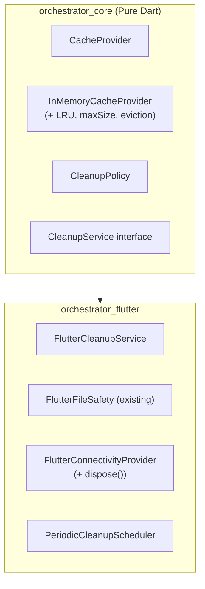

# RFC 004: Resource Cleanup & Optimization

**Status**: 📋 Draft  
**Context**: Reclaim resources and optimize memory during framework runtime.

---

## 1. Problem Statement

The current framework has fragmented cleanup components:
- `FlutterFileSafety.cleanupFiles()` - Deletes temporary files after synchronization.
- `CacheProvider.clear()` - Clears the entire cache.
- `NetworkQueueStorage.removeJob()` - Deletes completed jobs.

**Issues:**
1. No centralized cleanup mechanism.
2. `InMemoryCacheProvider` only performs "lazy eviction" (expired entries are removed only when accessed).
3. No cache size limits (could grow indefinitely).
4. No periodic cleanup for file storage.
5. `FlutterConnectivityProvider.dispose()` is not implemented (FIX WARNING #10).

---

## 2. Solution Overview

### 2.1. Package Structure



---

## 3. Proposed Changes

### 3.1. `orchestrator_core` Changes

#### 3.1.1. Enhanced `InMemoryCacheProvider`

```dart
class InMemoryCacheProvider implements CacheProvider {
  final int maxEntries;
  final Duration? defaultTtl;
  
  InMemoryCacheProvider({
    this.maxEntries = 1000,
    this.defaultTtl,
  });
  
  // LRU eviction when maxEntries exceeded
  @override
  Future<void> write(String key, value, {Duration? ttl}) async {
    if (_store.length >= maxEntries) {
      _evictOldest();
    }
    // ...existing logic
  }
  
  /// Proactively remove all expired entries.
  /// Call this periodically from cleanup service.
  Future<int> evictExpired() async {
    final expiredKeys = _store.entries
        .where((e) => e.value.isExpired)
        .map((e) => e.key)
        .toList();
    for (final key in expiredKeys) {
      _store.remove(key);
    }
    return expiredKeys.length;
  }
  
  /// Get current cache statistics.
  CacheStats getStats() => CacheStats(
    entryCount: _store.length,
    maxEntries: maxEntries,
  );
}
```

#### 3.1.2. New `CleanupPolicy` Class

```dart
/// Configuration for cleanup behavior.
class CleanupPolicy {
  /// Maximum age of files before cleanup.
  final Duration? maxFileAge;
  
  /// Maximum number of cache entries.
  final int? maxCacheEntries;
  
  /// Interval between automatic cleanup runs.
  final Duration? cleanupInterval;
  
  /// Enable/disable automatic cleanup.
  final bool autoCleanup;
  
  const CleanupPolicy({
    this.maxFileAge = const Duration(days: 7),
    this.maxCacheEntries = 1000,
    this.cleanupInterval = const Duration(hours: 1),
    this.autoCleanup = true,
  });
  
  static const CleanupPolicy defaultPolicy = CleanupPolicy();
  static const CleanupPolicy aggressive = CleanupPolicy(
    maxFileAge: Duration(days: 1),
    maxCacheEntries: 100,
    cleanupInterval: Duration(minutes: 15),
  );
  static const CleanupPolicy conservative = CleanupPolicy(
    maxFileAge: Duration(days: 30),
    maxCacheEntries: 5000,
    cleanupInterval: Duration(hours: 24),
  );
}
```

#### 3.1.3. New `CleanupService` Interface

```dart
/// Interface for cleanup services.
/// Core defines interface, Flutter provides implementation.
abstract class CleanupService {
  /// Run cleanup based on policy.
  Future<CleanupReport> runCleanup();
  
  /// Force cleanup for specific resources.
  Future<void> cleanupCache();
  Future<void> cleanupFiles();
  Future<void> cleanupNetworkQueue();
  
  /// Get current resource usage stats.
  Future<ResourceStats> getStats();
  
  /// Dispose resources and stop scheduled cleanup.
  void dispose();
}

/// Report of cleanup operation.
class CleanupReport {
  final int cacheEntriesRemoved;
  final int filesRemoved;
  final int bytesFreed;
  final Duration duration;
  
  const CleanupReport({
    required this.cacheEntriesRemoved,
    required this.filesRemoved,
    required this.bytesFreed,
    required this.duration,
  });
}
```

---

### 3.2. `orchestrator_flutter` Changes

#### 3.2.1. `FlutterCleanupService` Implementation

```dart
class FlutterCleanupService implements CleanupService {
  final CleanupPolicy policy;
  final CacheProvider cacheProvider;
  final NetworkQueueManager? networkQueueManager;
  final FlutterFileSafety? fileSafety;
  
  Timer? _periodicTimer;
  
  FlutterCleanupService({
    this.policy = const CleanupPolicy(),
    required this.cacheProvider,
    this.networkQueueManager,
    this.fileSafety,
  }) {
    if (policy.autoCleanup && policy.cleanupInterval != null) {
      _startPeriodicCleanup();
    }
  }
  
  void _startPeriodicCleanup() {
    _periodicTimer = Timer.periodic(
      policy.cleanupInterval!,
      (_) => runCleanup(),
    );
  }
  
  @override
  Future<CleanupReport> runCleanup() async {
    final stopwatch = Stopwatch()..start();
    int cacheRemoved = 0;
    int filesRemoved = 0;
    int bytesFreed = 0;
    
    // 1. Cache cleanup
    if (cacheProvider is InMemoryCacheProvider) {
      cacheRemoved = await (cacheProvider as InMemoryCacheProvider).evictExpired();
    }
    
    // 2. File cleanup
    if (fileSafety != null && policy.maxFileAge != null) {
      final result = await _cleanupOldFiles(policy.maxFileAge!);
      filesRemoved = result.count;
      bytesFreed = result.bytes;
    }
    
    // 3. Network queue cleanup (poisoned jobs)
    if (networkQueueManager != null) {
      await _cleanupPoisonedJobs();
    }
    
    stopwatch.stop();
    return CleanupReport(
      cacheEntriesRemoved: cacheRemoved,
      filesRemoved: filesRemoved,
      bytesFreed: bytesFreed,
      duration: stopwatch.elapsed,
    );
  }
  
  @override
  void dispose() {
    _periodicTimer?.cancel();
  }
}
```

#### 3.2.2. Fix `FlutterConnectivityProvider.dispose()`

```dart
class FlutterConnectivityProvider implements ConnectivityProvider {
  StreamSubscription? _subscription;
  final StreamController<bool> _controller = StreamController.broadcast();
  
  // ... existing code ...
  
  /// FIX WARNING #10: Properly dispose resources
  void dispose() {
    _subscription?.cancel();
    _controller.close();
  }
}
```

#### 3.2.3. Enhanced `FlutterFileSafety`

```dart
class FlutterFileSafety implements FileSafetyDelegate {
  // ... existing code ...
  
  /// Cleanup files older than maxAge in the safe directory.
  Future<({int count, int bytes})> cleanupOldFiles(Duration maxAge) async {
    final safeDirPath = await _getSafeDirPath();
    final safeDir = Directory(safeDirPath);
    
    if (!await safeDir.exists()) return (count: 0, bytes: 0);
    
    int count = 0;
    int bytes = 0;
    final cutoff = DateTime.now().subtract(maxAge);
    
    await for (final entity in safeDir.list()) {
      if (entity is File) {
        final stat = await entity.stat();
        if (stat.modified.isBefore(cutoff)) {
          bytes += stat.size;
          await entity.delete();
          count++;
        }
      }
    }
    
    return (count: count, bytes: bytes);
  }
  
  /// Get current storage usage.
  Future<int> getStorageUsage() async {
    final safeDirPath = await _getSafeDirPath();
    final safeDir = Directory(safeDirPath);
    
    if (!await safeDir.exists()) return 0;
    
    int totalBytes = 0;
    await for (final entity in safeDir.list()) {
      if (entity is File) {
        totalBytes += await entity.length();
      }
    }
    return totalBytes;
  }
}
```

---

## 4. Integration with OrchestratorConfig

```dart
class OrchestratorConfig {
  // ... existing code ...
  
  static CleanupService? _cleanupService;
  static CleanupPolicy _cleanupPolicy = CleanupPolicy.defaultPolicy;
  
  static void setCleanupService(CleanupService service) {
    _cleanupService = service;
  }
  
  static void setCleanupPolicy(CleanupPolicy policy) {
    _cleanupPolicy = policy;
  }
  
  static CleanupService? get cleanupService => _cleanupService;
  static CleanupPolicy get cleanupPolicy => _cleanupPolicy;
}
```

---

## 5. Usage

### 5.1. App Setup

```dart
void main() {
  // Existing setup...
  
  // Configure cleanup
  OrchestratorConfig.setCleanupPolicy(CleanupPolicy(
    maxFileAge: Duration(days: 7),
    maxCacheEntries: 500,
    cleanupInterval: Duration(hours: 2),
    autoCleanup: true,
  ));
  
  OrchestratorConfig.setCleanupService(FlutterCleanupService(
    policy: OrchestratorConfig.cleanupPolicy,
    cacheProvider: OrchestratorConfig.cacheProvider,
    networkQueueManager: OrchestratorConfig.networkQueueManager,
    fileSafety: FlutterFileSafety(),
  ));
  
  runApp(MyApp());
}
```

### 5.2. Manual Cleanup

```dart
// Force cleanup
final report = await OrchestratorConfig.cleanupService?.runCleanup();
print('Removed ${report?.cacheEntriesRemoved} cache entries');
print('Freed ${report?.bytesFreed} bytes');

// Cleanup specific resource
await OrchestratorConfig.cleanupService?.cleanupCache();
```

### 5.3. Get Stats (for DevTools)

```dart
final stats = await OrchestratorConfig.cleanupService?.getStats();
print('Cache: ${stats?.cacheEntryCount} entries');
print('Files: ${stats?.fileCount} files (${stats?.fileSizeBytes} bytes)');
```

---

## 6. DevTools Integration (Future)

DevTools extension can be extended to display:
- Cache usage chart
- File storage usage
- Cleanup history log
- Manual cleanup button

---

## 7. Implementation Checklist

### 7.1. `orchestrator_core`

- [ ] Enhance `InMemoryCacheProvider` with LRU eviction and `maxEntries`.
- [ ] Add `evictExpired()` method.
- [ ] Add `getStats()` method.
- [ ] Create `CleanupPolicy` class.
- [ ] Create `CleanupService` interface.
- [ ] Create `CleanupReport` and `ResourceStats` classes.
- [ ] Update `OrchestratorConfig` with cleanup settings.

### 7.2. `orchestrator_flutter`

- [ ] Implement `FlutterCleanupService`.
- [ ] Add `cleanupOldFiles()` to `FlutterFileSafety`.
- [ ] Add `getStorageUsage()` to `FlutterFileSafety`.
- [ ] Fix `FlutterConnectivityProvider.dispose()` (FIX WARNING #10).
- [ ] Add periodic cleanup scheduler.

### 7.3. Testing

- [ ] Unit tests for `InMemoryCacheProvider` LRU eviction.
- [ ] Unit tests for `CleanupService`.
- [ ] Integration test for periodic cleanup.
- [ ] Manual test: Verify memory doesn't grow unbounded.

### 7.4. Documentation

- [ ] Update API docs.
- [ ] Add usage examples to the book.

---

## 8. Key Features Summary

| Feature | Package | Description |
|---------|---------|-------------|
| **LRU Cache** | core | Auto-evict oldest entries when maxEntries is exceeded. |
| **TTL Eviction** | core | Proactive removal of expired cache entries. |
| **Periodic Cleanup** | flutter | Timer-based automatic cleanup. |
| **File Cleanup** | flutter | Remove files older than maxAge. |
| **Stats Reporting** | both | Get current resource usage stats. |
| **Configurable Policy** | core | Presets (default, aggressive, conservative). |
| **Manual Cleanup** | both | Force cleanup on demand. |

---

## 9. Breaking Changes

**No breaking changes.** All modifications are backward compatible:
- `InMemoryCacheProvider()` continues to work with default parameters.
- `CleanupService` is optional.
- Existing dispose patterns are unaffected.

---

## 10. Design Decisions (Resolved)

| Question | Decision | Rationale |
|----------|----------|-----------|
| **Persistent Cache Stats** | ❌ No | Overhead not justified. In-memory only, reset on restart. |
| **DevTools Panel** | ✅ Phase 2 | Useful for debugging, but core logic first. |
| **iOS Background Fetch** | ❌ No | Too complex. Use lazy cleanup on app start instead. |

**Implementation Scope:**
- **Phase 1**: Core cleanup logic, Timer scheduler, In-memory stats.
- **Phase 2**: DevTools UI (separate PR).
