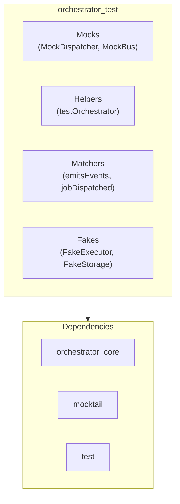

# RFC 005: Testing Support Package (orchestrator_test)

**Status**: ✅ Implemented  
**Context**: Provide testing utilities for framework consumers

---

## 1. Problem Statement

Framework v0.3.0 has internal tests but **does not provide testing utilities for consumers**. This makes it difficult for developers to test code that uses the Orchestrator framework.

### Current Issues

| Issue | Description |
|-------|-------------|
| **No Mocks** | Users must write their own mocks for `Dispatcher`, `SignalBus`, `BaseExecutor`. |
| **Missing Testing Helpers** | No helper functions to test Orchestrator flows (like `bloc_test`). |
| **High Boilerplate** | Test setup is complex and involves repetitive code. |
| **No Event Capture** | Hard to verify that events are emitted in the correct sequence. |

### Pain Point Example

```dart
// Current: User must write this boilerplate for every test file
class MockDispatcher implements Dispatcher {
  final List<BaseJob> dispatchedJobs = [];
  
  @override
  String dispatch(BaseJob job) {
    dispatchedJobs.add(job);
    return 'mock-id';
  }
  
  // ... must implement many other methods
}
```

---

## 2. Solution Overview

Create a new package `orchestrator_test` that provides:

1. **Mock Objects** - Pre-built mocks for core components.
2. **Test Helpers** - Declarative testing functions.
3. **Event Matchers** - Custom matchers for event verification.
4. **Fake Implementations** - In-memory implementations for isolated testing.

### 2.1. Package Structure



### 2.2. Design Goals

- **Zero Configuration**: Import and use immediately without complex setup.
- **Familiar API**: Patterns similar to `bloc_test` that Flutter developers are already familiar with.
- **Type Safe**: Full type safety and IDE autocomplete support.
- **Flexible**: Mocks can be extended or customized.

---

## 3. Proposed Changes

### Component: orchestrator_test (New Package)

---

#### [NEW] packages/orchestrator_test/pubspec.yaml

```yaml
name: orchestrator_test
description: >-
  Testing utilities for Orchestrator framework. Provides mocks, helpers, 
  and custom matchers for easy unit testing of Orchestrator-based code.
version: 0.1.0
homepage: https://github.com/lploc94/flutter_orchestrator

environment:
  sdk: ^3.0.0

dependencies:
  orchestrator_core: ^0.3.0
  mocktail: ^1.0.0
  test: ^1.24.0
  meta: ^1.9.0
```

---

#### [NEW] lib/orchestrator_test.dart

Main export file:

```dart
/// Orchestrator Testing Library
///
/// Provides testing utilities for the Orchestrator framework:
/// - [MockDispatcher]: Mock implementation of Dispatcher
/// - [MockSignalBus]: Mock implementation of SignalBus  
/// - [testOrchestrator]: BDD-style testing function
/// - Custom matchers for event verification
library;

// Mocks
export 'src/mocks/mock_dispatcher.dart';
export 'src/mocks/mock_signal_bus.dart';
export 'src/mocks/mock_executor.dart';

// Fakes
export 'src/fakes/fake_cache_provider.dart';
export 'src/fakes/fake_connectivity_provider.dart';
export 'src/fakes/fake_network_queue_storage.dart';

// Helpers
export 'src/helpers/test_orchestrator.dart';
export 'src/helpers/event_capture.dart';

// Matchers
export 'src/matchers/event_matchers.dart';
export 'src/matchers/job_matchers.dart';
```

---

#### [NEW] lib/src/mocks/mock_dispatcher.dart

```dart
import 'package:mocktail/mocktail.dart';
import 'package:orchestrator_core/orchestrator_core.dart';

/// A mock implementation of [Dispatcher] for testing.
///
/// Usage:
/// ```dart
/// final mockDispatcher = MockDispatcher();
/// when(() => mockDispatcher.dispatch(any())).thenReturn('job-id');
/// ```
class MockDispatcher extends Mock implements Dispatcher {}

/// A fake [Dispatcher] that captures all dispatched jobs.
///
/// Useful when you want to verify what jobs were dispatched:
/// ```dart
/// final dispatcher = FakeDispatcher();
/// myOrchestrator.doSomething();
/// expect(dispatcher.dispatchedJobs, hasLength(1));
/// expect(dispatcher.dispatchedJobs.first, isA<MyJob>());
/// ```
class FakeDispatcher implements Dispatcher {
  final List<BaseJob> dispatchedJobs = [];
  final SignalBus _bus = SignalBus();
  int _idCounter = 0;

  @override
  String dispatch(BaseJob job) {
    dispatchedJobs.add(job);
    final id = 'fake-job-${_idCounter++}';
    
    // Simulate immediate success by default
    Future.microtask(() {
      _bus.emit(JobSuccessEvent(id, null));
    });
    
    return id;
  }

  @override
  void register<T extends BaseJob>(BaseExecutor<T> executor) {}

  @override
  void clear() {
    dispatchedJobs.clear();
  }
  
  /// Simulate a job success event
  void simulateSuccess(String jobId, dynamic data) {
    _bus.emit(JobSuccessEvent(jobId, data));
  }
  
  /// Simulate a job failure event
  void simulateFailure(String jobId, Object error) {
    _bus.emit(JobFailureEvent(jobId, error, StackTrace.current, false));
  }
}
```

---

#### [NEW] lib/src/mocks/mock_signal_bus.dart

```dart
import 'dart:async';
import 'package:mocktail/mocktail.dart';
import 'package:orchestrator_core/orchestrator_core.dart';

/// A mock implementation of [SignalBus] for testing.
class MockSignalBus extends Mock implements SignalBus {}

/// A fake [SignalBus] that captures all emitted events.
///
/// ```dart
/// final bus = FakeSignalBus();
/// bus.emit(MyEvent('data'));
/// expect(bus.emittedEvents, hasLength(1));
/// ```
class FakeSignalBus implements SignalBus {
  final _controller = StreamController<BaseEvent>.broadcast();
  final List<BaseEvent> emittedEvents = [];

  @override
  Stream<BaseEvent> get stream => _controller.stream;

  @override
  void emit(BaseEvent event) {
    emittedEvents.add(event);
    _controller.add(event);
  }

  @override
  void dispose() {
    _controller.close();
  }
  
  /// Clear captured events
  void clear() {
    emittedEvents.clear();
  }
  
  /// Get events of a specific type
  List<T> eventsOfType<T extends BaseEvent>() {
    return emittedEvents.whereType<T>().toList();
  }
}
```

---

#### [NEW] lib/src/helpers/test_orchestrator.dart

BDD-style testing helper (inspired by `bloc_test`):

```dart
import 'dart:async';
import 'package:meta/meta.dart';
import 'package:test/test.dart';
import 'package:orchestrator_core/orchestrator_core.dart';

/// A BDD-style test helper for testing [BaseOrchestrator] implementations.
///
/// Similar to `blocTest` from the `bloc_test` package.
///
/// Example:
/// ```dart
/// testOrchestrator<CounterOrchestrator, int>(
///   'increments counter when IncrementJob is dispatched',
///   build: () => CounterOrchestrator(),
///   act: (orchestrator) => orchestrator.increment(),
///   expect: () => [1, 2],
/// );
/// ```
@isTest
void testOrchestrator<O extends BaseOrchestrator<S>, S>(
  String description, {
  required O Function() build,
  S Function()? seed,
  void Function(O orchestrator)? act,
  Duration wait = Duration.zero,
  List<S> Function()? expect,
  void Function(O orchestrator)? verify,
  Object? Function()? errors,
  String? skip,
}) {
  test(
    description,
    () async {
      final orchestrator = build();
      
      if (seed != null) {
        orchestrator.emit(seed());
      }

      final states = <S>[];
      final subscription = orchestrator.stream.listen(states.add);

      try {
        if (act != null) {
          act(orchestrator);
        }

        if (wait > Duration.zero) {
          await Future.delayed(wait);
        } else {
          // Allow microtasks to complete
          await Future.delayed(Duration(milliseconds: 50));
        }

        if (expect != null) {
          final expectedStates = expect();
          final matcher = equals(expectedStates);
          
          if (!matcher.matches(states, {})) {
            final desc = StringDescription()
              ..add('Expected: ')
              ..addDescriptionOf(expectedStates)
              ..add('\n  Actual: ')
              ..addDescriptionOf(states);
            fail(desc.toString());
          }
        }

        if (verify != null) {
          verify(orchestrator);
        }
      } finally {
        await subscription.cancel();
        orchestrator.dispose();
      }
    },
    skip: skip,
  );
}

/// Test helper for testing orchestrator event handling.
///
/// ```dart
/// testOrchestratorEvents<MyOrchestrator>(
///   'handles JobSuccessEvent correctly',
///   build: () => MyOrchestrator(),
///   events: () => [
///     JobSuccessEvent('job-1', {'data': 'value'}),
///   ],
///   expect: () => [MyState.loaded({'data': 'value'})],
/// );
/// ```
@isTest
void testOrchestratorEvents<O extends BaseOrchestrator<S>, S>(
  String description, {
  required O Function() build,
  required List<BaseEvent> Function() events,
  List<S> Function()? expect,
  void Function(O orchestrator)? verify,
  String? skip,
}) {
  test(
    description,
    () async {
      final orchestrator = build();
      final bus = SignalBus();
      final states = <S>[];
      final subscription = orchestrator.stream.listen(states.add);

      try {
        for (final event in events()) {
          bus.emit(event);
        }

        await Future.delayed(Duration(milliseconds: 50));

        if (expect != null) {
          final expectedStates = expect();
          _expectStates(states, expectedStates);
        }

        if (verify != null) {
          verify(orchestrator);
        }
      } finally {
        await subscription.cancel();
        orchestrator.dispose();
      }
    },
    skip: skip,
  );
}

void _expectStates<S>(List<S> actual, List<S> expected) {
  final matcher = equals(expected);
  if (!matcher.matches(actual, {})) {
    final desc = StringDescription()
      ..add('Expected: ')
      ..addDescriptionOf(expected)
      ..add('\n  Actual: ')
      ..addDescriptionOf(actual);
    fail(desc.toString());
  }
}
```

---

#### [NEW] lib/src/helpers/event_capture.dart

```dart
import 'dart:async';
import 'package:orchestrator_core/orchestrator_core.dart';

/// Captures events from a [SignalBus] for testing verification.
///
/// ```dart
/// final capture = EventCapture(signalBus);
/// 
/// // Perform actions that emit events
/// dispatcher.dispatch(MyJob());
/// 
/// await capture.waitFor<JobSuccessEvent>();
/// expect(capture.events, hasLength(2)); // JobStartedEvent, JobSuccessEvent
/// ```
class EventCapture {
  final SignalBus _bus;
  final List<BaseEvent> events = [];
  late final StreamSubscription<BaseEvent> _subscription;
  
  EventCapture([SignalBus? bus]) : _bus = bus ?? SignalBus() {
    _subscription = _bus.stream.listen(events.add);
  }
  
  /// Wait for an event of type [T] to be captured.
  ///
  /// Throws [TimeoutException] if event not received within [timeout].
  Future<T> waitFor<T extends BaseEvent>({
    Duration timeout = const Duration(seconds: 5),
  }) async {
    final completer = Completer<T>();
    
    // Check if already captured
    final existing = events.whereType<T>().firstOrNull;
    if (existing != null) return existing;
    
    final subscription = _bus.stream.listen((event) {
      if (event is T && !completer.isCompleted) {
        completer.complete(event);
      }
    });
    
    try {
      return await completer.future.timeout(timeout);
    } finally {
      await subscription.cancel();
    }
  }
  
  /// Get all captured events of type [T].
  List<T> ofType<T extends BaseEvent>() {
    return events.whereType<T>().toList();
  }
  
  /// Clear all captured events.
  void clear() => events.clear();
  
  /// Dispose the capture.
  Future<void> dispose() async {
    await _subscription.cancel();
  }
}
```

---

#### [NEW] lib/src/matchers/event_matchers.dart

Custom matchers for event verification:

```dart
import 'package:test/test.dart';
import 'package:orchestrator_core/orchestrator_core.dart';

/// Matches a [JobSuccessEvent] with the given [data].
Matcher isJobSuccess({dynamic data, String? correlationId}) {
  return predicate<BaseEvent>(
    (event) {
      if (event is! JobSuccessEvent) return false;
      if (correlationId != null && event.correlationId != correlationId) {
        return false;
      }
      if (data != null && event.data != data) return false;
      return true;
    },
    'is JobSuccessEvent${data != null ? ' with data $data' : ''}',
  );
}

/// Matches a [JobFailureEvent].
Matcher isJobFailure({String? correlationId, Type? errorType}) {
  return predicate<BaseEvent>(
    (event) {
      if (event is! JobFailureEvent) return false;
      if (correlationId != null && event.correlationId != correlationId) {
        return false;
      }
      if (errorType != null && event.error.runtimeType != errorType) {
        return false;
      }
      return true;
    },
    'is JobFailureEvent${errorType != null ? ' with error type $errorType' : ''}',
  );
}

/// Matches a [JobProgressEvent] with progress >= [minProgress].
Matcher isJobProgress({double? minProgress, String? message}) {
  return predicate<BaseEvent>(
    (event) {
      if (event is! JobProgressEvent) return false;
      if (minProgress != null && event.progress < minProgress) return false;
      if (message != null && event.message != message) return false;
      return true;
    },
    'is JobProgressEvent',
  );
}

/// Matches events emitted in sequence.
///
/// ```dart
/// expect(
///   capturedEvents,
///   emitsInOrder([
///     isJobSuccess(data: 'step1'),
///     isJobSuccess(data: 'step2'),
///   ]),
/// );
/// ```
Matcher emitsEventsInOrder(List<Matcher> matchers) {
  return predicate<List<BaseEvent>>(
    (events) {
      if (events.length < matchers.length) return false;
      for (var i = 0; i < matchers.length; i++) {
        if (!matchers[i].matches(events[i], {})) return false;
      }
      return true;
    },
    'emits events matching ${matchers.length} matchers in order',
  );
}
```

---

#### [NEW] lib/src/fakes/fake_cache_provider.dart

```dart
import 'package:orchestrator_core/orchestrator_core.dart';

/// A fake [CacheProvider] for testing.
///
/// Stores cache entries in memory without expiration logic.
class FakeCacheProvider implements CacheProvider {
  final Map<String, dynamic> _cache = {};
  
  @override
  T? get<T>(String key) => _cache[key] as T?;
  
  @override
  void set<T>(String key, T value, {Duration? ttl}) {
    _cache[key] = value;
  }
  
  @override
  void remove(String key) {
    _cache.remove(key);
  }
  
  @override
  void clear() {
    _cache.clear();
  }
  
  @override
  bool containsKey(String key) => _cache.containsKey(key);
  
  /// Get all cached entries (for test verification)
  Map<String, dynamic> get entries => Map.unmodifiable(_cache);
}
```

---

#### [NEW] lib/src/fakes/fake_connectivity_provider.dart

```dart
import 'dart:async';
import 'package:orchestrator_core/orchestrator_core.dart';

/// A fake [ConnectivityProvider] for testing offline scenarios.
///
/// ```dart
/// final connectivity = FakeConnectivityProvider(isOnline: false);
/// dispatcher.setConnectivityProvider(connectivity);
/// 
/// // Test offline behavior
/// dispatcher.dispatch(NetworkJob());
/// 
/// // Simulate coming back online
/// connectivity.setOnline(true);
/// ```
class FakeConnectivityProvider implements ConnectivityProvider {
  final _controller = StreamController<bool>.broadcast();
  bool _isOnline;
  
  FakeConnectivityProvider({bool isOnline = true}) : _isOnline = isOnline;
  
  @override
  bool get isOnline => _isOnline;
  
  @override
  Stream<bool> get onConnectivityChanged => _controller.stream;
  
  /// Set the connectivity state and emit change event.
  void setOnline(bool value) {
    if (_isOnline != value) {
      _isOnline = value;
      _controller.add(value);
    }
  }
  
  /// Toggle connectivity state.
  void toggle() => setOnline(!_isOnline);
  
  @override
  void dispose() {
    _controller.close();
  }
}
```

---

## 4. Usage Examples

### 4.1. Basic Unit Test

```dart
import 'package:test/test.dart';
import 'package:orchestrator_test/orchestrator_test.dart';
import 'package:my_app/orchestrators/counter_orchestrator.dart';

void main() {
  group('CounterOrchestrator', () {
    late FakeDispatcher dispatcher;
    late CounterOrchestrator orchestrator;
    
    setUp(() {
      dispatcher = FakeDispatcher();
      orchestrator = CounterOrchestrator();
    });
    
    tearDown(() {
      orchestrator.dispose();
    });
    
    testOrchestrator<CounterOrchestrator, int>(
      'emits [1] when increment is called',
      build: () => CounterOrchestrator(),
      act: (orc) => orc.increment(),
      expect: () => [1],
    );
    
    test('dispatches IncrementJob when increment called', () {
      orchestrator.increment();
      
      expect(dispatcher.dispatchedJobs, hasLength(1));
      expect(dispatcher.dispatchedJobs.first, isA<IncrementJob>());
    });
  });
}
```

### 4.2. Testing Offline Behavior

```dart
import 'package:test/test.dart';
import 'package:orchestrator_test/orchestrator_test.dart';

void main() {
  test('queues job when offline', () async {
    final connectivity = FakeConnectivityProvider(isOnline: false);
    final dispatcher = Dispatcher();
    dispatcher.setConnectivityProvider(connectivity);
    
    dispatcher.dispatch(SendMessageJob('Hello'));
    
    // Verify job was queued, not executed
    expect(dispatcher.queuedJobs, hasLength(1));
    
    // Simulate coming online
    connectivity.setOnline(true);
    await Future.delayed(Duration(milliseconds: 100));
    
    // Verify job was processed
    expect(dispatcher.queuedJobs, isEmpty);
  });
}
```

### 4.3. Event Capture

```dart
import 'package:test/test.dart';
import 'package:orchestrator_test/orchestrator_test.dart';

void main() {
  test('emits correct event sequence', () async {
    final capture = EventCapture();
    final orchestrator = MyOrchestrator();
    
    orchestrator.performAction();
    
    await capture.waitFor<JobSuccessEvent>();
    
    expect(capture.events, emitsEventsInOrder([
      isA<JobStartedEvent>(),
      isJobSuccess(data: 'result'),
    ]));
    
    await capture.dispose();
    orchestrator.dispose();
  });
}
```

---

## 5. Migration Path

Existing users do not need to make breaking changes. The new package is **additive**:

1. Add `orchestrator_test` to `dev_dependencies`
2. Import and use in test files
3. Gradually replace manual mocks with provided utilities

---

## 6. Verification Plan

### 6.1. Automated Tests

The package will have its own test suite:

```bash
cd packages/orchestrator_test
dart test
```

Test cases:
- MockDispatcher works correctly with mocktail
- FakeDispatcher captures jobs and simulates events
- FakeSignalBus captures and replays events
- testOrchestrator helper runs test lifecycle correctly
- Event matchers work with various event types
- FakeConnectivityProvider simulates online/offline

### 6.2. Integration Verification

Update `examples/simple_counter` with tests using `orchestrator_test` to verify real-world usage.

### 6.3. Documentation

- README with getting started guide
- API documentation (dartdoc)
- Examples included in the package

---

## 7. API Summary

| Component | Type | Description |
|-----------|------|-------------|
| `MockDispatcher` | Mock | Mocktail mock for Dispatcher |
| `FakeDispatcher` | Fake | Captures jobs, simulates events |
| `MockSignalBus` | Mock | Mocktail mock for SignalBus |
| `FakeSignalBus` | Fake | Captures events, provides stream |
| `testOrchestrator` | Helper | BDD-style orchestrator testing |
| `testOrchestratorEvents` | Helper | Test event handling |
| `EventCapture` | Helper | Capture and wait for events |
| `FakeCacheProvider` | Fake | In-memory cache for testing |
| `FakeConnectivityProvider` | Fake | Simulate online/offline |
| `isJobSuccess` | Matcher | Match JobSuccessEvent |
| `isJobFailure` | Matcher | Match JobFailureEvent |
| `isJobProgress` | Matcher | Match JobProgressEvent |
| `emitsEventsInOrder` | Matcher | Match event sequence |

---

## 8. Future Considerations

- **Golden Testing**: Add support for snapshot testing of state sequences
- **Coverage Integration**: Helper to verify all event handlers covered
- **Performance Testing**: Utilities to measure dispatcher throughput
