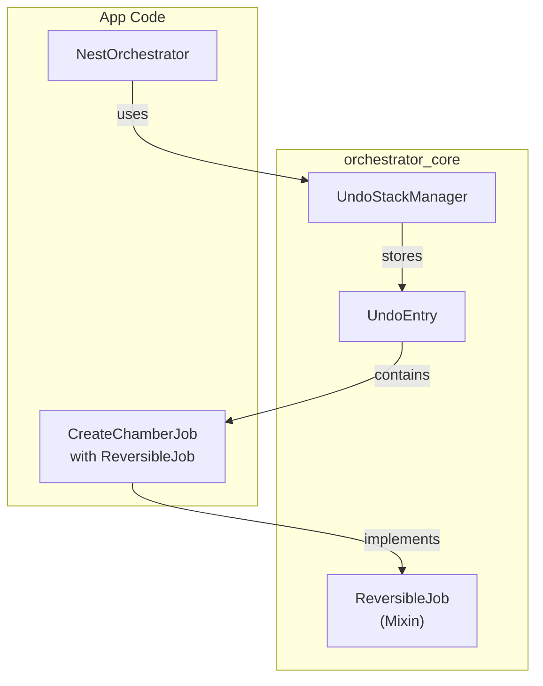
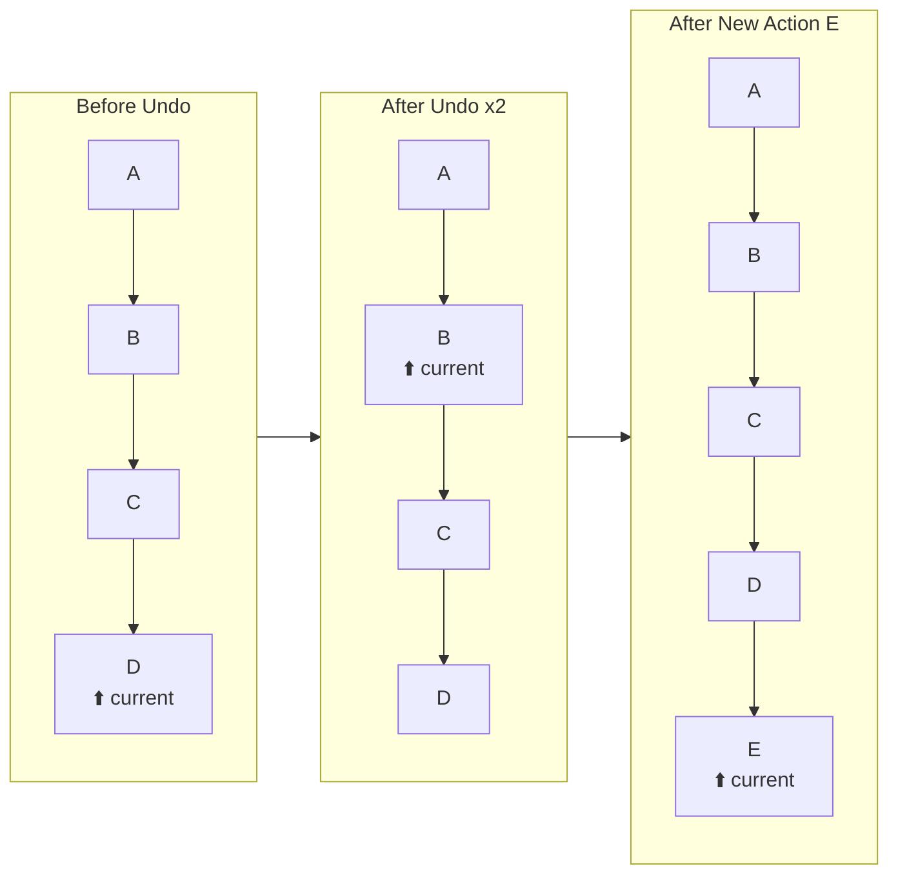
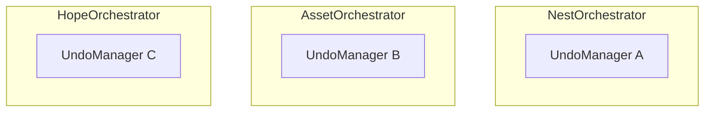
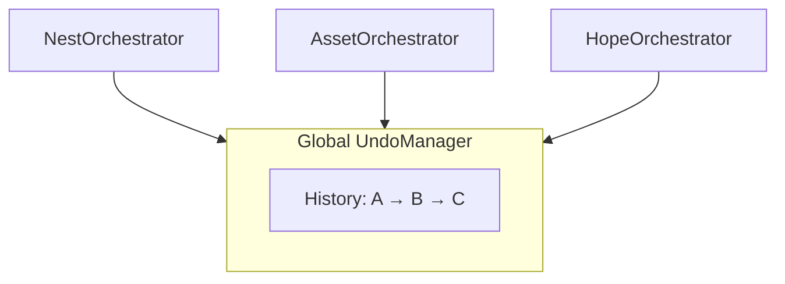
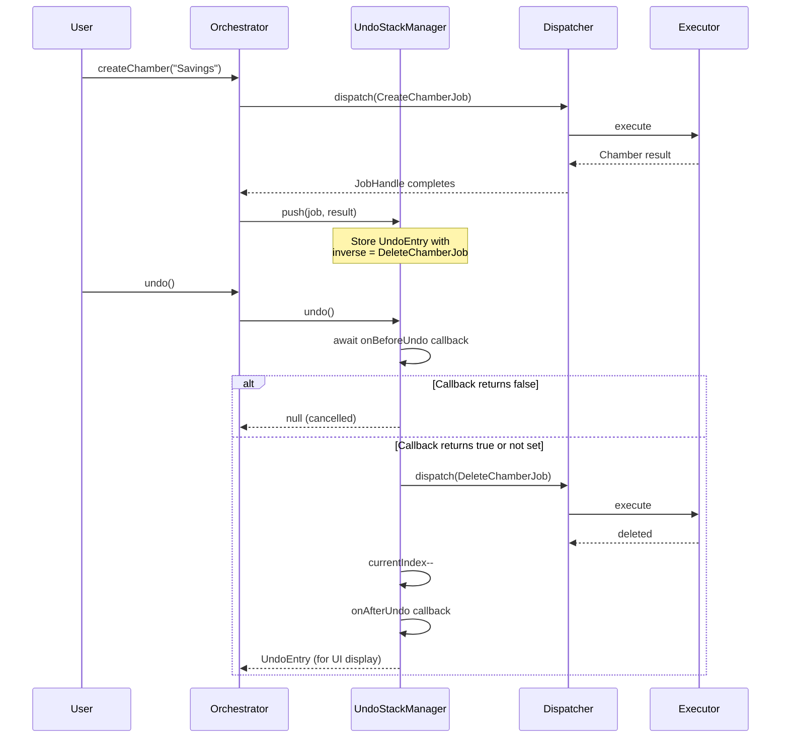
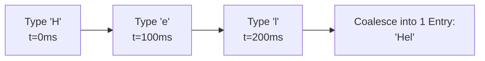

# RFC 007: Undo/Redo Stack with Inverse Jobs

**Status**: ✅ Implemented
**Context**: Universal Undo/Redo support via Command Pattern

---

## 1. Problem Statement

The Orchestrator Framework currently lacks a built-in mechanism for Undo/Redo operations. Users frequently require the ability to:
- Revert a recently performed action (Ctrl+Z).
- Re-apply an action that was previously undone (Ctrl+Y/Ctrl+Shift+Z).
- Revert to a specific point in time or a historical state (Time-Travel).

---

## 2. Solution Overview

We adopt the **Inverse Jobs Pattern** (Command Pattern) instead of a State Snapshot approach:
- Each Job is responsible for defining its own inverse operation.
- **Undo**: Dispatch the inverse job generated from the original result.
- **Redo**: Dispatch the original job again.

### 2.1. Architectural Overview



### 2.2. Advantages vs Snapshot (Memento)

| Criteria | Snapshot (Memento) | Inverse Jobs (Command) |
|----------|-------------------|------------------------|
| Memory Usage | High (Clones state) | Low (Stores job parameters) |
| Data Consistency | UI only (may drift) | Real DB sync (re-executes logic) |
| Reusability | Low | Reuses existing Job executors |
| Complexity | Low | Medium |

---

## 3. Core Components

### 3.1. ReversibleJob (Mixin)

```dart
mixin ReversibleJob on EventJob {
  /// Creates an inverse Job to undo the action.
  /// [result] is the data returned by the original job execution.
  EventJob createInverse(dynamic result);
  
  /// A user-friendly description for the UI (Optional).
  /// e.g. "Create Chamber 'Savings'"
  String? get undoDescription => null;
}
```

### 3.2. UndoEntry (Data Structure)

```dart
class UndoEntry {
  final EventJob originalJob;   // Used for Redo
  final EventJob inverseJob;    // Used for Undo
  final dynamic originalResult; // Result from original execution
  final DateTime timestamp;
  final String? description;    // Derived from undoDescription
  final String? sourceId;       // Originating Orchestrator ID (for Global mode)
}
```

### 3.3. UndoStackManager (Core Logic)

```dart
class UndoStackManager {
  final Dispatcher dispatcher;
  final int maxHistorySize;
  final Duration coalesceDuration;

  // Callbacks (onBeforeUndo/Redo can block by returning false)
  Future<bool> Function(UndoEntry)? onBeforeUndo;
  void Function(UndoEntry)? onAfterUndo;
  Future<bool> Function(UndoEntry)? onBeforeRedo;
  void Function(UndoEntry)? onAfterRedo;
  void Function(UndoEntry, Object, StackTrace?)? onError;

  // State
  int get undoCount;
  int get redoCount;
  bool get canUndo;
  bool get canRedo;
  List<UndoEntry> get history;
  int get currentIndex;
  int get historyLength;

  // Actions - return UndoEntry? for UI display
  void push(EventJob job, dynamic result, {String? sourceId});
  Future<UndoEntry?> undo();   // Returns null if cancelled or nothing to undo
  Future<UndoEntry?> redo();   // Returns null if cancelled or nothing to redo
  Future<UndoToResult> undoTo(int targetIndex, {UndoStrategy strategy});
  Future<UndoToResult> undoToTimestamp(DateTime target, {UndoStrategy strategy});
  List<UndoHistoryEntry> getHistoryView(); // Lightweight view for UI
  void clear();
  void dispose();

  // Global Singleton Pattern
  static void initGlobal(Dispatcher dispatcher, {int maxHistorySize, Duration coalesceDuration});
  static UndoStackManager get instance;
  static bool get hasGlobalInstance;
  static void resetGlobal();
}
```

### 3.4. UndoHistoryEntry (Lightweight UI View)

```dart
/// Lightweight representation for UI rendering (history panels, timelines)
class UndoHistoryEntry {
  final int index;
  final String? description;
  final DateTime timestamp;
  final String jobTypeName;
  final bool isUndone;        // true if this entry is after currentIndex
  final String? sourceId;
}
```

---

## 4. History Model: Linear History (Redo Preservation)

Instead of clearing the Redo stack when a new action is performed, we maintain a linear history with an index pointer. This prevents the "Accidental Loss" of redo history common in simple stack implementations.



**Benefits**: Users never lose history entries even if they perform a new action after undoing.

---

## 5. Scoping Patterns

### 5.1. Per-Orchestrator (Default)



**Use Case**: Independent features where cross-module undo is not required.

### 5.2. Global (Shared History)



**Use Case**: Complex applications where actions affect multiple modules simultaneously and a unified Ctrl+Z is expected.

### 5.3. Comparison

| Criteria | Per-Orchestrator | Global |
|----------|------------------|--------|
| Complexity | ⭐ Low | ⭐⭐⭐ Medium |
| Undo Scope | Current feature only | Application-wide |
| Conflicts | None | Possible in parallel execution |
| UX | Context-specific | Modern (Photoshop/Figma style) |

---

## 6. Undo Flow



---

## 7. Advanced Features

### 7.1. Time-Travel Undo

Users can select a specific state from a list instead of clicking undo multiple times.

```dart
// Undo to a specific index in history
final result = await undoManager.undoTo(5);

// Undo to a specific point in time
final result = await undoManager.undoToTimestamp(
  DateTime.now().subtract(Duration(minutes: 10))
);
```

### 7.2. Action Coalescing

Prevents "Keystroke Bloat" where every single character typed creates an individual undo entry.

```dart
// Actions of the same type within 500ms are merged into one entry
UndoStackManager(
  dispatcher,
  enableCoalescing: true,
  coalesceDuration: Duration(milliseconds: 500),
);
```



### 7.3. Side Effects Handling

```dart
undoManager.onBeforeUndo = (entry) async {
  if (entry.originalJob is SendEmailJob) {
    return await showConfirmDialog(
      'Sent emails cannot be recalled. Continue Undo?'
    );
  }
  return true; // Proceed with undo
};
```

### 7.4. Error Strategies

| Strategy | Description | Recommended Use Case |
|----------|-------------|----------------------|
| `stopOnError` | Halts operation immediately on first failure | Default, safest |
| `skipAndContinue` | Skips failed step and proceeds with next | Non-critical data |
| `rollbackAll` | On failure, redos successful undos to restore state | High atomicity requirement |

---

## 8. Usage Example

### 8.1. Define Reversible Job

```dart
class CreateChamberJob extends EventJob<Chamber, ChamberCreatedEvent>
    with ReversibleJob {
  
  final String name;
  CreateChamberJob({required this.name});

  @override
  ChamberCreatedEvent createEventTyped(Chamber result) =>
      ChamberCreatedEvent(id, result);

  @override
  EventJob createInverse(dynamic result) {
    final chamber = result as Chamber;
    return DeleteChamberJob(chamberId: chamber.id);
  }
  
  @override
  String? get undoDescription => 'Create chamber "$name"';
}
```

### 8.2. Integration in Orchestrator

```dart
class NestNotifier extends OrchestratorNotifier<NestState> {
  late final UndoStackManager undoManager;

  @override
  void onInit() {
    undoManager = UndoStackManager(dispatcher);

    // Optional: Add confirmation for sensitive operations
    undoManager.onBeforeUndo = (entry) async {
      if (entry.originalJob is SensitiveJob) {
        return await showConfirmDialog(
          'This action cannot be undone. Continue?'
        );
      }
      return true;
    };
  }

  Future<void> createChamber(String name) async {
    final job = CreateChamberJob(name: name);
    final result = await dispatch(job).future;

    // Push the successful result into history
    undoManager.push(job, result.data);
  }

  Future<void> undo() async {
    final entry = await undoManager.undo();
    if (entry != null) {
      showSnackBar('Undone: ${entry.description}');
    }
  }

  Future<void> redo() async {
    final entry = await undoManager.redo();
    if (entry != null) {
      showSnackBar('Redone: ${entry.description}');
    }
  }
}
```

---

## 9. Implementation Checklist

- [x] `ReversibleJob` mixin definition
- [x] `UndoEntry` and `UndoHistoryEntry` models
- [x] `UndoStackManager` implementation
  - [x] Linear history buffer with pointer management
  - [x] `push`, `undo`, `redo` foundational logic
  - [x] Time-travel logic (`undoTo`, `undoToTimestamp`)
  - [x] Coalescing logic for high-frequency actions
  - [x] Callback hooks (`onBeforeUndo`, `onAfterUndo`, `onBeforeRedo`, `onAfterRedo`, `onError`)
  - [x] Blocking callbacks (return `Future<bool>` to cancel operations)
  - [x] Global singleton support and `sourceId` tracking
  - [x] `dispose()` method for lifecycle management
  - [x] `getHistoryView()` for lightweight UI rendering
- [x] `UndoStrategy` enum and error handling logic
- [x] Comprehensive unit tests (45 tests covering all edge cases)
- [ ] User documentation and migration guide

---

## 10. Implementation Notes

### Return Types
`undo()` and `redo()` return `Future<UndoEntry?>` instead of `Future<bool>`:
- Returns `UndoEntry` on success (allows UI to display "Undone: Create chamber 'Savings'")
- Returns `null` if nothing to undo/redo OR if `onBeforeUndo`/`onBeforeRedo` callback returned `false`

### Callback Types
```dart
typedef UndoConfirmCallback = Future<bool> Function(UndoEntry entry);
typedef UndoNotifyCallback = void Function(UndoEntry entry);
typedef UndoErrorCallback = void Function(UndoEntry entry, Object error, StackTrace? stack);
```

### Files Created
| File | Description |
|------|-------------|
| `lib/src/mixins/reversible_job.dart` | ReversibleJob mixin |
| `lib/src/models/undo_entry.dart` | UndoEntry, UndoToResult, UndoHistoryEntry |
| `lib/src/undo/undo_stack_manager.dart` | Core manager implementation |
| `test/undo_stack_test.dart` | 45 comprehensive unit tests |

---

## 11. Future Enhancements

- **Undo Groups**: Batching multiple unrelated actions into a single logical undo step.
- **Persistence**: Serializing history to disk to persist undo state between app restarts.
- **Delta/Diffing**: For large object updates, storing only the changed fields to save memory.
- **Visual History Timeline**: A built-in Flutter widget for displaying the undo history.
