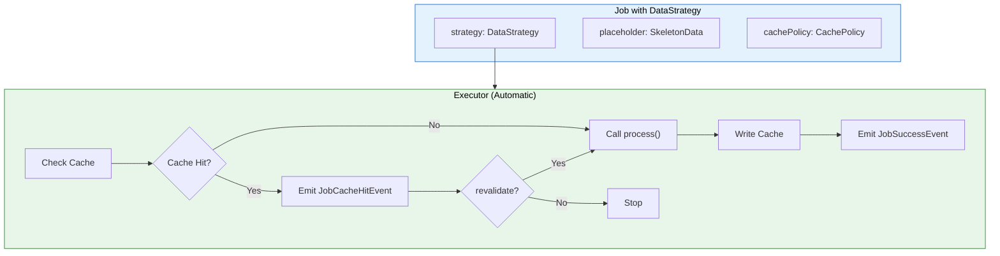
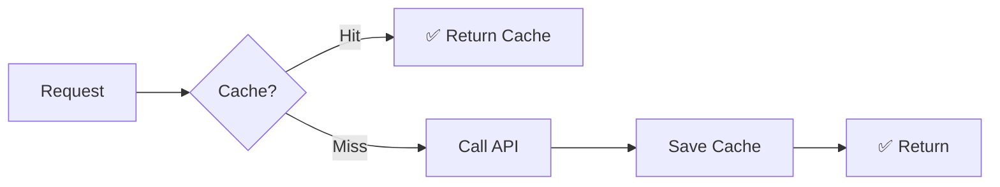
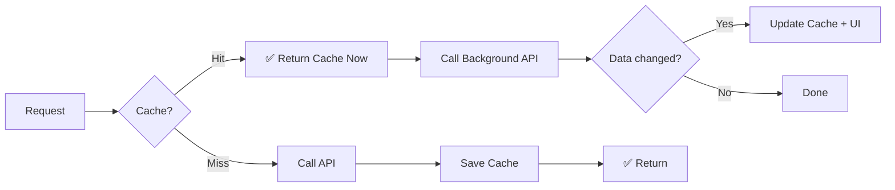
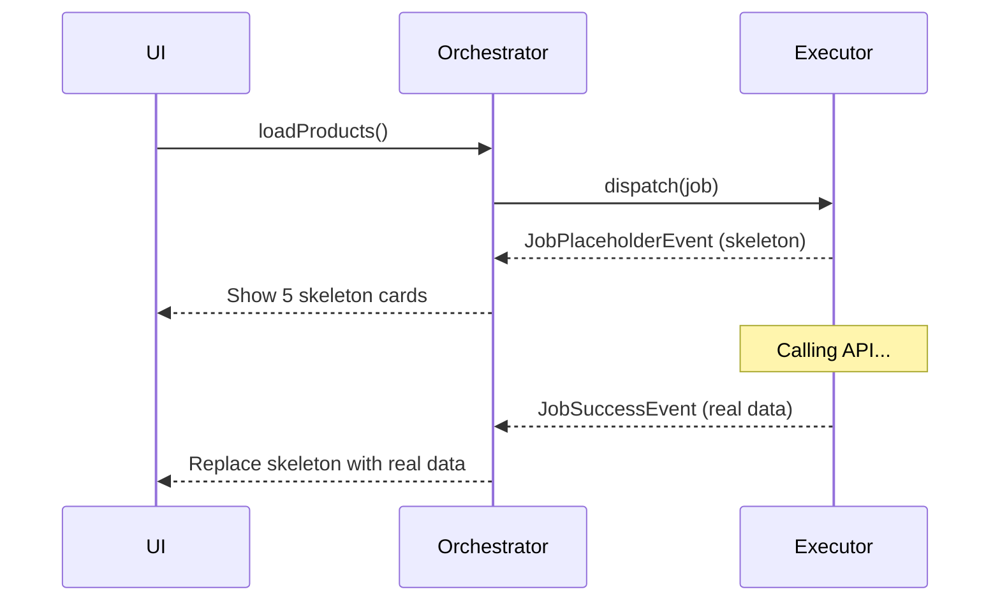
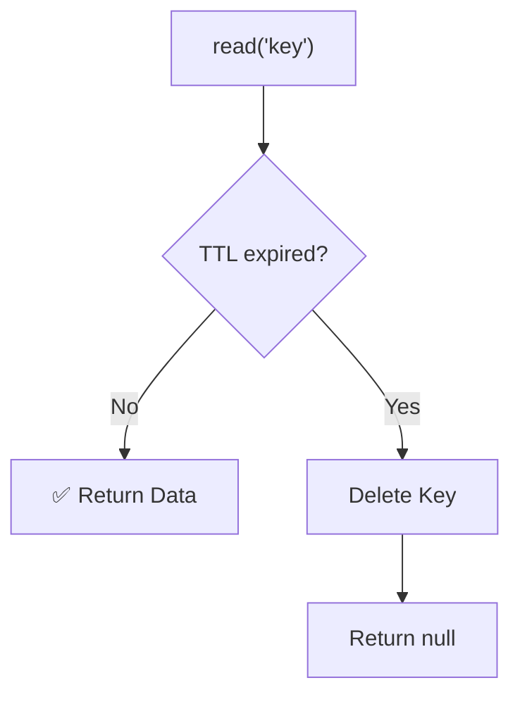

# Cache & Data Strategy

Caching is one of the most critical features for improving user experience. Flutter Orchestrator integrates a flexible cache system with multiple built-in strategies.

### Benefits of Caching

- **Reduce API calls** → Save bandwidth, battery, data
- **Instant data display** → Smoother UX
- **Offline operation** → Data available without internet
- **Stale-While-Revalidate** → Best of both worlds

---

## 1. Architecture Overview



---

## 2. Configuring Cache Provider

### 2.1. In main()

```dart
import 'package:orchestrator_core/orchestrator_core.dart';

void main() {
  // Use In-Memory Cache (Default)
  OrchestratorConfig.setCacheProvider(InMemoryCacheProvider());
  
  // Or custom provider (Hive, SQLite, SharedPrefs...)
  // OrchestratorConfig.setCacheProvider(HiveCacheProvider());
  
  runApp(MyApp());
}
```

### 2.2. CacheProvider Interface

```dart
abstract class CacheProvider {
  /// Write data to cache
  Future<void> write(String key, dynamic value, {Duration? ttl});
  
  /// Read data from cache (null if missing or expired)
  Future<dynamic> read(String key);
  
  /// Delete specific key
  Future<void> delete(String key);
  
  /// Delete by condition
  Future<void> deleteMatching(bool Function(String key) predicate);
  
  /// Clear all cache
  Future<void> clear();
}
```

### 2.3. Creating Custom Provider

```dart
class HiveCacheProvider implements CacheProvider {
  final Box _box = Hive.box('cache');
  
  @override
  Future<void> write(String key, value, {Duration? ttl}) async {
    final entry = {
      'value': value,
      'expiry': ttl != null 
        ? DateTime.now().add(ttl).toIso8601String() 
        : null,
    };
    await _box.put(key, entry);
  }
  
  @override
  Future<dynamic> read(String key) async {
    final entry = _box.get(key);
    if (entry == null) return null;
    
    final expiry = entry['expiry'];
    if (expiry != null && DateTime.parse(expiry).isBefore(DateTime.now())) {
      await _box.delete(key);
      return null;
    }
    
    return entry['value'];
  }
  
  // ... implement delete, deleteMatching, clear
}
```

---

## 3. DataStrategy & CachePolicy

### 3.1. Structure

```dart
class DataStrategy {
  /// Placeholder data (Skeleton, loading state...)
  final dynamic placeholder;
  
  /// Cache configuration
  final CachePolicy? cachePolicy;
}

class CachePolicy {
  /// Unique key in cache
  final String key;
  
  /// Time to live (null = forever)
  final Duration? ttl;
  
  /// true = SWR pattern, false = Cache-First
  final bool revalidate;
  
  /// true = Skip cache, force network (Pull-to-Refresh)
  final bool forceRefresh;
}
```

### 3.2. Config on Job

```dart
class FetchProductsJob extends BaseJob {
  FetchProductsJob() : super(
    id: generateJobId(),
    strategy: DataStrategy(
      placeholder: List.generate(5, (_) => Product.skeleton()),
      cachePolicy: CachePolicy(
        key: 'products_list',
        ttl: Duration(hours: 1),
        revalidate: true,  // SWR pattern
      ),
    ),
  );
}
```

---

## 4. Caching Patterns

### 4.1. Cache-First (Offline-First)

If cache exists → Return immediately, **DO NOT** call API.



```dart
class FetchUserJob extends BaseJob {
  FetchUserJob(this.userId) : super(
    id: generateJobId(),
    strategy: DataStrategy(
      cachePolicy: CachePolicy(
        key: 'user_$userId',
        ttl: Duration(hours: 24),
        revalidate: false,  // ← Cache-First: No revalidate
      ),
    ),
  );
  final String userId;
}
```

**When to use:**
- Static data (User profile, Settings...)
- Speed > Freshness

### 4.2. Stale-While-Revalidate (SWR)

Return cache immediately → Call API in background → Update if different.



```dart
class FetchNewsJob extends BaseJob {
  FetchNewsJob() : super(
    id: generateJobId(),
    strategy: DataStrategy(
      cachePolicy: CachePolicy(
        key: 'news_feed',
        ttl: Duration(minutes: 5),
        revalidate: true,  // ← SWR: Always revalidate
      ),
    ),
  );
}
```

**When to use:**
- Frequently changing data (News feed, Notifications...)
- Want instant display + eventual consistency

### 4.3. Network-First (Force Refresh)

Skip cache, **ALWAYS** call API.

```dart
class FetchProductsJob extends BaseJob {
  final bool isPullToRefresh;
  
  FetchProductsJob({this.isPullToRefresh = false}) : super(
    id: generateJobId(),
    strategy: DataStrategy(
      cachePolicy: CachePolicy(
        key: 'products_list',
        forceRefresh: isPullToRefresh,  // ← Skip cache on pull-to-refresh
      ),
    ),
  );
}

// Usage
RefreshIndicator(
  onRefresh: () async {
    cubit.loadProducts(isPullToRefresh: true);
  },
  child: ProductList(),
)
```

**When to use:**
- Pull-to-refresh (user demands fresh data)
- Force sync after mutation

### 4.4. Placeholder (Skeleton UI)

Show temporary UI IMMEDIATELY.



```dart
class FetchProductsJob extends BaseJob {
  FetchProductsJob() : super(
    id: generateJobId(),
    strategy: DataStrategy(
      placeholder: List.generate(5, (_) => Product.skeleton()),
    ),
  );
}

// In Orchestrator - handle placeholder
@override
void onActiveEvent(BaseEvent event) {
  if (event is JobPlaceholderEvent) {
    final skeletons = event.dataAs<List<Product>>();
    emit(state.copyWith(products: skeletons, isShowingSkeleton: true));
  }
}

@override
void onActiveSuccess(JobSuccessEvent event) {
  final products = event.dataAs<List<Product>>();
  emit(state.copyWith(products: products, isShowingSkeleton: false));
}
```

---

## 5. Caching in Executor

Besides automatic DataStrategy, you can manipulate cache manually:

### 5.1. Read/Write Cache

```dart
class UpdateUserExecutor extends BaseExecutor<UpdateUserJob> {
  @override
  Future<User> process(UpdateUserJob job) async {
    // 1. Read current cache
    final oldUser = await readCache<User>('user_${job.userId}');
    
    // 2. Call API update
    final newUser = await api.updateUser(job.userId, job.data);
    
    // 3. Write to cache with TTL
    await writeCache('user_${job.userId}', newUser, ttl: Duration(hours: 24));
    
    return newUser;
  }
}
```

### 5.2. Invalidate Cache

```dart
class DeleteProductExecutor extends BaseExecutor<DeleteProductJob> {
  @override
  Future<void> process(DeleteProductJob job) async {
    await api.deleteProduct(job.productId);
    
    // Invalidate related caches
    await invalidateKey('product_${job.productId}');
    await invalidateKey('products_list');
    await invalidatePrefix('product_search_');
  }
}
```

### 5.3. Invalidate matchingly

```dart
// Delete all keys containing "temp"
await invalidateMatching((key) => key.contains('temp'));

// Delete cache for specific user
await invalidateMatching((key) => key.startsWith('user_123_'));
```

---

## 6. InvalidateCacheJob (Built-in)

Framework provides a built-in Job to invalidate cache without creating an Executor:

```dart
// Delete specific key
dispatch(InvalidateCacheJob(key: 'user_123'));

// Delete by prefix
dispatch(InvalidateCacheJob(prefix: 'products_'));

// Delete by predicate
dispatch(InvalidateCacheJob(
  predicate: (key) => key.contains('deleted'),
));
```

---

## 7. TTL (Time To Live)

### 7.1. Configuring TTL

```dart
CachePolicy(
  key: 'products',
  ttl: Duration(hours: 1),  // Expires after 1 hour
)

CachePolicy(
  key: 'user_settings',
  ttl: null,  // Never expires
)
```

### 7.2. How TTL works



---

## 8. Best Practices

### ✅ Do

- **Use meaningful keys:** `user_{userId}`, `products_page_{page}`
- **Group with prefixes:** `product_*`, `user_*`, `search_*`
- **Invalidate after mutation:** Clear related cache after POST/PUT/DELETE
- **Set reasonable TTL:** Dynamic data → Short TTL

### ❌ Don't

```dart
// ❌ WRONG: Vague key
CachePolicy(key: 'data')

// ✅ CORRECT: Descriptive key
CachePolicy(key: 'user_profile_123')

// ❌ WRONG: Forget invalidate
class UpdateProductExecutor extends BaseExecutor<UpdateProductJob> {
  Future<Product> process(UpdateProductJob job) async {
    return await api.updateProduct(job.data);
    // Forgot invalidating 'products_list' → UI shows old data
  }
}

// ✅ CORRECT: Invalidate related
class UpdateProductExecutor extends BaseExecutor<UpdateProductJob> {
  Future<Product> process(UpdateProductJob job) async {
    final result = await api.updateProduct(job.data);
    await invalidateKey('products_list');
    await invalidateKey('product_${job.productId}');
    return result;
  }
}
```

---

## 9. Caching Patterns Summary

| Pattern | `revalidate` | `forceRefresh` | Behavior |
|---------|--------------|----------------|----------|
| Cache-First | `false` | `false` | Cache hit → Stop |
| SWR | `true` | `false` | Cache hit → Continue API |
| Network-First | - | `true` | Skip Cache |
| Placeholder Only | - | - | No CachePolicy |

---

## See Also

- [Job - DataStrategy](../concepts/job.md#7-datastrategy)
- [Executor - Cache](../concepts/executor.md#7-cache-integration)
