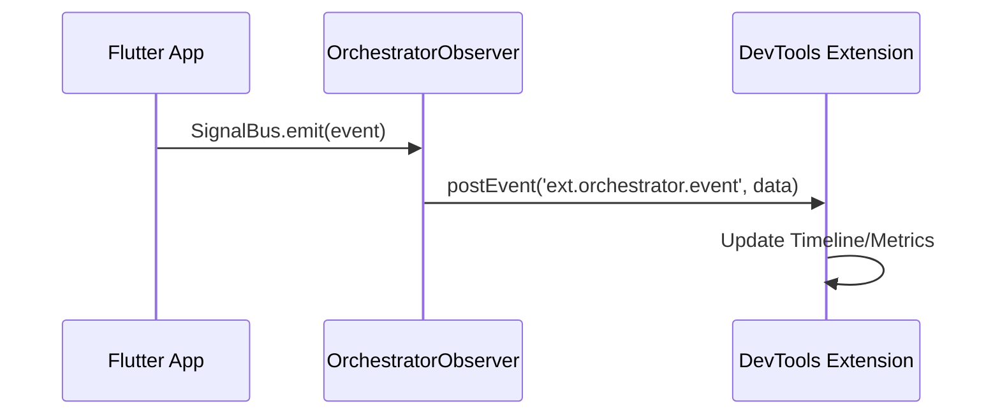

# DevTools Extension Guide

The Flutter Orchestrator DevTools Extension provides real-time debugging capabilities for your Orchestrator-based applications.

## Features

### 1. Event Timeline
Monitor all dispatched jobs and events as they occur:
- View event types (JobStarted, JobSuccess, JobFailure, etc.)
- Filter by event type or job name
- See timestamps and correlation IDs

### 2. Job Inspector
Group related events by correlation ID:
- See the complete lifecycle of each job
- Inspect success/failure data
- View retry attempts and error details

### 3. Metrics Dashboard
Get insights into your application's job execution:
- **Total Events/Jobs**: Overall activity count
- **Success Rate**: Percentage of successful jobs
- **Peak Throughput**: Maximum jobs processed per second
- **Cache Hit Rate**: Efficiency of caching strategy
- **Anomaly Detection**: Automatic detection of failures and unusual patterns

### 4. Network Queue
Inspect the offline job queue:
- View pending jobs waiting for connectivity
- Check retry counts and poison pill status
- Monitor sync progress

### 5. Executor Registry
View all registered executors:
- See which executors are available
- Verify registration at startup

## Setup

The DevTools extension is automatically available when you:

1. Add `orchestrator_flutter` to your project:
   ```bash
   flutter pub add orchestrator_flutter
   ```

2. Initialize the DevTools observer in your `main()`:
   ```dart
   import 'package:orchestrator_flutter/orchestrator_flutter.dart';

   void main() {
     initDevToolsObserver();
     runApp(MyApp());
   }
   ```

3. Run your app in debug or profile mode and open Flutter DevTools.

## Usage Tips

- **Filter Events**: Use the filter bar to focus on specific event types or jobs
- **Click Events**: Click on any event to see detailed JSON data
- **Watch Metrics**: Keep the Metrics tab open during load testing
- **Debug Offline**: Use the Network Queue tab to verify offline job handling

## Release Build Optimization

> [!IMPORTANT]
> Although `OrchestratorObserver` only activates in debug/profile mode (automatically checks `kDebugMode || kProfileMode`), the code still exists in release builds. To optimize app size and ensure no debug code in production, follow this guide.

### Option 1: Conditional Initialization (Recommended)

Use `kReleaseMode` to skip `initDevToolsObserver()` in release:

```dart
import 'package:flutter/foundation.dart';
import 'package:orchestrator_flutter/orchestrator_flutter.dart';

void main() {
  // Only init DevTools in debug/profile mode
  if (!kReleaseMode) {
    initDevToolsObserver();
  }
  runApp(MyApp());
}
```

### Option 2: Assert (Tree-shaking friendly)

Use `assert` so the compiler automatically removes code in release:

```dart
void main() {
  assert(() {
    initDevToolsObserver();
    return true;
  }());
  runApp(MyApp());
}
```

### Option 3: No Import in Release

To completely remove the dependency in release, use conditional imports:

```dart
// lib/devtools_init.dart
export 'devtools_init_stub.dart'
    if (dart.library.developer) 'devtools_init_real.dart';

// lib/devtools_init_stub.dart
void initDevTools() {} // No-op

// lib/devtools_init_real.dart
import 'package:orchestrator_flutter/orchestrator_flutter.dart';
void initDevTools() => initDevToolsObserver();
```

### Verify Build Size

Compare sizes before and after applying optimization:

```bash
# Before
flutter build apk --release --analyze-size

# After adding conditional
flutter build apk --release --analyze-size
```

Typically, this can reduce a few KB to tens of KB depending on the compiler's tree-shaking.

## Troubleshooting

### Extension Not Showing
- Ensure `orchestrator_flutter` is properly imported
- Verify `initDevToolsObserver()` is called before `runApp()`
- Check that you're running in debug/profile mode (not release)

### No Events Appearing
- Confirm your app is dispatching jobs through the Dispatcher
- Check that executors are properly registered

## Architecture



The extension works by:
1. `OrchestratorObserver` subscribes to `SignalBus`
2. Events are serialized and sent via `dart:developer.postEvent()`
3. DevTools extension receives and displays events in real-time
