# Error Handling & Logging

Centralized error handling is a key strength of Flutter Orchestrator. The Framework provides automatic **Error Boundary**, flexible **Logging**, and **Circuit Breaker** to protect the application.

---

## 1. Error Flow Overview

```mermaid
flowchart TD
    subgraph Executor["Executor (Error Boundary)"]
        Process["process(job)"] --> Try["try { ... }"]
        Try --> Success["✅ return result"]
        Try --> Catch["catch (e, stack)"]
        Catch --> Log["logger.error()"]
        Log --> EmitFail["emit JobFailureEvent"]
    end
    
    subgraph Orchestrator["Orchestrator"]
        EmitFail --> Hook["onActiveFailure(event)"]
        Hook --> UpdateState["emit(state.copyWith(error: ...))"]
    end
    
    subgraph UI["UI"]
        UpdateState --> Show["Show Error Message"]
    end
    
    style Catch fill:#ffebee,stroke:#c62828,color:#000
    style Hook fill:#fff3e0,stroke:#e65100,color:#000
```



---

## 2. Error Boundary in Executor

The Framework automatically wraps `process()` in a try-catch block. You **do not need** to write error handling code inside Executor.

### 2.1. How it works

```dart
// In Executor - YOU WRITE
@override
Future<User> process(FetchUserJob job) async {
  return await api.getUser(job.userId);  // Can throw
}

// Framework AUTOMATICALLY DOES
Future<void> execute(T job) async {
  try {
    final result = await process(job);
    emitResult(job.id, result);
  } catch (e, stack) {
    OrchestratorConfig.logger.error('Job ${job.id} failed', e, stack);
    emitFailure(job.id, e, stack);  // → JobFailureEvent
  }
}
```

### 2.2. Benefits

- ✅ **No App Crash:** Exceptions are caught and handled gracefully
- ✅ **Full Stack Trace:** Easy debugging
- ✅ **Auto Log:** Errors are recorded
- ✅ **UI Notification:** Via `JobFailureEvent`

---

## 3. Error Handling in Orchestrator

### 3.1. Basic Hook

```dart
class UserCubit extends OrchestratorCubit<UserState> {
  @override
  void onActiveFailure(JobFailureEvent event) {
    emit(state.copyWith(
      isLoading: false,
      error: _mapError(event.error),
    ));
  }
  
  String _mapError(Object error) {
    if (error is SocketException) {
      return 'No internet connection. Please check your network.';
    }
    if (error is TimeoutException) {
      return 'Connection too slow. Please try again.';
    }
    if (error is UnauthorizedException) {
      return 'Session expired. Please login again.';
    }
    return 'An error occurred. Please try again later.';
  }
}
```

### 3.2. Handle by Job Type

```dart
@override
void onActiveFailure(JobFailureEvent event) {
  if (event.correlationId.startsWith('login_')) {
    emit(state.copyWith(loginError: event.error.toString()));
  } else if (event.correlationId.startsWith('fetch_')) {
    emit(state.copyWith(fetchError: event.error.toString()));
  }
}
```

### 3.3. Handle all failure types

```dart
@override
void onActiveFailure(JobFailureEvent event) {
  _handleError(event.error, event.stackTrace);
}

@override
void onActiveTimeout(JobTimeoutEvent event) {
  _handleError(TimeoutException('Operation timed out'), null);
}

@override
void onActiveCancelled(JobCancelledEvent event) {
  // Usually don't show error as user initiated cancel
  emit(state.copyWith(isLoading: false));
}

void _handleError(Object error, StackTrace? stack) {
  emit(state.copyWith(isLoading: false, error: _mapError(error)));
  
  // Log for debug
  if (kDebugMode) {
    print('Error: $error');
    if (stack != null) print(stack);
  }
}
```

---

## 4. Logging

### 4.1. Logger Configuration

```dart
void main() {
  // Development: Detailed Log
  if (kDebugMode) {
    OrchestratorConfig.enableDebugLogging();
  }
  
  // Production: Log errors only + send to server
  if (kReleaseMode) {
    OrchestratorConfig.setLogger(ProductionLogger());
  }
  
  runApp(MyApp());
}
```

### 4.2. OrchestratorLogger Interface

```dart
abstract class OrchestratorLogger {
  void log(LogLevel level, String message, [Object? error, StackTrace? stackTrace]);
  
  // Convenience methods
  void debug(String message);
  void info(String message);
  void warning(String message, [Object? error]);
  void error(String message, Object error, [StackTrace? stackTrace]);
}
```

### 4.3. Log Levels

| Level | Description | When to use |
|-------|-------------|-------------|
| `debug` | Most detailed | Development only |
| `info` | General info | Important events |
| `warning` | Warning | Potential issues |
| `error` | Critical Failure | Exceptions, failures |

### 4.4. Built-in Loggers

```dart
// Console Logger (Development)
OrchestratorConfig.setLogger(ConsoleLogger(minLevel: LogLevel.debug));

// Silent Logger (Production default)
OrchestratorConfig.setLogger(NoOpLogger());

// Custom Logger
class ProductionLogger extends OrchestratorLogger {
  @override
  void log(LogLevel level, String message, [Object? error, StackTrace? stack]) {
    if (level == LogLevel.error && error != null) {
      // Send to Sentry/Crashlytics
      Sentry.captureException(error, stackTrace: stack);
    }
  }
}
```

---

## 5. Circuit Breaker

Protects application from **infinite loops** or **event spam**.

### 5.1. How it works

```mermaid
flowchart TD
    Event["Event In"] --> Count["Count per second"]
    Count --> Check{"> maxEventsPerSecond?"}
    Check -->|No| Process["✅ Process Normally"]
    Check -->|Yes| Block["🛑 BLOCK event"]
    Block --> Log["Log error: Circuit Breaker triggered"]
    
    style Block fill:#ffebee,stroke:#c62828,color:#000
```



### 5.2. Configuration

```dart
void main() {
  // Default: 50 events/second per type
  OrchestratorConfig.maxEventsPerSecond = 100;  // Increase for high-frequency apps
  
  // Set limit for specific event type
  OrchestratorConfig.setTypeLimit<JobProgressEvent>(500);  // Progress can be frequent
  OrchestratorConfig.setTypeLimit<MyHighFreqEvent>(1000);
  
  runApp(MyApp());
}
```

### 5.3. When does Circuit Breaker trigger?

```
[ERROR] Circuit Breaker: Event JobSuccessEvent exceeded limit (51/s > 50).
        Blocking this specific event type to prevent infinite loop.
        Other events are unaffected.
```

**Common Causes:**
- Orchestrator emits state in `onActiveSuccess` → triggers new dispatch → infinite loop
- API returns error → retry immediately → spam events

---

## 6. Retry vs Fail

### 6.1. When to Retry

```dart
class FetchDataJob extends BaseJob {
  FetchDataJob() : super(
    id: generateJobId(),
    retryPolicy: RetryPolicy(
      maxRetries: 3,
      baseDelay: Duration(seconds: 1),
      shouldRetry: (error, attempt) {
        // Retry for transient errors
        if (error is SocketException) return true;
        if (error is TimeoutException) return true;
        if (error is HttpException && error.statusCode >= 500) return true;
        return false;
      },
    ),
  );
}
```

### 6.2. When NOT to Retry

```dart
shouldRetry: (error, attempt) {
  // DO NOT retry for permanent errors
  if (error is UnauthorizedException) return false;  // Token expired
  if (error is NotFoundException) return false;       // Resource missing
  if (error is ValidationException) return false;     // Bad input
  if (error is HttpException && error.statusCode == 400) return false;
  return true;
}
```

### 6.3. Error Classification

| Error Type | Should Retry? | Reason |
|------------|---------------|--------|
| Network timeout | ✅ Yes | Network might recover |
| Server 5xx | ✅ Yes | Server might recover |
| Server 4xx | ❌ No | Bad request |
| Auth expired | ❌ No | Refresh token needed |
| Validation error | ❌ No | Bad input |

---

## 7. User-facing Error Messages

### 7.1. Error Mapper

```dart
class ErrorMapper {
  static String toUserMessage(Object error) {
    return switch (error) {
      SocketException() => 'No internet connection',
      TimeoutException() => 'Connection too slow',
      HttpException(statusCode: 401) => 'Session expired',
      HttpException(statusCode: 403) => 'Access denied',
      HttpException(statusCode: 404) => 'Data not found',
      HttpException(statusCode: >= 500) => 'Server error, please try again',
      ValidationException(:final message) => message,
      _ => 'An unexpected error occurred',
    };
  }
}

// Usage
@override
void onActiveFailure(JobFailureEvent event) {
  final message = ErrorMapper.toUserMessage(event.error);
  emit(state.copyWith(error: message));
}
```

### 7.2. Display in UI

```dart
BlocBuilder<UserCubit, UserState>(
  builder: (context, state) {
    if (state.error != null) {
      return Column(
        children: [
          Icon(Icons.error_outline, color: Colors.red, size: 48),
          Text(state.error!, style: TextStyle(color: Colors.red)),
          ElevatedButton(
            onPressed: () => context.read<UserCubit>().retry(),
            child: Text('Retry'),
          ),
        ],
      );
    }
    // ... normal UI
  },
)
```

---

## 8. Error Tracking Integration

### 8.1. Sentry

```dart
class SentryLogger extends OrchestratorLogger {
  @override
  void log(LogLevel level, String message, [Object? error, StackTrace? stack]) {
    if (level == LogLevel.error && error != null) {
      Sentry.captureException(
        error,
        stackTrace: stack,
        hint: Hint.withMap({'message': message}),
      );
    }
  }
}

// Setup
void main() async {
  await SentryFlutter.init((options) {
    options.dsn = 'your-dsn';
  });
  
  OrchestratorConfig.setLogger(SentryLogger());
  runApp(MyApp());
}
```

### 8.2. Firebase Crashlytics

```dart
class CrashlyticsLogger extends OrchestratorLogger {
  @override
  void log(LogLevel level, String message, [Object? error, StackTrace? stack]) {
    if (level == LogLevel.error && error != null) {
      FirebaseCrashlytics.instance.recordError(
        error,
        stack,
        reason: message,
        fatal: false,
      );
    }
    
    if (level == LogLevel.warning || level == LogLevel.info) {
      FirebaseCrashlytics.instance.log('[$level] $message');
    }
  }
}
```

---

## 9. Best Practices

### ✅ Do

- **Always handle `onActiveFailure`:** Show user-friendly error messages
- **Map technical errors → friendly messages:** Never show stack trace to user
- **Log fully in development:** Easy debugging
- **Send errors to server in production:** Monitor app health
- **Configure retry wisely:** Retry transient, fail fast permanent

### ❌ Don't

```dart
// ❌ WRONG: Ignore failure
@override
void onActiveFailure(JobFailureEvent event) {
  // Empty → User unaware of error
}

// ❌ WRONG: Show technical error to user
emit(state.copyWith(error: event.error.toString()));
// → "SocketException: Connection refused"

// ❌ WRONG: Log sensitive info
logger.debug('Login with password: ${user.password}');

// ❌ WRONG: Infinite retry
RetryPolicy(maxRetries: 999, shouldRetry: (_,_) => true);
```

---

## See Also

- [Job - RetryPolicy](../concepts/job.md#5-retrypolicy)
- [Orchestrator - Event Hooks](../concepts/orchestrator.md#5-event-hooks) - Failure handling hooks
- [Event - JobFailureEvent](../concepts/event.md#22-jobfailureevent)
