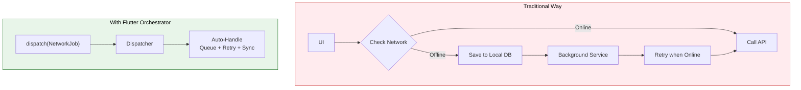
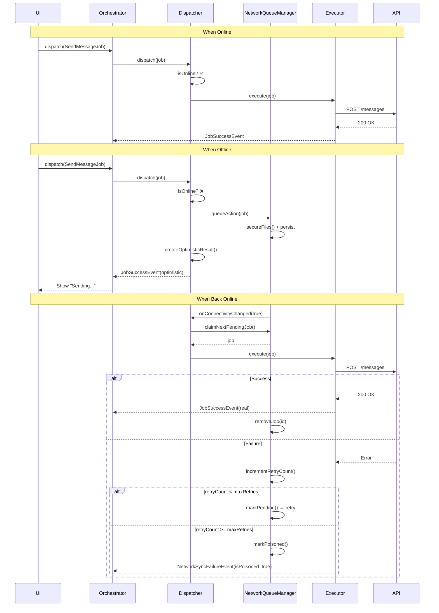
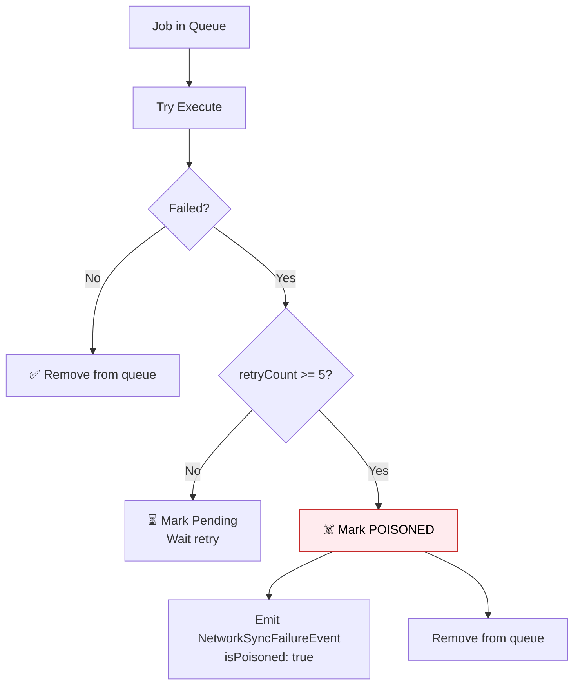

# Offline Support

One of the most powerful features of Flutter Orchestrator is its automatic **Offline Support** via the **NetworkAction** mechanism.

> **Principle:** You just mark a Job as `NetworkAction`, and the Framework handles everything: **Queue → Persist → Retry → Sync**.

---

## 1. Problem with Traditional Approach



**Issues with Traditional Approach:**
- ❌ Offline logic scattered everywhere
- ❌ Manual Background Service implementation
- ❌ Hard to maintain and debug
- ❌ Prone to missing edge cases

---

## 2. Solution: NetworkAction Interface

### 2.1. Overview

```dart
abstract class NetworkAction<T> {
  /// Serialize job to save to queue when offline
  Map<String, dynamic> toJson();
  
  /// Hypothesized result returned immediately (Optimistic UI)
  T createOptimisticResult();
  
  /// (Optional) Key for deduplication
  String? get deduplicationKey => null;
}
```

### 2.2. Full Example (v0.6.0+)

```dart
import 'package:orchestrator_core/orchestrator_core.dart';

// Domain Event with DataSource
class MessageSentEvent extends BaseEvent {
  final Message message;
  final DataSource source;

  MessageSentEvent(super.correlationId, this.message, this.source);
}

// Job with NetworkAction support
class SendMessageJob extends EventJob<Message, MessageSentEvent>
    implements NetworkAction<Message> {
  final String content;
  final String recipientId;

  SendMessageJob({
    required this.content,
    required this.recipientId,
  }) : super(id: generateJobId('msg'));

  // ========== EventJob: Create Domain Event ==========

  @override
  MessageSentEvent createEventTyped(Message result) {
    // Use dataSource getter to include source in event
    return MessageSentEvent(id, result, dataSource);
  }

  // ========== NetworkAction: Serialization ==========

  @override
  Map<String, dynamic> toJson() => {
    'id': id,
    'content': content,
    'recipientId': recipientId,
  };

  factory SendMessageJob.fromJson(Map<String, dynamic> json) {
    return SendMessageJob._withId(
      id: json['id'] as String,
      content: json['content'] as String,
      recipientId: json['recipientId'] as String,
    );
  }

  SendMessageJob._withId({
    required String id,
    required this.content,
    required this.recipientId,
  }) : super(id: id);

  // ========== NetworkAction: Optimistic Result ==========

  @override
  Message createOptimisticResult() {
    return Message(
      id: id,
      content: content,
      recipientId: recipientId,
      status: MessageStatus.sending,
      createdAt: DateTime.now(),
    );
  }

  // ========== Optional: Failure Rollback ==========

  @override
  MessageSentEvent? createFailureEvent(Object error, Message? lastOptimistic) {
    // Return event to rollback optimistic state
    return MessageSentEvent(
      id,
      Message(id: id, content: content, status: MessageStatus.failed),
      DataSource.failed,
    );
  }

  @override
  String? get deduplicationKey => id;
}
```

> **💡 Key Points (v0.6.0+):**
> - Use `dataSource` getter in `createEventTyped()` to include source info
> - Override `createFailureEvent()` to handle permanent sync failures
> - `DataSource` can be: `fresh`, `cached`, `optimistic`, or `failed`

---

## 3. Detailed Workflow



---

## 4. Configuration

### 4.1. Setup in main()

```dart
void main() async {
  WidgetsFlutterBinding.ensureInitialized();

  // 1. Register Network Jobs
  NetworkJobRegistry.registerType<SendMessageJob>(SendMessageJob.fromJson);

  // 2. Register Executors
  Dispatcher().register<SendMessageJob>(SendMessageExecutor(api));

  // 3. Config Connectivity Provider
  OrchestratorConfig.setConnectivityProvider(
    ConnectivityPlusProvider(),
  );

  // 4. Config Network Queue Manager
  OrchestratorConfig.setNetworkQueueManager(
    NetworkQueueManager(
      storage: FileNetworkQueueStorage(),
      fileDelegate: FlutterFileSafety(),
    ),
  );

  // 5. Process queued jobs from previous session (NEW in v0.6.0)
  await Dispatcher().processQueuedJobs();

  runApp(MyApp());
}
```

### 4.2. ConnectivityProvider Interface

```dart
abstract class ConnectivityProvider {
  /// Check connectivity status
  Future<bool> get isConnected;
  
  /// Stream of connectivity changes
  Stream<bool> get onConnectivityChanged;
}

// Implementation with connectivity_plus
class ConnectivityPlusProvider implements ConnectivityProvider {
  final Connectivity _connectivity = Connectivity();
  
  @override
  Future<bool> get isConnected async {
    final result = await _connectivity.checkConnectivity();
    return result != ConnectivityResult.none;
  }
  
  @override
  Stream<bool> get onConnectivityChanged {
    return _connectivity.onConnectivityChanged
      .map((result) => result != ConnectivityResult.none);
  }
}
```

### 4.3. NetworkQueueStorage Interface

```dart
abstract class NetworkQueueStorage {
  /// Save job to persistence
  Future<void> saveJob(String id, Map<String, dynamic> data);
  
  /// Remove job from persistence
  Future<void> removeJob(String id);
  
  /// Get job by ID
  Future<Map<String, dynamic>?> getJob(String id);
  
  /// Get all jobs (FIFO order)
  Future<List<Map<String, dynamic>>> getAllJobs();
  
  /// Update job
  Future<void> updateJob(String id, Map<String, dynamic> updates);
  
  /// Clear all
  Future<void> clearAll();
}
```

---

## 5. File Safety (Temporary File Protection)

### 5.1. The Problem

When user uploads photo/video, files are often in **temporary** directories (`/tmp`, `/cache`). OS can delete these files **AT ANY TIME**. If offline and file is deleted before sync → **Error**.

### 5.2. Solution: FileSafetyDelegate

```dart
abstract class FileSafetyDelegate {
  /// Copy temp files to safe location
  Future<Map<String, dynamic>> secureFiles(Map<String, dynamic> jobData);
  
  /// Delete safe files after sync complete
  Future<void> cleanupFiles(Map<String, dynamic> jobData);
}

// Implementation
class FlutterFileSafety implements FileSafetyDelegate {
  @override
  Future<Map<String, dynamic>> secureFiles(Map<String, dynamic> data) async {
    final appDir = await getApplicationSupportDirectory();
    final safeDir = Directory('${appDir.path}/network_queue_files');
    await safeDir.create(recursive: true);
    
    // Copy file if it's a temp path
    if (data['filePath'] != null) {
      final tmpPath = data['filePath'] as String;
      if (tmpPath.contains('/tmp') || tmpPath.contains('/cache')) {
        final fileName = path.basename(tmpPath);
        final safePath = '${safeDir.path}/$fileName';
        await File(tmpPath).copy(safePath);
        data['filePath'] = safePath;  // Replace with safe path
      }
    }
    
    return data;
  }
  
  @override
  Future<void> cleanupFiles(Map<String, dynamic> data) async {
    final safePath = data['filePath'] as String?;
    if (safePath != null && safePath.contains('network_queue_files')) {
      await File(safePath).delete();
    }
  }
}
```

---

## 6. Poison Pill (Handling Permanent Failures)

### 6.1. Mechanism

If a Job fails consecutively after **5 retries** (default), it is marked as **Poisoned** and removed from the queue to unblock other jobs.



### 6.2. Handling in Orchestrator (v0.6.0+)

With `createFailureEvent()`, the framework automatically emits domain events on failure:

```dart
@override
void onEvent(BaseEvent event) {
  switch (event) {
    case MessageSentEvent e when isJobRunning(e.correlationId):
      if (e.source == DataSource.failed) {
        // Sync failed permanently → Rollback optimistic UI
        final messages = state.messages.map((m) {
          if (m.id == e.message.id) {
            return m.copyWith(status: MessageStatus.failed);
          }
          return m;
        }).toList();
        emit(state.copyWith(messages: messages));

        // Show retry dialog
        showRetryDialog('Could not send message. Try again?');
      } else {
        // Success (optimistic or fresh)
        final messages = [...state.messages];
        final index = messages.indexWhere((m) => m.id == e.message.id);
        if (index >= 0) {
          messages[index] = e.message;
        } else {
          messages.add(e.message);
        }
        emit(state.copyWith(messages: messages));
      }
  }
}
```

> **💡 DataSource Values:**
> - `DataSource.optimistic` - Returned immediately when offline
> - `DataSource.fresh` - Returned after successful sync
> - `DataSource.failed` - Returned when sync fails permanently (poison pill)

---

## 7. NetworkJobRegistry

### 7.1. Why Registry?

When restoring Job from queue (JSON), Framework needs to know:
- **Job Type** (String) → to find factory
- **Factory function** → to deserialize JSON to Job

### 7.2. API Reference

```dart
class NetworkJobRegistry {
  /// Register with string type name
  static void register(String type, EventJob Function(Map<String, dynamic>) factory);

  /// Register with generic type (type-safe, recommended)
  static void registerType<T extends EventJob>(EventJob Function(Map<String, dynamic>) factory);

  /// Restore Job from JSON
  static EventJob? restore(String type, Map<String, dynamic> json);

  /// Check if registered
  static bool isRegistered(String type);

  /// Clear all (testing)
  static void clear();
}
```

### 7.3. Registration Example

```dart
void main() {
  // Type-safe registration (recommended)
  NetworkJobRegistry.registerType<SendMessageJob>(SendMessageJob.fromJson);
  NetworkJobRegistry.registerType<LikePostJob>(LikePostJob.fromJson);
}
```

---

## 8. NetworkJobStatus

```dart
enum NetworkJobStatus {
  pending,     // Waiting to be processed
  processing,  // Being processed (claimed)
  poisoned,    // Permanently failed
}
```

---

## 9. Best Practices

### ✅ Do

- **Include `DataSource` in events:** For UI to distinguish optimistic vs synced data
- **Implement `createFailureEvent()`:** For automatic rollback on sync failure
- **Implement `deduplicationKey`:** Prevent duplicates on multiple taps
- **Call `processQueuedJobs()` on startup:** Sync pending jobs from previous sessions
- **Use File Safety:** For jobs with file attachments

### ❌ Don't

```dart
// ❌ WRONG: Not including DataSource in event
class MessageSentEvent extends BaseEvent {
  final Message message;
  // Missing: final DataSource source;
}

// ❌ WRONG: Not using dataSource getter
@override
MessageSentEvent createEventTyped(Message result) {
  return MessageSentEvent(id, result);  // Missing dataSource
}

// ❌ WRONG: Optimistic result missing status
@override
Message createOptimisticResult() {
  return Message(content: content);  // Missing status: sending
}

// ❌ WRONG: Not handling DataSource.failed
case MessageSentEvent e when isJobRunning(e.correlationId):
  emit(state.copyWith(message: e.message));  // Should check e.source
```

---

## 10. Component Summary

| Component | Description |
|-----------|-------------|
| `NetworkAction<T>` | Interface for offline-capable Job |
| `NetworkQueueManager` | Manages queue (persist, retry) |
| `NetworkQueueStorage` | Storage interface for queue |
| `ConnectivityProvider` | Check/stream network status |
| `FileSafetyDelegate` | Protect temporary files |
| `NetworkJobRegistry` | Registry for deserialization |
| `NetworkSyncFailureEvent` | Framework event when sync fails |
| `DataSource` | Enum: `fresh`, `cached`, `optimistic`, `failed` |
| `createFailureEvent()` | Optional method for domain failure events |
| `processQueuedJobs()` | Trigger queue processing on app startup |

---

## 11. DataSource Enum

```dart
enum DataSource {
  /// Data fetched directly from source (API, database)
  fresh,

  /// Data retrieved from cache
  cached,

  /// Data created optimistically while offline
  optimistic,

  /// Data from permanently failed sync (poison pill)
  failed,
}
```

---

## See Also

- [Code Generation](code_generation.md) - Auto-register Network Jobs
- [Dispatcher - NetworkAction](../concepts/dispatcher.md#4-handling-networkaction-offline-support) - Details in Dispatcher
- [Event - NetworkSyncFailureEvent](../concepts/event.md#61-networksyncfailureevent) - failure handling
