# Offline Support

One of the most powerful features of Flutter Orchestrator is its automatic **Offline Support** via the **NetworkAction** mechanism.

> **Principle:** You just mark a Job as `NetworkAction`, and the Framework handles everything: **Queue → Persist → Retry → Sync**.

---

## 1. Problem with Traditional Approach


**Issues with Traditional Approach:**
- ❌ Offline logic scattered everywhere
- ❌ Manual Background Service implementation
- ❌ Hard to maintain and debug
- ❌ Prone to missing edge cases

---

## 2. Solution: NetworkAction Interface

### 2.1. Overview

```dart
abstract class NetworkAction<T> {
  /// Serialize job to save to queue when offline
  Map<String, dynamic> toJson();
  
  /// Hypothesized result returned immediately (Optimistic UI)
  T createOptimisticResult();
  
  /// (Optional) Key for deduplication
  String? get deduplicationKey => null;
}
```

### 2.2. Full Example

```dart
import 'package:orchestrator_core/orchestrator_core.dart';

@NetworkJob()
class SendMessageJob extends BaseJob implements NetworkAction<Message> {
  final String content;
  final String recipientId;
  
  SendMessageJob({
    required this.content,
    required this.recipientId,
  }) : super(id: generateJobId('msg'));  // Framework generates unique ID
  
  // ========== REQUIRED: Serialization ==========
  
  @override
  Map<String, dynamic> toJson() => {
    'id': id,  // Important: Serialize ID for tracking
    'content': content,
    'recipientId': recipientId,
  };
  
  factory SendMessageJob.fromJson(Map<String, dynamic> json) {
    return SendMessageJob._withId(
      id: json['id'] as String,
      content: json['content'] as String,
      recipientId: json['recipientId'] as String,
    );
  }
  
  // Private constructor to restore with old ID
  SendMessageJob._withId({
    required String id,
    required this.content,
    required this.recipientId,
  }) : super(id: id);
  
  // Wrapper for NetworkJobRegistry (returns BaseJob)
  static BaseJob fromJsonToBase(Map<String, dynamic> json) {
    return SendMessageJob.fromJson(json);
  }
  
  // ========== REQUIRED: Optimistic Result ==========
  
  @override
  Message createOptimisticResult() {
    return Message(
      id: id,  // Use job.id as tempId (Framework generated it)
      content: content,
      recipientId: recipientId,
      status: MessageStatus.sending,
      createdAt: DateTime.now(),
    );
  }
  
  // ========== OPTIONAL: Deduplication ==========
  
  @override
  String? get deduplicationKey => id;  // Use job.id to prevent duplicates
}
```

> **💡 Note on ID:**
> - `generateJobId()` Is a Framework helper, creating unique ID format: `prefix-timestamp-random`
> - Example: `msg-1703579123456789-a1b2c3`
> - Use this `id` for tracking optimistic UI, **no need** to create separate `tempId`

---

## 3. Detailed Workflow

```mermaid
sequenceDiagram
    participant UI
    participant Orchestrator
    participant Dispatcher
    participant Queue as NetworkQueueManager
    participant Executor
    participant API
    
    Note over UI,API: When Online
    UI->>Orchestrator: dispatch(SendMessageJob)
    Orchestrator->>Dispatcher: dispatch(job)
    Dispatcher->>Dispatcher: isOnline? ✅
    Dispatcher->>Executor: execute(job)
    Executor->>API: POST /messages
    API-->>Executor: 200 OK
    Executor-->>Orchestrator: JobSuccessEvent
    
    Note over UI,API: When Offline
    UI->>Orchestrator: dispatch(SendMessageJob)
    Orchestrator->>Dispatcher: dispatch(job)
    Dispatcher->>Dispatcher: isOnline? ❌
    Dispatcher->>Queue: queueAction(job)
    Queue->>Queue: secureFiles() + persist
    Dispatcher->>Dispatcher: createOptimisticResult()
    Dispatcher-->>Orchestrator: JobSuccessEvent(optimistic)
    Orchestrator-->>UI: Show "Sending..."
    
    Note over UI,API: When Back Online
    Queue->>Dispatcher: onConnectivityChanged(true)
    Dispatcher->>Queue: claimNextPendingJob()
    Queue-->>Dispatcher: job
    Dispatcher->>Executor: execute(job)
    Executor->>API: POST /messages
    alt Success
        API-->>Executor: 200 OK
        Executor-->>Orchestrator: JobSuccessEvent(real)
        Queue->>Queue: removeJob(id)
    else Failure
        API-->>Executor: Error
        Queue->>Queue: incrementRetryCount()
        alt retryCount < maxRetries
            Queue->>Queue: markPending() → retry
        else retryCount >= maxRetries
            Queue->>Queue: markPoisoned()
            Executor-->>Orchestrator: NetworkSyncFailureEvent(isPoisoned: true)
        end
    end
```



---

## 4. Configuration

### 4.1. Setup in main()

```dart
void main() async {
  WidgetsFlutterBinding.ensureInitialized();
  
  // 1. Register Network Jobs (from code generation)
  registerNetworkJobs();
  
  // 2. Register Executors
  Dispatcher().register<SendMessageJob>(SendMessageExecutor(api));
  
  // 3. Config Connectivity Provider
  OrchestratorConfig.setConnectivityProvider(
    ConnectivityPlusProvider(),  // Implement from connectivity_plus
  );
  
  // 4. Config Network Queue Manager
  OrchestratorConfig.setNetworkQueueManager(
    NetworkQueueManager(
      storage: FileNetworkQueueStorage(),
      fileDelegate: FlutterFileSafety(),  // Optional: file protection
    ),
  );
  
  runApp(MyApp());
}
```

### 4.2. ConnectivityProvider Interface

```dart
abstract class ConnectivityProvider {
  /// Check connectivity status
  Future<bool> get isConnected;
  
  /// Stream of connectivity changes
  Stream<bool> get onConnectivityChanged;
}

// Implementation with connectivity_plus
class ConnectivityPlusProvider implements ConnectivityProvider {
  final Connectivity _connectivity = Connectivity();
  
  @override
  Future<bool> get isConnected async {
    final result = await _connectivity.checkConnectivity();
    return result != ConnectivityResult.none;
  }
  
  @override
  Stream<bool> get onConnectivityChanged {
    return _connectivity.onConnectivityChanged
      .map((result) => result != ConnectivityResult.none);
  }
}
```

### 4.3. NetworkQueueStorage Interface

```dart
abstract class NetworkQueueStorage {
  /// Save job to persistence
  Future<void> saveJob(String id, Map<String, dynamic> data);
  
  /// Remove job from persistence
  Future<void> removeJob(String id);
  
  /// Get job by ID
  Future<Map<String, dynamic>?> getJob(String id);
  
  /// Get all jobs (FIFO order)
  Future<List<Map<String, dynamic>>> getAllJobs();
  
  /// Update job
  Future<void> updateJob(String id, Map<String, dynamic> updates);
  
  /// Clear all
  Future<void> clearAll();
}
```

---

## 5. File Safety (Temporary File Protection)

### 5.1. The Problem

When user uploads photo/video, files are often in **temporary** directories (`/tmp`, `/cache`). OS can delete these files **AT ANY TIME**. If offline and file is deleted before sync → **Error**.

### 5.2. Solution: FileSafetyDelegate

```dart
abstract class FileSafetyDelegate {
  /// Copy temp files to safe location
  Future<Map<String, dynamic>> secureFiles(Map<String, dynamic> jobData);
  
  /// Delete safe files after sync complete
  Future<void> cleanupFiles(Map<String, dynamic> jobData);
}

// Implementation
class FlutterFileSafety implements FileSafetyDelegate {
  @override
  Future<Map<String, dynamic>> secureFiles(Map<String, dynamic> data) async {
    final appDir = await getApplicationSupportDirectory();
    final safeDir = Directory('${appDir.path}/network_queue_files');
    await safeDir.create(recursive: true);
    
    // Copy file if it's a temp path
    if (data['filePath'] != null) {
      final tmpPath = data['filePath'] as String;
      if (tmpPath.contains('/tmp') || tmpPath.contains('/cache')) {
        final fileName = path.basename(tmpPath);
        final safePath = '${safeDir.path}/$fileName';
        await File(tmpPath).copy(safePath);
        data['filePath'] = safePath;  // Replace with safe path
      }
    }
    
    return data;
  }
  
  @override
  Future<void> cleanupFiles(Map<String, dynamic> data) async {
    final safePath = data['filePath'] as String?;
    if (safePath != null && safePath.contains('network_queue_files')) {
      await File(safePath).delete();
    }
  }
}
```

---

## 6. Poison Pill (Handling Permanent Failures)

### 6.1. Mechanism

If a Job fails consecutively after **5 retries** (default), it is marked as **Poisoned** and removed from the queue to unblock other jobs.

```mermaid
flowchart TD
    Job["Job in Queue"] --> Try["Try Execute"]
    Try --> Fail{"Failed?"}
    Fail -->|No| Success["✅ Remove from queue"]
    Fail -->|Yes| Count{"retryCount >= 5?"}
    Count -->|No| Retry["⏳ Mark Pending<br/>Wait retry"]
    Count -->|Yes| Poison["☠️ Mark POISONED"]
    Poison --> Event["Emit NetworkSyncFailureEvent<br/>isPoisoned: true"]
    Poison --> Remove["Remove from queue"]
    
    style Poison fill:#ffebee,stroke:#c62828,color:#000
```



### 6.2. Handling in Orchestrator

```dart
@override
void onPassiveEvent(BaseEvent event) {
  if (event is NetworkSyncFailureEvent && event.isPoisoned) {
    // Job failed permanently → Rollback optimistic UI
    final failedId = event.correlationId;
    
    // Example: Mark message as failed
    final messages = state.messages.map((m) {
      if (m.tempId == failedId) {
        return m.copyWith(status: MessageStatus.failed);
      }
      return m;
    }).toList();
    
    emit(state.copyWith(messages: messages));
    
    // Show dialog to user
    showRetryDialog('Could not send message. Do you want to try again?');
  }
}
```

---

## 7. NetworkJobRegistry

### 7.1. Why Registry?

When restoring Job from queue (JSON), Framework needs to know:
- **Job Type** (String) → to find factory
- **Factory function** → to deserialize JSON to Job

### 7.2. API Reference

```dart
class NetworkJobRegistry {
  /// Register with string type name
  static void register(String type, BaseJob Function(Map<String, dynamic>) factory);
  
  /// Register with generic type (type-safe)
  static void registerType<T extends BaseJob>(BaseJob Function(Map<String, dynamic>) factory);
  
  /// Restore Job from JSON
  static BaseJob? restore(String type, Map<String, dynamic> json);
  
  /// Check if registered
  static bool isRegistered(String type);
  
  /// Clear all (testing)
  static void clear();
}
```

### 7.3. Manual vs Code Generation

```dart
// Manual
void main() {
  NetworkJobRegistry.register('SendMessageJob', SendMessageJob.fromJsonToBase);
  NetworkJobRegistry.register('LikePostJob', LikePostJob.fromJsonToBase);
}

// With Code Generation (Recommended)
@NetworkRegistry([SendMessageJob, LikePostJob])
void setupNetworkRegistry() {}
// → Automatically generates registerNetworkJobs()
```

---

## 8. NetworkJobStatus

```dart
enum NetworkJobStatus {
  pending,     // Waiting to be processed
  processing,  // Being processed (claimed)
  poisoned,    // Permanently failed
}
```

---

## 9. Best Practices

### ✅ Do

- **Use unique `tempId`:** For tracking and optimistic rollback
- **Implement `deduplicationKey`:** Prevent duplicates on multiple taps
- **Handle `NetworkSyncFailureEvent`:** Rollback UI on poison
- **Use File Safety:** For jobs with file attachments

### ❌ Don't

```dart
// ❌ WRONG: Forgot fromJsonToBase
class MyJob extends BaseJob implements NetworkAction<Result> {
  factory MyJob.fromJson(Map<String, dynamic> json) => ...;
  // Missing: static BaseJob fromJsonToBase(...)
}

// ❌ WRONG: Insufficient Optimistic result
@override
Message createOptimisticResult() {
  return Message(content: content);  // Missing status, tempId
}

// ❌ WRONG: Not listening to NetworkSyncFailureEvent
// → User sees "sent" message but actually failed
```

---

## 10. Component Summary

| Component | Description |
|-----------|-------------|
| `NetworkAction<T>` | Interface for offline-capable Job |
| `NetworkQueueManager` | Manages queue (persist, retry) |
| `NetworkQueueStorage` | Storage interface for queue |
| `ConnectivityProvider` | Check/stream network status |
| `FileSafetyDelegate` | Protect temporary files |
| `NetworkJobRegistry` | Registry for deserialization |
| `NetworkSyncFailureEvent` | Event when sync fails |

---

## See Also

- [Code Generation](code_generation.md) - Auto-register Network Jobs
- [Dispatcher - NetworkAction](../concepts/dispatcher.md#4-handling-networkaction-offline-support) - Details in Dispatcher
- [Event - NetworkSyncFailureEvent](../concepts/event.md#61-networksyncfailureevent) - failure handling
