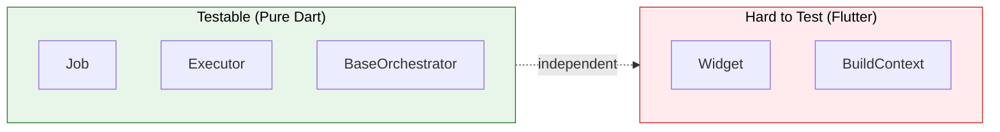

# Testing

The Flutter Orchestrator architecture is designed to be **Testable**. Business logic resides in pure Dart Executors and Orchestrators, independent of Flutter, allowing for simple and fast testing.

We provide a dedicated package, **`orchestrator_test`**, to simplify testing with mocks, fakes, and BDD-style helpers.

---

## 1. Architecture Benefits



**Benefits:**
- ✅ Pure Dart Executors → Test without Flutter
- ✅ No need to mock `BuildContext`, `Widget`
- ✅ Fast tests → Run in milliseconds
- ✅ Scoped Bus → Isolated tests

---

## 2. Setup

Add `orchestrator_test` to your `dev_dependencies`:

```yaml
dev_dependencies:
  flutter_test:
    sdk: flutter
  orchestrator_test: ^0.1.0
  bloc_test: ^9.0.0 # Recommended for testing Cubits/Blocs
```

---

## 3. Unit Testing Executors

Executors contain the pure business logic. You can unit test them by mocking their dependencies (like API services or the Dispatcher).

`orchestrator_test` exports `mocktail`, so you can easily create mocks.

```dart
import 'package:test/test.dart';
import 'package:orchestrator_test/orchestrator_test.dart';

// Mock API dependency
class MockApiService extends Mock implements ApiService {}

void main() {
  group('FetchUserExecutor', () {
    late MockApiService mockApi;
    late FetchUserExecutor executor;
    
    setUp(() {
      mockApi = MockApiService();
      executor = FetchUserExecutor(mockApi);
    });
    
    test('should return user on success', () async {
      // Arrange
      final expectedUser = User(id: '123', name: 'John');
      when(() => mockApi.getUser('123')).thenAnswer((_) async => expectedUser);
      
      // Act
      final result = await executor.process(FetchUserJob(userId: '123'));
      
      // Assert
      expect(result, equals(expectedUser));
      verify(() => mockApi.getUser('123')).called(1);
    });
  });
}
```

---

## 4. Testing Orchestrators (BDD Style)

Orchestrators (Cubits) manage state. You can test them using the `testOrchestrator` helper, which provides a declarative way to test state transitions, similar to `blocTest`.

### 4.0. Dependency Injection for Testing

Since v0.4.0, `BaseOrchestrator` supports optional `bus` and `dispatcher` injection:

```dart
// In your orchestrator
class UserOrchestrator extends BaseOrchestrator<UserState> {
  UserOrchestrator({super.bus, super.dispatcher}) : super(UserState.initial());
}

// In your test
test('verifies dispatch was called', () {
  final mockDispatcher = MockDispatcher();
  final bus = SignalBus.scoped();

  // Stub the dispatch to return a job ID
  when(() => mockDispatcher.dispatch(any())).thenReturn('mock-job-id');

  final orchestrator = UserOrchestrator(
    bus: bus,
    dispatcher: mockDispatcher,
  );

  orchestrator.fetchUser('123');

  // Verify dispatch was called with correct job
  verify(() => mockDispatcher.dispatch(any(that: isA<FetchUserJob>()))).called(1);

  orchestrator.dispose();
  bus.dispose();
});
```

This enables:
- **Mock Dispatcher**: Verify `dispatch()` calls without executing real jobs
- **Scoped Bus**: Isolate event streams between tests
- **Fast Tests**: No actual job execution, just verification

```dart
import 'package:orchestrator_test/orchestrator_test.dart';

testOrchestrator<CounterOrchestrator, int>(
  'emits 1 when increment is called',
  build: () => CounterOrchestrator(),
  act: (orchestrator) => orchestrator.increment(),
  expect: () => [1],
);

testOrchestrator<CounterOrchestrator, int>(
  'emits specific state sequence',
  build: () => CounterOrchestrator(),
  act: (orchestrator) async {
    orchestrator.increment();
    orchestrator.increment();
  },
  expect: () => [1, 2],
);
```

### 4.1. Testing with Mocks

You can pass a `MockDispatcher` to your orchestrator if it supports dependency injection, or use a `FakeExecutor` registered to the global dispatcher (if your orchestrator uses the global singleton).

```dart
testOrchestrator<UserOrchestrator, UserState>(
  'emits [loading, success] on fetch',
  setUp: () {
    // Register a fake executor to handle the job immediately
    final dispatcher = Dispatcher();
    dispatcher.register(FakeExecutor<FetchUserJob>(
      (job) async => User(name: 'Fake User')
    ));
  },
  build: () => UserOrchestrator(),
  act: (orc) => orc.fetchUser('123'),
  expect: () => [
    UserState.loading(),
    UserState.success(User(name: 'Fake User')),
  ],
);
```

---

## 5. Integration Testing with Fakes

`orchestrator_test` provides powerful **Fakes** to simulate complex behavior without mocking everything manually.

### 5.1. FakeExecutor

Simulate backend responses or logic without network calls.

```dart
final executor = FakeExecutor<MyJob>((job) async {
  if (job.id == 'error') throw Exception('Failed');
  return 'Success';
});

dispatcher.register(executor);
```

### 5.2. FakeConnectivityProvider

Test "Offline Support" features by controlling network state.

```dart
test('queues job when offline', () async {
  final connectivity = FakeConnectivityProvider(isConnected: false);
  OrchestratorConfig.setConnectivityProvider(connectivity);

  dispatcher.dispatch(NetworkJob());

  // Verify job is queued, not processed
  expect(queueManager.hasPendingJobs, isTrue);

  // Go online -> Job should be processed
  connectivity.goOnline();
  await Future.delayed(Duration(milliseconds: 100)); // Wait for sync
  expect(queueManager.hasPendingJobs, isFalse);
});
```

### 5.3. FakeCacheProvider

Test caching logic in memory.

```dart
final cache = FakeCacheProvider(trackTtl: true);
await cache.write('key', 'value', ttl: Duration(seconds: 1));
```

---

## 6. Event Testing

### 6.1. EventCapture

Capture events emitted by the `SignalBus` to verify interactions.

```dart
test('should emit failure event', () async {
  final capture = EventCapture(); // Listens to global bus by default
  
  // Dispatch a job that fails
  dispatcher.dispatch(FailingJob());
  
  // Wait for specific event
  final event = await capture.waitFor<JobFailureEvent>();
  
  expect(event.error, isA<Exception>());
  expect(capture.events, hasLength(1));
});
```

### 6.2. Event Matchers

Custom matchers make assertions readable.

```dart
expect(event, isJobSuccess(data: 'result'));
expect(event, isJobFailure(wasRetried: true));
expect(event, isJobProgress(minProgress: 0.5));
expect(event, isJobCancelled());
expect(event, isJobTimeout());
```

And for sequences:

```dart
expect(
  events,
  emitsEventsInOrder([
    isJobProgress(),
    isJobSuccess(),
  ]),
);
```

---

## 7. Testing Timeout & Retry

### 7.1. Test Timeout

```dart
class SlowExecutor extends BaseExecutor<TestJob> {
  @override
  Future<dynamic> process(TestJob job) async {
    await Future.delayed(Duration(seconds: 10));  // Very slow
    return 'done';
  }
}

test('should timeout correctly', () async {
  dispatcher.register(SlowExecutor());
  
  final job = TestJob(timeout: Duration(milliseconds: 100));
  orchestrator.dispatch(job);
  
  await Future.delayed(Duration(milliseconds: 200));
  
  expect(orchestrator.eventLog.any((e) => e.contains('Timeout')), isTrue);
});
```

### 7.2. Test Retry

```dart
class FailingExecutor extends BaseExecutor<FailingJob> {
  int attempts = 0;
  
  @override
  Future<dynamic> process(FailingJob job) async {
    attempts++;
    if (attempts <= job.failCount) {
      throw Exception('Simulated failure #$attempts');
    }
    return 'success after retries';
  }
}

test('should retry on failure', () async {
  final executor = FailingExecutor();
  dispatcher.register(executor);
  
  // Fail 2 times, retry 3 times → should succeed
  final job = FailingJob(
    failCount: 2,
    retryPolicy: RetryPolicy(maxRetries: 3),
  );
  
  orchestrator.dispatch(job);
  await Future.delayed(Duration(milliseconds: 500));
  
  // Verified retry attempts
  expect(executor.attempts, equals(3));  // 2 fails + 1 success
  expect(orchestrator.eventLog, contains('Success:success after retries'));
});
```

---

## 8. Job Matchers

`orchestrator_test` provides matchers for verifying Job properties:

```dart
// Match job ID
expect(job, hasJobId('my-job-id'));

// Match job type
expect(job, isJobOfType<MyJob>());

// Match timeout
expect(job, hasTimeout(Duration(seconds: 30)));

// Match cancellation token presence
expect(job, hasCancellationToken());

// Match retry policy
expect(job, hasRetryPolicy(maxRetries: 3));

// Check job list
expect(dispatcher.dispatchedJobs, containsJobOfType<MyJob>());
expect(dispatcher.dispatchedJobs, hasJobCount<MyJob>(2));
```

---

## 9. Full Example (Integration)

Here is a full integration test example using `bloc_test` and `FakeExecutor`:

```dart
import 'package:bloc_test/bloc_test.dart';
import 'package:orchestrator_test/orchestrator_test.dart';

void main() {
  late Dispatcher dispatcher;

  setUp(() {
    dispatcher = Dispatcher();
    dispatcher.resetForTesting();
  });

  blocTest<CounterCubit, CounterState>(
    'emits [loading, success] when increment is called',
    setUp: () {
      // Register FakeExecutor
      dispatcher.register<IncrementJob>(
        FakeExecutor<IncrementJob>((job) async => 10),
      );
    },
    build: () => CounterCubit(),
    act: (cubit) => cubit.increment(),
    expect: () => [
      // Use matchers or explicit values
      isA<CounterState>().having((s) => s.isLoading, 'isLoading', true),
      isA<CounterState>().having((s) => s.count, 'count', 10),
    ],
  );
}
```

---

## 10. Coverage

### 10.1. Run with coverage

```bash
# Generate coverage
dart test --coverage=coverage

# Convert to lcov
dart pub global activate coverage
dart pub global run coverage:format_coverage \
  --lcov \
  --in=coverage \
  --out=coverage/lcov.info \
  --report-on=lib

# Generate HTML report
genhtml coverage/lcov.info -o coverage/html

# Open report
open coverage/html/index.html
```

### 10.2. CI/CD (GitHub Actions)

```yaml
# .github/workflows/test.yml
name: Test

on: [push, pull_request]

jobs:
  test:
    runs-on: ubuntu-latest
    steps:
      - uses: actions/checkout@v3
      - uses: dart-lang/setup-dart@v1
      
      - name: Install dependencies
        run: dart pub get
        
      - name: Run tests
        run: dart test --coverage=coverage
        
      - name: Upload coverage
        uses: codecov/codecov-action@v3
        with:
          files: coverage/lcov.info
```

---

## 11. Best Practices

### ✅ Do

- **Use Fakes over Mocks**: Prefer `FakeExecutor` over mocking `process()` when possible. It's more realistic and requires less setup.
- **Isolate Tests**: Ensure `Dispatcher` and `SignalBus` are reset or scoped between tests. `Dispatcher` is a singleton, so use `setUp(() => dispatcher.resetForTesting())`.
- **Test Matchers**: Use `isJobSuccess`, `hasJobId` etc. to keep tests readable.
- **Offline Tests**: Always use `FakeConnectivityProvider` to test offline/online transitions explicitly.
- **Use Scoped Bus**: Always `SignalBus.scoped()` in tests for isolation
- **Dispose after test**: Call `dispose()` in `tearDown`

### ❌ Don't

```dart
// ❌ WRONG: Use Global Bus in test → Pollution
test('bad test', () async {
  final orc = TestOrchestrator();  // Uses global bus!
  // → Affects other tests
});

// ✅ CORRECT: Use Scoped Bus
test('good test', () async {
  final bus = SignalBus.scoped();
  final orc = TestOrchestrator(bus: bus);
  // → Isolated
  
  orc.dispose();
  bus.dispose();
});

// ❌ WRONG: Forget dispose
test('leaky test', () async {
  final bus = SignalBus.scoped();
  // ... test ...
  // Forgot bus.dispose() → Memory leak
});
```

---

## See Also

- [Orchestrator - Scoped Bus](../concepts/orchestrator.md#11-scoped-bus-advanced)
- [SignalBus - Testing](../concepts/signal_bus.md#3-scoped-bus-for-testing--isolation)
