# Orchestrator Core Architecture

> Complete technical documentation of orchestrator_core v1.0.0 with Domain Event Architecture v3

## Table of Contents

1. [High-Level Overview](#high-level-overview)
2. [Core Components](#core-components)
3. [Data Flow](#data-flow)
4. [Job Execution Lifecycle](#job-execution-lifecycle)
5. [Event System](#event-system)
6. [Advanced Features](#advanced-features)

---

## High-Level Overview

The Orchestrator Pattern separates **what** to do (Jobs) from **how** to do it (Executors), with a central **Dispatcher** routing jobs and a **SignalBus** for event-driven communication.


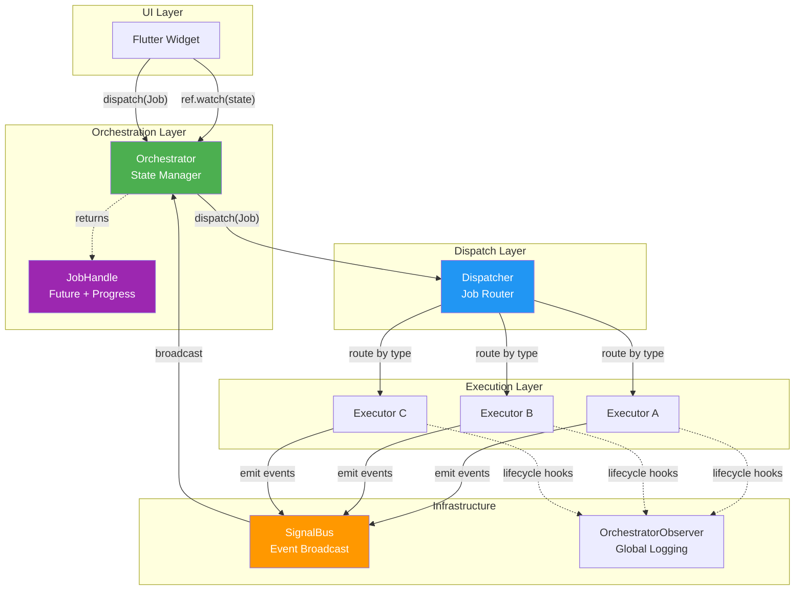


---

## Core Components

### 1. BaseJob

The immutable command object that describes **what** needs to be done.

```dart
// Simple Job
class LoadUsersJob extends BaseJob {
  LoadUsersJob() : super(id: generateJobId('load_users'));
}

// Job with parameters
class CreateUserJob extends BaseJob {
  final String name;
  final String email;
  
  CreateUserJob({required this.name, required this.email})
    : super(id: generateJobId('create_user'));
}
```

#### EventJob (v1.0.0+)

Jobs that automatically emit domain events upon completion:

```dart
class LoadUsersJob extends EventJob<List<User>, UsersLoadedEvent> {
  @override
  UsersLoadedEvent createEventTyped(List<User> result) {
    return UsersLoadedEvent(correlationId: id, users: result);
  }
  
  @override
  String? get cacheKey => 'users_list';
  
  @override
  Duration? get cacheTtl => Duration(minutes: 5);
}
```


### 2. BaseExecutor

Handles job execution with built-in support for timeout, retry, cancellation, and progress.

```dart
class LoadUsersExecutor extends BaseExecutor<LoadUsersJob> {
  final UserRepository _repo;
  
  LoadUsersExecutor(this._repo);
  
  @override
  Future<List<User>> process(LoadUsersJob job) async {
    // Progress reporting
    emitProgress(job.id, progress: 0.3, message: 'Fetching...');
    
    final users = await _repo.getAll();
    
    emitProgress(job.id, progress: 1.0, message: 'Done');
    return users;
  }
}
```

#### Executor Lifecycle

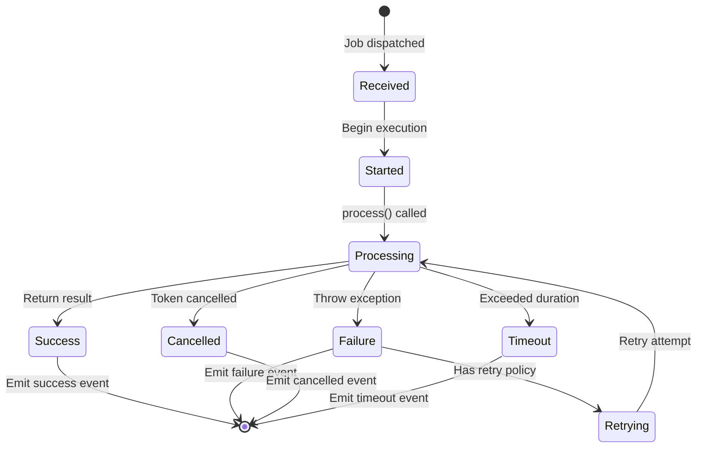


### 3. Dispatcher

Routes jobs to their registered executors. Singleton pattern ensures consistent routing.

```dart
// Registration (typically in app initialization)
final dispatcher = Dispatcher();
dispatcher.register<LoadUsersJob>(LoadUsersExecutor(repo));
dispatcher.register<CreateUserJob>(CreateUserExecutor(repo));

// Dispatch (internal - called by Orchestrator)
dispatcher.dispatch(job, handle: jobHandle);
```

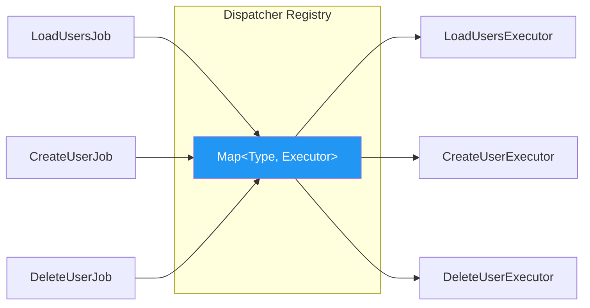


### 4. BaseOrchestrator

The "Reactive Brain" - manages state and reacts to domain events.

```dart
class UserOrchestrator extends BaseOrchestrator<UserState> {
  UserOrchestrator() : super(UserState.initial());
  
  // Dispatch jobs
  JobHandle<List<User>> loadUsers() {
    return dispatch<List<User>>(LoadUsersJob());
  }
  
  // React to ALL events via single handler
  @override
  void onEvent(BaseEvent event) {
    switch (event) {
      case UsersLoadedEvent e:
        emit(state.copyWith(users: e.users));
      case UserCreatedEvent e:
        emit(state.copyWith(users: [...state.users, e.user]));
      case UserDeletedEvent e:
        emit(state.copyWith(
          users: state.users.where((u) => u.id != e.userId).toList()
        ));
    }
  }
}
```


### 5. SignalBus

Broadcast event bus for decoupled communication. Supports both global and scoped instances.

```dart
// Global bus (default)
final globalBus = SignalBus.instance;

// Scoped bus (for testing or isolation)
final scopedBus = SignalBus.scoped();

// Listen to events
bus.listen((event) {
  print('Received: $event');
});

// Emit events
bus.emit(UserCreatedEvent(correlationId: jobId, user: newUser));
```

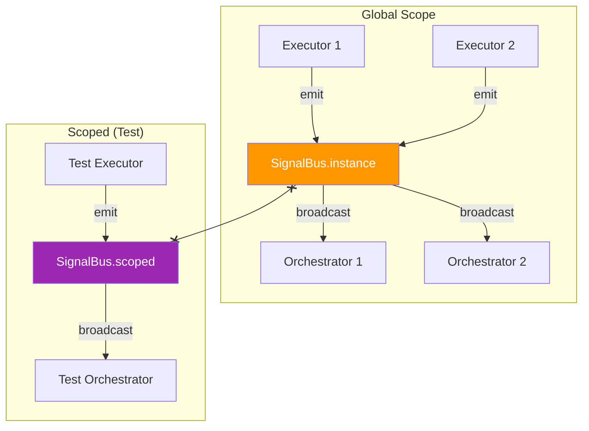


### 6. JobHandle

Represents a running job with future result and progress tracking.

```dart
// Fire and forget
orchestrator.loadUsers();

// Await result
final handle = orchestrator.loadUsers();
final result = await handle.future;
print(result.data);        // List<User>
print(result.source);      // DataSource.fresh | cached | optimistic

// Track progress
handle.progress.listen((p) {
  print('${p.value * 100}% - ${p.message}');
});
```

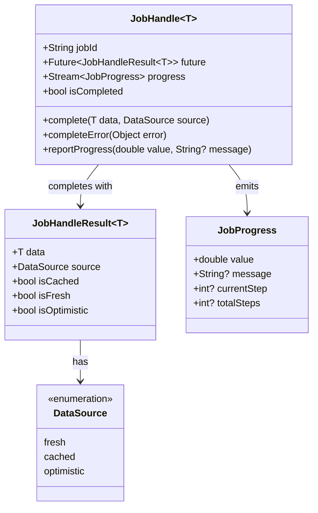


---

## Data Flow

### Complete Job Execution Flow

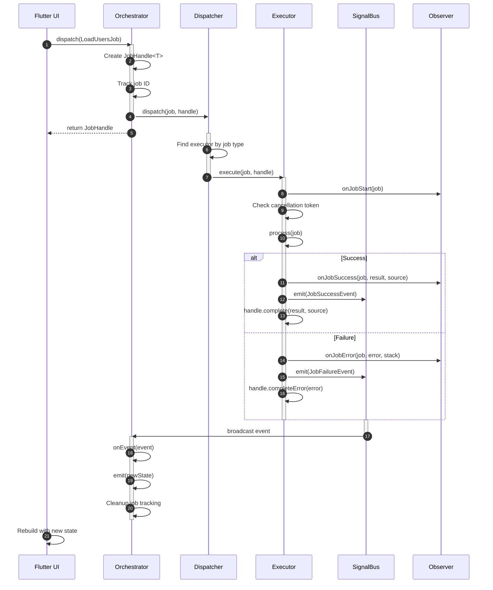


### EventJob Flow (Domain Events)

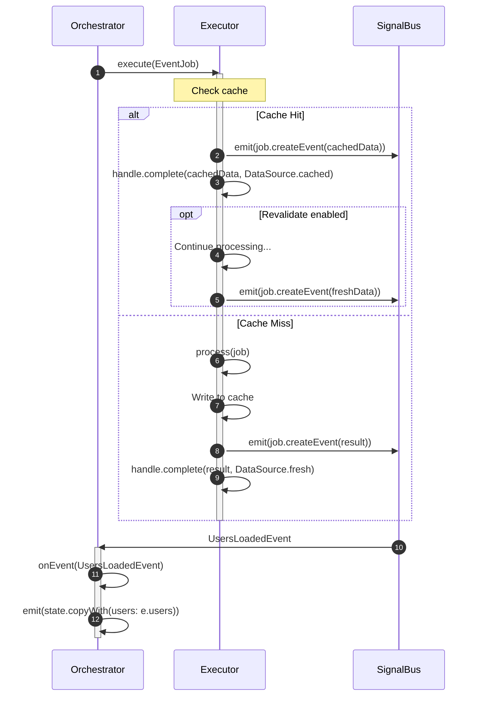


---

## Event System

### Event Hierarchy

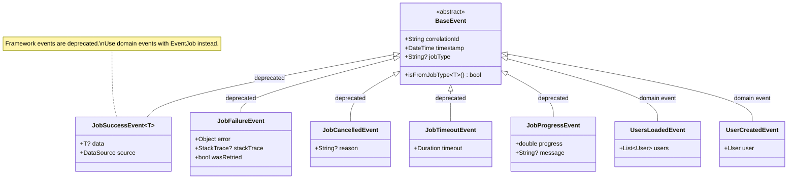


### Active vs Passive Events

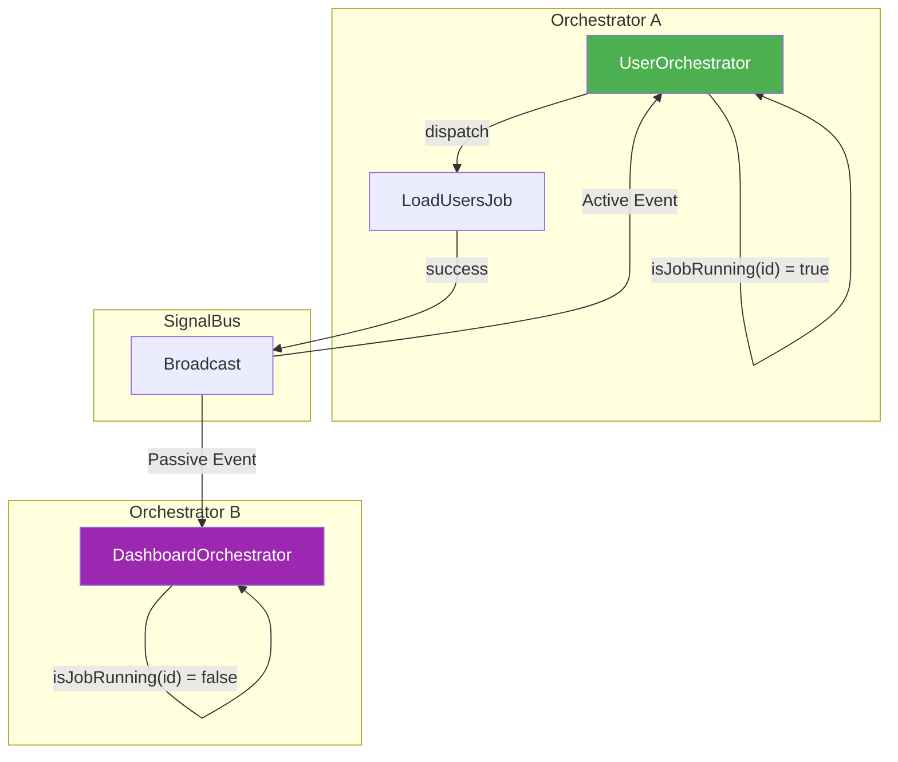

**Active Event**: The orchestrator that dispatched the job receives the completion event.
- `isJobRunning(event.correlationId)` returns `true`

**Passive Event**: Other orchestrators receive the same event as observers.
- `isJobRunning(event.correlationId)` returns `false`
- Useful for cross-feature state synchronization


---

## Advanced Features

### 1. Timeout & Cancellation

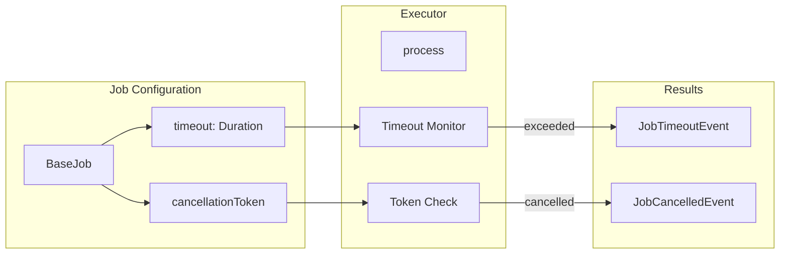

```dart
// With timeout
final job = LoadUsersJob()..timeout = Duration(seconds: 30);

// With cancellation
final token = CancellationToken();
final job = LoadUsersJob()..cancellationToken = token;

// Cancel later
token.cancel();
```


### 2. Retry Policy

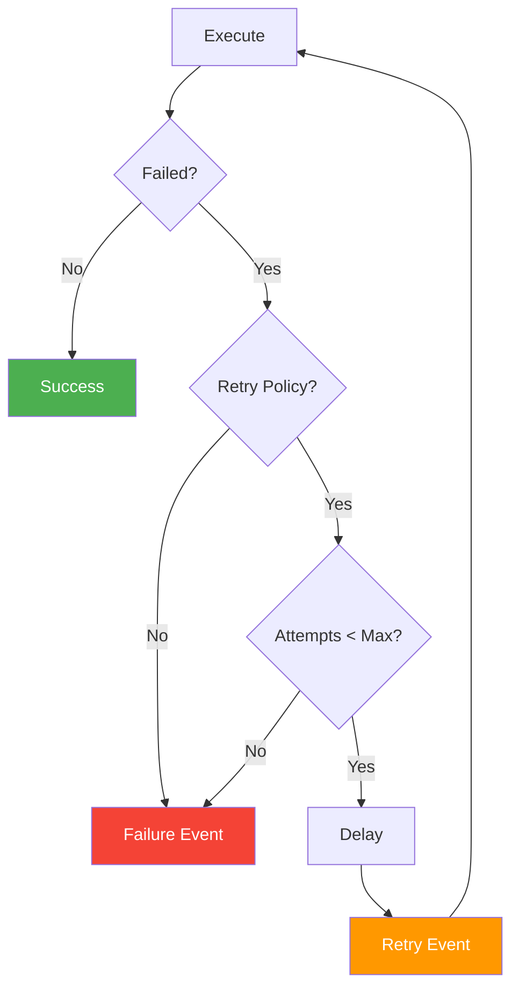

```dart
final job = LoadUsersJob()
  ..retryPolicy = RetryPolicy(
    maxRetries: 3,
    delay: Duration(seconds: 1),
    backoffMultiplier: 2.0,  // 1s, 2s, 4s
  );
```


### 3. Circuit Breaker (Loop Protection)

The orchestrator has built-in protection against infinite event loops.

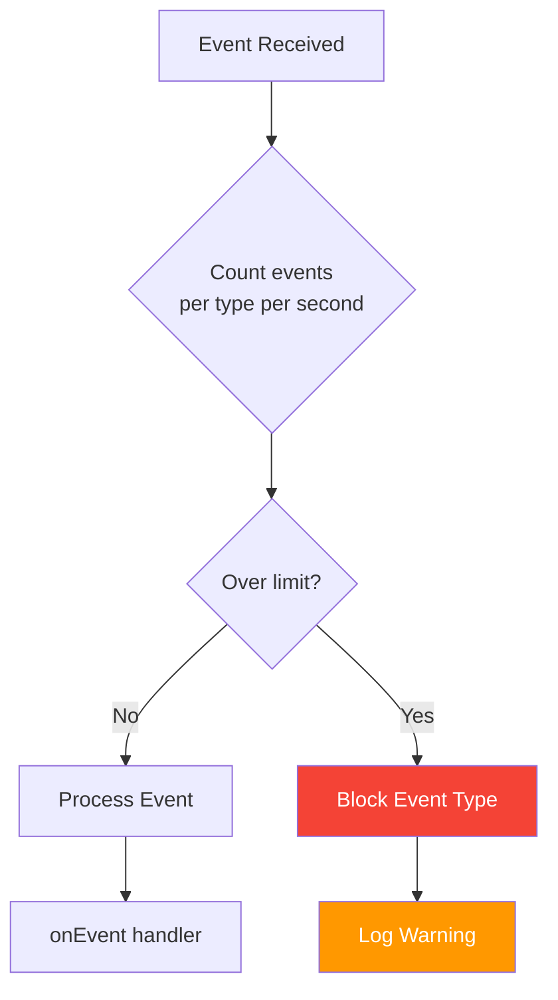

```dart
// Configure limits per event type
OrchestratorConfig.setLimit(JobProgressEvent, 100);  // Allow 100/sec
OrchestratorConfig.setLimit(JobSuccessEvent, 50);    // Allow 50/sec
```


### 4. OrchestratorObserver (Global Logging)

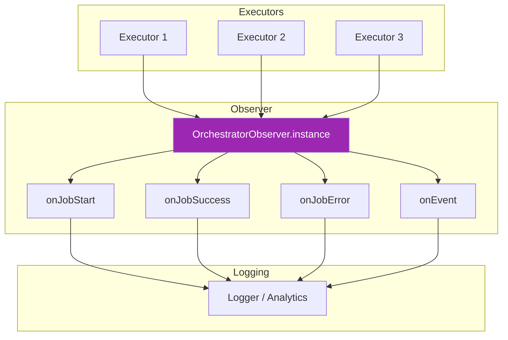

```dart
class MyObserver extends OrchestratorObserver {
  @override
  void onJobStart(BaseJob job) {
    analytics.track('job_started', {'type': job.runtimeType.toString()});
  }
  
  @override
  void onJobError(BaseJob job, Object error, StackTrace stack) {
    crashlytics.recordError(error, stack);
  }
}

// Set globally
OrchestratorObserver.instance = MyObserver();
```


---

## File Structure

```
packages/orchestrator_core/lib/
├── orchestrator_core.dart          # Public exports
└── src/
    ├── base/
    │   ├── base_executor.dart      # Job execution with lifecycle
    │   └── base_orchestrator.dart  # State management + event routing
    ├── infra/
    │   ├── dispatcher.dart         # Job → Executor routing
    │   ├── signal_bus.dart         # Event broadcast
    │   └── orchestrator_observer.dart  # Global logging
    ├── models/
    │   ├── job.dart                # BaseJob + EventJob
    │   ├── event.dart              # BaseEvent + framework events
    │   ├── job_handle.dart         # JobHandle + Result + Progress
    │   └── data_source.dart        # DataSource enum
    └── utils/
        ├── cancellation.dart       # CancellationToken
        ├── retry_policy.dart       # RetryPolicy
        └── logger.dart             # OrchestratorConfig
```


---

## Quick Reference

### Usage Patterns

| Pattern | Code | Use Case |
|---------|------|----------|
| Fire & Forget | `orchestrator.loadUsers()` | Update state via events |
| Await Result | `await handle.future` | Need immediate result |
| Track Progress | `handle.progress.listen(...)` | Show progress UI |
| Active Check | `isJobRunning(id)` | Distinguish own vs other jobs |

### Event Types

| Event | When Emitted | Deprecated? |
|-------|--------------|-------------|
| `JobSuccessEvent` | Job completed successfully | Yes - use domain events |
| `JobFailureEvent` | Job threw exception | Yes - use domain events |
| `JobCancelledEvent` | CancellationToken cancelled | Yes - use domain events |
| `JobTimeoutEvent` | Exceeded timeout duration | Yes - use domain events |
| `JobProgressEvent` | `emitProgress()` called | Yes - use JobHandle.progress |
| Custom domain events | EventJob completion | No - recommended |

### DataSource Values

| Value | Meaning |
|-------|---------|
| `DataSource.fresh` | Just fetched from source |
| `DataSource.cached` | Returned from cache |
| `DataSource.optimistic` | Optimistic update (pending confirmation) |

---

*Generated for orchestrator_core v1.0.0 - Domain Event Architecture v3*
