# Dispatcher - Coordination Center

Dispatcher is the **"Router"** of the system. It receives Jobs from Orchestrator, finds the appropriate Executor, and forwards it for execution. It also handles underlying tasks like **Offline Queue** and **Auto-Sync**.

> **Role:** Similar to API Gateway or Message Broker in backend architectures.

### Position in Architecture

```mermaid
flowchart LR
    subgraph Orchestrators["Orchestrators"]
        O1["UserOrchestrator"]
        O2["CartOrchestrator"]
    end
    
    subgraph Dispatcher["Dispatcher (Singleton)"]
        Registry["Registry<br/>(Job → Executor)"]
        Router["Router Logic"]
        OfflineQ["Offline Queue"]
    end
    
    subgraph Executors["Executors"]
        E1["FetchUserExecutor"]
        E2["AddToCartExecutor"]
    end
    
    O1 --> Router
    O2 --> Router
    Router --> Registry
    Registry --> E1
    Registry --> E2
    Router -.->|"Offline"| OfflineQ
    OfflineQ -.->|"When Online"| Router
    
    style Dispatcher fill:#fff3e0,stroke:#e65100,color:#000
```



---

## 1. Singleton Pattern

Dispatcher is a **Global Singleton** - only one instance exists throughout the app.

```dart
// All calls return the SAME instance
final dispatcher1 = Dispatcher();
final dispatcher2 = Dispatcher();
print(dispatcher1 == dispatcher2); // true
```

**Why Singleton?**
- Ensures all Orchestrators share same registry
- Centralized Offline Queue management
- Easy monitoring and debugging

---

## 2. Registering Executor

Before dispatching a Job, you must register its corresponding Executor.

### 2.1. Register via Generic Type (Recommended)

```dart
// In main.dart
void main() {
  // 1. Register all Executors BEFORE runApp
  Dispatcher().register<FetchUserJob>(FetchUserExecutor());
  Dispatcher().register<LoginJob>(LoginExecutor());
  Dispatcher().register<CreateOrderJob>(CreateOrderExecutor());
  
  // 2. Other configs...
  
  // 3. Run app
  runApp(MyApp());
}
```

### 2.2. Register via Runtime Type

Use when genetic type is unavailable (dynamic registration):

```dart
// Register by Type object
Dispatcher().registerByType(FetchUserJob, FetchUserExecutor());

// Use case: Plugin system, dynamic loading
for (final module in loadedModules) {
  Dispatcher().registerByType(module.jobType, module.executor);
}
```

### 2.3. Internal Registry

```mermaid
flowchart TD
    subgraph Registry["Executor Registry (Map)"]
        R1["FetchUserJob → FetchUserExecutor"]
        R2["LoginJob → LoginExecutor"]
        R3["CreateOrderJob → CreateOrderExecutor"]
    end
    
    Job["dispatch(FetchUserJob)"] --> Lookup["Lookup in Registry"]
    Lookup --> R1
    R1 --> Execute["executor.execute(job)"]
```



---

## 3. Dispatch Job

### 3.1. Basic Flow


### 3.2. Usage

```dart
// In Orchestrator
void loadUser(String userId) {
  // dispatch() returns job ID immediately (Fire-and-Forget)
  final jobId = dispatch(FetchUserJob(userId));
  
  // Results will arrive via event hooks (onActiveSuccess, onActiveFailure...)
}
```

### 3.3. Dispatch via Orchestrator vs Direct

```dart
// ✅ CORRECT: Dispatch via Orchestrator
class UserOrchestrator extends BaseOrchestrator<UserState> {
  void loadUser() {
    dispatch(FetchUserJob()); // Orchestrator tracks automatically
  }
}

// ❌ WRONG: Dispatch directly from UI
class MyWidget extends StatelessWidget {
  void onTap() {
    Dispatcher().dispatch(FetchUserJob()); // No tracking!
  }
}
```

---

## 4. Handling NetworkAction (Offline Support)

When Job implements `NetworkAction`, Dispatcher handles offline state automatically.

### 4.1. Detailed Flow


### 4.2. Optimistic Result

When offline, Dispatcher will:
1. Save Job to Queue
2. Call `job.createOptimisticResult()`
3. Emit `JobSuccessEvent` with assumed result
4. UI updates as if successful

```dart
// In Job
class SendMessageJob extends BaseJob implements NetworkAction<Message> {
  final String text;
  
  @override
  Message createOptimisticResult() {
    return Message(
      id: 'temp_${DateTime.now().millisecondsSinceEpoch}',
      text: text,
      status: MessageStatus.sending,
    );
  }
}
```

---

## 5. Auto-Sync

### 5.1. Mechanism


### 5.2. FIFO Order

Jobs are processed **First In First Out** to ensure consistency:

```
Queue: [Job1, Job2, Job3]
       ↑
       Process first
```

---

## 6. Poison Pill (Max Retries)

To prevent a persistently failing Job from blocking the Queue, Dispatcher implements **Poison Pill**.

### 6.1. Logic

```mermaid
flowchart TD
    Fail["Sync Failed"] --> Count["Increment retry count"]
    Count --> Check{">= 5 times?"}
    Check -->|No| Pending["Mark Pending<br/>(Retry later)"]
    Check -->|Yes| Poison["🔴 POISON PILL"]
    
    Poison --> Remove["Remove from Queue"]
    Remove --> Emit["Emit NetworkSyncFailureEvent<br/>(isPoisoned: true)"]
    Emit --> Rollback["Orchestrator rollback UI"]
```



### 6.2. Handling Poison Pill

```dart
@override
void onPassiveEvent(BaseEvent event) {
  if (event is NetworkSyncFailureEvent && event.isPoisoned) {
    // Job discarded after 5 failures
    // Rollback optimistic UI
    final failedMessageId = event.correlationId;
    emit(state.markMessageFailed(failedMessageId));
    
    // Show error
    showError('Could not send message. Please ignore.');
  }
}
```

### 6.3. Max Retries Config

```dart
// Default: 5 times
// Currently hardcoded, override in subclass if needed
```

---

## 7. ExecutorNotFoundException

If dispatching a Job without a registered Executor:

```dart
// No executor for UnknownJob
Dispatcher().dispatch(UnknownJob());
// → Exception: ExecutorNotFoundException: 
//   No executor registered for job type UnknownJob
```

### 7.1. Prevention

```dart
void main() {
  // Register ALL Executors before app runs
  _registerExecutors();
  runApp(MyApp());
}

void _registerExecutors() {
  final d = Dispatcher();
  d.register<FetchUserJob>(FetchUserExecutor());
  d.register<LoginJob>(LoginExecutor());
  // ... all other jobs
}
```

### 7.2. Debugging

```
ExecutorNotFoundException: No executor registered for job type FetchProductJob
```

**Checklist:**
- [ ] Registered `FetchProductJob` in `main()`?
- [ ] Correct Job Name? (FetchProductJob vs FetchProductsJob)
- [ ] Typo in generic type?

---

## 8. Testing

### 8.1. Reset for Test Isolation

```dart
setUp(() {
  // Reset Dispatcher completely
  Dispatcher().resetForTesting();
  
  // Register mock executors
  Dispatcher().register<TestJob>(mockExecutor);
});
```

### 8.2. Clear Registry

```dart
tearDown(() {
  // Clear registry only
  Dispatcher().clear();
});
```

### 8.3. Dispose

```dart
// Use only when test suite finishes
Dispatcher().dispose();
```

---

## 9. Configuring Offline Support

Configuration in `main()`:

```dart
void main() async {
  WidgetsFlutterBinding.ensureInitialized();
  
  // 1. Register Executors
  _registerExecutors();
  
  // 2. Config Connectivity Provider
  OrchestratorConfig.setConnectivityProvider(
    FlutterConnectivityProvider(),
  );
  
  // 3. Config Network Queue Manager
  OrchestratorConfig.setNetworkQueueManager(
    NetworkQueueManager(
      storage: FileNetworkQueueStorage(),
      fileDelegate: FlutterFileSafety(),
    ),
  );
  
  // 4. Register Network Jobs (from code gen)
  registerNetworkJobs();
  
  runApp(MyApp());
}
```

---

## 10. API Reference

### 10.1. Public Methods

| Method | Description |
|--------|-------------|
| `register<J>(executor)` | Register Executor for Job type J |
| `registerByType(type, executor)` | Register Executor by runtime Type |
| `dispatch(job)` | Send Job to Executor, return job ID |
| `clear()` | Clear all registrations |
| `dispose()` | Cleanup listeners |
| `resetForTesting()` | Reset completely for testing |

### 10.2. Properties

| Property | Type | Description |
|----------|------|-------------|
| `maxRetries` | `int` | Max retries (default: 5) |

---

## 11. Best Practices

### ✅ Do

- **Register all Executors in `main()`**
- **One Job Type → One Executor**
- **Always dispatch via Orchestrator**
- **Handle `NetworkSyncFailureEvent`** for rollback

### ❌ Don't

```dart
// ❌ WRONG: Register later
class MyWidget extends StatefulWidget {
  @override
  void initState() {
    // NO! Register in main()
    Dispatcher().register<MyJob>(MyExecutor());
  }
}

// ❌ WRONG: Dispatch from Widget
ElevatedButton(
  onPressed: () {
    Dispatcher().dispatch(MyJob()); // NO! Use Orchestrator
  },
)

// ❌ WRONG: Forget to register
// → ExecutorNotFoundException
```

---

## See Also

- [Job - Action Definition](job.md) - Dispatcher Input
- [Executor - Logic Processing](executor.md) - Dispatcher Target
- [Offline Support](../advanced/offline_support.md)
- [SignalBus - Event Communication](signal_bus.md)
