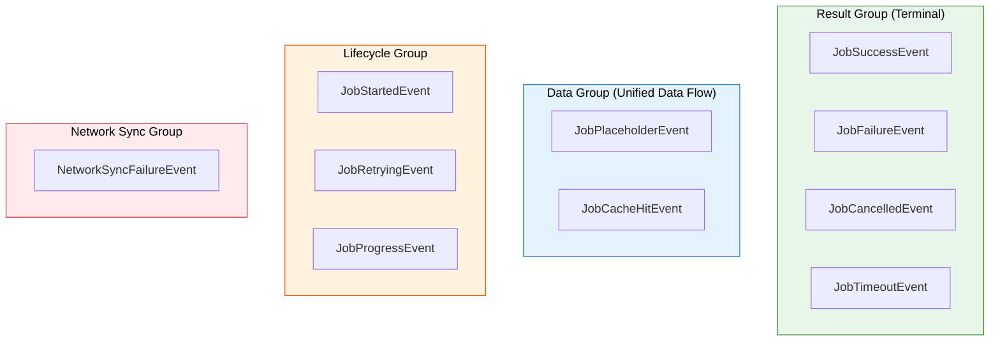
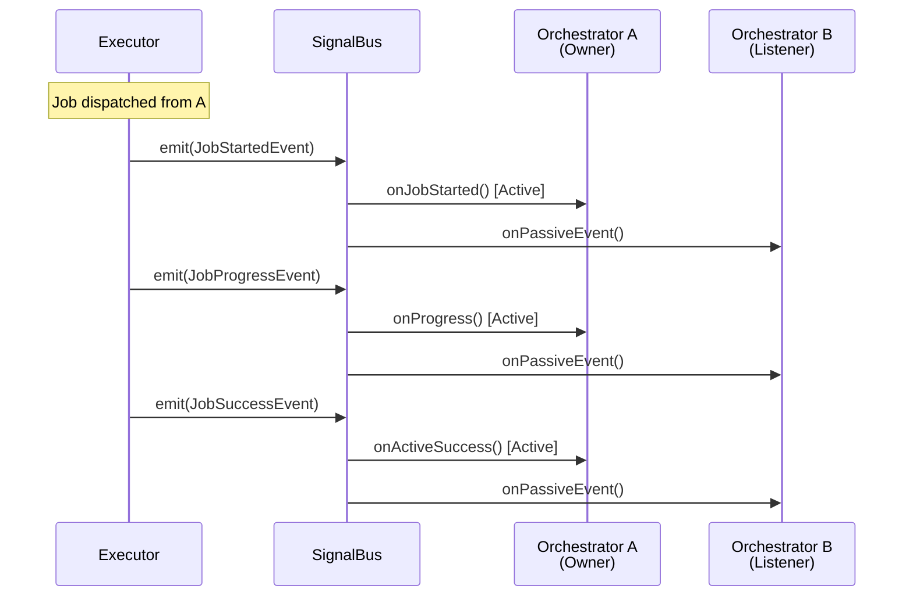

# Event - Event Types

Event is the **"Signal"** from Executor. After processing a Job, Executor emits Events via SignalBus to notify Orchestrator of results, progress or other states.

> **Characteristic:** Fire-and-Forget - Executor just sends, doesn't wait for response. Orchestrator listens and handles itself.

### Event Classification



---

## 1. BaseEvent

All Events inherit from `BaseEvent`:

```dart
@immutable
abstract class BaseEvent {
  /// ID of the Job creating this event (Correlation ID)
  /// Used to link event with original job
  final String correlationId;
  
  /// Event timestamp
  final DateTime timestamp;
  
  BaseEvent(this.correlationId) : timestamp = DateTime.now();
}
```

**Correlation ID:**
- Each Job has a unique ID
- All events from that Job carry the same `correlationId`
- Orchestrator uses this ID to distinguish Active vs Passive events

---

## 2. Result Events (Terminal)

These are **Terminal Events** - marking the end of Job lifecycle.

### 2.1. JobSuccessEvent

Emitted when Job completes **successfully**.

```dart
class JobSuccessEvent<T> extends BaseEvent {
  /// Result data
  final T data;
  
  /// Helper method for safe casting
  /// Returns null if type mismatch (instead of throwing)
  R? dataAs<R>() {
    if (data is R) return data as R;
    return null;
  }
}
```

**Handling in Orchestrator:**

```dart
@override
void onActiveSuccess(JobSuccessEvent event) {
  // Method 1: Safe cast with dataAs()
  final user = event.dataAs<User>();
  if (user != null) {
    emit(state.copyWith(user: user, isLoading: false));
  }
  
  // Method 2: Check by Job type (if handling multiple types)
  // Use when needing distinct logic per job type
}
```

### 2.2. JobFailureEvent

Emitted when Job **fails** (throws exception).

```dart
class JobFailureEvent extends BaseEvent {
  /// Root error (can be Exception, Error, or any Object)
  final Object error;
  
  /// Stack trace for debug
  final StackTrace? stackTrace;
  
  /// true if this failure happened AFTER retries exhausted
  final bool wasRetried;
}
```

**Handling in Orchestrator:**

```dart
@override
void onActiveFailure(JobFailureEvent event) {
  String message;
  
  if (event.error is NetworkException) {
    message = 'Network error. Please check internet.';
  } else if (event.error is AuthException) {
    message = 'Session expired. Please login again.';
  } else {
    message = 'An error occurred: ${event.error}';
  }
  
  emit(state.copyWith(isLoading: false, error: message));
  
  // Detailed log for debug
  if (event.stackTrace != null) {
    logger.error('Job failed', event.error, event.stackTrace);
  }
}
```

### 2.3. JobCancelledEvent

Emitted when Job is **cancelled** (via CancellationToken).

```dart
class JobCancelledEvent extends BaseEvent {
  /// Cancellation reason (optional)
  final String? reason;
}
```

**Handling in Orchestrator:**

```dart
@override
void onActiveCancelled(JobCancelledEvent event) {
  emit(state.copyWith(isLoading: false));
  // Usually no error shown as user initiated cancel
}
```

### 2.4. JobTimeoutEvent

Emitted when Job **exceeds execution time**.

```dart
class JobTimeoutEvent extends BaseEvent {
  /// Duration configured on Job
  final Duration timeout;
}
```

**Handling in Orchestrator:**

```dart
@override
void onActiveTimeout(JobTimeoutEvent event) {
  emit(state.copyWith(
    isLoading: false,
    error: 'Connection too slow (>${event.timeout.inSeconds}s). Please try again.',
  ));
}
```

---

## 3. Data Events (Unified Data Flow)

These emit **BEFORE** actual result from `process()`.

### 3.1. JobPlaceholderEvent

Emitted immediately if Job has `strategy.placeholder`.

```dart
class JobPlaceholderEvent<T> extends BaseEvent {
  /// Placeholder data (skeleton, loading state...)
  final T data;
}
```

**Use case: Skeleton UI**

```dart
// In Job
class FetchProductsJob extends BaseJob {
  FetchProductsJob() : super(
    id: generateJobId(),
    strategy: DataStrategy(
      placeholder: List.generate(5, (_) => Product.skeleton()),
    ),
  );
}

// In Orchestrator
@override
void onActiveEvent(BaseEvent event) {
  if (event is JobPlaceholderEvent) {
    final skeletons = event.dataAs<List<Product>>();
    emit(state.copyWith(products: skeletons, isLoadingSkeletons: true));
  }
}
```

### 3.2. JobCacheHitEvent

Emitted when data found in cache.

```dart
class JobCacheHitEvent<T> extends BaseEvent {
  /// Data from cache
  final T data;
}
```

**Timeline:**

```
dispatch(job)
  → JobPlaceholderEvent (if any)   ← UI shows skeleton
  → JobCacheHitEvent (if hit)      ← UI shows stale data
  → JobSuccessEvent (if revalidate) ← UI shows fresh data
```

---

## 4. Progress Events

### 4.1. JobProgressEvent

Emitted to report progress to UI.

```dart
class JobProgressEvent extends BaseEvent {
  /// Progress 0.0 to 1.0 (auto-clamped)
  final double progress;
  
  /// Optional message
  final String? message;
  
  /// Current step (optional)
  final int? currentStep;
  
  /// Total steps (optional)
  final int? totalSteps;
}
```

**Handling in Orchestrator:**

```dart
@override
void onProgress(JobProgressEvent event) {
  emit(state.copyWith(
    uploadProgress: event.progress,
    uploadMessage: event.message,
    currentStep: event.currentStep,
    totalSteps: event.totalSteps,
  ));
}

// In UI
LinearProgressIndicator(value: state.uploadProgress)
Text('${(state.uploadProgress * 100).toInt()}%')
Text(state.uploadMessage ?? '')
```

---

## 5. Lifecycle Events

### 5.1. JobStartedEvent

Emitted when Job **starts** execution.

```dart
class JobStartedEvent extends BaseEvent {
  // No extra fields
  // Just notifying start
}
```

**Use case:** Tracking, analytics, logging

```dart
@override
void onJobStarted(JobStartedEvent event) {
  analytics.trackEvent('job_started', {'id': event.correlationId});
}
```

### 5.2. JobRetryingEvent

Emitted when Job is **retrying** after error.

```dart
class JobRetryingEvent extends BaseEvent {
  /// Retry attempt number (1-indexed)
  final int attempt;
  
  /// Max retries
  final int maxRetries;
  
  /// Last error
  final Object lastError;
  
  /// Delay before next retry
  final Duration delayBeforeRetry;
}
```

**Handling in Orchestrator:**

```dart
@override
void onJobRetrying(JobRetryingEvent event) {
  emit(state.copyWith(
    statusMessage: 'Retrying... (${event.attempt}/${event.maxRetries})',
  ));
}
```

---

## 6. Network Sync Events

### 6.1. NetworkSyncFailureEvent

Emitted when a **NetworkAction job** fails during background sync.

```dart
class NetworkSyncFailureEvent extends BaseEvent {
  /// Failure error
  final Object error;
  
  /// Stack trace
  final StackTrace? stackTrace;
  
  /// Retry count
  final int retryCount;
  
  /// true = Job dropped (exceeded max retries)
  /// false = Job will be retried
  final bool isPoisoned;
}
```

**IMPORTANT - Handling Poison Pill:**

```dart
@override
void onPassiveEvent(BaseEvent event) {
  if (event is NetworkSyncFailureEvent && event.isPoisoned) {
    // Job failed permanently
    // MUST rollback optimistic UI
    final failedId = event.correlationId;
    
    // Example: Mark message as failed
    emit(state.markMessageFailed(failedId));
    
    // Notify user
    showSnackbar('Could not send message. Please retry.');
  }
}
```

---

## 7. Custom Events

You can define custom events for special cases:

```dart
// Define custom event
class UserLoggedOutEvent extends BaseEvent {
  final String reason;
  
  UserLoggedOutEvent({required this.reason}) 
    : super('system-logout-${DateTime.now().millisecondsSinceEpoch}');
}

class NewNotificationEvent extends BaseEvent {
  final int count;
  final String preview;
  
  NewNotificationEvent(String jobId, {required this.count, required this.preview})
    : super(jobId);
}

// Emit from Executor
@override
Future<void> process(CheckNotificationsJob job) async {
  final notifications = await _api.getNotifications();
  
  if (notifications.isNotEmpty) {
    emit(NewNotificationEvent(
      job.id,
      count: notifications.length,
      preview: notifications.first.title,
    ));
  }
  
  return notifications;
}

// Listen in Orchestrator
@override
void onPassiveEvent(BaseEvent event) {
  if (event is NewNotificationEvent) {
    emit(state.copyWith(badgeCount: event.count));
  }
}
```

---

## 8. Event Flow Diagram



**Explanation:**
- **Active Events:** Orchestrator A dispatches job → receives events via specific hooks (`onActiveSuccess`, `onActiveFailure`...)
- **Passive Events:** All other Orchestrators receive events via `onPassiveEvent()`

---

## 9. Event Summary Table

| Event | When Emitted | Hook in Orchestrator |
|-------|--------------|----------------------|
| `JobStartedEvent` | Job starts | `onJobStarted()` |
| `JobPlaceholderEvent` | Has placeholder | `onActiveEvent()` |
| `JobCacheHitEvent` | Cache hit | `onActiveEvent()` |
| `JobProgressEvent` | Progress report | `onProgress()` |
| `JobRetryingEvent` | Retrying | `onJobRetrying()` |
| `JobSuccessEvent` | Success | `onActiveSuccess()` |
| `JobFailureEvent` | Failure | `onActiveFailure()` |
| `JobCancelledEvent` | Cancelled | `onActiveCancelled()` |
| `JobTimeoutEvent` | Timeout | `onActiveTimeout()` |
| `NetworkSyncFailureEvent` | Sync failure | `onPassiveEvent()` |

---

## 10. Best Practices

### ✅ Do

- **Use `dataAs<T>()`** instead of direct cast → prevents crash
- **Handle all terminal events** (Success, Failure, Cancelled, Timeout)
- **Log failure events** with stack trace
- **Rollback UI** on `NetworkSyncFailureEvent` with `isPoisoned = true`

### ❌ Don't

```dart
// ❌ WRONG: Direct cast risks crash
final user = event.data as User; // Dangerous!

// ✅ CORRECT: Use dataAs()
final user = event.dataAs<User>();
if (user != null) { ... }

// ❌ WRONG: Ignoring failure
@override
void onActiveFailure(JobFailureEvent event) {
  // Empty → User unaware of error
}

// ✅ CORRECT: Always handle and notify
@override
void onActiveFailure(JobFailureEvent event) {
  emit(state.copyWith(error: event.error.toString()));
}
```

---

## See Also

- [Orchestrator - Event Hooks](orchestrator.md#5-event-hooks)
- [Executor - Emit Events](executor.md#8-emit-custom-events)
- [SignalBus - Event Communication](signal_bus.md)
